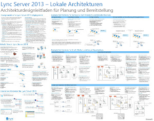
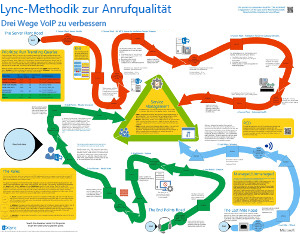
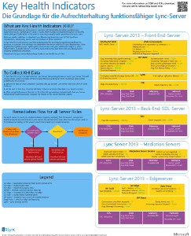
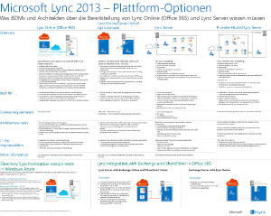
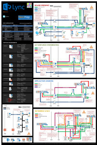

---
title: 'Lync Server 2013: Technische Diagramme '
TOCTitle: Technische Diagramme
ms:assetid: 7b6da49b-ac72-4ab0-8957-166e330b38fa
ms:mtpsurl: https://technet.microsoft.com/de-de/library/Dn594589(v=OCS.15)
ms:contentKeyID: 61170930
ms.date: 12/10/2016
mtps_version: v=OCS.15
ms.translationtype: HT
---

# Technische Diagramme für Lync Server 2013

 

_**Letztes Änderungsdatum des Themas:** 2016-12-08_

**Zusammenfassung:** In den folgenden Diagrammen sind empfohlene Lösungen für Lync 2013 visuell dargestellt.

Diese Ressourcen sind im VSD- (Visio 2010 oder Visio 2013) und PDF-Format verfügbar. Informationen zum Drucken von Dokumenten finden Sie unter Tipps für das Drucken von Postern.

Möglicherweise benötigen Sie zusätzliche Software, um diese Dateien anzeigen zu lassen. Weitere Informationen finden Sie in der folgenden Tabelle.

<table>
<colgroup>
<col style="width: 50%" />
<col style="width: 50%" />
</colgroup>
<thead>
<tr class="header">
<th>Dateityp</th>
<th>Software</th>
</tr>
</thead>
<tbody>
<tr class="odd">
<td>
VSD
</td>
<td>
Visio 2010, Visio 2013 oder der <a href="http://go.microsoft.com/fwlink/?linkid=393676">kostenlose Visio-Viewer</a>

Wenn Sie den Visio-Viewer verwenden, klicken Sie mit der rechten Maustaste auf <strong>Ziel speichern unter</strong>, speichern Sie die Datei auf Ihren Computer und öffnen Sie die Datei dann auf Ihrem Computer.
</td>
</tr>
<tr class="even">
<td>
PDF
</td>
<td>
Jeder PDF-Viewer, z. B. <a href="http://go.microsoft.com/fwlink/?linkid=393675">Adobe Reader</a>
</td>
</tr>
<tr class="odd">
<td>
ZIP
</td>
<td>
Jedes Dateikomprimierungsdienstprogramm. In Windows 7 und 8 werden diese Dateien systemintern geöffnet.
</td>
</tr>
</tbody>
</table>

## Poster

Auf diesen Postern ist ein bestimmter technischer Bereich detailliert dargestellt. Sie sind dafür vorgesehen, mit entsprechenden Artikeln auf TechNet oder im Download Center erhältlichen Inhalten verwendet zu werden.

<table>
<colgroup>
<col style="width: 50%" />
<col style="width: 50%" />
</colgroup>
<thead>
<tr class="header">
<th>Titel</th>
<th>Beschreibung</th>
</tr>
</thead>
<tbody>
<tr class="odd">
<td>
<strong>Lokale Lync Server 2013-Architekturen</strong>

<a href="http://go.microsoft.com/fwlink/?linkid=392974">Zoomen Sie mit Zoom.it von Microsoft in die Details des Posters ein</a> (am besten geeignet für Desktopcomputer oder Laptops)

<a href="http://go.microsoft.com/fwlink/?linkid=392578">PDF-Version</a> (am besten geeignet für mobile Geräte oder Tablets)

<a href="http://go.microsoft.com/fwlink/?linkid=392579">Visio-Version</a> (am besten geeignet für Benutzer mit Visio)
</td>
<td>
Auf dem Poster finden Sie Architekturanleitungen für die Planung und Bereitstellung. Das Poster enthält Informationen zu typischen Komponenten von Lync Server, die für die Planung einer Bereitstellung verwendete Terminologie, neue Funktionen, Serverrollen und eine Installationsübersicht. Darüber hinaus bietet das Poster Beispielarchitekturen, die hohe Verfügbarkeit und Notfallwiederherstellung verbessern, sowie kleine, mittlere und große Beispieltopologien.

Größe: 86,4 x 111,8 cm

Dieses Poster wurde mithilfe von Visio 2013 erstellt. Es sollten keine Änderungen für eine bestimmte Umgebung erforderlich sein.
</td>
</tr>
<tr class="even">
<td>
<strong>Lync Call Quality Methodology</strong>

<a href="http://go.microsoft.com/fwlink/?linkid=392972">Zoomen Sie mit Zoom.it von Microsoft in die Details des Posters ein</a> (am besten geeignet für Desktopcomputer oder Laptops)

<a href="http://go.microsoft.com/fwlink/?linkid=391841">Visio- und PDF-Versionen in einer ZIP-Datei</a>
</td>
<td>
Poster mit einer Beschreibung der Lync-Systemproblembehandlung, insbesondere für Probleme, die die Enterprise VoIP-Qualität betreffen. Verwenden Sie dieses Poster mit:

<ul>
<li>
<a href="http://go.microsoft.com/fwlink/p/?linkid=390677">Lync Server-Netzwerkhandbuch</a>
</li>
<li>
<a href="lync-server-2013-poster-lync-call-quality-methodology.md">Lync Call Quality Methodology</a> (Artikel zu Barrierefreiheit)
</li>
<li>
<a href="lync-server-2013-poster-key-health-indicators.md">Key Health Indicators</a> (Artikel zu Barrierefreiheit)
</li>
</ul>

Größe: 86,4 x 111,8 cm

Dieses Poster wurde mithilfe von Visio 2010 erstellt. Es sollten keine Änderungen für eine bestimmte Umgebung erforderlich sein.
</td>
</tr>
<tr class="odd">
<td>
<strong>Key Health Indicators</strong>

<a href="http://go.microsoft.com/fwlink/?linkid=392971">Zoomen Sie mit Zoom.it von Microsoft in die Details des Posters ein</a> (am besten geeignet für Desktopcomputer oder Laptops)

<a href="http://go.microsoft.com/fwlink/?linkid=391839">Visio- und PDF-Versionen in einer ZIP-Datei</a>
</td>
<td>
Poster mit einer Beschreibung der Serverfehlerbehandlungskennzahlen für die grundlegende Serverintegrität und für die Rolle eines bestimmten Servers in der Lync-Implementierung. Verwenden Sie dieses Poster mit:

<ul>
<li>
<a href="http://go.microsoft.com/fwlink/p/?linkid=390677">Lync Server-Netzwerkhandbuch</a>
</li>
<li>
<a href="lync-server-2013-poster-lync-call-quality-methodology.md">Lync Call Quality Methodology</a> (Artikel zu Barrierefreiheit)
</li>
<li>
<a href="lync-server-2013-poster-key-health-indicators.md">Key Health Indicators</a> (Artikel zu Barrierefreiheit)
</li>
</ul>

Größe: 43,2 x 55,9 cm

Dieses Poster wurde mithilfe von Visio 2010 erstellt. Es sollten keine Änderungen für eine bestimmte Umgebung erforderlich sein.
</td>
</tr>
<tr class="even">
<td>
<strong>Lync 2013-Plattformoptionen</strong>

<a href="http://go.microsoft.com/fwlink/p/?linkid=391840">Zoomen Sie mit Zoom.it von Microsoft in die Details des Posters ein.</a>

<a href="http://go.microsoft.com/fwlink/p/?linkid=391837">PDF-Version</a> (am besten geeignet für mobile Geräte oder Tablets)

<a href="http://go.microsoft.com/fwlink/p/?linkid=391839">Visio-Version</a> (am besten geeignet für Benutzer mit Visio)
</td>
<td>
Auf diesem Poster sind die verfügbaren Plattformoptionen für Lync 2013 für BDMs und Architekten beschrieben. Kunden können Lync Online mit Office 365, Hybrid Lync, lokalem Lync Server und gehostetem Lync auswählen. Das Poster enthält Details zu jeder Architekturoption, darunter die am besten geeigneten Szenarien für jede Option, die Lizenzanforderungen und die Verantwortlichkeiten von IT-Mitarbeitern.

Größe: 86,4 x 111,8 cm

Dieses Poster wurde mithilfe von Visio 2013 erstellt. Es sollten keine Änderungen für eine bestimmte Umgebung erforderlich sein.
</td>
</tr>
<tr class="odd">
<td>
<strong>Microsoft Lync Server 2013-Protokollarbeitsauslastungen</strong>

<a href="http://go.microsoft.com/fwlink/?linkid=392970">Zoomen Sie mit Zoom.it von Microsoft in die Details des Posters ein.</a>

<a href="http://go.microsoft.com/fwlink/?linkid=392512">PDF-Version</a> (am besten geeignet für mobile Geräte oder Tablets)

<a href="http://go.microsoft.com/fwlink/?linkid=392513">Visio-Version</a> (am besten geeignet für Benutzer mit Visio)
</td>
<td>
Laden Sie dieses Poster herunter, um die Funktionen und Anforderungen von Lync 2013, Lync Phone, Lync Web App, Lync für Mac und Lync Mobile zu verstehen. Sehen Sie sich an, wie Sie mit Lync Server-Arbeitsauslastungen die Kommunikation in einer gesamten Organisation vereinfachen können.

Größe: 61 x 91,4 cm

Dieses Poster wurde mithilfe von Visio 2013 erstellt. Es sollten keine Änderungen für eine bestimmte Umgebung erforderlich sein.
</td>
</tr>
</tbody>
</table>

## Tipps für das Drucken von Postern

Wenn Sie einen Plotter haben, können Sie die Poster in ihrer vollen Größe ausdrucken. Wenn Sie keinen Plotter haben, gehen Sie wie folgt vor, um sie auf kleineres Papier zu drucken.

**Drucken von Postern auf kleinerem Papier**

1.  Öffnen Sie das Poster in Visio.

2.  Klicken Sie im Menü **Datei** auf **Seite einrichten**.

3.  Wählen Sie auf der Registerkarte **Druckeinrichtung** im Bereich **Druckerpapier** das Papierformat aus, auf das Sie drucken möchten.

4.  Klicken Sie auf der Registerkarte **Druckeinrichtung** im Bereich **Zum Drucken zoomen** auf **Anpassen** und geben Sie dann **Seitenbreite mal Seitenhöhe** ein.

5.  Klicken Sie auf der Registerkarte **Zeichenblattgröße** auf **An Zeichnungsgröße anpassen** und dann auf **OK**.

6.  Klicken Sie im Menü **Datei** auf **Drucken**.

