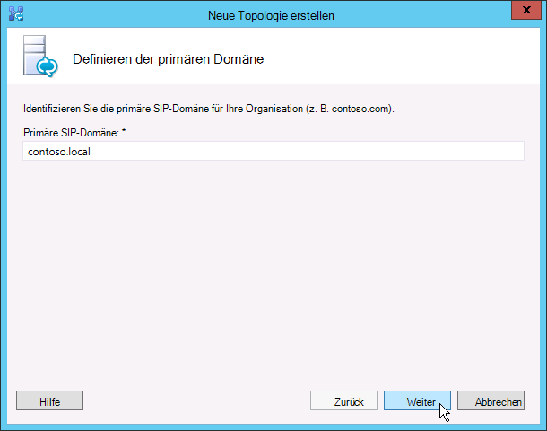
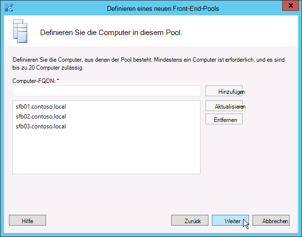

# Erstellen Sie und veröffentlichen Sie neue Topologie in Skype für Business Server
 
**Zusammenfassung:** Informationen Sie zum Erstellen, veröffentlichen und eine neue Topologie überprüfen, bevor Sie Skype für Business Server installieren. Laden Sie eine kostenlose Testversion von Skype für Business Server aus dem Microsoft Evaluation Center herunter: [https://www.microsoft.com/evalcenter/evaluate-skype-for-business-server](https://www.microsoft.com/evalcenter/evaluate-skype-for-business-server).
  
Vor der Installation von der Skype für Business Server-System auf jedem Server in der Topologie müssen Sie eine Topologie erstellen und veröffentlichen. Beim Veröffentlichen einer Topologie laden Sie die Topologieinformationen in die Datenbank des zentralen Verwaltungsspeichers. Bei einem Enterprise Edition-Pool erstellen Sie die Datenbank des zentralen Verwaltungsspeichers beim ersten Veröffentlichen einer neuen Topologie. In der Standard Edition müssen Sie den Vorgang „Ersten Standard Edition-Server vorbereiten“ des Bereitstellungs-Assistenten vor dem Veröffentlichen der Topologie ausführen. Damit wird die Standard Edition durch Installation einer SQL Server Express Edition-Instanz und die Erstellung des zentralen Verwaltungsspeichers vorbereitet. Sie können die Schritte 1 bis 5 in einer beliebigen Reihenfolge ausführen. Die Schritte 6, 7 und 8 müssen jedoch wie in der Abbildung dargestellt nacheinander und nach den Schritten 1 bis 5 ausgeführt werden. Die Erstellung und Veröffentlichung einer neuen Topologie wird in Schritt 6 beschrieben.
  

  
## Create and publish new topology

Sie können verwenden Skype für Business Server-Topologie-Generator zum Entwerfen, definieren, konfigurieren und Veröffentlichen von Topologien. Dieses Tool wurde zusammen mit den Verwaltungstools (siehe weiter oben) installiert. Beim Erstellen einer Topologie stehen zahlreiche Auswahlmöglichkeiten zur Verfügung. In diesem Verfahren erstellen Sie eine einfache Topologie mit Konferenzfunktion.
  
> [!IMPORTANT]
> Skype für Business Server erfordert für SQL Server ausgeführt werden. Die primären Datenbanken werden als zentraler Verwaltungsspeicher bezeichnet. Wenn Sie die Enterprise Edition bereitstellen, werden diese Datenbanken im Rahmen der Veröffentlichung der Topologie (siehe Schritte unten) erstellt. In diesem Fall fordert der Topologie-Generator die Verbindungsinformationen für eine SQL Server-Installation an. Wenn Sie die Standard Edition bereitstellen möchten, müssen Sie SQL Server Express Edition vor dem Erstellen und Veröffentlichen der neuen Topologie installieren. Öffnen Sie hierfür den Bereitstellungs-Assistenten auf dem Server, der als Front-End dienen soll, und führen Sie „Ersten Standard Edition-Server vorbereiten“ aus. Wenn Sie auf „Ersten Standard Edition-Server vorbereiten“ klicken, installiert der Bereitstellungs-Assistent automatisch SQL Server Express Edition und erstellt die Datenbanken des zentralen Verwaltungsspeichers. 
  
### Erstellen einer neuen Topologie

1. Melden Sie sich als Standardbenutzer mit Zugriff auf den Topologie-Generator an.
    
2. Skype für Business Server-Topologie-Generator zu öffnen.
    
3. Wählen Sie **Neue Topologie** aus und klicken Sie auf **OK**.
    
4. Wählen Sie einen Speicherort und einen Dateinamen für die Topologie-Konfigurationsdatei aus.
    
    > [!NOTE]
    > Die Konfiguration der Topologie wird als Topologie-Generator-XML-Datei (.tbxml) gespeichert. Beim Veröffentlichen einer Topologie übertragen Sie die Konfigurationsinformationen aus der Datei in die SQL Server-Datenbank. Wenn Sie den Topologie-Generator anschließend öffnen, können Sie die Konfiguration aus SQL Server direkt in den Topologie-Generator herunterladen und dann entweder wieder in SQL Server veröffentlichen oder als Topologie-Generator-Konfigurationsdatei speichern. 
  
5. Geben Sie auf dem Bildschirm **Primäre Domäne definieren** die **Primäre SIP-Domäne** ein und klicken Sie auf **Weiter**. Im vorliegenden Beispiel ist dies **contoso.local** (siehe Abbildung).
    
     
  
6. Geben Sie alle weiteren unterstützten SIP-Domänen, (soweit vorhanden) ein und klicken Sie auf **Weiter**.
    
7. Geben Sie einen Namen unter **Name** und eine **Beschreibung** des ersten Standorts ein und klicken Sie auf **Weiter** (siehe Abbildung).
    
     
  
8. Füllen Sie die Felder **Ort**, **Bundesland/Kanton** und **Länder-/Ortsvorwahl** für den Standort aus und klicken Sie auf **Weiter**.
    
9. Klicken Sie auf **Fertig stellen**, um die Definition der neuen Topologie abzuschließen. Der Assistent für neues Front-End wird automatisch gestartet.
    
### Definieren eines Front-End-Pools oder Standard Edition-Servers

1. Lesen Sie die Voraussetzungen im Assistenten und klicken Sie auf **Weiter**.
    
2. Geben Sie den vollqualifizierten Domänennamen (FQDN) des Pools ein, wählen Sie **Enterprise Edition-Front-End-Pool** oder **Standard Edition-Server** aus und klicken Sie auf **Weiter** (siehe Abbildung).
    
    > [!TIP]
    > Skype für Business Server Enterprise Edition kann mehrere Server zusammenarbeiten, um die Front-End-Rolle bieten enthalten. Wenn mehrere Server verwendet werden, um die Rolle zu erfüllen, wird sie einen Pool aufgerufen. Auf diese Weise zusammenarbeiten, um die Rolle des Front-End Bereitstellen mehrerer Server wird auch als bezeichnet den Front-End-Pool. Skype für Business Server Standard Edition kann nur einen einzelnen Server zum Bereitstellen der Front-End-Rolle enthalten. Es ist häufig auf den Front-End-Pool verweisen, auch wenn nur ein einzelner Server die Rolle bereit ist. 
  
     
  
3. Geben Sie die vollqualifizierten Domänennamen (FQDN) aller Computer im Pool ein und klicken Sie auf **Weiter** (siehe Abbildung).
    
     
  
4. Wählen Sie die Funktionen aus, die in die Topologie eingeschlossen werden sollen, und klicken Sie auf **Weiter** (siehe Abbildung).
    
    > [!NOTE]
    > Skype für Business Server umfasst zahlreiche erweiterte Funktionen. Lesen Sie die Planungs- und Bereitstellungsdokumentation zu allen Funktionen, die Sie verwenden möchten. 
  
     
  
5. Auf der Seite **verbundene Serverrollen auswählen** die Möglichkeit, den Vermittlungsserver auf dem Front-End-Server verbinden, oder Sie können auswählen, ihn als eigenständiger Server bereitstellen.
    
    Wenn Sie den Vermittlungsserver mit dem Front-End-Pool der Enterprise Edition verbinden möchten, aktivieren Sie das Kontrollkästchen. Die Serverrolle wird auf den Servern im Pool bereitgestellt. Wenn Sie den Vermittlungsserver eigenständig bereitstellen möchten, deaktivieren Sie das entsprechende Kontrollkästchen. Sie werden den Vermittlungsserver in einem separaten Bereitstellungsschritt bereitstellen, nachdem Sie vollständig auf den Front-End-Server bereitstellen. Planen von Details zu einer Kollokation, finden Sie unter [Grundlagen der Topologie Skype für Business Server](../../plan-your-deployment/topology-basics/topology-basics.md).
    
6. Über die Seite **Serverrollen zu diesem Front-End-Pool zuordnen** können Sie Serverrollen definieren und dem Front-End-Pool zuordnen. Die folgende Rolle ist verfügbar:
    
    **Aktivieren Sie einen edgepool** Definiert und ordnet einen einzelnen Edgeserver oder einen Pool von Edge-Server. Ein Edge-Server vereinfacht die Kommunikation und Zusammenarbeit zwischen Benutzern innerhalb der Organisation und Personen außerhalb der Organisation, einschließlich Verbundbenutzer.
    
    Für die Bereitstellung und Zuordnung der Serverrollen sind zwei Szenarien möglich.
    
    In Szenario 1 definieren Sie eine neue Topologie für eine Neuinstallation. Die Installation kann über eine der beiden folgenden Methoden ausgeführt werden:
    
   - Lassen Sie das Kontrollkästchen deaktiviert und definieren Sie die Topologie. Nachdem Sie den Front-End-Server und den Back-End-Server veröffentlicht, konfiguriert und getestet haben, können Sie den Topologie-Generator erneut ausführen, um die Rollenserver zur Topologie hinzuzufügen. Bei dieser Vorgehensweise können Sie den Front-End-Pool und den Server, auf dem SQL Server ausgeführt wird, ohne Komplikationen durch zusätzliche Rollen testen. Wenn Sie die anfänglichen Tests abgeschlossen haben, können Sie den Topologie-Generator zur Auswahl der erforderlichen Rollen erneut ausführen.
    
   - Wählen Sie die Rollen aus, die installiert werden müssen, und richten Sie anschließend die Hardware für die ausgewählten Rollen ein.
    
     In Szenario 2 verfügen Sie über eine vorhandene Bereitstellung und in Ihrer Infrastruktur sollen neue Rollen installiert werden, bzw. Sie müssen vorhandene Rollen einem neuen Front-End-Server zuordnen:
    
   - In diesem Fall wählen Sie die Rollen aus, die bereitgestellt oder dem neuen Front-End-Server zugeordnet werden sollen. In beiden Fällen fahren Sie mit der Definition der Rollen fort, richten gegebenenfalls erforderliche Hardware ein und führen die Installation aus.
    
7. Als Nächstes definieren Sie den SQL Server-Speicher für die Topologie. In diesem Beispiel wird die Standardinstanz verwendet. Weitere Informationen zu SQL Server-Features, wie hohe Verfügbarkeit finden Sie unter [Planen für hohe Verfügbarkeit und notfallwiederherstellung in Skype für Business Server](../../plan-your-deployment/high-availability-and-disaster-recovery/high-availability-and-disaster-recovery.md).
    
   - Zum Verwenden eines SQL Server-Speichers, der bereits in Ihrer Topologie definiert wurde, wählen Sie eine Instanz unter **SQL-Speicher** aus.
    
   - Um eine neue SQL Server-Instanz zum Speichern von Poolinformationen zu definieren, klicken Sie auf **neu**, und geben Sie im Dialogfeld **Neuen SQL-Speicher definieren** den **SQL Server-FQDN** .
    
   - Zum Angeben des Namens einer SQL Server-Instanz wählen Sie **Benannte Instanz** und geben Sie anschließend den Namen der Instanz an.
    
   - Klicken Sie auf **Standardinstanz**, um die Standardinstanz zu verwenden.
    
   - Zum Verwenden der SQL-Spiegelung wählen Sie **SQL-Spiegelung aktivieren** aus und wählen Sie dann eine vorhandene Instanz aus oder erstellen Sie eine neue Instanz.

     > [!NOTE]
     > SQL-Spiegelung wird steht in Skype für Business Server 2015 jedoch nicht mehr in unterstützt Skype für Business Server 2019. Die AlwaysOn Availability Groups, AlwaysOn Failover Cluster Instanzen (FCI) und SQL clustering Failovermethoden werden bevorzugt mit Skype für Business Server 2019.
    
     In diesem Beispiel geben Sie den **SQL Server-FQDN** ein, konfigurieren alle relevanten Einstellungen für hohe Verfügbarkeit und klicken dann auf **OK** (siehe Abbildung).
    
     
  
8. Aktivieren Sie nach Bedarf die SQL Server-Speicherspiegelung oder den SQL Server-Spiegelungszeugen und klicken Sie auf **Weiter**.
    
9. Definieren Sie die zu verwendende Dateifreigabe.
    
   - Zum Verwenden einer Dateifreigabe, die bereits in Ihrer Topologie definiert wurde, wählen Sie **Zuvor definierte Dateifreigabe verwenden**.
    
   - Zum Definieren einer neuen Dateifreigabe wählen Sie **Neue Dateifreigabe definieren**, geben Sie im Feld **Dateiserver-FQDN** den vollqualifizierten Domänennamen des vorhandenen Dateiservers ein, auf dem sich die Dateifreigabe befinden soll, und geben Sie anschließend einen Namen für die Dateifreigabe in das Feld **Dateifreigabe** ein.
    
     In diesem Beispiel klicken Sie auf **Neuen Dateispeicher definieren**, füllen die Felder **Dateiserver-FQDN** und **Dateifreigabe** aus und klicken auf **Weiter**.
    
     > [!NOTE]
     > Die Dateifreigabe für Skype für Business Server verbunden werden jedoch aus Leistungsgründen nicht empfohlen. Im vorliegenden Beispiel befindet sich die Dateifreigabe auf einem dedizierten Einzelserver, der als Dateifreigabe fungieren soll. Es werden jedoch andere, robustere Dateifreigabesysteme empfohlen, z. B. DFS mit Windows Server 2012 R2. Ausführliche Informationen zu unterstützten Datei freigeben Systeme finden Sie unter [Anforderungen für Ihre Skype für Business-Umgebung](../../plan-your-deployment/requirements-for-your-environment/requirements-for-your-environment.md). Weitere Informationen zum Erstellen der Dateifreigabe finden Sie unter [Erstellen einer Dateifreigabe in Skype für Business Server](create-a-file-share.md). Sie können die Dateifreigabe definieren, ohne sie erstellt zu haben. Sie müssen die Dateifreigabe am definierten Speicherort erstellen, bevor Sie die Topologie veröffentlichen. 
  
10. Auf der Seite „Webdienste-URL angeben“ müssen Sie entscheiden, ob Sie die Basis-URL des internen Webdienstepools außer Kraft setzen müssen. Der Grund für eine Außerkraftsetzung liegt im Lastenausgleich. Einfacher SIP-Datenverkehr kann über einen einfachen Lastenausgleich verteilt werden. Für HTTP/S-Webdienste-Datenverkehr muss aber eine unterstützte Hardware- oder Softwarelösung für den Lastenausgleich verwendet werden. Unterstützte zum Lastenausgleich finden Sie unter [Infrastruktur für Skype für Unternehmen](https://docs.microsoft.com/SkypeForBusiness/certification/infra-gateways). Im vorliegenden Beispiel wird DNS-Lastenausgleich für SIP-Datenverkehr und zusätzlich eine unterstützte Lastenausgleichslösung verwendet. Da der Datenverkehr auf diese Weise aufgeteilt wird, muss der FQDN des internen Webdienstepools außer Kraft gesetzt werden. Würde dagegen ein einfacher Lastenausgleich für den gesamten Datenverkehr verwendet, statt den SIP-Datenverkehr durch den DNS-Lastenausgleich zu schicken, wäre eine Außerkraftsetzung der Webdienste-URL nicht erforderlich. 
    
    Klicken Sie im DNS-dieses Themas haben wir einen A-Eintrag für webint.contoso.local erstellt. Dies ist die URL, die wir für den Datenverkehr im Web Services HTTP/S verwenden muss, und es über unterstützte Software Systems zum Lastenausgleich, das wir eingerichtet. Daher überschreiben wir in diesem Beispiel wird die URL, um let Skype für Business Server wissen, dass alle HTTP/S-Datenverkehr webint.contoso.local anstelle von pool.contoso.local, gesendet werden sollen, wie in der Abbildung dargestellt. Weitere Informationen zum Lastenausgleich finden Sie [Netzwerklastenausgleich Anforderungen für Skype für Unternehmen zu laden](../../plan-your-deployment/network-requirements/load-balancing.md).
    
    > [!IMPORTANT]
    > Die Basis-URL ist die Webdienstidentität der URL ohne https://. Wenn die vollständige URL für die Webdienste des Pools ist beispielsweise https://webint.contoso.local, die base-URL ist webint.contoso.local. 
  
    - Wenn Sie den DNS-Lastenausgleich konfigurieren (wie im vorliegenden Beispiel), aktivieren Sie das Kontrollkästchen **FQDN der internen Webdienste außer Kraft setzen** und geben Sie in **Interne Basis-URL** die interne Basis-URL ein (diese muss sich vom Pool-FQDN unterscheiden). 
    
    > [!CAUTION]
    > Wenn Sie die internen Webdienste mit einem eigenen FQDN außer Kraft setzen, muss der FQDN gegenüber jedem anderen Front-End-Pool, Director und Director-Pool eindeutig sein. **Nur Standardzeichen verwenden** (einschließlich A – Z, a – Z, 0-9 und Bindestriche) beim Definieren von URLs oder vollqualifizierte Domänennamen. Verwenden Sie keine Unicode-Zeichen oder Unterstriche. Nicht-Standardzeichen in einer URL oder vollqualifizierten Domänennamen (FQDN) werden von externen DNS und öffentlichen Zertifizierungsstellen (wenn die URL oder der FQDN dem Antragstellernamen oder dem alternativen Antragstellernamen im Zertifikat zugewiesen werden muss) häufig nicht unterstützt.
  
    - Geben Sie optional im Feld **Externe Basis-URL** die externe Basis-URL ein. Die externe Basis-URL wird zur Unterscheidung dieser URL von Ihrer internen Domänenbenennung eingegeben. Beispiel: Der Name Ihrer internen Domäne lautet „contoso.local“, der Name Ihrer externen Domäne lautet „contoso.com“. Zur Definition der URL würden Sie den Domänennamen „contoso.com“ verwenden, da dieser aus dem öffentlichen DNS auflösbar sein muss. Dies ist auch im Fall eines Reverseproxys wichtig. Der Domänenname der externen Basis-URL würde dem Domänennamen des vollqualifizierten Domänennamens des Reverseproxys entsprechen. Für Instant Messaging und Anwesenheit ist HTTP-Zugriff auf den Front-End-Pool erforderlich.
    
      
  
11. Wenn Sie auf der Seite **Funktionen auswählen** die Option **Konferenzen** ausgewählt haben, müssen Sie einen Office Web Apps Server auswählen. Klicken Sie auf **Neu**, um das Dialogfeld zu öffnen.
    
12. Geben Sie im Dialogfeld **Neuen Office Web Apps-Server definieren** den FQDN Ihres Office Web Apps-Servercomputers im Feld **FQDN von Office Web Apps-Server** ein. Anschließend sollte im Feld **Office Web Apps-Server-Such-URL** automatisch die Such-URL Ihres Office Web Apps-Servers stehen.
    
    Wählen Sie die Option **Office Web Apps Server in einem externen Netzwerk (d. h., Umkreisnetzwerk/Internet) bereitgestellt wird**nicht, wenn der Office Web Apps Server lokal installiert ist und in derselben Netzwerkzone als Skype für Business Server.
    
    Wenn der Office Web Apps-Server außerhalb Ihrer internen Firewall bereitgestellt ist, aktivieren Sie die Option **Der Office Web Apps-Server ist in einem externen Netzwerk bereitgestellt (d.h. Umkreisnetzwerk/Internet)**.
    
13. Klicken Sie auf **Fertig stellen**, um die Konfiguration abzuschließen. Wenn Sie auf der Seite **Serverrollen zu diesem Front-End-Pool zuordnen** weitere Rollenserver definiert haben, werden im Assistenten separate Seiten zur Rollenkonfiguration geöffnet, auf denen Sie die Serverrollen konfigurieren können. Im vorliegenden Beispiel wurde nur die Konferenzrolle ausgewählt.
    
### Konfigurieren von einfachen URLs

1. Im Topologie-Generator mit der rechten Maustaste im obersten Knotens **Skype für Business Server** , und klicken Sie dann auf **Eigenschaften bearbeiten**, wie in der Abbildung dargestellt.
    
     
  
2. Wählen Sie im Bereich **Einfache URLs** entweder **Telefonzugriff-URLs:** (Dialin) oder **Besprechungs-URLs:** (Meet) aus und klicken Sie anschließend auf **URL bearbeiten**.
    
3. Aktualisieren Sie die URL auf den gewünschten Wert ein, und klicken Sie dann auf **OK** , um die bearbeitete URL zu speichern. Sie sollten die einfache URL mithilfe der externen SIP-Domäne, damit externe Benutzer können an Besprechungen teilnehmen, beispielsweise "contoso.com" konfigurieren, die externen, im Gegensatz zu contoso.local, ist eine interne Domäne ist. Daher sollte die SIP-Domäne von externen DNS aufgelöst werden können.
    
4. Bearbeiten Sie ggf. auch die Besprechungs-URL, indem Sie dieselben Schritte ausführen.
    
### So definieren Sie die optionale einfache URL für den administrativen Zugriff

1. Im Topologie-Generator mit der rechten Maustaste in des Knotens **Skype für Business Server** , und klicken Sie dann auf **Eigenschaften bearbeiten**.
    
2. Klicken Sie im Feld **URL für administrativen Zugriff** Geben Sie die einfache URL für administrativen Zugriff auf die Skype Business Server-Systemsteuerung aus, und klicken Sie dann auf **OK**.
    
    > [!TIP]
    > Es wird empfohlen, die einfachstmögliche URL als Verwaltungs-URL zu verwenden. Die einfachste Option ist https://admin. _ \<Domäne\>_. Die Verwaltungs-URL kann eine interne oder eine externe Domäne sein, z. B. contoso.local oder contoso.com, sofern der jeweilige Datensatz im internen DNS aufgelöst werden kann. 
  
    > [!IMPORTANT]
    > Wenn Sie eine einfache URL nach der ersten Bereitstellung ändern, müssen Sie beachten, welche Änderungen sich auf Ihre DNS-Datensätze und -Zertifikate für einfache URLs auswirken. Wenn die Änderung wirkt sich auf der Basis von einer einfachen URL, müssen Sie die DNS-Einträgen und Zertifikaten zu ändern. Beispiel: Ändern von https://sfb.contoso.com/Meet auf https://meet.contoso.com die base-URL von sfb.contoso.com in meet.contoso.com, geändert, damit Sie die DNS-Einträgen und Zertifikaten verweisen auf meet.contoso.com ändern müssen. Wenn Sie die einfache URL aus geändert https://sfb.contoso.com/Meet auf https://sfb.contoso.com/Meetings, die base-URL des sfb.contoso.com bleibt, also keine DNS oder zertifikatänderungen erforderlich sind. Bei jeder Änderung einer einfachen URL müssen Sie jedoch das Cmdlet **Enable-CsComputer** auf jedem Director- und Front-End-Server ausführen, um die Änderung zu registrieren.
  
### Veröffentlichen und Prüfen der Topologie

1. Vergewissern Sie sich, dass alle einfachen URLs richtig konfiguriert wurden.
    
2. Stellen Sie sicher, dass der SQL Server-basierte Server online und für den Computer verfügbar ist, auf dem der Topologie-Generator installiert wurde (einschließlich aller erforderlichen Firewallregeln).
    
3. Vergewissern Sie sich, dass die Dateifreigabe verfügbar ist und dass die richtigen Berechtigungen definiert wurden.
    
4. Stellen Sie sicher, dass die richtigen Serverrollen zur Erfüllung der Bereitstellungsanforderungen in der Topologie definiert wurden.
    
5. Vergewissern Sie sich, dass die Server in Active Directory-Domänendienste vorhanden sind. Dies passiert automatisch, wenn Sie die Server der Domäne hinzufügen.
    
    Wenn Sie die Topologie überprüft haben und keine Überprüfungsfehler aufgetreten sind, können Sie die Topologie veröffentlichen. Im Falle von Überprüfungsfehlern müssen Sie diese zunächst korrigieren, bevor Sie die Topologie veröffentlichen können.
    
6. Klicken Sie mit der rechten Maustaste auf den Knoten **Skype for Business Server** und dann auf **Topologie veröffentlichen**.
    
7. Klicken Sie auf der Seite **Topologie veröffentlichen** auf **Weiter**.
    
8. Wählen Sie auf der Seite **Zentralen Verwaltungsserver auswählen** einen Front-End-Pool aus (siehe Abbildung).
    
    > [!NOTE]
    > Sie können auf **Erweitert** klicken, um Speicherorte für Datenbankdateien zu konfigurieren.
  
     
  
9. Wählen Sie auf der Seite **Datenbanken auswählen** die Datenbanken aus, die Sie veröffentlichen möchten.
    
    > [!NOTE]
    > Wenn Sie nicht über die entsprechenden Rechte zum Erstellen der Datenbanken verfügen, können Sie die Kontrollkästchen neben dieser Datenbanken deaktivieren, und Benutzer mit entsprechenden Berechtigungen kann die Datenbanken später erstellen. Ausführliche Informationen zu Anforderungen finden Sie unter [Server-Anforderungen für Skype für Business Server](../../plan-your-deployment/requirements-for-your-environment/server-requirements.md). 
  
10. Klicken Sie optional auf **Erweitert**. Über die erweiterten Optionen zur Platzierung von SQL Server-Datendateien stehen folgende Optionen zur Verfügung: 
    
    - **Ort der Datenbankdatei automatisch ermitteln** – diese Option bestimmt die am besten betrieblichen, basierend auf der Festplattenkonfiguration auf dem SQL Server-basierten Server durch die Protokoll- und Datendateien, die am besten geeigneten Speicherorte verteilen.
    
    - **Mithilfe von SQL Server-Instanz Standardeinstellungen** – diese Option wird die Protokoll- und Datendateien auf dem SQL Server-basierten Server mithilfe der Einstellungen für die Instanz. Diese Option macht keinen Gebrauch von der Funktion des SQL Server-basierten Servers zum Ermitteln der optimalen Speicherorte für Protokolle und Daten. Der SQL Server-Administrator verschiebt die Protokoll- und Datendateien in der Regel an Speicherorte, die für den SQL Server-basierten Server geeignet sind und den Verwaltungsverfahren für die Organisation entsprechen.
    
    Klicken Sie auf **OK** und dann auf **Weiter**. 
    
11. Klicken Sie optional auf **Erweitert**. Über die erweiterten Optionen zur Platzierung von SQL Server-Datendateien stehen folgende Optionen zur Verfügung: 
    
    - **Ort der Datenbankdatei automatisch ermitteln** – diese Option bestimmt die am besten betrieblichen, basierend auf der Festplattenkonfiguration auf dem SQL Server-basierten Server durch die Protokoll- und Datendateien, die am besten geeigneten Speicherorte verteilen.
    
    - **Mithilfe von SQL Server-Instanz Standardeinstellungen** – diese Option wird die Protokoll- und Datendateien auf dem SQL Server-basierten Server mithilfe der Einstellungen für die Instanz. Diese Option macht keinen Gebrauch von der Funktion des SQL Server-basierten Servers zum Ermitteln der optimalen Speicherorte für Protokolle und Daten. Der SQL Server-Administrator verschiebt die Protokoll- und Datendateien in der Regel an Speicherorte, die für den SQL Server-basierten Server geeignet sind und den Verwaltungsverfahren für die Organisation entsprechen.
    
    Klicken Sie anschließend auf **OK**.
    
12. Klicken Sie auf **Weiter**, um die Veröffentlichung abzuschließen.
    
    > [!NOTE]
    > Ein häufiger Fehler bei diesem Schritt ist, dass die SQL Server-Datenbanken nicht erstellt werden können. Wenn der Vorgang nicht abgeschlossen werden kann, wird ein Fehler angezeigt (siehe Abbildung). Häufigste Ursache ist, dass der Benutzer, der die Datenbank zu erstellen versucht, nicht über die erforderlichen Berechtigungen verfügt oder dass das SQL Server-System aufgrund einer Firewall oder eines Netzwerkproblems nicht kontaktiert werden kann. 
  
     
  
13. Wenn die Veröffentlichung abgeschlossen ist, wird ein Link zum Öffnen einer Liste der nächsten Schritte angezeigt. Klicken Sie auf **Klicken Sie hier, um die Aufgabenliste zu öffnen**, um die nächsten Schritte anzuzeigen, und klicken Sie dann auf **Fertig stellen**. 
    
    Die Meldung „Abgeschlossen mit Warnungen“ für die Datenbankerstellung bedeutet nicht, dass ein Fehler aufgetreten ist. Der Installationsvorgang wurde so ändern Sie Einstellungen in SQL Server für Skype für Business Server ordnungsgemäß funktioniert. Wenn eine Einstellung in SQL Server geändert wird, wird dies als Warnung protokolliert, damit SQL Server-Administratoren genau sehen können, was durch den Installationsprozess geändert wurde. Wenn Sie eine Warnung ausgegeben werden, können Sie wählen Sie den Datensatz, und klicken Sie dann auf **Protokolle anzeigen** , um die Details der Warnung anzeigen.
    
    Wenn die Topologie erfolgreich veröffentlicht wurde, können Sie mit der Installation von einem lokalen Replikat des zentralen Verwaltungsspeichers auf jedem Server mit Skype für Business Server in Ihrer Topologie beginnen. Es wird empfohlen, mit dem ersten Front-End-Pool zu beginnen. 
    

