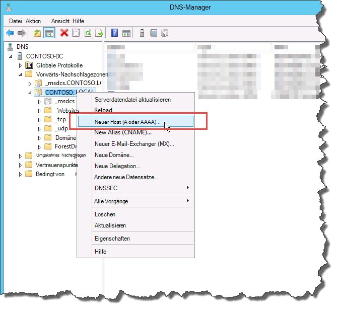

# Erstellen von DNS-Einträgen für Skype for Business Server
 
**Zusammenfassung:** Informationen zum Konfigurieren von DNS und zum Erstellen von DNS-Einträgen für eine Installation von Skype for Business Server. Laden Sie eine kostenlose Testversion von Skype for Business Server aus dem Microsoft Evaluation [https://www.microsoft.com/evalcenter/evaluate-skype-for-business-server](https://www.microsoft.com/evalcenter/evaluate-skype-for-business-server)Center unter: herunter.
  
Damit Skype for Business Server ordnungsgemäß funktioniert, müssen eine Reihe von DNS-Einstellungen (Domain Name System) vorhanden sein. Diese steuern den Zugriff der Clients auf die Dienste und sorgen dafür, dass die Server übereinander informiert sind. Diese Einstellungen müssen pro Bereitstellung nur einmal festgelegt werden, da ein einmal zugeordneter DNS-Eintrag domänenübergreifend zur Verfügung steht. Sie können die Schritte 1 bis 5 in einer beliebigen Reihenfolge ausführen. Die Schritte 6, 7 und 8 müssen jedoch wie in der Abbildung dargestellt nacheinander und nach den Schritten 1 bis 5 erfolgen. Die Erstellung von DNS-Einträgen wird in Schritt 5 beschrieben. Weitere Informationen zum Planen von DNS finden Sie unter [Umgebungsanforderungen für Skype for Business Server](../../plan-your-deployment/requirements-for-your-environment/environmental-requirements.md) -oder [Server Anforderungen für Skype for Business Server 2019](../../../SfBServer2019/plan/system-requirements.md).
  
> [!IMPORTANT]
> Es wird ausdrücklich darauf hingewiesen, dass es sich hier lediglich um ein Beispiel für die Erstellung von DNS-Einträgen in einer Windows-DNS-Umgebung handelt. Es gibt viele andere DNS-Einträge, die für Skype for Business Server erforderlich sind, und das Verfahren zum Erstellen von DNS-Einträgen hängt von dem System ab, das Sie zum Verwalten von DNS in Ihrer Organisation verwenden. Eine vollständige Liste der Anforderungen für DNS finden Sie unter [DNS-Anforderungen für Skype for Business Server](../../plan-your-deployment/network-requirements/dns.md). 
  

  
## Konfigurieren von DNS

Für Skype for Business Server sind DNS-Einträge erforderlich, damit Sie ordnungsgemäß funktionieren und für Benutzer zugänglich sind.
  
Das vorliegende Beispiel ist der Pool „contoso.local“ mit DNS-Lastenausgleich und einem FQDN. Dieser Pool besteht aus drei Servern mit Skype for Business Server Enterprise Edition. Ein Front-End-Server der Standard Edition kann nur einen einzelnen Server enthalten. Bei Verwendung der Standard Edition würden Sie nur den vollqualifizierten Domänennamen (FQDN) des einzelnen Standard Edition-Servers verwenden, wenn Sie auf die Front-End-Rolle verweisen und keinen Serverpool mit DNS-Lastenausgleich wie im gezeigten Beispiel erstellen. Dieses einfache Beispiel verwendet nur die Front-End-Rolle und umfasst die in der Tabelle unten aufgeführten DNS-Einträge. Informationen zum Planen Ihrer spezifischen DNS-Anforderungen finden Sie unter [DNS-Anforderungen für Skype for Business Server](../../plan-your-deployment/network-requirements/dns.md). 
  
 
|**Beschreibung**|**Eintragstyp**|**Name**|**Auflösung in**|**Lastenausgleichstyp**|
|:-----|:-----|:-----|:-----|:-----|
|Interner Webdienst-FQDN    |A    |webint.contoso.local    |VIP für interne Webdienste    |Unterstützte Software und Hardware    |
|Pool-FQDN    |A    |pool.contoso.local    |IP-Adresse von Server SFB01    |DNS    |
|FQDN von SFB01    |A    |SFB01.contoso.local    |IP-Adresse von Server SFB01    |DNS    |
|Pool-FQDN    |A    |pool.contoso.local    |IP-Adresse von Server SFB02    |DNS    |
|FQDN von SFB02    |A    |SFB02.contoso.local    |IP-Adresse von Server SFB02    |DNS    |
|Pool-FQDN    |A    |pool.contoso.local    |IP-Adresse von Server SFB03    |DNS    |
|FQDN von SFB03    |A    |SFB03.contoso.local    |IP-Adresse von Server SFB03    |DNS    |
|Skype for Business-AutoErmittlung    |A    |lyncdiscoverinternal.contoso.local    |VIP für interne Webdienste    |Unterstützte Software und Hardware    |
|Einfache URL für Besprechungen    |A    |meet.contoso.local    |VIP für interne Webdienste    |Unterstützte Software und Hardware    |
|Einfache URL vom Typ „Dialin“    |A    |dialin.contoso.local    |VIP für interne Webdienste    |Unterstützte Software und Hardware    |
|Einfache URL für Web Scheduler    |A    |scheduler.contoso.local    |VIP für interne Webdienste    |Unterstützte Software und Hardware    |
|Einfache URL für die Verwaltung    |A    |admin.contoso.local    |VIP für interne Webdienste    |Unterstützte Software und Hardware    |
|Vorgänger-Ermittlung    |SRV    |_sipinternaltls._tcp.contoso.local    |Pool-FQDN (Port 5061)    |-    |
   
### Erstellen von DNS-Einträgen

1. Melden Sie sich beim DNS-Server an und öffnen Sie **Server-Manager**.
    
2. Klicken Sie auf das Dropdownmenü **Extras** und dann auf **DNS**.
    
3. Erweitern Sie in der Konsolenstruktur für Ihre SIP-Domäne **Forward-Lookupzonen**, und erweitern Sie dann die SIP-Domäne, in der Skype for Business Server installiert wird.
    
4. Klicken Sie mit der rechten Maustaste auf die SIP-Domäne und wählen Sie **Neuer Host (A oder AAAA)** (siehe Abbildung).
    
     
  
5. Geben Sie im Feld **Name** den Namen des Hosteintrags ein (der Domänenname wird automatisch angehängt).
    
6. Geben Sie im Feld **IP-Adresse** die IP-Adresse des einzelnen Front-End-Servers ein und wählen Sie dann **Verknüpften PTR-Eintrag erstellen** oder nach Bedarf **Authentifizierte Benutzer können DNS-Einträge mit demselben Besitzernamen aktualisieren**. Hierbei wird vorausgesetzt, dass DNS für den Lastenausgleich des gesamten Datenverkehrs mit Ausnahme von Webdiensten verwendet wird. Im vorliegenden Beispiel gibt es drei Front-End-Server wie in der Tabelle gezeigt.
    
   |**Servername**|**Typ**|**Daten**|
   |:-----|:-----|:-----|
   |SFB01    |Host (A)    |10.0.0.5    |
   |SFB02    |Host (A)    |10.0.0.6    |
   |SFB03    |Host (A)    |10.0.0.7    |
   
7. Als Nächstes erstellen Sie die DNS-Lastenausgleichseinträge für den Pool. Der DNS-Lastenausgleich ermöglicht das Senden von Anforderungen durch DNS an die einzelnen Server im Pool unter Verwendung des gleichen DNS-Poolnamens. Weitere Informationen zu DNS und Lastenausgleich finden Sie unter [DNS-Anforderungen für Skype for Business Server](../../plan-your-deployment/network-requirements/dns.md). 
    
    > [!NOTE]
    > Nur in Enterprise Edition-Bereitstellungen können mehrere Server gepoolt werden. Wenn Sie einen einzelnen Enterprise-Server oder einen Standard Edition-Server bereitstellen, müssen Sie für diesen nur einen A-Eintrag erstellen. 
  
    Wenn Sie beispielsweise über einen Pool namens „pool.contoso.local“ und drei Front-End-Server verfügen, würden Sie die folgenden DNS-Einträge erstellen:
    
   |**FQDN**|**Typ**|**Daten**|
   |:-----|:-----|:-----|
   |pool.contoso.local    |Host (A)    |10.0.0.5    |
   |pool.contoso.local    |Host (A)    |10.0.0.6    |
   |pool.contoso.local    |Host (A)    |10.0.0.7    |
   
8. Fahren Sie mit der Erstellung von A-Einträgen für alle Server in der Bereitstellung fort. 
    
9. Zum Erstellen des SRV (Serviceeintrags) für die Vorgänger-Ermittlung klicken Sie mit der rechten Maustaste auf die SIP-Domäne und wählen Sie **Andere neue Einträge** aus.
    
10. Klicken Sie unter **Wählen Sie einen Ressourceneintragstyp** auf **Dienstidentifizierung (SRV)** und dann auf **Eintrag erstellen**.
    
11. Klicken Sie auf **Dienst** und geben Sie **_sipinternaltls** ein.
    
12. Klicken Sie auf **Protokoll** und geben Sie **_tcp** ein.
    
13. Klicken Sie auf **Portnummer** und geben Sie **5061** ein.
    
14. Klicken Sie auf **Host, der diesen Dienst anbietet** und geben Sie den FQDN des Pools bzw. des Standard Edition-Servers ein.
    
     
  
15. Klicken Sie auf **OK** und dann auf **Fertig**.
    
### Überprüfen von DNS-Einträgen

1. Melden Sie sich mit einem Konto, das Mitglied der Gruppe der authentifizierten Benutzer ist oder über gleichwertige Berechtigungen verfügt, an einem Clientcomputer in der Domäne an.
    
2. Klicken Sie auf **Start**, geben Sie **cmd** ein und drücken Sie die Eingabetaste.
    
3. Geben **Sie \<nslookup-FQDN des Front-\> End-Pools** oder ** \<des FQDN des Standard Edition-Servers oder\>des Enterprise Edition-Servers**ein, und drücken Sie die EINGABETASTE.
    
4. Fahren Sie mit der Überprüfung der restlichen A-Einträge der Bereitstellung fort.
    
5. Wenn Sie Vorgängerclients unterstützen und einen SRV-Eintrag erstellt haben, prüfen Sie diesen durch Eingabe von **set type=srv** an der **nslookup**-Eingabeaufforderung und Drücken der Eingabetaste.
    
6. Geben Sie **_sipinternaltls. _tcp ein. *Domäne* ** (Beispiel: _sipinternaltls. _tcp. contoso. local), und drücken Sie dann die EINGABETASTE.
    
7. Die Ausgabe sollte derjenigen in der Abbildung ähneln. In der Beispielausgabe werden nicht alle DNS-Einträge gezeigt, es müssen jedoch alle Einträge geprüft werden. 
    
     
  

