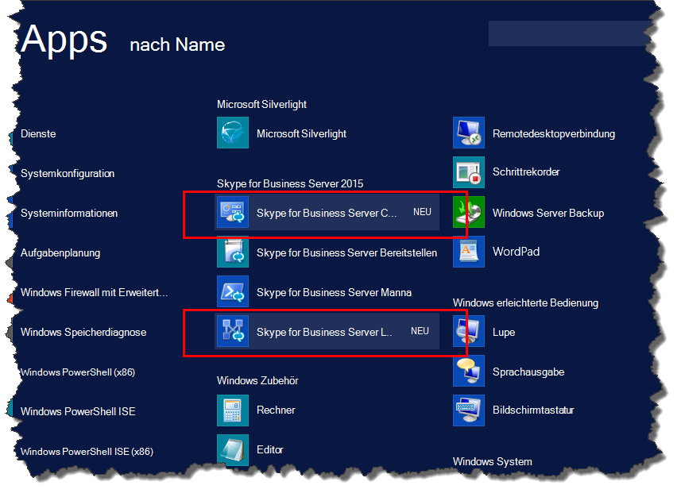

# Installieren von Verwaltungstools in Skype for Business Server
 
**Zusammenfassung:** Hier erfahren Sie, wie Sie die für eine Installation von Skype for Business Server erforderlichen Verwaltungstools installieren. Laden Sie eine kostenlose Testversion von Skype for Business Server vom Microsoft Evaluation Center [https://www.microsoft.com/evalcenter/evaluate-skype-for-business-server](https://www.microsoft.com/evalcenter/evaluate-skype-for-business-server)unter: herunter.
  
Zu den Verwaltungstools gehören der Topologie-Generator und die Systemsteuerung. Die Verwaltungstools müssen auf mindestens einem Server in der Topologie oder auf einer 64-Bit-Verwaltungsarbeitsstation mit einer Windows-Betriebssystemversion installiert werden, die für Skype for Business Server unterstützt wird. Sie können die Schritte 1 bis 5 in beliebiger Reihenfolge ausführen. Sie müssen jedoch die Schritte 6, 7 und 8 in der Reihenfolge und nach den Schritten 1 bis 5 ausführen, wie im Diagramm dargestellt. Das Installieren der Verwaltungstools ist der Schritt 3 von 8.
  

  
## Installieren von Skype for Business Server Verwaltungstools

Die Installationsmedien für Skype for Business Server bieten eine flexible Benutzeroberfläche. Bei der ersten Ausführung von "Setup. exe" werden nur die Skype for Business Server-Bereitstellungs-Assistenten und die Skype for Business Server-Verwaltungsshell installiert. Durch die Verwendung dieser beiden Tools, die als Kernkomponenten bezeichnet werden, können Sie den Installationsvorgang fortsetzen, Sie bieten jedoch keine primäre Funktionalität für die gesamte Skype for Business Server Umgebung. Der Bereitstellungs-Assistent wird automatisch gestartet, nachdem Sie die Hauptkomponenten installiert haben. Im Abschnitt **install Administration Tools** des Bereitstellungs-Assistenten werden Skype for Business Server Topologie-Generator und Skype for Business Server Systemsteuerung installiert.
  
> [!IMPORTANT]
> In jeder Skype for Business Server Umgebung muss mindestens ein Server vorhanden sein, auf dem die Verwaltungstools installiert sind. 
  
Sehen Sie sich die Video Schritte für die **Installation von Verwaltungstools**an:
  
> [!video https://www.microsoft.com/videoplayer/embed/99a5c436-963b-4eed-b423-651568c87cb1?autoplay=false]
  
### Installieren von Skype for Business Server Verwaltungstools im Bereitstellungs-Assistenten

1. Legen Sie das Skype for Business Server Installationsmedium ein. Wenn das Setup nicht automatisch gestartet wird, doppelklicken Sie auf **Setup**.
    
2. Für die Installationsmedien muss Microsoft Visual C++ ausgeführt werden. Ein Dialogfeld wird eingeblendet, in dem Sie gefragt werden, ob Sie es installieren möchten. Klicken Sie auf **Ja**.
    
3. Mithilfe von Smart Setup, einem neuen Feature in Skype for Business Server, können Sie eine Verbindung mit dem Internet herstellen, um während des Installationsvorgangs nach Updates zu suchen. Dies bietet eine bessere Erfahrung, indem Sie sicherstellen, dass Sie über die neuesten Updates für das Produkt bei der Installation verfügen. Klicken Sie auf **Installieren**, um mit der Installation zu beginnen.
    
4. Überprüfen Sie den Lizenzvertrag sorgfältig, und wenn Sie zustimmen, wählen Sie **Ich stimme den Bedingungen des Lizenzvertrags**zu, und klicken Sie auf **OK**.
    
5. Die Skype for Business Server Kernkomponenten werden auf dem Server installiert. 
    
    Die Kernkomponenten bestehen aus den folgenden, wie in der Abbildung dargestellt.
    
    
  
   - **Skype for Business Server-Bereitstellungs-Assistent** Ein Bereitstellungsprogramm, das eine Startrampe für die Installation der verschiedenen Komponenten von Skype for Business Server bereitstellt.
    
   - **Skype for Business Server Management-Shell** Ein vorkonfiguriertes PowerShell-Programm, das die Verwaltung von Skype for Business Server ermöglicht.
    
     Nachdem die Installation der Kernkomponenten abgeschlossen ist, wird der Skype for Business Server-Bereitstellungs-Assistent automatisch gestartet, wie in der Abbildung dargestellt. 
    
     
  
6. Zusätzlich zu den Hauptkomponenten müssen Sie auch Skype for Business Server Topologie-Generator und Skype for Business Server Systemsteuerung auf mindestens einem Server in der Umgebung installieren. Klicken Sie im Bereitstellungs-Assistenten auf **Verwaltungs Tools installieren** .
    
7. Klicken Sie auf **Weiter**, um die Installation zu starten.
    
8. Klicken Sie nach Abschluss der Installation auf **Fertig stellen**. Die Verwaltungstools werden nun dem Server hinzugefügt, wie in der Abbildung dargestellt.
    
    
  
   - **Skype for Business Server Topologie-Generator** Ein Programm, das zum Erstellen, bereitstellen und Verwalten von Topologien verwendet wird.
    
   - **Skype for Business Server-System** Steuerung Ein Programm, mit dem die Installation verwaltet wird.
    

