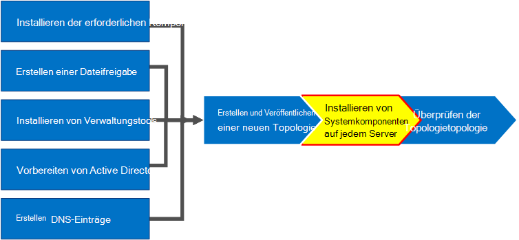

# Installieren von Skype for Business Server auf Servern in der TopologieInstall Skype for Business Server on servers in the topology
 
**Zusammenfassung:** Hier erfahren Sie, wie Sie die Systemkomponenten von Skype for Business Server auf jedem Server in der Topologie installieren.**Summary:** Learn how to install the Skype for Business Server system components on each server in the topology. Laden Sie eine kostenlose Testversion von Skype for Business Server vom [Microsoft Evaluation Center](https://www.microsoft.com/evalcenter/evaluate-skype-for-business-server)herunter.Download a free trial of Skype for Business Server from the [Microsoft Evaluation center](https://www.microsoft.com/evalcenter/evaluate-skype-for-business-server).
  
Nachdem die Topologie in den zentralen Verwaltungsspeicher geladen wurde und Active Directory weiß, welche Server welche Rollen ausführen sollen, müssen Sie das Skype for Business Server-System auf jedem der Server in der Topologie installieren.Once the topology is loaded into the Central Management Store and Active Directory knows which servers will perform which roles, you need to install the Skype for Business Server system on each of the servers in the topology. Sie können die Schritte 1 bis 5 in beliebiger Reihenfolge ausführen.You can do steps 1 through 5 in any order. Sie müssen jedoch die Schritte 6, 7 und 8 der Reihe nach ausführen, und zwar nach den Schritten 1 bis 5, wie im Diagramm beschrieben.However, you must do steps 6, 7, and 8 in order, and after steps 1 through 5 as outlined in the diagram. Die Installation des Skype for Business-Server Systems ist Schritt 7 von 8.Installing the Skype for Business Server system is step 7 of 8.
  

  
## Installieren von Skype for Business Server SystemInstall Skype for Business Server system

Nachdem Sie eine Topologie veröffentlicht haben, können Sie die Skype for Business Server-Komponenten auf jedem Server in der Topologie installieren.Once you have published a topology, you can install the Skype for Business Server components on each server in the topology. Dieser Abschnitt führt Sie durch die Installation von Skype for Business Server und das Einrichten der Serverrollen für den Front-End-Pool und alle Serverrollen, die mit den Front-End-Servern zusammengesetzt sind.This section guides you through installing Skype for Business Server and setting up the server roles for the Front End pool and any server roles that are collocated with the Front End servers. Zum Installieren und Einrichten von Serverrollen führen Sie den Skype for Business Server-Bereitstellungs-Assistenten auf jedem Computer aus, auf dem Sie eine Serverrolle installieren.To install and set up server roles, you run the Skype for Business Server Deployment Wizard on each computer on which you are installing a server role. Sie verwenden den Bereitstellungs-Assistenten, um alle vier Bereitstellungsschritte abzuschließen, einschließlich der Installation des lokalen Konfigurationsspeichers, der Installation der Front-End-Server, der Konfiguration von Zertifikaten und dem Starten von Diensten.You use the Deployment Wizard to complete all four deployment steps, including installing the Local Configuration store, installing the Front End Servers, configuring certificates, and starting services.
  
> [!IMPORTANT]
> Sie müssen den Topologie-Generator verwenden, um die Topologie abzuschließen und zu veröffentlichen, bevor Sie Skype for Business Server auf Servern installieren können.You must use Topology Builder to complete and publish the topology before you can install Skype for Business Server on servers. 
  
> [!NOTE]
> Dieses Verfahren muss für alle Server in der Topologie abgeschlossen werden.This procedure must be completed for all servers in the topology. 
  
> [!CAUTION]
> Nachdem Sie Skype for Business Server auf einem Front-End-Server installiert haben, müssen Sie beim erstmaligen Starten von Services sicherstellen, dass der Windows-Firewalldienst auf dem Server ausgeführt wird.After you install Skype for Business Server on a Front End Server, the first time you start services, you must make sure that the Windows Firewall Service is running on the server. 
  
> [!CAUTION]
> Bevor Sie diese Schritte ausführen, stellen Sie sicher, dass Sie mit einem Domänenbenutzerkonto am Server angemeldet sind, das sowohl ein lokaler Administrator als auch ein Mitglied der RTCUniversalServerAdmins-Gruppe ist.Before you follow these steps, make sure you're logged onto the server with a domain user account that's both a local administrator and a member of the RTCUniversalServerAdmins group. 
  
> [!NOTE]
> Wenn Sie Skype for Business Server-Setup noch nicht auf diesem Server ausgeführt haben, werden Sie aufgefordert, ein Laufwerk und einen Pfad für die Installation einzugeben.If you haven't run Skype for Business Server setup on this server before, you'll be prompted for a drive and path for the installation. Auf diese Weise können Sie ein anderes Laufwerk als das Systemlaufwerk verwenden, sofern dies von Ihrem Unternehmen vorgeschrieben oder nicht ausreichend Speicherplatz vorhanden ist.This provides the capability to install to a drive other than the system drive, if your organization requires it, or if you have space concerns. Sie können den Pfad für den Installationspfad für die Skype for Business Server-Dateien im Dialogfeld " **Einrichten** " auf ein neues, verfügbares Laufwerk ändern.You can change the installation location path for the Skype for Business Server files in the **Setup** dialog box to a new, available drive. Wenn Sie die Setup Dateien in diesem Pfad, einschließlich OCSCore. msi, installieren, werden die restlichen Skype for Business Server-Dateien ebenfalls bereitgestellt.If you install the Setup files to this path, including OCSCore.msi, the rest of the Skype for Business Server files will deploy there as well.
  
> [!IMPORTANT]
> Bevor Sie mit der Installation beginnen, stellen Sie sicher, dass Windows Server mithilfe von Windows Update auf dem neuesten Stand ist.Before you begin the installation, make sure that Windows Server is up-to-date by using Windows Update. 
  

  
### Installieren von Skype for Business Server SystemInstall Skype for Business Server system

1. Legen Sie das Skype for Business Server-Installationsmedium ein.Insert the Skype for Business Server installation media. Wenn das Setup nicht automatisch startet, doppelklicken Sie auf **Setup**.If the setup does not automatically begin, double-click **Setup**.
    
2. Das Installationsmedium erfordert die Ausführung von Microsoft Visual C++. Es wird ein Dialogfenster geöffnet, in dem Sie gefragt werden, ob Sie es installieren möchten. Klicken Sie auf **Ja.**The installation media requires Microsoft Visual C++ to run. A dialog will pop up asking if you want to install it. Click **Yes.**
    
3. Lesen Sie die Lizenzbedingungen sorgfältig durch und klicken Sie auf **Ich stimme den Lizenzbedingungen zu**, wenn Sie diesen zustimmen. Klicken Sie dann auf **OK**.Carefully review the License Agreement, and if you agree, select **I accept the terms in the license agreement**, and click **OK**. 
    
4. Smart Setup ist eine Funktion in Skype for Business Server, auf der Sie während des Installationsvorgangs eine Verbindung mit dem Internet herstellen können, um nach Updates von Microsoft Update (MU) zu suchen, wie in der Abbildung zu sehen ist.Smart Setup is a feature in Skype for Business Server where you can connect to the Internet to check for updates from Microsoft Update (MU) during the installation process, as shown in the figure. Diese Funktion verbessert die Benutzerfreundlichkeit, da sichergestellt ist, dass Sie die neuesten Updates für das Produkt verwenden.This provides a better experience by making sure you have the most recent updates for the product. Klicken Sie auf **Installieren**, um die Installation zu starten.Click **Install** to begin the installation.
    
    > [!NOTE]
    > Viele Unternehmen stellen Windows Server Update Services (WSUS) in ihrer Unternehmensumgebung bereit.Many organizations have Windows Server Update Services (WSUS) deployed in their corporate environments. In WSUS können Administratoren die komplette Verteilung von Updates verwalten, die durch Microsoft Update auf Computern ihres Netzwerks freigegeben werden.WSUS lets administrators fully manage the distribution of updates that are released through Microsoft Update to computers in their network. Im Rahmen des kumulativen Updates 1 wurde in Skype for Business Server die Unterstützung für Smart Setup für die Zusammenarbeit mit WSUS eingeführt.As part of the Cumulative Update 1 release Skype for Business Server introduced support for Smart Setup to work with WSUS. Kunden mit WSUS, die Skype for Business Server zum ersten Mal bereitstellen oder ein Upgrade von der lync Server 2013-Umgebung mithilfe des in-Place-Upgrades durchführen, haben intelligentes Setup, das Skype für Windows-Updates von WSUS abruft, anstatt Updates abzurufen. von Mu.Customers with WSUS who are deploying Skype for Business Server for the first time or upgrading from the Lync Server 2013 environment using the In-Place Upgrade feature will have Smart Setup fetching Skype for Windows updates from WSUS as opposed to fetching updates from MU. Kunden, die Skype verwenden möchten, müssen auf allen Geräten „SmartSetupWithWSUS.psq“ ausführen, bevor „ Setup.exe“ ausgeführt werden kann.Customers wanting to use Smart Setup need to run the SmartSetupWithWSUS.psq on all the machines before running Setup.exe. 
  
     
  
5. Klicken Sie auf der Seite Deployment-Assistent auf **Skype for Business Server System installieren oder aktualisieren**.On the Deployment Wizard page, click **Install or Update Skype for Business Server System**.
    
6. Führen Sie die Verfahren in den folgenden Verfahren aus, wenn Sie sie abgeschlossen haben, klicken Sie auf **Beenden** , um den Bereitstellungs-Assistenten zu schließen.Perform the procedures in the following procedures, when you've completed them, click **Exit** to close the Deployment Wizard. Wiederholen Sie die Verfahren für alle Front End-Server im Pool.Repeat the procedures for each Front End server in the pool.
    
### Schritt 1: Installieren des lokalen KonfigurationsspeichersStep 1: Install Local Configuration Store

1. Überprüfen Sie die Voraussetzungen und klicken Sie neben **Schritt 1: Lokalen Konfigurationsspeicher installieren** auf **Ausführen**.Review the prerequisites, and then click **Run** next to **Step 1: Install Local Configuration Store**.
    
    > [!NOTE]
    > Beim lokalen Konfigurationsspeicher handelt es sich um eine schreibgeschützte Kopie des zentralen Verwaltungsspeichers. In einer Standard Edition-Bereitstellung wird der zentrale Verwaltungsspeicher mithilfe einer lokalen Kopie von SQL Server Express Edition auf dem Front-End-Server erstellt. Dies erfolgt, wenn Sie das Verfahren zur Vorbereitung des ersten Standard Edition-Servers ausführen. In einer Enterprise Edition-Bereitstellung wird der zentrale Verwaltungsspeicher erstellt, wenn Sie die Topologie, zu der ein Enterprise Edition-Front-End-Pool gehört, veröffentlichen.The Local Configuration Store is a read-only copy of the Central Management Store. In a Standard Edition deployment, the Central Management Store is created using a local copy of SQL Server Express Edition on the Front End server. This happens when you run the Prepare First Standard Edition Server procedure. In an Enterprise Edition deployment, the Central Management store is created when you publish the topology that includes an Enterprise Edition Front End pool. 
  
2. Vergewissern Sie sich auf der Seite **Lokalen Konfigurationsspeicher installieren**, dass die Option **Direkt vom zentralen Verwaltungsspeicher abrufen** ausgewählt ist, und klicken Sie dann auf **Weiter**.On the **Install Local Configuration Store** page, make sure that the **Retrieve directly from the Central Management store** option is selected, and then click **Next**.
    
    SQL Server Express Edition wird auf dem lokalen Server installiert. SQL Server Express Edition ist für den lokalen Konfigurationsspeicher erforderlich.SQL Server Express Edition is installed on the local server. SQL Server Express Edition is required for the local configuration store.
    
3. Klicken Sie nach Abschluss der Installation der lokalen Serverkonfiguration auf **Fertig stellen**.When the local server configuration installation is complete, click **Finish**.
    
### Schritt 2: Einrichten oder Entfernen von Skype for Business Server-KomponentenStep 2: Setup or remove Skype for Business Server components

1. Überprüfen Sie die Voraussetzungen, und klicken Sie dann neben **Schritt 2: Einrichten oder Entfernen von Skype for Business Server-Komponenten**auf **Ausführen** .Review the prerequisites, and then click **Run** next to **Step 2: Setup or Remove Skype for Business Server Components**.
    
2. Klicken Sie auf der Seite **Skype for Business Server-Komponenten einrichten** auf **weiter** , um Komponenten gemäß der Definition in ihrer veröffentlichten Topologie einzurichten.On the **Set Up Skype for Business Server Components** page, click **Next** to set up components as defined in your published topology.
    
3. Auf der Seite **Befehle ausführen** wird während der Ausführung des Vorgangs eine Zusammenfassung der Befehle und Installationsinformationen angezeigt.The **Executing Commands** page displays a summary of commands and installation information as the set up takes place. Wenn Sie fertig sind, können Sie die Liste verwenden, um ein anzuzeigende Protokoll auszuwählen, und klicken Sie dann auf **Protokoll anzeigen**.When it's done, you can use the list to select a log to view, and then click **View Log**.
    
4. Wenn die Einrichtung von Skype for Business Server-Komponenten abgeschlossen ist und Sie die Protokolle nach Bedarf überprüft haben, klicken Sie auf **Fertig stellen** , um diesen Schritt in der Installation abzuschließen.When Skype for Business Server components setup is done and you've reviewed the logs as needed, click **Finish** to complete this step in the installation.
    
    > [!NOTE]
    > Starten Sie den Server neu, wenn Sie dazu aufgefordert werden (dies ist der Fall, wenn Windows Desktop Experience installiert werden musste).Restart the server if prompted (which might happen if Windows Desktop Experience needed to be installed). Wenn der Computer wieder in Betrieb ist, müssen Sie diesen Vorgang (Schritt 2: Einrichten oder Entfernen von Skype for Business Server-Komponenten) erneut ausführen.When the computer is back up and running, you need to run this (Step 2: Setup or Remove Skype for Business Server Components) procedure again. 
  
    > [!NOTE]
    > Wenn das Installationsprogramm Voraussetzungen erkennt, die nicht erfüllt werden, wird wie in der Abbildung dargestellt die Meldung „Die Voraussetzung wurde nicht erfüllt.“ angezeigt.If the installer finds any prerequisites that have not been satisfied, you will be notified with a "Prerequisite not satisfied" message, as shown in the figure. Erfüllen Sie die erforderlichen Voraussetzungen, und starten Sie dann das Verfahren (Schritt 2: Einrichten oder Entfernen von Skype for Business Server-Komponenten) erneut.Satisfy the required prerequisite, and then start this (Step 2: Setup or Remove Skype for Business Server Components) procedure again. 
  
     
  
5. Vergewissern Sie sich, dass die ersten zwei Schritte erwartungsgemäß ausgeführt wurden. Prüfen Sie, ob neben dem Wort **Abgeschlossen** wie in der Abbildung dargestellt ein grünes Häkchen angezeigt wird.Verify that the first two steps completed as expected. Confirm that there is a green checkmark with the word **Complete**, as shown in the figure.
    
     
  
6. Führen Sie **Windows Update** erneut aus, um zu überprüfen, ob nach der Installation der Skype for Business Server-Komponenten Updates vorhanden sind.Run **Windows Update** again to check if there are any updates after you install the Skype for Business Server Components.
    
### Schritt3: Anfordern, Installieren und Zuweisen von ZertifikatenStep 3: Request, install, or assign certificates

1. Überprüfen Sie die Voraussetzungen und klicken Sie neben **Schritt 3: Zertifikate anfordern, installieren oder zuweisen** auf **Ausführen**.Review the prerequisites, and then click **Run** next to **Step 3: Request, Install or Assign Certificates**.
    
    > [!NOTE]
    > Skype for Business Server bietet Unterstützung für die SHA-2-Suite (SHA-2 verwendet Digest-Längen von 224-, 256-, 384-oder 512-Bits) von Digest-Hash-und-Signaturalgorithmen für Verbindungen von Clients, auf denen Windows 10, Windows 8, Windows 7, Windows Server 2012 R2, Windows Server 2012 oder Windows Server 2008 R2-Betriebssysteme.Skype for Business Server includes support for the SHA-2 suite (SHA-2 uses digest lengths of 224, 256, 384 or 512 bits) of digest hash and signing algorithms for connections from clients running the Windows 10, Windows 8, Windows 7, Windows Server 2012 R2, Windows Server 2012, or Windows Server 2008 R2 operating systems. Damit der externe Zugriff über die SHA-2-Suite unterstützt wird, wird das externe Zertifikat von einer öffentlichen Zertifizierungsstelle ausgestellt, die auch ein Zertifikat mit einem Digest gleicher Bitlänge ausstellen kann.To support external access using the SHA-2 suite, the external certificate is issued by a public CA that also can issue a certificate with the same bit length digest. 
  
    > [!IMPORTANT]
    > Die Auswahl des verwendeten Hashdigests und Signaturalgorithmus hängt von den Clients und Servern ab, die das Zertifikat verwenden sollen, sowie von den anderen Computern und Geräten, mit denen Clients und Server kommunizieren sollen, die ebenfalls imstande sein müssen, die im Zertifikat enthaltenen Algorithmen zu verwenden.The selection of which hash digest and signing algorithm is dependent on the clients and the servers that will use the certificate, and other computers and devices that clients and servers will communicate with who must also know how to use the algorithms used in the certificate. Informationen dazu, welche Digest-Längen im Betriebssystem und einigen Clientanwendungen unterstützt werden, finden Sie unter [Windows-PKI-Blog-SHA2 und Windows](https://go.microsoft.com/fwlink/p/?LinkId=287002).For information on which digest lengths are supported in the operating system and some client applications, see [Windows PKI blog - SHA2 and Windows](https://go.microsoft.com/fwlink/p/?LinkId=287002). 
  
    Für jeden Standard Edition- oder Front-End-Server werden bis zu vier Zertifikate benötigt: das oAuthTokenIssuer-Zertifikat, ein Standardzertifikat, ein internes Webzertifikat und ein externes Webzertifikat.Each Standard Edition or Front End server requires up to four certificates: the oAuthTokenIssuer certificate, a default certificate, a web internal certificate, and a web external certificate. Sie können jedoch ein einzelnes Standardzertifikat mit geeigneten Einträgen für alternative Antragstellernamen sowie das oAuthTokenIssuer-Zertifikat anfordern und zuweisen.However, you can request and assign a single default certificate with appropriate subject alternative name entries as well as the oAuthTokenIssuer certificate. Details zu den Zertifikatanforderungen finden Sie unter [Umgebungsanforderungen für Skype for Business Server](../../plan-your-deployment/requirements-for-your-environment/environmental-requirements.md) -oder [Server Anforderungen für Skype for Business Server 2019](../../../SfBServer2019/plan/system-requirements.md).For details about the certificate requirements, see [Environmental requirements for Skype for Business Server](../../plan-your-deployment/requirements-for-your-environment/environmental-requirements.md) or [Server requirements for Skype for Business Server 2019](../../../SfBServer2019/plan/system-requirements.md).
    
    > [!IMPORTANT]
    > Im folgenden Verfahren wird beschrieben, wie die Zertifikate von einer internen auf Active Directory-Zertifikatsdiensten basierenden Zertifizierungsstelle konfiguriert werden.The following procedure describes how to configure certificates from an internal Active Directory Certificate Services based certificate authority. 
  
2. Klicken Sie auf der Seite **Zertifikat-Assistent** auf **Anfordern**.On the **Certificate Wizard** page, click **Request**.
    
3. Geben Sie auf der Seite **Zertifikatsanforderung** die relevanten Daten ein und wählen Sie die SIP-Domäne. Klicken Sie anschließend auf **Weiter**.On the **Certificate Request** page fill in the relevant data including selecting the SIP domain and , click **Next**.
    
4. Sie können auf der Seite **Verzögerte oder sofortige Anforderungen** die Standardoption **Anforderung unmittelbar an eine Onlinezertifizierungsstelle senden** akzeptieren, indem Sie auf **Weiter** klicken. Bei Auswahl dieser Option muss die interne Zertifizierungsstelle mit automatischer Onlineregistrierung verfügbar sein. Wenn Sie die Option zur verzögerten Anforderung auswählen, werden Sie aufgefordert, einen Namen und einen Speicherort zur Speicherung der Zertifikatanforderungsdatei anzugeben. Die Zertifikatanforderung muss entweder von einer Zertifizierungsstelle in Ihrer Organisation oder von einer öffentlichen Zertifizierungsstelle bereitgestellt und verarbeitet werden. Anschließend müssen Sie die Zertifikatantwort importieren und der entsprechenden Zertifikatrolle zuweisen.On the **Delayed or Immediate Requests** page, you can accept the default **Send the request immediately to an online certification authority** option by clicking **Next**. The internal CA with automatic online enrollment must be available if you select this option. If you choose the option to delay the request, you will be prompted for a name and location to save the certificate request file. The certificate request must be presented and processed by a CA either inside your organization, or by a public CA. You will then need to import the certificate response and assign it to the proper certificate role.
    
5. Wählen Sie auf der Seite Zertifizierungs **Stelle auswählen** die Option eine Zertifizierungsstelle in **der Liste in Ihrer Umgebung gefunden** auswählen aus, und wählen Sie dann in der Liste eine bekannte Zertifizierungsstelle (durch Registrierung in Active Directory-Domänendienste) aus.On the **Choose a Certificate Authority (CA)** page, select the **Select a CA from the list detected in your environment** option, and then select a known (through registration in Active Directory Domain Services) CA from the list. Alternativ können Sie die Option **Andere Zertifizierungsstelle angeben** auswählen, den Namen einer anderen Zertifizierungsstelle in das Feld eingeben und auf **Weiter** klicken.Or, select the **Specify another certification authority** option, enter the name of another CA in the box, and then click **Next**.
    
6. Auf der Seite **Zertifizierungsstellenkonto** werden Sie zur Eingabe von Anmeldeinformationen zum Anfordern und Verarbeiten der Zertifikatsanforderung bei der Zertifizierungsstelle aufgefordert. Sie müssen vorab festlegen, ob zum Anfordern eines Zertifikats ein Benutzername und ein Kennwort erforderlich sind. Der Zertifizierungsstellenadministrator verfügt über die benötigten Informationen und kann Ihnen ggf. bei diesem Schritt helfen. Wenn Sie alternative Anmeldeinformationen angeben müssen, aktivieren Sie das Kontrollkästchen, geben Sie einen Benutzernamen und ein Kennwort in die Textfelder ein und klicken Sie dann auf **Weiter**.On the **Certificate Authority Account** page, you are prompted for credentials to request and process the certificate request at the CA. You should have determined if a user name and password is necessary to request a certificate in advance. Your CA administrator will have the required information and might have to assist you in this step. If you need to supply alternate credentials, select the check box, provide a user name and password in the text boxes, and then click **Next**.
    
7. Klicken Sie auf der Seite **Alternative Zertifikatvorlage angeben** auf **Weiter**, um die standardmäßige Webservervorlage zu verwenden.On the **Specify Alternate Certificate Template** page, to use the default Web Server template, click **Next**.
    
    > [!NOTE]
    > Falls Ihre Organisation eine Vorlage zur Nutzung als Alternative für die Standardvorlage für die Webserver-Zertifizierungsstelle erstellt hat, aktivieren Sie das Kontrollkästchen und geben Sie den Namen der alternativen Vorlage ein. Sie müssen den vom Zertifizierungsstellenadministrator angegebenen Vorlagennamen eingeben.If your organization has created a template for use as an alternative for the default Web server CA template, select the check box, and then enter the name of the alternate template. You will need the template name as defined by the CA administrator. 
  
8. Geben Sie auf der Seite **Name und Sicherheitseinstellungen** einen **Anzeigenamen**ein.On the **Name and Security Settings** page, specify a **Friendly Name**. Mithilfe eines Anzeigenamens können Sie das Zertifikat und den Zweck schnell identifizieren.By using a friendly name, you can quickly identify the certificate and purpose. Wenn Sie das Feld leer lassen, wird automatisch ein Name generiert.If you leave it blank, a name will be generated automatically. Stellen Sie die **Bit-Länge** des Schlüssels ein, oder übernehmen Sie den Standardwert von 2048-Bits.Set the **Bit length** of the key, or accept the default of 2048 bits. Wählen Sie den **privaten Schlüssel des Zertifikats als exportierbar kennzeichnen** aus, wenn Sie feststellen, dass das Zertifikat und der private Schlüssel verschoben oder auf andere Systeme kopiert werden müssen, und klicken Sie dann auf **weiter**.Select the **Mark the certificate's private key as exportable** if you determine that the certificate and private key needs to be moved or copied to other systems, and then click **Next**.
    
    > [!NOTE]
    > Skype for Business Server bietet minimale Anforderungen für einen exportierbaren privaten Schlüssel.Skype for Business Server has minimal requirements for an exportable private key. Eine solche Stelle befindet sich auf den Edgeservern in einem Pool, in dem der Mediarelay-Authentifizierungsdienst Kopien des Zertifikats anstelle einzelner Zertifikate für jede Instanz im Pool verwendet.One such place is on the Edge Servers in a pool, where the Media Relay Authentication Service uses copies of the certificate, rather than individual certificates for each instance in the pool. 
  
9. Geben Sie auf der Seite **Organisationsinformationen** optional Informationen zu Ihrer Organisation an und klicken Sie dann auf **Weiter**.On the **Organization Information** page, optionally provide organization information, and then click **Next**.
    
10. Geben Sie auf der Seite **Geografische Informationen** optional geografische Informationen an und klicken Sie dann auf **Weiter**.On the **Geographical Information** page, optionally provide geographical information, and then click **Next**.
    
11. Überprüfen Sie auf der Seite **Antragstellername/Alternative Antragstellernamen** die alternativen Antragstellernamen, die hinzugefügt werden, und klicken Sie dann auf **Weiter**.On the **Subject Name / Subject Alternate Names** page, review the subject alternative names that will be added, and then click **Next**.
    
12. Aktivieren Sie auf der Seite **SIP-Domäneneinstellung** die Option **SIP-Domäne** und klicken Sie dann auf **Weiter**.On the **SIP Domain setting** page, select the **SIP Domain**, and then click **Next**.
    
13. Geben Sie auf der Seite **Weitere alternative Antragstellernamen konfigurieren** zusätzlich erforderliche alternative Antragstellernamen an und klicken Sie auf **Weiter**.On the **Configure Additional Subject Alternate Names** page, add any additional required subject alternative names, including any that might be required for additional SIP domains in the future, and then click **Next**.
    
14. Überprüfen Sie auf der Seite **Zusammenfassung über Zertifikatsanforderungen** die Informationen in der Zusammenfassung. Wenn alle Informationen richtig angegeben sind, klicken Sie auf **Weiter**. Wenn Sie eine Einstellung korrigieren oder ändern müssen, klicken Sie auf **Zurück**, um zur entsprechenden Seite zu gelangen und die Korrektur oder Änderung durchzuführen.On the **Certificate Request Summary** page, review the information in the summary. If the information is correct, click **Next**. If you need to correct or modify a setting, click **Back** to the proper page to make the correction or modification.
    
15. Klicken Sie auf der Seite **Befehle werden ausgeführt** auf **Weiter**.On the **Executing Commands** page, click **Next**.
    
16. On the **Online Certificate Request Status** page, review the information returned.On the **Online Certificate Request Status** page, review the information returned. You should note that the certificate was issued and installed into the local certificate store.You should note that the certificate was issued and installed into the local certificate store. Wenn die Meldung als ausgestellt und installiert, aber ungültig gemeldet wird, stellen Sie sicher, dass das Zertifizierungsstellen-Stammzertifikat im Speicher der vertrauenswürdigen Stammzertifizierungsstelle des Servers installiert wurde.If it is reported as having been issued and installed, but it is not valid, make sure that the CA root certificate has been installed in the server's Trusted Root CA store. Refer to your CA documentation on how to retrieve a Trusted Root CA certificate.Refer to your CA documentation on how to retrieve a Trusted Root CA certificate. If you need to view the retrieved certificate, click **View Certificate Details**.If you need to view the retrieved certificate, click **View Certificate Details**. Standardmäßig ist das Kontrollkästchen zum **Zuweisen der Zertifikate zu den Skype for Business Server-Zertifikat Verwendungen** aktiviert.By default, the check box for **Assign the certificate to Skype for Business Server certificate usages** is selected. If you want to manually assign the certificate, clear the check box, and then click **Finish**.If you want to manually assign the certificate, clear the check box, and then click **Finish**.
    
17. Wenn Sie das Kontrollkästchen für **die Verwendung des Zertifikats für Skype for Business Server-Zertifikate** auf der vorherigen Seite deaktiviert haben, wird die Seite " **zertifikatzuweisung** " angezeigt.If you cleared the check box for **Assign the certificate to Skype for Business Server certificate usages** on the previous page, you will be presented with the **Certificate Assignment** page. Click **Next**.Click **Next**.
    
18. Wählen Sie auf der Seite **Zertifikatspeicher** das von Ihnen angeforderte Zertifikat aus. Klicken Sie auf **Zertifikatdetails anzeigen**, wenn Sie das Zertifikat anzeigen möchten, und klicken Sie zum Fortfahren auf **Weiter**.On the **Certificate Store** page, select the certificate that you requested. If you want to view the certificate, click **View Certificate Details**, and then click **Next** to continue.
    
    > [!NOTE]
    > Wenn auf der Seite **Status der Onlinezertifikatsanforderung** ein Problem mit dem Zertifikat gemeldet wird (wenn das Zertifikat beispielsweise als ungültig angezeigt wird), kann das Anzeigen des tatsächlichen Zertifikats bei der Lösung des Problems helfen. Zwei häufige Ursachen dafür, dass ein Zertifikat als ungültig angezeigt wird, sind das zuvor erwähnte fehlende Zertifikat der vertrauenswürdigen Stammzertifizierungsstelle und ein fehlender privater Schlüssel, der dem Zertifikat zugeordnet ist. Informationen zur Lösung dieser beiden Probleme finden Sie in der Dokumentation der Zertifizierungsstelle.If the **Online Certificate Request Status** page reported an issue with the certificate, such as the certificate is not valid, view the actual certificate for help in resolving the issue. Two specific issues that can cause a certificate to not be valid is the previously mentioned missing Trusted Root CA certificate, and a missing private key that is associated with the certificate. Refer to your CA documentation to resolve these two issues.
  
19. Überprüfen Sie anhand der Informationen auf der Seite **Zusammenfassung der Zertifikatzuweisung**, dass es sich um das zuzuweisende Zertifikat handelt, und klicken Sie dann auf **Weiter**.On the **Certificate Assignment Summary** page, review the information presented to make sure that this is the certificate that should be assigned, and then click **Next**.
    
20. Überprüfen Sie auf der Seite **Befehle werden ausgeführt** die Befehlsausgabe. Klicken Sie auf **Protokoll anzeigen**, um zu überprüfen, ob bei der Zuweisung Fehler oder Warnungen ausgegeben wurden. Klicken Sie nach der Überprüfung auf **Fertig stellen**.On the **Executing Commands** page, review the output of the command. Click **View Log** if you want to review the assignment process or if there was an error or warning issued. When you are finished with your review, click **Finish**.
    
21. Überprüfen Sie auf der Seite **Zertifikat-Assistent**, ob alle Dienste mit einem grünen Häkchen versehen sind. Dies gibt an, dass sie alle einem Zertifikat zugewiesen wurden, u. a. wie in der Abbildung dargestellt dem OAuthTokenIssuer-Zertifikat. Klicken Sie dann auf **Schließen**.On the **Certificate Wizard** page, confirm that all services have a green check to indicate that all have been assigned a certificate, including the OAuthTokenIssuer ,as shown in the figure, and then click **Close**.
    
     
  
    > [!TIP]
    > Wenn Sie die Installation in einer Laborumgebung ausführen und soeben mithilfe der Active Directory-Zertifikatdienste die Zertifizierungsstelle eingerichtet haben, müssen Sie sowohl den Server, auf dem die Zertifikatdienste ausgeführt werden, als auch den Front-End-Server neu starten, damit die Zertifikatzuweisung erfolgreich ausgeführt werden kann.If you are installing in a lab environment and have just set up the Certificate Authority using Active Directory Certificate Services, you will need to reboot both the server running Certificate Services and also the Front End server before the certificate assignment can go through successfully. 
  
    > [!TIP]
    >  Weitere Informationen zu Zertifikaten in den Active Directory-Zertifikatdiensten finden Sie unter [Active Directory-Zertifikatdienste](https://technet.microsoft.com/en-us/windowsserver/dd448615.aspx).For more information about certificates in Active Directory Certificate Services, see [Active Directory Certificate Services](https://technet.microsoft.com/en-us/windowsserver/dd448615.aspx). 
  
### Schritt 4: Dienste startenStep 4: Start Services

1. Überprüfen Sie die Anforderungen für den **Schritt 4: Dienste starten**.Review the prerequisites for **Step 4: Start Services**.
    
2. If this is an Enterprise Edition Front End pool with at least three servers, Windows Fabric is used, and you must use the **Start-CsPool** cmdlet.If this is an Enterprise Edition Front End pool with at least three servers, Windows Fabric is used, and you must use the **Start-CsPool** cmdlet. Wenn ein einzelner Server verwendet wird, was bei der Standard Edition immer der Fall ist, verwenden Sie Muse das Cmdlet **Start-CsWindowsService** .If a single server is used, which is always the case with Standard Edition, you muse use the **Start-CsWindowsService** cmdlet. In diesem Beispiel verwenden wir Enterprise Edition mit drei Front-End-Servern im Pool, öffnen Sie die **Skype for Business Server-Verwaltungsshell** , und führen Sie das Cmdlet **Start-CsPool** aus, wie in der Abbildung dargestellt.In this example we are using Enterprise Edition with three Front End servers in the pool, open the **Skype for Business Server Management Shell** and run the **Start-CsPool** cmdlet as shown in the figure. For all other roles, including Standard Edition server, you must use **Start-CsWindowsService**.For all other roles, including Standard Edition server, you must use **Start-CsWindowsService**. To deploy roles other than the Front End role, see documentation for those particular roles.To deploy roles other than the Front End role, see documentation for those particular roles.
    
     
  
3. Klicken Sie nach dem erfolgreichen Start aller Dienste auf der Seite **Befehle ausführen** auf **Fertig stellen**.On the **Executing Commands** page, after all services have started successfully, click **Finish**.
    
    > [!IMPORTANT]
    > Der Befehl zum Starten der Dienste auf dem Server ist eine Best-Effort-Methode, um anzuzeigen, dass die Dienste wirklich gestartet wurden.The command to start the services on the server is a best effort method to report that the services have, in fact, started. Diese Anzeige spiegelt jedoch möglicherweise nicht den tatsächlichen Status des jeweiligen Diensts wider.It might not reflect the actual state of the service. Es wird empfohlen, mithilfe des Schritts **Dienststatus (optional)** wie in der Abbildung dargestellt die Microsoft Management Console (MMC) zu öffnen und zu überprüfen, ob die Dienste erfolgreich gestartet wurden.We recommend that you use the step **Service Status (Optional)** to open the Microsoft Management Console (MMC) and confirm that the services have started successfully, as shown in the figure. Wenn ein Skype for Business Server-Dienst nicht gestartet wurde, können Sie mit der rechten Maustaste auf diesen Dienst in der MMC klicken und dann auf **Start**klicken.If any Skype for Business Server service has not started, you can right-click that service in the MMC, and then click **Start**. 
  
     
  

