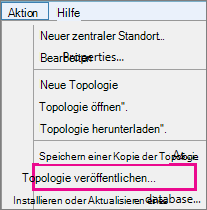

# <a name="upgrade-to-skype-for-business-server-2015"></a>Upgrade auf Skype for Business Server 2015
 
**Zusammenfassung:** Informationen Sie zum upgrade von Lync Server 2013 zu Skype für Business Server 2015. Laden Sie eine kostenlose Testversion von Skype für Business Server 2015 aus dem [Microsoft-Evaluierungscenter](https://www.microsoft.com/evalcenter/evaluate-skype-for-business-server).
  
Verwenden Sie die Verfahren in diesem Dokument von Lync Server 2013 auf Skype für Business Server 2015 Aktualisieren mithilfe der Skype für Business Server-Topologie-Generator und das neue Feature In-Place Upgrade. Wenn Sie von Lync Server 2010 oder Office Communications Server 2007 R2 aktualisieren möchten, finden Sie unter [Planen eines Upgrades auf Skype für Business Server 2015](../plan-your-deployment/upgrade.md).

> [!NOTE]
> Compliance-Upgrades in Skype für Business Server 2015 verfügbar waren, jedoch werden in Skype für Business Server 2019 nicht mehr unterstützt. Nebeneinander Koexistenz unterstützt wird, finden Sie weitere Informationen unter [Migration zu Skype für Business Server 2019](../../SfBServer2019/migration/migration-to-skype-for-business-server-2019.md) .
  
## <a name="upgrade-from-lync-server-2013"></a>Aktualisieren von Lync Server 2013

Aktualisieren von Lync Server 2013 auf Skype für Business Server 2015 bei der Installation der erforderlichen Software, mit der Skype für Business Server-Topologie-Generator zum upgrade von Datenbanken im Pool und mithilfe der Skype für Business Server In-Place Upgrade auf jedem der Server, die dem Pool zugeordnet. Zum Durchführen eines Upgrades führen Sie die acht Schritte im vorliegenden Thema aus.
  
### <a name="before-you-begin"></a>Vorbereitung

- Überprüfen Sie [Planen eines Upgrades auf Skype für Business Server 2015](../plan-your-deployment/upgrade.md).
    
- Überprüfen Sie die [Anforderungen für Skype für Business Server 2015](../plan-your-deployment/requirements-for-your-environment/server-requirements.md).
    
- [Installieren erforderlicher Komponenten für Skype für Business Server 2015](install/install-prerequisites.md) .
    
- [Skype für Business Server 2015 installieren](install/install.md) .
    
### <a name="step-1-install-administrator-tools-and-download-topology"></a>Schritt 1: Administratortools installieren und Topologie herunterladen

1. Verbinden Sie mit Computer in der Topologie, die keine Lync OCSCore oder andere Lync-Komponenten installiert sind.
    
2. Skype für Business Server 2015-Installationsmedium führen Sie **Setup.exe** aus **OCS_Volume\Setup\AMD64**. 
    
3. Klicken Sie auf **Installieren**. 
    
4. Akzeptieren Sie die Lizenzvereinbarungen.
    
5. Klicken Sie im Bereitstellungs-Assistenten auf **Administratortools installieren** und befolgen Sie die Schritte zur Installation.
    
     
  
6. Öffnen Sie in der Windows-Startseite Skype für Business Server-Topologie-Generator.
    
7. Klicken Sie auf **Topologie aus einer vorhandenen Bereitstellung herunterladen** und anschließend auf **Weiter**.
    
8. Geben Sie einen Namen für die Topologie ein und klicken Sie auf **Speichern**.
    
9. Gehen Sie zu dem Speicherort, an dem die Topologie gespeichert ist, und erstellen Sie eine Kopie der Topologie.
    
### <a name="step-2-upgrade-and-publish-topology-using-topology-builder"></a>Schritt 2: Upgrade und Veröffentlichen der Topologie mit dem Topologie-Generator

Bevor Sie den Upgradeprozess beginnen, müssen alle Dienste für die Pools ausgeführt werden, den, die Sie aktualisieren möchten. Die Topologieänderungen werden in der lokalen Datenbank der Server im Pool repliziert.
  
> [!IMPORTANT]
>  Speichern Sie vor dem Upgrade eine Kopie Ihrer Topologiedatei. Nach dem upgrade Sie ist nicht möglich, um die herabzustufen Topologie. > Wenn Ihre Dienste auf den gleichen Servern werden wie Ihre Datenbanken, wie Sie den beständigen Chat-Dienst auf demselben Server wie die Datenbank für beständigen Chat ist, um diesen Schritt überspringen, und gehen Sie zu Schritt 4. Wenn Sie die Dienste angehalten haben, führen Sie das Setup der Funktion für direkte Upgrades auf jedem Server zum Aktualisieren der lokalen Datenbanken aus.
  
> [!NOTE]
> Wenn die Topologie eine gespiegelte Back-End-Datenbank hat, werden Sie feststellen, dass sowohl der Prinzipalserver als auch die gespiegelten Datenbanken angezeigt werden, **wenn Sie die Topologie mithilfe des Topologie-Generators veröffentlichen**. Stellen Sie sicher, dass sämtliche Datenbanken auf dem Prinzipalserver laufen und dass Sie beim Veröffentlichen der Topologie nur die Prinzipaldatenbank und nicht die Spiegelung auswählen, andernfalls wird nach der Veröffentlichung der Topologie eine Warnung angezeigt.
  
Wählen Sie eine der folgenden Optionen aus, aktualisieren und veröffentlichen eine neue Topologie mithilfe der Skype für Business Server 2015 Topologie-Generator. Nachdem Sie die Schritte vollständig ausgeführt haben und die Topologie veröffentlicht haben, für die das Upgrade ausgeführt wurde, fahren Sie mit Schritt 3 in diesem Thema fort.
  
#### <a name="option-1-upgrade-an-isolated-front-end-pool-and-associated-archiving-and-monitoring-stores"></a>Option 1: Upgrade eines isolierten Front-End-Pools und der zugehörigen Speicher für die Archivierung und Überwachung

Wenn der Pool, für den Sie ein Upgrade durchführen möchten, vom Speicher zur Archivierung und Überwachung abhängig ist, wird mithilfe der folgenden Schritte auch für den Speicher zur Archivierung und Überwachung ein Upgrade durchgeführt.
  
1. Im Topologie-Generator mit der rechten Maustaste in eines Pools von Lync Server 2013, Option **auf Skype für Business Server 2015 aktualisieren**, und führen Sie die Schritte. 
    
     
  
2. Klicken Sie im Topologie-Generator auf **Aktion** > **Topologie veröffentlichen** oder **Aktion** > **Topologie** > **Veröffentlichen**. 
    
     
  
3. Wählen Sie während der Veröffentlichung die Installation einer Datenbank im Speicher für die Archivierung und Überwachung aus.
    
#### <a name="option-2-upgrade-front-end-pool-without-upgrading-archiving-and-monitoring-stores"></a>Option 2: Upgrade Front-End-Pool ohne zu aktualisieren, Archivierung und Überwachung von Speicher

Mithilfe der folgenden Anweisungen wird die Archivierung und Überwachung für den ausgewählten Pool deaktiviert. Der Pool weist nach dem Upgrade keine Speicher für die Archivierung und Überwachung auf.
  
1. Wählen Sie im Topologie-Generator den Lync Server 2013-Pool, den Sie aktualisieren möchten.
    
2. Entfernen Sie die Abhängigkeit auf die Lync Server 2013-Archivierung und Überwachung Speicher. 
    
   - Klicken Sie auf **Aktion** > **Eigenschaften bearbeiten**.
    
   - Deaktivieren Sie das Kontrollkästchen **Archivierung**.
    
     
  
   - Deaktivieren Sie das Kontrollkästchen **Überwachung**.
    
     
  
3. Mit der rechten Maustaste in des Lync Server 2013-Pools, wählen Sie die **Durchführen eines Upgrades auf Skype für Business Server 2015**, und führen Sie die Schritte. 
    
     
  
4. Klicken Sie im Topologie-Generator auf **Aktion** > **Topologie veröffentlichen** oder **Aktion** > **Topologie** > **Veröffentlichen**. 
    
#### <a name="option-3-upgrade-front-end-pool-and-associated-it-to-new-skype-for-business-server-2015-archiving-and-monitoring-stores"></a>Option 3: Upgrade Front-End-Pool und neue Skype für Business Server 2015 Archivierung und Überwachung Informationsspeicher zugeordnet

Wenn Sie die folgenden Anweisungen ausführen, wird die Archivierung und Überwachung im vorherigen Speicher abgebrochen und im neuen, von Ihnen erstellten Speicher gestartet. 
  
1. Wählen Sie im Topologie-Generator den Lync Server 2013-Pool, den Sie aktualisieren möchten. 
    
2. Entfernen Sie die Abhängigkeit auf die Lync Server 2013-Archivierung und Überwachung Speicher. 
    
   - Klicken Sie auf **Aktion** > **Eigenschaften bearbeiten**.
    
   - Deaktivieren Sie das Kontrollkästchen **Archivierung**.
    
     
  
   - Deaktivieren Sie das Kontrollkästchen **Überwachung**.
    
     
  
3. Mit der rechten Maustaste in des Lync Server 2013-Pools, wählen Sie die **Durchführen eines Upgrades auf Skype für Business Server 2015**, und führen Sie die Schritte. 
    
     
  
4. Erstellen Sie einen neuen SQL-Speicher für die Archivierung. 
    
   - Wählen Sie den Pool und die **Aktion** > **Eigenschaften bearbeiten**. 
    
   -  Aktivieren Sie das Kontrollkästchen **Archivierung**.
    
   - Klicken Sie auf **Neu**.
    
     
  
5. Erstellen Sie einen neuen SQL-Speicher für die Überwachung. 
    
   - Wählen Sie den Pool und die **Aktion** > **Eigenschaften bearbeiten**. 
    
   -  Wählen Sie das Kontrollkästchen **Überwachung** aus.
    
   - Klicken Sie auf **Neu**.
    
     
  
6. Klicken Sie im Topologie-Generator auf **Aktion** > **Topologie veröffentlichen** oder **Aktion** > **Topologie** > **Veröffentlichen**. 
    
7. Wählen Sie während der Veröffentlichung die Installation einer Datenbank im neuen Speicher für die Archivierung und Überwachung aus.
    
### <a name="step-3-wait-for-replication"></a>Schritt 3: Auf die Replikation warten

Die Replikation nimmt etwas Zeit in Anspruch, um die aktualisierte Topologie auf allen Servern der Umgebung zu veröffentlichen.
  
### <a name="step-4-stop-all-services-in-pool-to-be-upgraded"></a>Schritt 4: Alle Dienste im Pool abbrechen, für den ein Upgrade durchgeführt werden soll

Auf jedem Server bedient, die den Pool, den Sie möchten aktualisieren, führen Sie das folgende Cmdlet in PowerShell:
  
```
Disable-CsComputer -Scorch
```

Es wird empfohlen, Disable-CsComputer verwenden, da Sie möglicherweise den Server während des Vorgangs In-Place Upgrade neu starten müssen. Wenn Sie „Stop-CsWindowsService“ verwenden, werden einige Dienste nach einem Computerneustart eventuell automatisch neu gestartet. Dies kann dazu führen, dass das direkte Upgrade nicht ordnungsgemäß ausgeführt werden kann.
  
### <a name="step-5-upgrade-front-end-pools-and-non-front-end-pool-servers"></a>Schritt 5: Upgrades für Front-End-Pools und Nicht-Front-End-Pool-Server durchführen

> [!NOTE]
>  Vor dem Aktualisieren installieren Sie alle neue erforderlichen Komponenten für Skype für Business Server 2015 benötigt die umfassen: > mindestens 32GB freiem Speicherplatz, bevor Sie versuchen, ein Upgrade. Darüber hinaus stellen Sie sicher, dass das Laufwerk eine lokale Festplatte ist, nicht über USB oder Firewire verbunden ist, mit dem NTFS-Dateisystem formatiert ist, nicht komprimiert ist und keine Seite Datei enthält. > PowerShell, Version 6.2.9200.0 oder höher. > die neuesten Lync Server 2013 Kumulatives Update installiert. > SQL Server 2012 SP1 installiert. > die folgenden KB (automatisch installiert, wenn Microsoft Update verwenden) durch die Installation: > Windows Server 2008 R2 -[KB2533623](https://support.microsoft.com/kb/2533623)> Windows Server 2012 -[KB2858668](https://support.microsoft.com/kb/2858668)> Windows Server 2012 R2 -[KB2982006](https://support.microsoft.com/kb/2982006)
  
Verwenden Sie die In-Place Upgrade auf jedem Server, um den Front-End-Pool, edgepool, Mediation Server und Pools für beständigen Chat zu aktualisieren.
  
1. Führen Sie auf jedem Server **Setup.exe** aus **OCS_Volume\Setup\amd64** auf die Skype für Business Server 2015-Installationsmedien.
    
2. Akzeptieren Sie den Lizenzvertrag, und folgen Sie den Anweisungen für die In-Place Upgrade.
    
3. Wiederholen Sie diese Schritte für jeden Server im Front-End-Pool und auf jedem Poolserver der nicht - Front-End-aus.
    
> [!NOTE]
> Sie werden möglicherweise während des direkten Upgrades zum Neustarten des Servers aufgefordert. Das ist normal. Nach einem Neustart, wird die In-Place Upgrade aus, an der Stelle fortgesetzt. 
  
Nach dem erfolgreichen direkten Upgrade wird Ihnen die folgende Meldung angezeigt.
  

  
### <a name="step-6-restart-services-on-all-upgraded-servers"></a>Schritt 6: Dienste auf den Servern mit Upgrade neu starten

> [!NOTE]
> Vor dem Neustart der Dienste, stellen Sie sicher, dass %ProgramData%\WindowsFabric auf allen Front-End-Servern nicht vorhanden ist. Falls doch, löschen Sie es, bevor Sie die Dienste starten. 
  
- Nachdem Sie alle Server in der Front-End-Pool aktualisiert haben, starten Sie die Dienste mit den folgenden PowerShell-Befehl neu: 
    
  ```
  Start-CsPool
  ```

    > [!NOTE]
    > Wenn bereits ein anstehender Systemstart erforderlich ist, bevor sie das direkte Upgrade ausführen, werden Sie beim direkten Upgrade am Ende der Installation nicht zu einem Neustart aufgefordert. Dies führt zu Assembly-Ausnahmen gegenüber dem ersten Front-End-Server, wenn Sie versuchen, die Services mit dem Start-CSPool-Cmdlet zu starten. Nehmen Sie zur Fehlerbehebung einen Neustart aller Server im Pool vor und führen Sie das Cmdlet dann erneut aus. 
  
- Für Nicht-Front-End-Poolserver starten Sie die Dienste mithilfe des folgenden Befehls neu:
    
  ```
  Start-CsWindowsService
  ```

Nachdem Sie auf der Seite für das direkte Upgrade auf **OK** geklickt haben, wird folgende Erinnerung an die Ausführung dieses Schritts angezeigt.
  

  
### <a name="step-7-verify-skype-for-business-functionality-works"></a>Schritt 7: Überprüfen Sie, ob es sich bei Skype für Business Funktionalität works

Stellen Sie sicher, dass das Upgrade für den Pool erfolgreich war, die aktualisiert wurde, testen Sie Skype für Unternehmen, um sicherzustellen, dass die Funktionalität wie erwartet funktioniert. 
  
### <a name="step-8-upgrade-secondary-pools"></a>Schritt 8: Ein Upgrade der sekundären Pools durchführen

Wiederholen Sie die Schritte in diesem Thema, um ein Upgrade aller zusätzlichen Pools durchzuführen, die in Ihrer Umgebung vorhanden sind.
  
## <a name="troubleshoot-issues-with-the-in-place-upgrade"></a>Problembehandlung beim direkten Upgrade

Wenn das direkte Upgrade fehlschlägt, wird Ihnen ggf. eine Meldung angezeigt, die in etwa dem folgenden Bild entspricht. 
  

  
Überprüfen Sie die vollständige Meldung unten auf der Seite, um Hilfe zur Fehlerbehebung zu erhalten. Klicken Sie auf **Protokoll anzeigen**, um mehr Informationen zu erhalten.
  
Ausfall der In-Place Upgrade auf **Verifying upgraden Bereitschaft** oder **Fehlende erforderliche Komponenten installieren**, stellen Sie sicher, dass der Server hat die neuesten Windows Server, Lync Server und SQL Server Updates angewendet und die gesamte erforderliche Software und Rollen werden installiert. Eine Liste der was erforderlich ist finden Sie unter [Server-Anforderungen für Skype für Business Server 2015](../plan-your-deployment/requirements-for-your-environment/server-requirements.md) und [Installieren der erforderlichen Komponenten für Skype für Business Server 2015](install/install-prerequisites.md).
  
## <a name="see-also"></a>Siehe auch

[Planen des Upgrades auf Skype for Business Server 2015](../plan-your-deployment/upgrade.md)
  
[Serveranforderungen für Skype for Business Server 2015](../plan-your-deployment/requirements-for-your-environment/server-requirements.md)
  
[Installieren der erforderlichen Komponenten für Skype for Business Server 2015](install/install-prerequisites.md)
  
[Installieren von Skype for Business Server 2015](install/install.md)