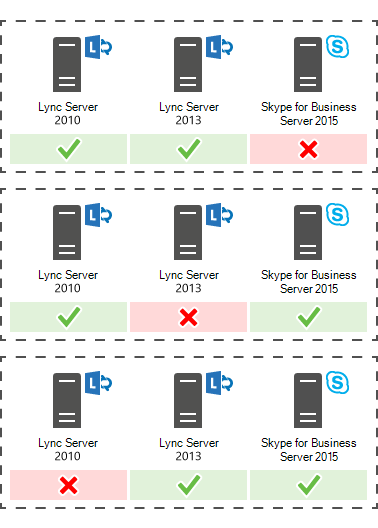

# Planen des Upgrades auf Skype for Business Server 2015Plan to upgrade to Skype for Business Server 2015
 
Zusammenfassung: Informationen Sie über die Dinge, dass Sie bei der Planung eines Upgrades auf Skype für Business Server 2015 berücksichtigen sollten.Summary: Learn about the things you should consider when you plan an upgrade to Skype for Business Server 2015. Laden Sie eine kostenlose Testversion von Skype für Business Server 2015 aus dem Microsoft Evaluation Center herunter: [https://www.microsoft.com/evalcenter/evaluate-skype-for-business-server](https://www.microsoft.com/evalcenter/evaluate-skype-for-business-server).Download a free trial of Skype for Business Server 2015 from the Microsoft Evaluation center at: [https://www.microsoft.com/evalcenter/evaluate-skype-for-business-server](https://www.microsoft.com/evalcenter/evaluate-skype-for-business-server).
  
Im Rahmen des Projektplans zum Upgraden auf Skype für Business Server 2015, verwenden Sie dieses Thema um zu verstehen, wie die empfohlene Aktualisierungspfade zu Skype für Business Server 2015, die In-Place Upgrade funktioniert, was die unterstützte Koexistenzszenarien sind, und den Upgradeprozess sieht folgendermaßen aus.As part of your plan to upgrade to Skype for Business Server 2015, use this topic to understand the recommended upgrade paths to Skype for Business Server 2015, how the In-Place Upgrade works, what the supported coexistence scenarios are, and what the upgrade process looks like.
  
## Empfohlene Aktualisierungspfade zu Skype für Business Server 2015Recommended upgrade paths to Skype for Business Server 2015

 Wenn von Lync Server 2013, Lync Server 2010 oder Office Communications Server 2007 R2 auf Skype für Business Server 2015 aktualisieren, verwenden Sie die folgenden Aktualisierungspfade:To upgrade from Lync Server 2013, Lync Server 2010, or Office Communications Server 2007 R2 to Skype for Business Server 2015, use the following upgrade paths:
  
> [!CAUTION]
> Bei direkten Upgrades werden Konferenzverzeichnisse automatisch von Lync Server 2013 zu Skype for Business Server 2015 verschoben. Wenn Sie jedoch beabsichtigen, die Konferenzverzeichnisse manuell zu verschieben, ist es sehr wichtig, dass Sie die Skype for Business Server 2015-Verwaltungsshell verwenden. Wenn Sie versuchen, die Konferenzverzeichnisse mithilfe der Lync Server 2013-Verwaltungsshell von Lync Server 2013 zu Skype for Business Server 2015 zu verschieben, kann es zu Datenverlust kommen. Im Allgemeinen gilt Folgendes: Immer dann, wenn Sie in beliebiger Kapazität mit Skype for Business Server 2015 arbeiten, sollten Sie die Skype for Business Server 2015-Toolsammlung verwenden.In-Place Upgrade automatically moves conference directories from Lync Server 2013 to Skype for Business Server 2015. However, if you plan to manually move conference directories it is very important to use the Skype for Business Server 2015 Management Shell. If you try to use the Lync Server 2013 Management Shell to move conference directories from Lync Server 2013 to Skype for Business Server 2015 then data loss can occur. In general, whenever you are working with Skype for Business Server 2015 in any capacity you should use the Skype for Business Server 2015 tool set. 
  
|**Version****Version**|**Empfehlungen****Recommendations**|
|:-----|:-----|
|Lync Server 2013Lync Server 2013    | Verwenden Sie zum Aktualisieren der Skype für Business Server-Topologie-Generator und das neue Feature für In-Place Upgrade auf jedem Server, der dem Pool zugeordnet.To upgrade, use the Skype for Business Server Topology Builder and the new In-Place Upgrade feature on each of the servers associated with the pool. Ausführliche Schritte finden Sie unter [Aktualisieren von Lync Server 2013 für die Skype für Business Server 2015 planen](upgrade.md#BKMK_PlanUpgradeFromLync2013) und [Durchführen eines Upgrades auf Skype für Business Server 2015](../deploy/upgrade-to-skype-for-business-server.md) .see [Plan to upgrade from Lync Server 2013 to Skype for Business Server 2015](upgrade.md#BKMK_PlanUpgradeFromLync2013) and [Upgrade to Skype for Business Server 2015](../deploy/upgrade-to-skype-for-business-server.md) for detailed steps.   |
|Lync Server 2010 + Lync Server 2013 (dualer Modus)Lync Server 2010 + Lync Server 2013 (dual-mode)    |Erstens Durchführen eines Upgrades auf Lync Server 2013, und dann auf Aktualisieren Skype für Business Server 2015 mithilfe des neuen Features In-Place Upgrade.First, upgrade to Lync Server 2013, and then upgrade to Skype for Business Server 2015 by using the new In-Place Upgrade feature. Wenn Ihre Topologie aber primär Lync Server 2010 umfasst, können Sie auch ein Rollback der Lync Server 2013-Komponenten auf Lync Server 2010 und dann direkt ein Upgrade auf Skype for Business Server 2015 durchführen.However, if your topology is primary Lync Server 2010 you can also roll back the Lync Server 2013 components to Lync Server 2010 and then upgrade directly to Skype for Business Server 2015. In diesem Fall könnten Sie das direkte Upgrade nicht nutzen und würden die direkte Koexistenz zwischen Lync Server 2010 und Skype for Business Server 2015 verwenden.In this case you would not be able to take advantage of In-Place Upgrade and would use straight co-existence between Lync Server 2010 and Skype for Business Server 2015. Dreifaches Vorhandensein wird nicht unterstützt, eine Koexistenz dagegen schon.Tri-existence is not supported but co-existence is supported.    |
|Lync Server 2010Lync Server 2010    |Wählen Sie einen neuen Skype for Business Server 2015-Pool aus und migrieren Sie dann Benutzer zu diesem neuen Pool.Bring up a new Skype for Business Server 2015 pool and then migrate users to this new pool. Anschließend können Sie den alten Lync Server 2010-Pool außer Betrieb nehmen.You can then decommission the old Lync Server 2010 pool. Ein Upgrade von Lync Server 2010 auf Skype for Business Server 2015 ist ähnlich wie ein Upgrade von Lync Server 2010 auf Lync Server 2013.Upgrading from Lync Server 2010 to Skype for Business Server 2015 is similar to upgrading from Lync Server 2010 to Lync Server 2013. Finden Sie unter [Migration von Lync Server 2010 zu Lync Server 2013](https://go.microsoft.com/fwlink/p/?LinkId=526615).See [Migration from Lync Server 2010 to Lync Server 2013](https://go.microsoft.com/fwlink/p/?LinkId=526615).    |
|Office Communications Server 2007 R2Office Communications Server 2007 R2    | Wählen Sie eine der beiden Optionen aus:Pick one of two options:    Richten Sie eine neue Skype für Business Server 2015-Umgebung.Set up a new Skype for Business Server 2015 environment.    Auch wenn Ihre Hardware und Software die Anforderungen für Skype für Business Server 2015 erfüllen, Durchführen eines Upgrades auf Lync Server 2013 und Upgraden Sie dann mithilfe des neuen Features In-Place Upgrade für Business Server 2015 auf Skype.Or if your hardware and software meet the requirements for Skype for Business Server 2015, upgrade to Lync Server 2013, and then upgrade to Skype for Business Server 2015 by using the new In-Place Upgrade feature. Weitere Informationen finden Sie unter [Server-Anforderungen für Skype für Business Server 2015](requirements-for-your-environment/server-requirements.md) und [Migration von Office Communications Server 2007 R2 zu Lync Server 2013](https://go.microsoft.com/fwlink/p/?LinkId=526616).For more information, see [Server requirements for Skype for Business Server 2015](requirements-for-your-environment/server-requirements.md) and [Migration from Office Communications Server 2007 R2 to Lync Server 2013](https://go.microsoft.com/fwlink/p/?LinkId=526616).    |
   
> [!NOTE]
> SQL Server 2014 wird unterstützt Skype für Business Server 2015 jedoch nicht in Lync Server 2013 unterstützt wird.SQL Server 2014 is supported in Skype for Business Server 2015 but is not supported in Lync Server 2013. Wenn Sie von SQL Server 2012 auf SQL Server 2014 aktualisieren möchten muss dann der Pool zuerst auf Skype für Business Server 2015 mithilfe der In-Place Upgrade-Methode, wie in diesem Dokument beschrieben aktualisiert werden.If you want to upgrade from SQL Server 2012 to SQL Server 2014 then the pool must first be upgraded to Skype for Business Server 2015 using the In-Place Upgrade method as described in this document. Sie können dann aktualisieren von SQL Server 2012, um den SQL Server 2014, finden Sie unter [Aktualisieren auf SQL Server 2014](https://msdn.microsoft.com/en-us/library/bb677622%28v=sql.120%29.aspx).You can then upgrade from SQL Server 2012 to SQL Server 2014, see [Upgrade to SQL Server 2014](https://msdn.microsoft.com/en-us/library/bb677622%28v=sql.120%29.aspx). Weitere Informationen zum datenbankanforderungen finden Sie unter [Server-Anforderungen für Skype für Business Server 2015](requirements-for-your-environment/server-requirements.md).To learn more about database requirements, see [Server requirements for Skype for Business Server 2015](requirements-for-your-environment/server-requirements.md). 
  
## Planung eines Upgrades von Lync Server 2013 auf Skype for Business Server 2015Plan to upgrade from Lync Server 2013 to Skype for Business Server 2015

Sie können Lync Server 2013-Systeme auf Skype für Business Server 2015 mithilfe der neuen Funktion In-Place Upgrade aktualisieren.You can upgrade Lync Server 2013 systems to Skype for Business Server 2015 using the new In-Place Upgrade feature. Direktes Upgrade bietet eine per Mausklick-Lösung, die Zertifikate sichert, Server-Komponenten deinstalliert, lokale Datenbanken aktualisiert und die Skype für Business Server 2015 Rollen installiert.In-place upgrade provides a one-click solution that backs up certificates, uninstalls server components, upgrades local databases, and installs the Skype for Business Server 2015 roles. Direktes Upgrade soll vorhandener Hardware und Server Investitionen, Verringerung der Kosten für allgemeinen zum Bereitstellen von Skype für Business Server 2015 beibehalten.In-place upgrade seeks to preserve existing hardware and server investments, reducing the overall cost to deploy Skype for Business Server 2015.
  
> [!NOTE]
> In-Place Upgrade können Sie die gleiche Hardware beim Upgrade auf Skype für Business Server verwenden.In-Place Upgrade allows you to use the same hardware when upgrading to Skype for Business Server. Bei der Wiederverwendung der gleichen Hardware dürfen Sie jedoch nicht von derselben Leistungsfähigkeit ausgehen.However, reusing the same hardware does not translate into the same performance capacity. Sie sollten davon ausgehen, dass die Leistung Lasten für Lync Server 2013 und Skype für Business Server 2015 identisch sein.You should not expect the performance loads for Lync Server 2013 and Skype for Business Server 2015 to be identical. 
  
> [!NOTE]
> Direktes Upgrade unterstützt keine hohe Verfügbarkeit oder Disaster Recovery für Skype für Business Server.In-Place upgrade does not support high availability or disaster recovery for Skype for Business Server. 
  
Direktes Upgrade umfasst Offlineschalten von Lync Server 2013-Pool, und aktualisieren es auf einen Skype für Business Server 2015 Pool.In-place upgrade involves taking the Lync Server 2013 pool offline and upgrading it to a Skype for Business Server 2015 pool. 
  
### Erstellen eines Plans für ein direktes UpgradeCreate an In-Place Upgrade plan

Stellen Sie einen Plan für der umfasst:Make a plan that includes:
  
1. Kenntnis der aktuellen Topologie.An understanding of your current topology.
    
    > [!NOTE]
    > Achten Sie darauf, dass LRS-Verwaltungstool für Lync Server 2013 vor dem Ausführen des In-Place Upgrade zu deinstallieren.Be sure to uninstall LRS Admin tool for Lync Server 2013 before running In-Place Upgrade. Die LRS-Verwaltungstool für Lync Server 2013 können nicht mit Skype für Business Server 2015 verwendet werden.The LRS Admin Tool for Lync Server 2013 cannot coexist with Skype for Business Server 2015. Installieren Sie nach dem Ausführen der In-Place Upgrade der neuen LRS-Verwaltungstool, finden Sie unter [Microsoft Lync Raum System Administrative Webportal für Skype für Business Server 2015](https://go.microsoft.com/fwlink/?LinkID=544807)After running In-Place Upgrade install the new LRS Admin tool, see [Microsoft Lync Room System Administrative Web Portal for Skype for Business Server 2015 ](https://go.microsoft.com/fwlink/?LinkID=544807)
  
2. Der primäre Pool für das Upgrade.The primary pool for the upgrade.
    
3. Die Entscheidung darüber, ob ein Upgrade der Datenbanken für die Archivierung und Überwachung durchgeführt oder neue Datenbanken erstellt werden sollen.Whether you'll upgrade the Archiving and Monitoring databases or create new ones.
    
4. Die verwendete Methode für direkte Upgrades: Offline oder durch Verschieben von Benutzern. Wenn Sie Benutzer verschieben, müssen Sie auch die mit dem primären Pool verknüpften globalen Konferenzverzeichnisse migrieren.The In-Place Upgrade method you'll use: Offline or Move Users. As part of Move Users you also will need to migrate the global conference directories associated with the primary pool. 
    
5. Einen Kommunikationsplan für betroffene Benutzer.A communication plan for impacted users.
    
6. Einen Plan zur Sicherung im Falle eines fehlgeschlagenen Upgrades.A backup plan in case the upgrades fails.
    
Alle dem primären Pool angehörenden Benutzer können die Dienste während des Upgrades nicht nutzen.Any users that are in the primary pool while it's being upgraded won't be able to use the services until the upgrade is complete. Wenn Sie über einen funktionsfähigen sekundären Pool verfügen, können Sie diese Benutzer vor dem Upgrade dorthin verschieben, damit sie nicht von der Ausfallzeit während des Upgrades betroffen sind.If you have a working secondary pool, you can avoid impacting users by moving them to the secondary pool before the upgrade. Verschieben Sie die Benutzer nach dem Upgrade wieder in den primären Pool aus.After the upgrade, move the users back to the primary pool.
  
### Methoden für direkte UpgradesIn-place upgrade methods

Es gibt zwei Methoden für direkte Upgrades:There are two scenarios for In-Place Upgrade: 
  
- Bei der ersten Methode werden die Benutzer verschoben, so entsteht für sie keine Ausfallzeit.The Move User method, which requires no downtime for users. 
    
- Bei der Offline-Methode entsteht für die Benutzer eine Ausfallzeit.The Offline method, which requires downtime.
    
Es wird empfohlen, ein Upgrade Offline-Methode während eines Wartungsfensters geplant werden, und Benutzer werden die Downtime benachrichtigt.We recommend that an Offline method upgrade be scheduled during a maintenance window and users are notified of the downtime.
  
> [!NOTE]
> Beim Upgrade eines gekoppelten Pools in Lync Server 2013, bei dem ein Upgrade beider Pools auf Skype for Business Server 2015 ausgeführt werden soll, stellen Sie sicher, dass das Upgrade des zweiten Pools unmittelbar nach dem Upgrade des ersten Pools erfolgt. Wenn ein Pool mit Lync Server 2013 und der zweite Pool mit Skype for Business Server 2015 ausgeführt wird, sind die Notfallwiederherstellungsoptionen minimiert. Wenn beispielsweise ein Pool unter Version 2013 und der zweite unter Version 2015 ausgeführt wird und es zu einem Notfall kommt, kann es zu Datenverlusten kommen, da ein Pool-Failover im Notfallmodus nicht unterstützt wird, wenn ein Poolpaar nicht unter der gleichen Version ausgeführt wird.When upgrading a paired pool on Lync Server 2013 and you want to upgrade both pools to Skype for Business Server 2015. Make sure to upgrade the second pool immediately after upgrading the first pool. When one pool is running Lync Server 2013 and the second pool is running Skype for Business Server 2015 then disaster recovery options are minimized. For example, if one pool is running 2013 and the second is 2015 and there is a disaster then you could experience data loss because pool failover is not supported in disaster mode when paired pools are not the same version. 
  
#### Offline-Methode für direkte UpdatesIn-place upgrade Offline method

Verwenden Sie diese Methode, wenn Sie Benutzer nicht zwischen Pools verschieben möchten.Use this method if you don't want to move users between user pools. Während des Upgrades werden Benutzer nicht Lync oder Skype für BusinessServices verwendet werden können.During the upgrade, users will not be able to use Lync or Skype for Business services. 
  
Im folgenden Diagramm ist eine Übersicht über diesen Prozess dargestellt.The following diagram shows an overview of this process.
  

  
> [!NOTE]
> Wenn Sie über gepaarte Pools verfügen, lösen Sie die Paarung nicht vor dem Upgrade.If you have paired pools, do not unpair them before the upgrade. 
  
Nachdem Sie mit dem Upgrade eines Serverpools begonnen haben, müssen Sie das Upgrade des gesamten Pools vervollständigen.Once you start to upgrade a server pool, you must complete the upgrade of the entire pool. Skype für Business Server unterstützt nicht, müssen nur einen Teil des Pools aktualisiert.Skype for Business Server doesn't support having only a portion of the pool upgraded. 
  
#### Methode der Verschiebung von Benutzern (keine Ausfallzeit für Benutzer)Move Users method (no user downtime)

Zur Verwendung dieser Methode verschieben Sie die Benutzer in einen anderen Pool, bevor Sie mit dem Upgrade beginnen.To use this method, you move users to another pool before you start the upgrade. Während des Upgrades können Benutzer Lync-Dienste verwenden.During the upgrade, users can use Lync services. Nachdem sie in der aktualisierte Pool verschoben haben, können sie Skype für Unternehmen verwenden.After they're moved to the upgraded pool, they can use Skype for Business. Im folgenden Diagramm sehen Sie einen Überblick über diesen Prozess.The following diagram shows an overview of this process.
  
> [!IMPORTANT]
> Im Rahmen dieser Methode müssen Sie auch die mit dem primären Pool verknüpften globalen Konferenzverzeichnisse migrieren.As part of Move Users you also will need to migrate the global conference directories associated with the primary pool. PSTN-Einwahlkonferenzen lösen weiterhin die ConferenceID in den aktualisierten Pool und nicht in den gepaarten Pool auf.PSTN dial-in conferencing will still resolve ConferenceID to the pool being upgraded, instead of the paired pool. Daher müssen die Konferenzverzeichnisse verschoben werden, wenn die im Pool geplanten PSTN-Konferenzen während des Upgrades weiterhin zugänglich sein sollen.So you need to move Conference Directories, if you still want PSTN conferences scheduled in the pool to be accessible during upgrade. 
  

  
#### Benutzer für ein Hardware-Upgrade verschiebenMove users for hardware upgrade

 Wenn Ihre Hardware den [Anforderungen für Skype für Business Server 2015](requirements-for-your-environment/server-requirements.md)nicht erfüllt werden, richten Sie eine neue Skype für Business Server 2015 Umgebung, und verschieben Sie Benutzer vorhanden.If your hardware doesn't meet the [Server requirements for Skype for Business Server 2015](requirements-for-your-environment/server-requirements.md), set up a new Skype for Business Server 2015 environment, and move users there. Im folgenden Diagramm ist eine Übersicht über diesen Prozess für ein Upgrade von Lync Server 2010 dargestellt.The following diagram shows an overview of this process for upgrade from Lync Server 2010. 
  

  
### Prozess des direkten UpgradesIn-place upgrade process

 Aktualisieren von Lync Server 2013 zu Skype für Business Server 2015 mit den folgenden Schritten:Upgrade from Lync Server 2013 to Skype for Business Server 2015 using the following steps:
  
1. Sichern Sie alle Datenbanken vor dem Upgrade.Back up all databases before the upgrade.
    
2. Stellen Sie sicher, dass alle Dienste, für die ein Upgrade ausgeführt werden soll, aktiv ausgeführt werden.Make sure all services that are to be upgraded are in a running state.
    
3. Führen Sie ein Upgrade der Topologiedatei mithilfe des Topologie-Generator durch und veröffentlichen Sie diese.Upgrade and publish the topology file using the topology builder.
    
4. Unterbrechen Sie alle Dienste der Front-End-Server.Stop all services on all Front End servers.
    
5. Installieren von neuen erforderlichen Komponenten für Skype für Business Server benötigt.Install new prerequisites required for Skype for Business Server.
    
6.  Starten Sie das direkte Upgrade auf jedem Front-End-Server.On each Front End server, start the In-Place Upgrade.
    
7. Nach Abschluss des Upgrades müssen Sie alle Dienste neu starten.When the upgrade is complete, restart all services.
    
  - Starten Sie für alle Front-End-Pools mithilfe des Befehls Start-CsPool neu.For the Front End pool, restart services using the command Start-CsPool.
    
  - Verwenden Sie Start-CSWindowsService für Server, die keine Front-End-Server sind.For non-Front End servers, use Start-CSWindowsService.
    
> [!NOTE]
>  Wenn Sie kein Upgrade für die bereits vorhandenen Datenbanken zur Archivierung und Überwachung durchführen möchten, entfernen Sie die Abhängigkeit, bevor Sie ein Upgrade der Topologie durchführen.If you don't want to upgrade your existing Archiving and Monitoring databases, remove the dependency before you upgrade the topology. Wenn Sie neue Datenbanken zur Archivierung und Überwachung erstellen möchten, können Sie einen neuen SQL-Speicher erstellen und ihn dem Pool zuweisen.If you want to create new Archiving and Monitoring databases, during the upgrade, you can create a new SQL store and associate it with the pool. Sie können die Schritte zum dazu im Thema[Durchführen eines Upgrades auf Skype für Business Server 2015](../deploy/upgrade-to-skype-for-business-server.md)suchen.You can find the steps on how to do this in the topic,[Upgrade to Skype for Business Server 2015](../deploy/upgrade-to-skype-for-business-server.md). > In-Place Upgrade unterstützt hohe Verfügbarkeit oder notfallwiederherstellung für Skype für Business Server nicht.>  In-place upgrade does not support high availability or disaster recovery for Skype for Business Server. Um zu vermeiden, Benutzer Dienste unterbrechen, verwenden Sie die [Benutzer verschieben-Methode (keine Benutzer Ausfallzeit)](upgrade.md#bkmk_MoveUsersMethod) zum Upgrade. > während des Upgrades das Xds-Replikat in der lokalen freigegebenen Ordner auf dem Laufwerk mit dem meisten freien Speicherplatz platziert wird.To avoid interrupting users' services, use the [Move Users method (no user downtime)](upgrade.md#bkmk_MoveUsersMethod) to upgrade.>  During the upgrade process the xds-replica is placed in the local shared folder on the disk drive with the most free space. Wird dieses Laufwerk später entfernt, treten unter Umständen Probleme auf, zum Beispiel starten Dienste möglicherweise nicht.If that disk is later removed then you can run into issues such as services not starting.
  
### Upgrade-ReihenfolgeUpgrade order

Aktualisieren Sie die Topologie von innen nach außen.Upgrade the topology from the inside to the outside. Führen Sie zunächst ein Upgrade aller Pools durch, fahren Sie dann mit den Edgeservern fort und führen Sie zum Schluss ein Upgrade für den zentralen Verwaltungsspeicher (CMS, Central Management Store) durch.Upgrade all your pools first, then the edge servers, and finally the Central Management Store (CMS) pool. 
  
### Überlegungen zur Kerberos-AuthentifizierungKerberos authentication considerations

Wenn Sie die Kerberos-Authentifizierung für Webdienste verwenden, müssen Sie die Kerberos-Konten neu zuweisen und das Kennwort nach Abschluss eines direkten Upgrades zurücksetzen.If you use Kerberos authentication for Web Services, you must reassign Kerberos accounts and reset the password after the In-Place Upgrade is complete. Weitere Informationen hierzu finden Sie unter [Einrichten der Kerberos-Authentifizierung](https://go.microsoft.com/fwlink/p/?LinkId=530342).To learn how to do this, see [Setting up Kerberos authentication](https://go.microsoft.com/fwlink/p/?LinkId=530342).
  
## Unterstützung für die Koexistenz mit Lync Server 2013 und Lync Server 2010Support for coexistence with Lync Server 2013 and Lync Server 2010

Sie können Skype for Business Server 2015 in derselben Topologie wie Lync Server 2013 oder Lync Server 2010 ausführen, es können jedoch nicht alle drei Lösungen in derselben Topologie vorhanden sein.You can run Skype for Business Server 2015 in the same topology as Lync Server 2013 or Lync Server 2010, but you can't have all three in the same topology.
  
Wenn eine Koexistenz zwischen Lync Server 2010 und Lync Server 2013 vorliegt, wird ein Upgrade der gesamten Topologie auf Lync Server 2013 sowie ein anschließendes Upgrade auf Skype for Business Server 2015 mit der Funktion für direkte Upgrades empfohlen.If you have a co-existence between Lync Server 2010 and Lync Server 2013, it is recommended to upgrade the entire topology to Lync Server 2013, and then upgrade to Skype for Business Server 2015 using the In-Place Upgrade. Weitere Informationen finden Sie unter [Migration von Lync Server 2010 zu Lync Server 2013](https://go.microsoft.com/fwlink/p/?LinkId=526615).For more information, see [Migration from Lync Server 2010 to Lync Server 2013](https://go.microsoft.com/fwlink/p/?LinkId=526615).
  
Wenn es sich bei Ihrer Topologie primär um Lync Server 2010 handelt, führen Sie ein Rollback der Lync Server 2013-Komponenten auf Lync Server 2010 durch, bevor Sie ein Upgrade der Topologie auf Skype for Business Server 2015 durchführen. In diesem Fall können Sie die Vorteile der Funktion für direkte Upgrades nicht nutzen und verfügen über eine Koexistenz-Topologie zwischen Lync Server 2010 und Skype for Business Server 2015.If your topology is primarily Lync Server 2010, roll back the Lync Server 2013 components to Lync Server 2010 before upgrading the topology to Skype for Business Server 2015. In this case, you lose the benefit of the In-Place Upgrade and have a co-existence topology between Lync Server 2010 and Skype for Business Server 2015.
  
Das folgende Diagramm zeigt die koexistenzunterstützung von Skype Business Server 2015 mit Lync Server 2013 und Lync Server 2010.The following diagram shows the coexistence support of Skype for Business Server 2015 with Lync Server 2013 and Lync Server 2010.
  

  
## Upgradeprozess mit vorhandener Survivable Branch-Anwendung und vorhandenem Survivable Branch ServerUpgrade process with existing Survivable Branch Appliance and Server

Skype für Business Server 2015 unterstützt keine direkte Aktualisierung Survivable Branch Appliance (SBA) oder einen Survivable Branch Server (SBS).Skype for Business Server 2015 doesn't support an In-Place Upgrade of a Survivable Branch Appliance (SBA) or a Survivable Branch Server (SBS).
  
Die Koexistenz zwischen Skype for Business Server-Rechenzentren mit Lync Server 2010 oder Lync Server 2013 SBA/SBS wird jedoch unterstützt.However, we do support coexistence of Skype for Business Server datacenters with Lync Server 2010 or Lync Server 2013 SBA/SBS. 
  
Wenn Sie ein direktes Upgrade eines Lync Server 2013-Front-End (FE)-Pools mit einem zugeordneten Zweigstellenstandort planen, können die vorhandenen Benutzer auf dem Lync Server 2013 SBA/SBS verbleiben.When planning for an In-Place Upgrade of a Lync Server 2013 Front End (FE) pool with an associated branch, you can leave the existing users on the Lync Server 2013 SBA/SBS. Während des Upgrades wechseln die SBA/SBS-Benutzer in den Ausfallsicherheitsmodus und kehren nach Abschluss des Upgrades in den normalen Funktionsmodus zurück.During the upgrade, the SBA/SBS users will go in resiliency mode and will return to normal functionality after the upgrade has completed. Weitere Informationen zu der Benutzer wünschen während der ausfallsicherheitsmodus ist finden Sie unter [Branch-Site Resiliency Features in Lync Server 2013](https://technet.microsoft.com/library/gg398715.aspx).For more information about the users' experience during the resiliency mode, please see [Branch-site resiliency features in Lync Server 2013](https://technet.microsoft.com/library/gg398715.aspx).
  
Wenn erneut hinzugefügt Migrieren einer Lync Server 2010-Topologie zu Skype für Business Server 2015, der SBA/SBS muss die Topologie, ähnlich wie die Migration zu Lync Server 2013.When migrating a Lync Server 2010 topology to Skype for Business Server 2015, the SBA/SBS must re-added to the topology, similar to the migration to Lync Server 2013. Lesen Sie [Verbinden Survivable Branch Appliance zu Lync Server 2013-Front-End-Pool](https://technet.microsoft.com/library/jj688026.aspx), für die erforderlichen Schritte.For the required steps, please read [Connecting Survivable Branch Appliance to Lync Server 2013 Front End pool](https://technet.microsoft.com/library/jj688026.aspx).
  
Für Topologien Koexistenz von Lync Server 2010 und Lync Server 2013 angepasst werden zuerst die Empfehlungen im Abschnitt "Unterstützung für die Koexistenz mit Lync Server 2013 und Lync Server 2010" gestellt.For co-existence topologies of Lync Server 2010 and Lync Server 2013, align first to the recommendations made in the section 'Support for coexistence with Lync Server 2013 and Lync Server 2010'.
  
## Waren diese Schritte hilfreich? Wenn ja, teilen Sie uns dies bitte unterhalb des Artikels mit. Wenn nicht, schreiben Sie uns, was für Sie unklar war, und wir verwenden Ihr Feedback, um unsere Schritte zu überprüfen.See also

#### 

[Upgrade auf Skype für Business Server 2015Upgrade to Skype for Business Server 2015](../deploy/upgrade-to-skype-for-business-server.md)
  
[Umgebungsanforderungen für Skype für Business Server 2015Environmental requirements for Skype for Business Server 2015](requirements-for-your-environment/environmental-requirements.md)
  
[Serveranforderungen für Skype für Business Server 2015Server requirements for Skype for Business Server 2015](requirements-for-your-environment/server-requirements.md)

