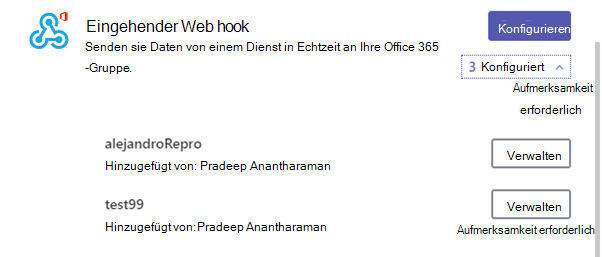
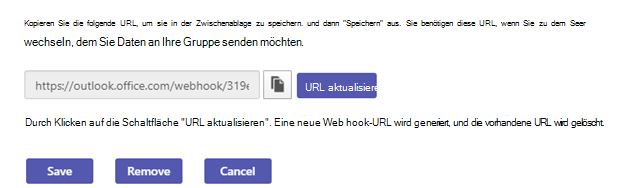

# Verwenden Microsoft 365 und benutzerdefinierten Verbindern in Microsoft Teams

Connectors halten Ihr Team auf dem laufenden, indem häufig verwendete Inhalts- und Dienstupdates direkt in einem Kanal zur Verfügung gestellt werden. Mit Connectors können Microsoft Teams Benutzer Updates von beliebten Diensten wie Trello, Wunderlist, GitHub und Azure DevOps Services innerhalb des Chatstreams im Team erhalten.

Jedes Mitglied eines Teams kann sein Team mit beliebten Clouddiensten über die Connectors verbinden, sofern die Teamberechtigungen dies zulassen, und alle Teammitglieder werden über Aktivitäten dieses Diensts benachrichtigt. Verbinder funktionieren auch nach dem Verlassen des Verbinders weiterhin, nachdem das Mitglied, das den Verbinder eingerichtet hat, den Connector verlassen hat. Jedes Teammitglied mit der Berechtigung zum Hinzufügen\Entfernen kann die Einrichtung von Connectors durch andere Mitglieder ändern.

Microsoft 365 Connectors können sowohl mit Microsoft Teams als auch mit Microsoft 365-Gruppen verwendet werden, wodurch es für alle Mitglieder einfacher wird, synchronisiert zu bleiben und relevante Informationen schnell zu erhalten. Sowohl Microsoft Teams als Exchange verwenden dasselbe Verbindermodell, das es Ihnen ermöglicht, die gleichen Verbinder auf beiden Plattformen zu verwenden. Es ist jedoch zu erwähnen, dass das Deaktivieren von Connectors für die Microsoft 365-Gruppe, von der ein Team abhängig ist, die Möglichkeit zum Erstellen von Connectors auch für dieses Team deaktiviert.

> [!NOTE]
> Connectors sind in anderen Umgebungen GCC deaktiviert. Wenn Sie sie aktivieren müssen, legen Sie die Parameter ConnectorsEnabled oder ConnectorsEnabledForTeams auf $true [Set-OrganizationConfig-Cmdlet](/powershell/module/exchange/set-organizationconfig) fest. Sie müssen zuvor eine [Verbindung mit PowerShell Exchange Online herstellen.](/powershell/exchange/connect-to-exchange-online-powershell)

> [!NOTE]
> Connectors sind in Government Cloud Community (GCC) standardmäßig deaktiviert. Wenn Sie sie aktivieren müssen, legen Sie die Parameter ConnectorsEnabled oder ConnectorsEnabledForTeams auf $true [SetOrganizationConfig-Cmdlet](/powershell/module/exchange/set-organizationconfig?view=exchange-ps) fest. Sie mussten zuvor eine Verbindung mit dem Exchange Online [PowerShell herstellen.](/powershell/exchange/connect-to-exchange-online-powershell?view=exchange-ps)

## Hinzufügen eines Connectors zu einem Kanal

Derzeit können Sie Connectors mithilfe Microsoft Teams Desktop- und Webclients hinzufügen. Die von diesen Connectors bereitgestellten Informationen können jedoch auf allen Clients **angezeigt werden, auch** auf mobilen Geräten.

1. Wenn Sie einem Kanal einen Verbinder hinzufügen möchten, klicken Sie auf die drei **Punkte (...),** rechts neben einem Kanalnamen, und klicken Sie dann auf **Verbinder**.

    > [!div class="mx-imgBorder"]
    > 

2. Sie können aus einer Vielzahl von verfügbaren Verbindern auswählen und dann auf **Hinzufügen klicken.**

    > [!div class="mx-imgBorder"]
    > 

3. Geben Sie die erforderlichen Informationen des ausgewählten Connectors ein, und klicken Sie auf **Speichern**. Jeder Connector erfordert verschiedene Informationen, damit er richtig funktioniert. Bei manchen dieser Informationen müssen Sie sich über die Links auf der Connector-Konfigurationsseite bei dem Dienst anmelden.

    > [!div class="mx-imgBorder"]
    > 

4. Die vom Connector bereitgestellten Daten werden automatisch im Kanal gepostet.

    > [!div class="mx-imgBorder"]
    > 

<!---Delete this section after customer migration to new Webhook URL is complete--->
> [!IMPORTANT]
> **Updatebenachrichtigung über die Connector-URL**
>
> Die Teams Connectors werden auf eine neue URL umstellen, um die Sicherheit zu erhöhen. Während dieses Übergangs erhalten Sie bestimmte Benachrichtigungen zum Aktualisieren des konfigurierten Connectors für die Verwendung der neuen URL. Es wird dringend empfohlen, den Verbinder sofort zu aktualisieren, um Unterbrechungen der Connectordienste zu verhindern. Um die URL zu aktualisieren, müssen Sie die folgenden Schritte ausführen:
> 1. Auf der Konfigurationsseite für Connectors wird unter der Schaltfläche "Verwalten" die Meldung "Achtung erforderlich" für die Verbindungen angezeigt, die aktualisiert werden müssen.
> 
> 2. Bei eingehenden Webhook-Connectors können Benutzer die Verbindung neu herstellen, indem sie einfach **URL aktualisieren** auswählen und die neu generierte Webhook-URL verwenden.
> 
> 3. Bei anderen Connectortypen muss der Benutzer den Connector entfernen und die Connectorkonfiguration erneut erstellen.
> 4. Nach dem erfolgreichen Aktualisieren der URL wird die Meldung "DIE URL ist aktuell" angezeigt.
> 

## Entwickeln von benutzerdefinierten Connectors

Sie können auch benutzerdefinierte Connectors sowie eingehende und ausgehende Webhooks erstellen. Weitere Informationen finden Sie in der [Dokumentation für Entwickler](/microsoftteams/platform/webhooks-and-connectors/what-are-webhooks-and-connectors).
