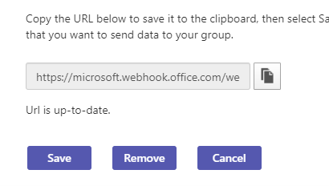

# Verwalten von Microsoft 365 und benutzerdefinierten Connectors

Um Ihr Team auf dem neuesten Stand zu halten, stellen die Connectors häufig verwendete Inhalts- und Dienstupdates direkt in einem Teams Kanal bereit. Mit Connectors können Ihre Teams Benutzer Updates von beliebten Diensten wie Trello, Wunderlist, GitHub und Azure DevOps Services erhalten. Die Updates werden direkt im Chatstream in ihrem Team veröffentlicht.

Microsoft 365 Connectors werden sowohl mit Microsoft Teams als auch mit Microsoft 365-Gruppen verwendet, wodurch es für alle Mitglieder einfacher ist, synchron zu bleiben und relevante Informationen schnell zu erhalten. Sowohl Microsoft Teams als auch Exchange verwenden dasselbe Verbindermodell, mit dem Sie auf beiden Plattformen dieselben Verbinder verwenden können. Wenn Sie jedoch connectors deaktivieren, die für eine Microsoft 365-Gruppe konfiguriert sind, wird auch die Möglichkeit deaktiviert, dass die Microsoft 365 Gruppe Connectors erstellt.

Jedes Mitglied eines Teams kann sein Team mit beliebten Clouddiensten mit den Connectors verbinden, wenn die Teamberechtigungen dies zulassen, und alle Teammitglieder werden über Aktivitäten von diesem Dienst benachrichtigt. Connectors funktionieren weiterhin, nachdem das Mitglied, das den Verbinder zunächst eingerichtet hat, verlassen hat. Jedes Teammitglied mit den Berechtigungen zum Hinzufügen oder Entfernen kann die Einrichtung von Connectors durch andere Mitglieder ändern.

## Aktivieren oder Deaktivieren von Connectors in Teams

Das Exchange Online PowerShell V2-Modul verwendet moderne Authentifizierung und arbeitet mit der mehrstufigen Authentifizierung, die als MFA bezeichnet wird, um eine Verbindung mit allen Exchange verwandten PowerShell-Umgebungen in Microsoft 365 herzustellen. Administratoren können Exchange Online PowerShell verwenden, um Connectors für einen gesamten Mandanten oder ein bestimmtes Gruppenpostfach zu deaktivieren, was sich auf alle Benutzer in diesem Mandanten oder Postfach auswirkt. Es ist nicht möglich, diese Option für einige bestimmte Benutzer zu deaktivieren. Außerdem sind Connectors standardmäßig für Government Community Cloud deaktiviert, die als GCC Mandanten bezeichnet werden.

Die Mandanteneinstellung setzt die Gruppeneinstellung außer Kraft. Wenn beispielsweise ein Administrator Connectors für die Gruppe aktiviert und im Mandanten deaktiviert, sind Connectors für die Gruppe deaktiviert. Um einen Connector in Teams zu aktivieren, stellen Sie mithilfe der modernen Authentifizierung mit oder ohne MFA [eine Verbindung mit Exchange Online PowerShell](/powershell/exchange/connect-to-exchange-online-powershell?view=exchange-ps#connect-to-exchange-online-powershell-using-modern-authentication-with-or-without-mfa&preserve-view=true) her.

### Befehle zum Aktivieren oder Deaktivieren von Connectors

Führen Sie die folgenden Befehle in Exchange Online PowerShell aus:

* So deaktivieren Sie Connectors für den Mandanten: `Set-OrganizationConfig -ConnectorsEnabled:$false`.
* So deaktivieren Sie Nachrichten mit Aktionen für den Mandanten: `Set-OrganizationConfig -ConnectorsActionableMessagesEnabled:$false`.
* Führen Sie die folgenden Befehle aus, um Connectors für Teams zu aktivieren:
  * `Set-OrganizationConfig -ConnectorsEnabled:$true`
  * `Set-OrganizationConfig -ConnectorsEnabledForTeams:$true`
  * `Set-OrganizationConfig -ConnectorsActionableMessagesEnabled:$true`

Weitere Informationen zum Austausch von PowerShell-Modulen finden [Sie unter Set-OrganizationConfig](/powershell/module/exchange/Set-OrganizationConfig?view=exchange-ps&preserve-view=true). Um Outlook Connectors zu aktivieren oder zu deaktivieren, [verbinden Sie Apps mit Ihren Gruppen in Outlook](https://support.microsoft.com/topic/connect-apps-to-your-groups-in-outlook-ed0ce547-038f-4902-b9b3-9e518ae6fbab).

<!---TBD: Delete this section after customer migration to new Webhook URL is complete --->

#### Benachrichtigung über das Update der Connector-URL

Die Teams Connectors wechseln zu einer neuen URL, um die Sicherheit zu verbessern. Während des Übergangs erhalten Sie eine Benachrichtigung zum Aktualisieren des konfigurierten Connectors. Aktualisieren Sie Ihren Connector so früh wie möglich, um Unterbrechungen der Connectordienste zu verhindern. So aktualisieren Sie Ihren Connector:

1. Überprüfen Sie auf der Konfigurationsseite für Connectors, ob neben dem konfigurierten Connector die Meldung **"Aufmerksamkeit erforderlich** " angezeigt wird.

   

1. Um die Verbindung für eingehende Webhook-Connectors neu zu erstellen, wählen Sie " **URL aktualisieren"** aus, und verwenden Sie die generierte Webhook-URL.

   

1. Entfernen Sie bei anderen Connectortypen den Connector, und erstellen Sie die Konnektorkonfiguration neu. Eine **URL wird auf dem neuesten Stand** angezeigt.

   

## Siehe auch

* [Übersicht über benutzerdefinierte Connectors und Webhooks](/microsoftteams/platform/webhooks-and-connectors/what-are-webhooks-and-connectors)
* [Erstellen Office 365 Connectors](/microsoftteams/platform/webhooks-and-connectors/how-to/connectors-creating)