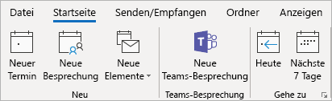
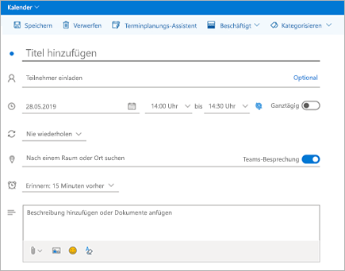
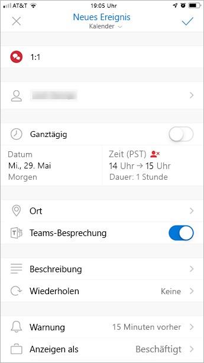

Verwenden des Microsoft Teams-Besprechungs-Add-Ins in Outlook
=======================================

Mit dem Add-in "Teams-Besprechung" können Benutzer eine Teams-Besprechung aus Outlook planen. Das Add-in steht für Outlook unter Windows, Mac, Web und Handy zur Verfügung.

## Teambesprechung-Add-in in Outlook für Windows

Das Team Besprechungs-Add-in wird automatisch für Benutzer installiert, die Microsoft Teams und entweder Office 2010, Office 2013 oder Office 2016 auf Ihrem Windows-PC installiert haben. Die Benutzer sehen auf dem Menüband „Kalender“ in Outlook das Microsoft Teams-Besprechungs-Add-In.

> [!NOTE]
> - Benutzerberechtigungen zum Ausführen der Datei "regsvr32. exe" sind eine Mindestanforderung, damit das Add-in "Teams-Besprechung" auf dem Computer installiert werden kann.
> - Wenn Benutzer das Microsoft Teams-Besprechungs-Add-In nicht sehen, weisen Sie sie an, Outlook und Microsoft Teams zu schließen, den Microsoft Teams-Client neu zu starten, sich bei Microsoft Teams anzumelden und den Outlook-Client zu starten (in dieser Reihenfolge).
> - Windows 7-Benutzer müssen das [Update für die universelle C-Laufzeit unter Windows](https://support.microsoft.com/help/2999226/update-for-universal-c-runtime-in-windows) in Windows installieren, damit das Teambesprechung-Add-in funktioniert.
> - Wenn Sie eine Office Outlook-Installation aus dem Microsoft Store verwenden, wird das Teambesprechung-Add-in nicht unterstützt. Benutzern, die dieses Add-in benötigen, wird empfohlen, die Klick-und-Los-Version von Office zu installieren, wie in [Office unter Windows 10 im S-Modus](https://support.office.com/article/faq-office-on-windows-10-in-s-mode-717193b5-ff9f-4388-84c0-277ddf07fe3f) beschrieben.

## Teambesprechung-Add-in in Outlook für Mac

Die Schaltfläche "Teams-Besprechung" in Outlook für Mac wird im Menüband von Outlook für Mac angezeigt, wenn Outlook den Produktions-Build 16.24.414.0 und höher ausführt.

Die Besprechungs Koordinaten (der Link "Teams beitreten" und die Einwahlnummern) werden der Besprechungseinladung hinzugefügt, nachdem der Benutzer auf " **senden**" geklickt hat.  

## Teambesprechung-Add-in in Outlook Web App

Die Schaltfläche "Teams-Besprechungen" in Outlook Web App wird als Teil der neuen Ereigniserstellung angezeigt, wenn sich der Benutzer in einer frühen Version des neuen Outlook im Web befindet. Informationen dazu, wie Benutzer die frühe Version des neuen Outlook im Web ausprobieren können, finden Sie im [Outlook-Blog](https://techcommunity.microsoft.com/t5/Outlook-Blog/Designed-to-be-fast-The-Outlook-on-the-web-user-experience-gets/ba-p/234909?utm_source=t.co&utm_medium=referral) .

Die Besprechungs Koordinaten (der Link "Teams beitreten" und die Einwahlnummern) werden der Besprechungseinladung hinzugefügt, nachdem der Benutzer auf " **senden**" geklickt hat.  

## Teambesprechung-Add-in in Outlook Mobile (IOS und Android)

Die Schaltfläche "Teams-Besprechung" wird in den neuesten Builds der Outlook IOS-und Android-App angezeigt.

Die Besprechungs Koordinaten (der Link "Teams beitreten" und die Einwahlnummern) werden der Besprechungseinladung hinzugefügt, nachdem der Benutzer auf " **senden**" geklickt hat.  

## Teambesprechung-Add-in in und "finden" für Outlook
"Finden" ist ein Add-in für Outlook, das Benutzern hilft, einen Konsens über eine Besprechungszeit in Unternehmen zu erzielen. Nachdem die Besprechungseinladungen Ihre bevorzugten Zeiten bereitgestellt haben, wird die Besprechungseinladung im Namen des Benutzers durch "finden" gesendet. Wenn die Option " **Online Besprechung** " in "suchen" ausgewählt ist, wird in "suchen" eine Skype for Business-oder Microsoft Teams-Besprechung geplant. (Die Suchzeit verwendet je nachdem, welche von Ihrer Organisation als standardmäßiger Online Besprechungs Kanal festgesetzt wurde.)

> [!NOTE]  
> Wenn Sie eine Skype for Business-Einstellung in Ihrem [Dashboard](https://findtime.microsoft.com/UserDashboard)für die Suchfunktion gespeichert haben, verwenden Sie die Suchfunktion anstelle von Microsoft Teams. Wenn Sie Microsoft Teams verwenden möchten, löschen Sie die Skype for Business-Einstellung in Ihrem Dashboard.

Weitere Informationen finden Sie unter [Planen von Besprechungen mit der Suchzeit](https://support.office.com/article/scheduling-meetings-with-findtime-4dc806ed-fde3-4ea7-8c5e-b5d1fddab4a6) .

## Authentifizierungsanforderungen

Benutzer des Microsoft Teams-Besprechungs-Add-Ins müssen sich mit moderner Authentifizierung bei Microsoft Teams anmelden. Wenn sich Benutzer nicht mit dieser Methode anmelden, können sie zwar den Microsoft Teams-Client verwenden, aber sie können keine Microsoft Teams-Onlinebesprechungen mit dem Outlook-Add-In planen. Dies können Sie mit einer der folgenden Methoden korrigieren:

- Wenn die moderne Authentifizierung für Ihre Organisation nicht konfiguriert ist, sollten Sie sie konfigurieren.
- Wenn die moderne Authentifizierung konfiguriert ist, diese jedoch im Dialogfeld abgebrochen wurde, sollten Sie die Benutzer anweisen, sich erneut mithilfe der mehrstufigen Authentifizierung anzumelden.

Weitere Informationen zum Konfigurieren der Authentifizierung finden Sie unter [Identitätsmodelle und Authentifizierung in Microsoft Teams](identify-models-authentication.md).

## Aktivieren von privaten Besprechungen

Die Option " **Terminplanung für private Besprechungen zulassen** " muss im Microsoft Teams Admin Center aktiviert sein, damit das Add-in bereitgestellt wird. Wechseln Sie im Admin Center zu **Besprechungen** > **Besprechungsrichtlinien**, und legen Sie im Abschnitt **Allgemein** **Zeitplanung für private Besprechungen zulassen** auf „Aktiviert“ fest.)

Der Microsoft Teams-Client ermittelt, ob die Benutzer die 32-Bit- oder 64-Bit-Version benötigen, und installiert dann das richtige Add-In.

> [!NOTE]
> Möglicherweise müssen die Benutzer Outlook nach einer Installation oder einem Upgrade von Microsoft Teams neu starten, um das aktuelle Add-In zu erhalten.

## Teams-Upgrade-Richtlinie und das Microsoft Teams-Besprechungs-Add-in für Outlook

Kunden können [Ihre Upgrade-Reise von Skype for Business in Teams auswählen](upgrade-and-coexistence-of-skypeforbusiness-and-teams.md). Mandantenadministratoren können den Koexistenzmodus "Teams" verwenden, um diese Reise für Ihre Benutzer zu definieren. Mandantenadministratoren haben die Möglichkeit, dass Benutzer Teams zusammen mit Skype for Business (Inseln-Modus) verwenden können. 

Wenn Benutzer im Insel Modus eine Besprechung in Outlook planen, erwarten Sie in der Regel, dass Sie entscheiden können, ob Sie eine Skype for Business-oder eine Teams-Besprechung planen. In Outlook im Web, Outlook Windows und Outlook Mac sehen Benutzer sowohl Skype for Business-als auch Teams-Add-Ins im Modus "Inseln". Aufgrund bestimmter Einschränkungen in der ersten Version kann Outlook Mobile nur das Erstellen von Skype for Business- **oder** Teams-Besprechungen unterstützen. Weitere Informationen finden Sie in der folgenden Tabelle.

| Koexistenzmodus im Team Admin Center | Standardanbieter für Besprechungen in Outlook Mobile |
| --------------------------------------|---------------------------------------------|
| Inseln | Skype for Business |
| Nur Skype for Business | Skype for Business |
| Skype for Business mit Zusammenarbeit in Teams | Skype for Business |
| Skype for Business mit Zusammenarbeit und Besprechungen in Teams | Teams |
| Nur Teams | Teams |

## Andere Überlegungen

Die Funktionen des Microsoft Teams-Besprechungs-Add-Ins werden noch weiterentwickelt. Beachten Sie daher Folgendes:

- Das Add-In ist für geplante Besprechungen mit bestimmten Teilnehmern gedacht, nicht für Besprechungen in einem Kanal. Kanalbesprechungen müssen in Microsoft Teams geplant werden.
- Das Add-In funktioniert nicht, wenn sich im Netzwerkpfad zwischen dem PC des Benutzers und den Microsoft Teams-Diensten ein Authentifizierungsproxy befindet.
- Benutzer können in Outlook keine Live Ereignisse planen. Wechseln Sie zu Teams, um Live-Events zu planen. Weitere Informationen finden Sie unter [Was sind Microsoft Teams Live-Ereignisse?](teams-live-events/what-are-teams-live-events.md).

## Problembehandlung

Wenn Sie das Add-In für Teams-Besprechungen für Outlook nicht installieren können, versuchen Sie diese Schritte zur Problembehandlung.

- Stellen Sie sicher, dass alle verfügbaren Updates für Outlook-Desktop Client angewendet wurden.
- Starten Sie den Teams-Desktopclient neu.
- Melden Sie sich ab, und melden Sie sich dann wieder beim Teams-Desktopclient an.
- Starten Sie den Outlook-Desktopclient neu. (Stellen Sie sicher, dass Outlook nicht im Admin-Modus ausgeführt wird.)
- Stellen Sie sicher, dass der Name des angemeldeten Benutzerkontos keine Leerzeichen enthält. (Dies ist ein bekanntes Problem, das in einem zukünftigen Update behoben wird.)
- Stellen Sie sicher, dass Single Sign-On (SSO) aktiviert ist.

Wenn Ihr Administrator Microsoft Exchange zum Steuern des [Zugriffs auf Exchange Web Server (EWS)](https://docs.microsoft.com/exchange/client-developer/exchange-web-services/how-to-control-access-to-ews-in-exchange)konfiguriert hat, kann eine Stellvertretung keine Teams-Besprechung im Auftrag des Vorgesetzten planen. Die Lösung für diese Konfiguration befindet sich in der Entwicklung und wird in Zukunft veröffentlicht. 

Eine allgemeine Anleitung zum Deaktivieren von Add-Ins finden Sie unter [Anzeigen, Verwalten und Installieren von Add-Ins in Office-Programmen](https://support.office.com/article/View-manage-and-install-add-ins-in-Office-programs-16278816-1948-4028-91E5-76DCA5380F8D).

Weitere Informationen zu [Besprechungen und Anrufen in Microsoft Teams](https://support.office.com/article/Meetings-and-calls-d92432d5-dd0f-4d17-8f69-06096b6b48a8)
