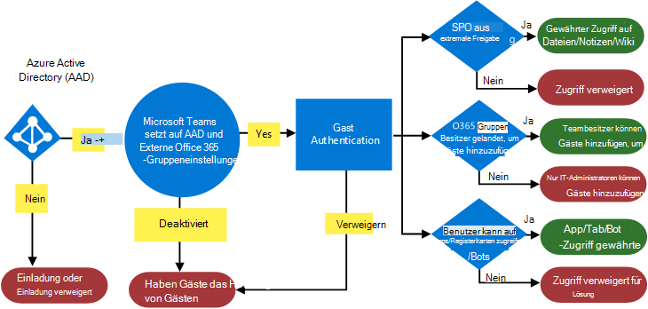
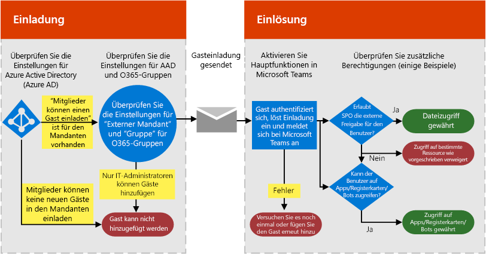
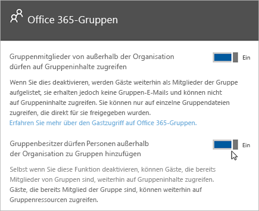

Autorisieren des Gastzugriffs in Microsoft TeamsAuthorize guest access in Microsoft Teams
===========================================

Um die Anforderungen Ihrer Organisation zu erfüllen, können Sie die Features und Funktionen für den Gastzugriff in Microsoft Teams mit vier verschiedenen Autorisierungsebenen verwalten.To satisfy your organization’s requirements, you can manage Microsoft Teams guest access features and capabilities through four different levels of authorization. Alle Autorisierungsebenen gelten für Ihren Office 365-Mandanten.All the authorization levels apply to your Office 365 tenant. Die einzelnen Autorisierungsebenen steuern den Gastzugriff wie unten beschrieben:Each authorization level controls the guest experience as shown below:

- **Azure Active Directory**: Für den Gastzugriff in Microsoft Teams wird die Azure AD B2B-Plattform (Business-to-Business) genutzt.**Azure Active Directory**: Guest access in Microsoft Teams relies on the Azure AD business-to-business (B2B) platform. Diese Autorisierungsebene steuert den Gastzugriff auf Verzeichnis-, Mandanten- und Anwendungsebene.Controls the guest experience at the directory, tenant, and application level.
- **Microsoft Teams**:Steuert die Gastumgebung nur in Microsoft Teams.**Microsoft Teams**: Controls the guest experience in Microsoft Teams only.
- **Office 365-Gruppen**: Steuert den Gastzugriff in Office 365-Gruppen und in Microsoft Teams.**Office 365 Groups**: Controls the guest experience in Office 365 Groups and Microsoft Teams.
- **SharePoint Online und OneDrive for Business**: Steuert den Gastzugriff in SharePoint Online, OneDrive for Business, Office 365-Gruppen und Microsoft Teams.**SharePoint Online and OneDrive for Business**: Controls the guest experience in SharePoint Online, OneDrive for Business, Office 365 Groups, and Microsoft Teams.

Diese verschiedenen Autorisierungsebenen bieten Ihnen Flexibilität beim Einrichten des Gastzugriffs für Ihre Organisation.These different authorization levels provide you with flexibility in how you set up guest access for your organization. Wenn Sie zum Beispiel in Ihrer Microsoft Teams-Organisation keine Gastbenutzer zulassen möchten (aber generell in Ihrer Organisation), deaktivieren Sie einfach den Gastzugriff in Microsoft Teams.For example, if you don’t want to allow guest users in your Microsoft Teams but want to allow it overall in your organization, just turn off guest access in Microsoft Teams. Ein weiteres Beispiel: Sie können den Gastzugriff auf Azure AD-, Microsoft Teams- und Gruppenebene aktivieren, aber dann das Hinzufügen von Gastbenutzern zu ausgewählten Teams deaktivieren, die einem oder mehreren Kriterien (z. B. der Datenklassifizierung „Vertraulich“) entsprechen.Another example: You could enable guest access at the AAD, Teams, and Groups levels, but then disable guest users' addition on selected teams that match one or more criteria such as data classification equals confidential. Für SharePoint Online und OneDrive for Business gibt es eigene Einstellungen für den Gastzugriff, die nicht auf Office 365-Gruppen basieren.SharePoint Online and OneDrive for Business have their own guest access settings that don't rely on Office 365 Groups.

> [!NOTE]
> Gäste unterliegen den [Office 365](https://go.microsoft.com/fwlink/p/?linkid=282347)- und [Azure Active Directory](https://go.microsoft.com/fwlink/p/?linkid=853019)-Dienstbeschränkungen.Guests are subject to  [Office 365](https://go.microsoft.com/fwlink/p/?linkid=282347) and [Azure Active Directory](https://go.microsoft.com/fwlink/p/?linkid=853019) service limits. 

Das folgende Diagramm zeigt, wie die Abhängigkeit der Gastzugriffsautorisierung zwischen Azure Active Directory, Microsoft Teams und Office 365 gewährt und integriert wird.The following diagram shows how guest access authorization dependency is granted and integrated between Azure Active Directory, Microsoft Teams, and Office 365.

Das nächste Diagramm bietet einen Überblick, wie das Benutzererlebnis mit dem Berechtigungsmodell über einen typischen Einladungs- und Einlösungsprozess in Bezug auf den Gastzugriff funktioniert.The next diagram shows, at a high level, how the user experience works with the permission model through a typical guest access invitation and redemption flow.

Es ist wichtig, zu beachten, dass Apps, Bots und Connectors evtl. einen eigenen Satz Berechtigungen und/oder je nach Benutzerkonto eine Zustimmung erfordern.It’s important to note here that apps, bots, and connectors might require their own set of permissions and/or consent specific to the user account. Diese müssen möglicherweise separat gewährt werden.These might need to be granted separately. Gleichermaßen kann SharePoint zusätzliche externe Freigabegrenzen für einen bestimmten Benutzer, bestimmte Benutzergruppen oder sogar auf Site-Ebene auferlegen.Similarly, SharePoint might impose extra external sharing boundaries for a specific user, groups of users, or even at the site level.

Die beiden vorherigen Diagramme sind auch in [Visio](https://github.com/MicrosoftDocs/OfficeDocs-SkypeForBusiness/blob/live/Teams/media/teams_dependencies.vsdx?raw=true) verfügbar.The previous two diagrams are also available in [Visio](https://github.com/MicrosoftDocs/OfficeDocs-SkypeForBusiness/blob/live/Teams/media/teams_dependencies.vsdx?raw=true).

## Steuern des Gastzugriffs in Azure Active DirectoryControl guest access in Azure Active Directory

Verwenden Sie Azure AD, um festzustellen, ob externe Projektmitarbeiter in Ihren Mandanten als Gäste eingeladen werden können und wie.Use Azure AD to determine whether external collaborators can be invited into your tenant as guests, and in what ways. Weitere Informationen zu Azure B2B-Gastzugriff, finden Sie unter [Was ist Gastbenutzerzugriff in Azure Active Directory B2B?](https://docs.microsoft.com/de-DE/azure/active-directory/b2b/what-is-b2b).For more information about Azure B2B guest access, see [What is guest user access in Azure Active Directory B2B](https://docs.microsoft.com/en-us/azure/active-directory/b2b/what-is-b2b). Informationen zu Azure AD-Rollen finden Sie unter [Erteilen von Berechtigungen für Benutzer von Partnerorganisationen in Ihrem Azure Active Directory-Mandanten](https://docs.microsoft.com/de-DE/azure/active-directory/b2b/add-guest-to-role).For information about Azure AD roles, see [Grant permissions to users from partner organizations in your Azure Active Directory tenant](https://docs.microsoft.com/en-us/azure/active-directory/b2b/add-guest-to-role).

Die Einstellungen für Einladungen gelten auf Mandantenebene und steuern den Gastzugriff auf Verzeichnis-, Mandanten- und Anwendungsebene.The settings for invitations apply at the tenant level and control the guest experience at the directory, tenant, and application level. Um diese Einstellungen im Azure-Portal zu konfigurieren, wechseln Sie zu **Azure Active Directory** > **Benutzer** > **Benutzereinstellungen**, und wählen dann unter **Externe Benutzer** **Einstellungen für die externe Zusammenarbeit verwalten** aus.To configure these settings in the Azure portal, go to **Azure Active Directory** > **Users** > **User settings**, and under **External users**, select **Manage external collaboration settings**.

Azure AD umfasst die folgenden Einstellungen, um externe Benutzer zu konfigurieren:Azure AD includes the following settings to configure external users:

- **Gastbenutzerberechtigungen sind beschränkt**: **Ja** bedeutet, dass Gäste keine Berechtigung für bestimmte Verzeichnisaufgaben haben, wie das Aufzählen von Benutzern, Gruppen oder anderen Verzeichnisressourcen.**Guest user permissions are limited**: **Yes** means that guests don't have permission for certain directory tasks, such as enumerate users, groups, or other directory resources. Darüber hinaus können Gästen in Ihrem Verzeichnis keine administrativen Rollen zugewiesen werden.In addition, guests can't be assigned to administrative roles in your directory. **Nein** bedeutet, dass Gäste denselben Zugriff auf Verzeichnisdaten haben wie normale Benutzer in Ihrem Verzeichnis.**No** means that guests have the same access to directory data that regular users have in your directory.
- **Administratoren und Benutzer mit der Rolle „Einladender“ können einladen**: **Ja** bedeutet, dass Administratoren und Benutzer mit der Rolle „Einladender“ Gäste in den Mandanten einladen können.**Admins and users in the guest inviter role can invite**: **Yes** means that admins and users in the "Guest Inviter" role will be able to invite guests to the tenant. **Nein** bedeutet, dass Administratoren und Benutzer Gäste nicht in den Mandanten einladen können.**No** means admins and users can't invite guests to the tenant.
- **Mitglieder können einladen**: **Ja** bedeutet, dass Mitglieder des Verzeichnisses ohne Administratorrechte Gäste zur Zusammenarbeit an Ressourcen einladen können, die durch Azure AD gesichert sind, z. B. SharePoint-Sites oder Azure-Ressourcen.**Members can invite**: **Yes** means that non-admin members of your directory can invite guests to collaborate on resources secured by your Azure AD, such as SharePoint sites or Azure resources. **Nein** bedeutet, dass nur Administratoren Gäste in Ihr Verzeichnis einladen können.**No** means that only admins can invite guests to your directory. 
      
    > [!NOTE]
    > Derzeit unterstützt Teams nicht die Rolle „Einladender“.Currently, Teams doesn't support the guest inviter role. Mindestens die Umschaltfläche **Mitglieder können einladen** muss auf **Ja** festgelegt werden, damit der Gastzugriff in Teams funktioniert.at a minimum the **Members can invite** toggle must be set to **Yes** for guest access to work in Teams.
- **Gäste können einladen**: **Ja** bedeutet, dass Gäste in Ihrem Verzeichnis andere Gäste zur Zusammenarbeit an Ressourcen einladen können, die durch Azure AD gesichert sind, z. B. SharePoint-Sites oder Azure-Ressourcen.**Guests can invite**: **Yes** means that guests in your directory can themselves invite other guests to collaborate on resources secured by your Azure AD, such as SharePoint sites or Azure resources. **Nein** bedeutet, dass Gäste keine anderen Gäste zur Zusammenarbeit mit Ihrer Organisation einladen können.**No** means that guests can't invite other guests to collaborate with your organization.
 
Weitere Informationen zum Steuern der Einladung von Gästen finden Sie unter [Delegieren von Einladungen für Azure Active Directory B2B-Zusammenarbeit](https://docs.microsoft.com/de-DE/azure/active-directory/b2b/delegate-invitations).For more information about controlling who can invite guests, see [Delegate invitations for Azure Active Directory B2B collaboration](https://docs.microsoft.com/en-us/azure/active-directory/b2b/delegate-invitations)

> [!NOTE]
> Sie können auch verwalten, welche Domänen in Ihren Mandanten als Gäste eingeladen werden können.You can also manage which domains can be invited into your tenant as guests. Informationen finden Sie unter [Gewähren/Blockieren des Gastzugriffs auf Office 365-Gruppen](https://docs.microsoft.com/exchange/recipients-in-exchange-online/manage-group-access-to-office-365-groups).See [Allow/Block guest access to Office 365 groups](https://docs.microsoft.com/exchange/recipients-in-exchange-online/manage-group-access-to-office-365-groups).

Das manuelle Hinzufügen des Benutzergastkontos zu Azure AD B2B ist nicht erforderlich, da das Konto automatisch zum Verzeichnis hinzugefügt wird, wenn Sie den Gast zu Teams hinzufügen.Adding the user guest account manually to Azure AD B2B is not required, as the account will be added to the directory automatically when you add the guest to Teams.

Die Azure AD-Lizenzierung ermöglicht es Ihnen, bis zu 5 Gäste pro Lizenz hinzuzufügen.Azure AD licensing allows you to add up to 5 guests per license. Weitere Informationen zu Azure AD-Lizenzen finden Sie unter [Lizenzierungsanleitung zur Azure Active Directory B2B-Zusammenarbeit](https://docs.microsoft.com/de-DE/azure/active-directory/b2b/licensing-guidance).For more information about Azure AD licensing, see [Azure Active Directory B2B collaboration licensing guidance](https://docs.microsoft.com/en-us/azure/active-directory/b2b/licensing-guidance).

## Steuern des Gastzugriffs in TeamsControl guest access in Teams

Sie können in Teams steuern, ob der Gastzugriff für Ihre Organisation aktiviert oder deaktiviert ist.In Teams, you can control whether the guest experience is enabled or disabled for your organization. Die Einstellung ist standardmäßig deaktiviert und gilt auf Mandantenebene nur für Teams.The setting is disabled by default and applies at the tenant level for Teams only.

Sie können die Einstellungen für den Gastzugriff in Teams über das Microsoft Teams Admin Center verwalten.You can manage Teams guest access settings from the Microsoft Teams admin center. Weitere Informationen finden Sie unter [Aktivieren oder Deaktivieren des Gastzugriffs auf Microsoft Teams](set-up-guests.md).For more information, see [Turn on or off guest access to Microsoft Teams](set-up-guests.md). 

## Steuern des Gastzugriffs in Office 365-GruppenControl guest access in Office 365 Groups

Über Office 365-Gruppen können Sie das Hinzufügen von Gastbenutzern sowie den Gastzugriff auf alle Office 365-Gruppen und auf Microsoft Teams in Ihrer Organisation steuern.From Office 365 Groups, you can control adding guest users and guest access to all Office 365 groups and Microsoft Teams in your organization.

1. Melden Sie sich mit Ihrem globalen Office 365-Administratorkonto unter [https://portal.office.com/adminportal/home](https://portal.office.com/adminportal/home) an.Sign in with your Office 365 global admin account at [https://portal.office.com/adminportal/home](https://portal.office.com/adminportal/home).

2. Wählen Sie im Navigationsmenü **Einstellungen** und dann **Dienste &amp; Add-Ins** aus.In the navigation menu, choose **Settings** and then select **Services &amp; add-ins**.

3. Wählen Sie **Office 365-Gruppen** aus.Select **Office 365 Groups**.

     
  
4. Je nachdem, ob Sie den Zugriff für Team- oder Gruppenbesitzer außerhalb Ihres Unternehmens auf Office 365-Gruppen gewähren möchten, legen Sie die Umschaltfläche auf der Seite „Office 365-Gruppen“ auf **Ein** oder **Aus** fest.On the Office 365 Groups page, set the toggle to **On** or **Off**, depending on whether you want to let team and group owners outside your organization access Office 365 groups. Ändern Sie die Umschaltfläche in **Ein** neben **Gruppenbesitzern das Hinzufügen von Personen außerhalb der Organisation zu Gruppen ermöglichen**.Click or tap the toggle to **On** next to **Let group owners add people outside the organization to groups**. Wenn Sie diese Umschaltfläche in **Ein** ändern, sehen Sie eine weitere Option. Mit dieser können Sie steuern, ob es Gruppen- und Teambesitzern möglich sein soll, Personen außerhalb der Organisation zu Office 365-Gruppen und Microsoft Teams hinzuzufügen.If you turn this toggle to **On**, you'll see another option to control whether you want to let group and team owners add people outside your organization to Office 365 groups and Microsoft teams. Legen Sie diese Umschaltfläche auf **Ein** fest, wenn Sie Gruppen- und Teambesitzern das Hinzufügen von Gastbenutzern ermöglichen möchten.Set this toggle to **On** if you want to let group and team owners add guest users. 
 
   

Diese Einstellungen gelten auf Mandantenebene und steuern den Gastzugriff in Office 365-Gruppen und in Microsoft Teams.These settings apply at the tenant level and control the guest experience in Office 365 Groups and Microsoft Teams.

Unter [Gastzugriff in Office 365-Gruppen](https://support.office.com/de-DE/article/Guest-access-in-Office-365-Groups-bfc7a840-868f-4fd6-a390-f347bf51aff6) finden Sie weitere Informationen zum Gastzugriff in Gruppen, einschließlich Funktionsweise des Gastzugriffs, Verwalten des Gastzugriffs und Antworten auf häufig gestellte Fragen.See [Guest access in Office 365 Groups](https://support.office.com/en-us/article/Guest-access-in-Office-365-Groups-bfc7a840-868f-4fd6-a390-f347bf51aff6) for more information about guest access in Groups, including how guest access works, how to manage guest access, and answers to frequently asked questions.

## Steuern des Gastzugriffs auf Sharepoint Online und OneDrive for BusinessControl guest access to SharePoint Online and OneDrive for Business

Teams nutzt SharePoint Online und OneDrive for Business zum Speichern von Dateien und Dokumenten für Kanäle und Chatunterhaltungen.Teams relies on SharePoint Online and OneDrive for Business to store files and documents for channels and chat conversations.  

Um alle Gastzugriffsfunktionen in Microsoft Teams zu aktivieren, müssen Office 365-Administratoren für die folgenden Einstellungen die Option **Ein** auswählen:To enable the full Teams guest access experience, Office 365 admins need to select **On** for the following settings:

- In SharePoint Online: **Vorhandene Gäste**, **Neue und vorhandene Gäste** oder **Jeder**In SharePoint Online: **Existing guests**, **New and existing guests**, or **Anyone**

    Weitere Informationen finden Sie unter [Aktivieren oder Deaktivieren der externen Freigabe](https://docs.microsoft.com/sharepoint/turn-external-sharing-on-or-off).For more information, see [Turn on or off guest access to Microsoft Teams](https://docs.microsoft.com/sharepoint/turn-external-sharing-on-or-off).

- In Office 365-Gruppen: **Hinzufügen von Personen außerhalb der Organisation zu Gruppen durch Gruppenbesitzer zulassen**In Office 365 groups: **Let group owners add people outside the organization to groups**

    Weitere Informationen finden Sie unter [Steuern des Gastzugriffs in Office 365-Gruppen](#control-guest-access-in-office-365-groups) oben.For more information, see [Control guest access in Office 365 Groups](#control-guest-access-in-office-365-groups), above.
  
Diese Einstellungen gelten auf Mandantenebene und steuern den Gastzugriff in SharePoint Online, OneDrive for Business, Office 365-Gruppen und Teams.These settings apply at the tenant level and control the guest experience at SharePoint Online, OneDrive for Business, Office 365 Groups, and Teams.

Sie können SharePoint Online-Einstellungen für externe Benutzer für die mit Microsoft Teams verbundene Teamwebsite verwalten.You can manage SharePoint Online external user settings for the Teams connected team site. Weitere Einzelheiten finden Sie unter [Verwalten der Einstellungen Ihrer SharePoint-Teamwebsite](https://support.office.com/article/Manage-your-SharePoint-team-site-settings-8376034d-d0c7-446e-9178-6ab51c58df42).For more details, see  [Manage your SharePoint team site settings](https://support.office.com/article/Manage-your-SharePoint-team-site-settings-8376034d-d0c7-446e-9178-6ab51c58df42).

## Gastzugriff und externer Zugriff (Partnerverbund) im VergleichGuest access vs. external access (federation)

[!INCLUDE [guest-vs-external-access](includes/guest-vs-external-access.md)]
