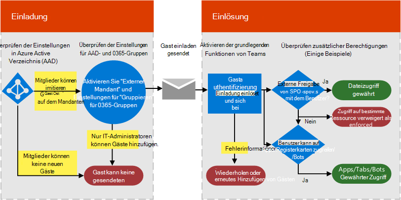

Autorisieren des Gastzugriffs in Microsoft Teams
===========================================

Um die Anforderungen Ihrer Organisation zu erfüllen, können Sie die Features und Funktionen für den Gastzugriff in Microsoft Teams mit vier verschiedenen Autorisierungsebenen verwalten. Alle Autorisierungsebenen gelten für Ihren Office 365-Mandanten. Die einzelnen Autorisierungsebenen steuern den Gastzugriff wie unten beschrieben:

- **Azure Active Directory**: Für den Gastzugriff in Microsoft Teams wird die Azure AD B2B-Plattform (Business-to-Business) genutzt. Diese Autorisierungsebene steuert den Gastzugriff auf Verzeichnis-, Mandanten- und Anwendungsebene.
- **Microsoft Teams**: Steuert die Gastumgebung nur in Microsoft Teams.
- **Office 365-Gruppen**: Steuert den Gastzugriff in Office 365-Gruppen und in Microsoft Teams.
- **SharePoint Online und OneDrive for Business**: Steuert den Gastzugriff in SharePoint Online, OneDrive for Business, Office 365-Gruppen und Microsoft Teams.

Diese verschiedenen Autorisierungsebenen bieten Ihnen Flexibilität beim Einrichten des Gastzugriffs für Ihre Organisation. Wenn Sie zum Beispiel in Ihrer Microsoft Teams-Organisation keine Gastbenutzer zulassen möchten (aber generell in Ihrer Organisation), deaktivieren Sie einfach den Gastzugriff in Microsoft Teams. Ein weiteres Beispiel: Sie können den Gastzugriff auf Azure AD-, Microsoft Teams- und Gruppenebene aktivieren, aber dann das Hinzufügen von Gastbenutzern zu ausgewählten Teams deaktivieren, die einem oder mehreren Kriterien (z. B. der Datenklassifizierung „Vertraulich“) entsprechen. Für SharePoint Online und OneDrive for Business gibt es eigene Einstellungen für den Gastzugriff, die nicht auf Office 365-Gruppen basieren.

> [!NOTE]
> Gäste unterliegen den [Office 365](https://go.microsoft.com/fwlink/p/?linkid=282347)- und [Azure Active Directory](https://go.microsoft.com/fwlink/p/?linkid=853019)-Dienstbeschränkungen. 

Das folgende Diagramm zeigt, wie die Abhängigkeit der Gastzugriffsautorisierung zwischen Azure Active Directory, Microsoft Teams und Office 365 gewährt und integriert wird.

Das nächste Diagramm bietet einen Überblick, wie das Benutzererlebnis mit dem Berechtigungsmodell über einen typischen Einladungs- und Einlösungsprozess in Bezug auf den Gastzugriff funktioniert.

Es ist wichtig, zu beachten, dass Apps, Bots und Connectors evtl. einen eigenen Satz Berechtigungen und/oder je nach Benutzerkonto eine Zustimmung erfordern. Diese müssen möglicherweise separat gewährt werden. Gleichermaßen kann SharePoint zusätzliche externe Freigabegrenzen für einen bestimmten Benutzer, bestimmte Benutzergruppen oder sogar auf Site-Ebene auferlegen.

Die beiden vorherigen Diagramme sind auch in [Visio](https://github.com/MicrosoftDocs/OfficeDocs-SkypeForBusiness/blob/live/Teams/media/teams_dependencies.vsdx?raw=true) verfügbar.

## Steuern des Gastzugriffs in Azure Active Directory

Verwenden Sie Azure AD, um festzustellen, ob externe Projektmitarbeiter in Ihren Mandanten als Gäste eingeladen werden können und wie. Weitere Informationen zu Azure B2B-Gastzugriff, finden Sie unter [Was ist Gastbenutzerzugriff in Azure Active Directory B2B?](https://docs.microsoft.com/azure/active-directory/b2b/what-is-b2b). Informationen zu Azure AD-Rollen finden Sie unter [Erteilen von Berechtigungen für Benutzer von Partnerorganisationen in Ihrem Azure Active Directory-Mandanten](https://docs.microsoft.com/azure/active-directory/b2b/add-guest-to-role).

Die Einstellungen für Einladungen gelten auf Mandantenebene und steuern den Gastzugriff auf Verzeichnis-, Mandanten- und Anwendungsebene. Um diese Einstellungen im Azure-Portal zu konfigurieren, wechseln Sie zu **Azure Active Directory** > **Benutzer** > **Benutzereinstellungen**, und wählen dann unter **Externe Benutzer** **Einstellungen für die externe Zusammenarbeit verwalten** aus.

Azure AD umfasst die folgenden Einstellungen, um externe Benutzer zu konfigurieren:

- **Gastbenutzerberechtigungen sind beschränkt**: **Ja** bedeutet, dass Gäste keine Berechtigung für bestimmte Verzeichnisaufgaben haben, wie das Aufzählen von Benutzern, Gruppen oder anderen Verzeichnisressourcen. Darüber hinaus können Gästen in Ihrem Verzeichnis keine administrativen Rollen zugewiesen werden. **Nein** bedeutet, dass Gäste denselben Zugriff auf Verzeichnisdaten haben wie normale Benutzer in Ihrem Verzeichnis.
- **Administratoren und Benutzer mit der Rolle „Einladender“ können einladen**: **Ja** bedeutet, dass Administratoren und Benutzer mit der Rolle „Einladender“ Gäste in den Mandanten einladen können. **Nein** bedeutet, dass Administratoren und Benutzer Gäste nicht in den Mandanten einladen können.
- **Mitglieder können einladen**: Um Mitgliedern Ihres Verzeichnisses, die keine Administratoren SIND; zu erlauben, Gäste einzuladen, legen Sie diese Richtlinie auf **Ja** fest (empfohlen). Wenn Sie nur Administratoren erlauben möchten, Gäste hinzuzufügen, können Sie diese Richtlinie auf **Nein** festlegen. Denken Sie daran, dass die Einstellung **Nein** die Gasterfahrung für Besitzer von Teams, die keine Administratoren sind, einschränkt. Sie können nur Gäste zu Teams hinzufügen, die bereits vom Administrator in AAD hinzugefügt wurden.
- **Gäste können einladen**: **Ja** bedeutet, dass Gäste in Ihrem Verzeichnis andere Gäste zur Zusammenarbeit an Ressourcen einladen können, die durch Azure AD gesichert sind, z. B. SharePoint-Sites oder Azure-Ressourcen. **Nein** bedeutet, dass Gäste keine anderen Gäste zur Zusammenarbeit mit Ihrer Organisation einladen können.
    > [!IMPORTANT]
    > Aktuell unterstützt Teams nicht die Rolle „Gasteinladender“. Das heißt, selbst wenn Sie **Gäste können einladen** auf **Ja** festlegen, können Gäste keine anderen Gäste in Teams einladen.
 
Weitere Informationen zum Steuern der Einladung von Gästen finden Sie unter [Delegieren von Einladungen für Azure Active Directory B2B-Zusammenarbeit](https://docs.microsoft.com/azure/active-directory/b2b/delegate-invitations).

> [!NOTE]
> Sie können auch verwalten, welche Domänen in Ihren Mandanten als Gäste eingeladen werden können. Informationen finden Sie unter [Gewähren/Blockieren des Gastzugriffs auf Office 365-Gruppen](https://docs.microsoft.com/exchange/recipients-in-exchange-online/manage-group-access-to-office-365-groups).

Das manuelle Hinzufügen des Benutzergastkontos zu Azure AD B2B ist nicht erforderlich, da das Konto automatisch zum Verzeichnis hinzugefügt wird, wenn Sie den Gast zu Teams hinzufügen.

### Lizenzierung für Gastzugriff
Die Gastzugriffslizenzierung ist Bestandteil der Azure AD-Lizenzierung. Der Gastzugriff ist in allen Office 365 Business Premium- und Office 365 Enterprise-Abonnements enthalten. Weitere Informationen zur Lizenzierung finden Sie unter [Lizenzierungsanleitung zur Azure Active Directory B2B-Zusammenarbeit](https://docs.microsoft.com/azure/active-directory/b2b/licensing-guidance).

> [!NOTE]
> Benutzer in Ihrer Organisation, die nur über eigenständige Office 365-Abonnementpläne verfügen, z. B. Exchange Online Plan 2, können nicht als Gäste zu Ihrer Organisation eingeladen werden, da Teams diese Benutzer als derselben Organisation angehörig betrachtet. Damit diese Benutze Teams verwenden können, müssen Sie über ein Office 365 Business Premium-, Office 365 Enterprise- oder Office 365 Education-Abonnement verfügen. 

## Steuern des Gastzugriffs in Teams

Der Gastzugriff ist standardmäßig in Teams deaktiviert. Informationen zum Aktivieren des Gastzugriffs finden Sie unter [Aktivieren oder Deaktivieren des Gastzugriffs in Microsoft Teams](set-up-guests.md). 

## Steuern des Gastzugriffs in Office 365-Gruppen

Über Office 365-Gruppen können Sie das Hinzufügen von Gastbenutzern sowie den Gastzugriff auf alle Office 365-Gruppen und auf Microsoft Teams-Teams in Ihrer Organisation steuern.

1. Melden Sie sich mit Ihrem globalen Office 365-Administratorkonto unter [https://portal.office.com/adminportal/home](https://portal.office.com/adminportal/home) an.

2. Wählen Sie links **Einstellungen** und dann **Dienste &amp; Add-Ins** aus.

3. Wählen Sie **Office 365-Gruppen** aus.

     
  
4. Je nachdem, ob Sie den Zugriff für Team- oder Gruppenbesitzer außerhalb Ihres Unternehmens auf Office 365-Gruppen gewähren möchten, legen Sie die Umschaltfläche auf der Seite „Office 365-Gruppen“ auf **Ein** oder **Aus** fest. Ändern Sie die Umschaltfläche in **Ein** neben **Gruppenbesitzern das Hinzufügen von Personen außerhalb der Organisation zu Gruppen ermöglichen**. Wenn Sie diese Umschaltfläche in **Ein** ändern, sehen Sie eine weitere Option. Mit dieser können Sie steuern, ob es Gruppen- und Teambesitzern möglich sein soll, Personen außerhalb der Organisation zu Office 365-Gruppen und Microsoft Teams hinzuzufügen. Legen Sie diese Umschaltfläche auf **Ein** fest, wenn Sie Gruppen- und Teambesitzern das Hinzufügen von Gastbenutzern ermöglichen möchten. 
 
   

Diese Einstellungen gelten auf Mandantenebene und steuern den Gastzugriff in Office 365-Gruppen und -Teams.

Unter [Gastzugriff in Office 365-Gruppen](https://support.office.com/article/Guest-access-in-Office-365-Groups-bfc7a840-868f-4fd6-a390-f347bf51aff6) finden Sie weitere Informationen zum Gastzugriff in Gruppen, einschließlich Funktionsweise des Gastzugriffs, Verwalten des Gastzugriffs und Antworten auf häufig gestellte Fragen.

## Steuern des Gastzugriffs auf Sharepoint Online und OneDrive for Business

Teams nutzt SharePoint Online und OneDrive for Business zum Speichern von Dateien und Dokumenten für Kanäle und Chatunterhaltungen.  

Um alle Gastzugriffsfunktionen in Teams zu aktivieren, müssen Office 365-Administratoren die folgenden Einstellungen konfigurieren:

- In SharePoint Online: Wählen Sie **Vorhandene Gäste**, **Neue und vorhandene Gäste** oder **Jeder** aus.

    Weitere Informationen finden Sie unter [Aktivieren oder Deaktivieren der externen Freigabe](https://docs.microsoft.com/sharepoint/turn-external-sharing-on-or-off).

- In Office 365-Gruppen: Aktivieren Sie **Hinzufügen von Personen außerhalb der Organisation zu Gruppen durch Gruppenbesitzer zulassen**.

    Weitere Informationen finden Sie unter [Steuern des Gastzugriffs in Office 365-Gruppen](#control-guest-access-in-office-365-groups) oben.
  
Diese Einstellungen gelten auf Mandantenebene und steuern den Gastzugriff in SharePoint Online, OneDrive for Business, Office 365-Gruppen und Teams.

Sie können SharePoint Online-Einstellungen für externe Benutzer für die mit Teams verbundenen Teamwebsites verwalten. Weitere Informationen  finden Sie unter [Verwalten der Einstellungen Ihrer SharePoint-Teamwebsite](https://support.office.com/article/Manage-your-SharePoint-team-site-settings-8376034d-d0c7-446e-9178-6ab51c58df42).

## Externer Zugriff (Partnerverbund) und Gastzugriff im Vergleich

[!INCLUDE [guest-vs-external-access](includes/guest-vs-external-access.md)]

## Verwandte Themen

- [Referenz zu Gastfreigabeeinstellungen für Microsoft 365](https://docs.microsoft.com/Office365/Enterprise/microsoft-365-guest-settings)
