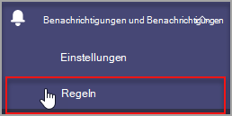

# Microsoft Teams der Geräteinte health-Überwachung

Die Geräteintestüberwachung im Microsoft Teams Admin Center bietet Ihnen die Möglichkeit, den Status verschiedener Geräte proaktiv zu Teams überwachen. Überwachen Des Offlinestatus eines Geräts und Empfangen von Benachrichtigungen in Echtzeit, wenn das überwachte Gerät in Ihrer Organisation offline geschaltet wird.  

Bevor Sie beginnen, benötigen Sie die Berechtigungen zum Erstellen von Teams/Kanälen in Ihrem Mandanten. [Weitere Informationen.](/microsoft-365/solutions/manage-creation-of-groups?view=o365-worldwide)

## Konfigurieren der Gerätestatusregel

1. Wählen Sie im linken Navigationsbereich des Microsoft Teams Admin Center die Option Benachrichtigungen **& Regeln für Benachrichtigungen**  >  **aus.**

   

2. Wählen Sie **auf der Seite** "Regeln" die Option **Gerätestatusregel aus.**

3. Wählen Sie das Gerät aus, um die Statusregel zum Aktivieren von Warnungen zu konfigurieren.

    

## Interpretieren der Regelkonfiguration

|Feld |Beschreibung  |
|--------|-------------|
|**Regeltyp**   |Die Gerätestatusregel hilft Ihnen bei der effektiven Verwaltung. Teams geräte und als Geräteverwaltungstyp klassifiziert. In Zukunft werden weitere Regeln für den Geräteverwaltungstyp zur Überwachung anderer zugehöriger Funktionen verfügbar sein (Beispiele hierfür sind fehlerhafte Geräte und der Anmeldestatus des Geräts).|
|**Bedingung**   |Sie können die Integrität von Geräten überwachen, wenn sie offline sind. [Weitere Informationen](../devices/device-management.md) zur Geräteverwaltung finden Sie im Teams Admin Center. |
|**Umfang**   |Sie können angeben, wie häufig der Gerätestatus überwacht werden soll, indem Sie die Häufigkeit der Regelauswertung erwähnen. Teams-Geräte werden standardmäßig in Echtzeit überwacht, wenn sie offline sind. |
|**Gerätebenutzer**   |Sie können angeben, welche Geräte eine proaktive Offlineüberwachung benötigen, indem Sie diese basierend auf angemeldeten Benutzern auswählen. Weitere Details [finden Sie unter Auswählen von](#select-devices-for-configuration) Geräten für die Konfiguration. |
|**Aktionen**  >  **Kanalwarnung**   |Im Abschnitt Aktionen können Sie Teams-Kanäle angeben, für die Sie Benachrichtigungen erhalten möchten. Derzeit wird ein Standardteam mit dem Namen **Administratorbenachrichtigungen** sowie Benachrichtigungen und Kanal mit dem Namen **MonitoringAlerts** erstellt, an das Benachrichtigungen übermittelt werden.     Globale Administratoren und Teams in Ihrem Mandanten werden diesem Standardteam automatisch hinzugefügt.|
|**Aktionen**  >  **Webhook**   |Sie können Benachrichtigungen auch mit einem externen Webhook erhalten (optional). Geben Sie eine externe öffentliche Webhook-URL im Webhook-Abschnitt an, an die eine JSON-Benachrichtigungsnutzlast gesendet wird.      Die Benachrichtigungsnutzlast über Webhooks kann in andere Systeme in Ihrer Organisation integriert werden, um benutzerdefinierte Workflows zu erstellen.   

**JSON-Nutzlastschema für Webhook:**   
<pre lang="json">{      "type": "object",     "properties": {        "AlertTitle": { "type": "string "} ,       "DeviceLoggedInUserId": { "type": "string" } ,       "DeviceId": { "type": "string" } ,        "MetricValues": {              "type": "object",             "properties": {                   "DeviceHealthStatus": { "type": "string"}              }         } ,        "RuleName": { "type": "string"} ,        "RuleDescription": { "type": "string"} ,        "RuleFrequency": { "type": "string"} ,        "RuleType": { "type": "string"} ,        "TenantId": { "type": "string"} ,         "RuleCondition": { "type": "string"} ,         "AlertRaisedAt": { "type": "string"}      }  } </pre>   

  **JSON-Beispielnutzlast:**    <pre lang="JSON">    {        "AlertTitle":"*sample_device_name* of *User_Name* has become offline",       "DeviceLoggedInUserId": *User_GUID* ,       "DeviceId": *Device_GUID* ,        "MetricValues": {           DeviceHealthStatus": "offline"              },                  "RuleName": "Device state rule" ,        "RuleDescription": ":"Alerts when device health status is detected as offline" ,        "RuleFrequency": "Real-time" ,        "RuleType": "Device Management" ,        "TenantId": *Tenant_GUID* ,         "RuleCondition": "DeviceHealthStatus = Offline" ,         "AlertRaisedAt": "2020-02-28T12:49:06Z"      }  </pre>   

## Geräte für die Konfiguration auswählen

1. Sie können die Teams, die Sie überwachen möchten, auswählen, indem Sie die Benutzer auswählen, die auf diesen Geräten angemeldet sind. Wählen **Sie im** Abschnitt **Gerätebenutzer die Option Hinzufügen** aus.

2. Wählen Sie einen oder mehrere Benutzer aus, für die Sie den Gerätestatus überwachen möchten.

   

   Die ausgewählte Benutzerliste wird im **Abschnitt Gerätebenutzer** angezeigt. Sie können diese Liste ändern, indem Sie Benutzer hinzufügen oder entfernen.

Alle von der ausgewählten Benutzerliste verwendeten Anmeldegeräte werden auf den Offlinestatus überwacht.

## Benachrichtigungen im Teams-Client

Die Benachrichtigungen werden im automatisch erstellten **MonitoringAlerts-Kanal** des **Admin Alerts and Notifications Teams** übermittelt.

Eine Geräte-Offlinebenachrichtigung kann die folgenden Informationen enthalten:

- Der Gerätename, der offline ist.
- Der Benutzer des Offlinegeräts.
- Wie lange ist das Gerät offline geschaltet? (Derzeit wird die Uhrzeit in UTC angezeigt.)
- Der Typ der Regel, die die Warnung ausgelöst hat.
- Warum eine Warnung ausgelöst wird