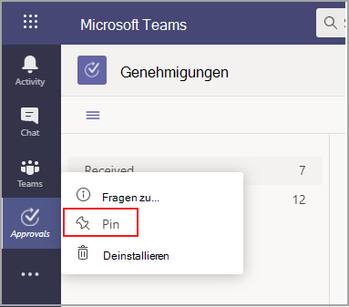

# Verfügbarkeit der Microsoft Teams-App "Genehmigungen"

Die App "Genehmigungen" steht als persönliche App für alle Benutzer von Microsoft Teams zur Verfügung.
Die App "Genehmigungen" bietet eine einfache Möglichkeit, um in Microsoft Teams Überwachung, Compliance, Verantwortlichkeit und Workflows sowohl in strukturierte als auch unstrukturierte Genehmigungen zu bringen.

 

Benutzer können die App "Genehmigungen" an der Menüleiste anheften.

 

Durch die erste mit der App "Genehmigungen" erstellte Genehmigung wird die Bereitstellung der Genehmigungslösung in der CDS-Standardumgebung (Common Data Service) ausgelöst. Mit der App "Genehmigungen" erstellte Genehmigungen werden in der CDS-Standardumgebung gespeichert.

In diesem Artikel werden die Anforderungen und Rollen für die App "Genehmigungen" beschrieben.

> [!NOTE]
> Dieses Feature wurde noch nicht für Benutzer von Government Community Cloud (GCC), Government Community Cloud High (GCCH) und DEPARTMENT OF Defense (DOD) veröffentlicht.

## Erforderliche Berechtigungen und Lizenzen

Zum Bereitstellen der Genehmigungen-App benötigen Sie Berechtigungen für die folgenden Elemente:

- Berechtigungen zum Erstellen einer Microsoft CDS-Datenbank.

- Ein Konto auf [flow.microsoft.com](https://flow.microsoft.com/)

- Administratorrolle in der Zielumgebung.

- Lizenz für [Power Automate](/power-automate/get-started-approvals), Office 365 oder Dynamics 365.

- Für Benutzer ist eine Lizenz für Microsoft Forms erforderlich, damit sie neue Genehmigungsvorlagen einrichten können.

Um die Genehmigungen-App verwenden zu können, benötigen Sie eine Lizenz für Power Automate, und Ihr Konto wird der Genehmigungen-Benutzerrolle in der Zielumgebung bei Ihrer ersten Genehmigungszuweisung automatisch hinzugefügt.

## Speicher mit CDS

Das allgemeine Datenmodell (Common Data Model, CDM) ist die gemeinsame Datensprache, die von Geschäfts- und Analyseanwendungen im CDS verwendet wird. Sie besteht aus einer Reihe standardisierter, erweiterbarer Datenschemas, die von Microsoft und unseren Partnern veröffentlicht werden, und die anwendungs- und geschäftsprozessübergreifend für Einheitlichkeit der Daten und deren Bedeutung sorgen. Weitere Informationen zum [Allgemeinen Datenmodell der Microsoft Power Platform](/power-automate/get-started-approvals).

Weitere Informationen zum [Genehmigungsworkflow](/power-automate/modern-approvals).

Genehmigungen, die aus einer Vorlage erstellt werden, werden weiterhin Daten in CDS gespeichert, z. B. Titel, Details, Vorlagen-ID und mehr. Antworten, die über die Genehmigungsanforderung übermittelt werden, werden in Forms gespeichert. Weitere Informationen finden  [Sie unter Datenspeicherung für Microsoft Forms.](https://support.microsoft.com/office/data-storage-for-microsoft-forms-97a34e2e-98e1-4dc2-b6b4-7a8444cb1dc3#:~:text=Where%20data%20is%20stored%20for%20Microsoft%20Forms.%20Microsoft,European-based%20tenants%20is%20stored%20on%20servers%20in%20Europe)

>[!Note]
>Wenn Sie die Formularvorlage auf der Microsoft Forms-Website löschen, wird ihre Genehmigungsvorlage nicht mehr angezeigt, und die Benutzer können die Anforderung nicht starten. Benutzern wird die Fehlermeldung "CDB TableNotFound" angezeigt, wenn sie versuchen, eine Genehmigungsvorlage zu öffnen, die in Microsoft Forms gelöscht wurde.

Die Genehmigungsvorlagen werden in Den Data Storage (SDS) gespeichert, einer kompatiblen Speicherplattform, die intern nur innerhalb von Microsoft verwendet wird. Die Vorlagen mit Organisationsbereich werden in "Mandantenshards" von SDS gespeichert, und Vorlagen mit Teambereich werden in "Gruppenshards" von SDS gespeichert. Dies bedeutet, dass die Vorlagen mit Organisationsbereich die gleiche Lebensdauer des Mandanten und der Vorlagen mit Teambereich für die gleiche Lebensdauer des Teams verwenden. Wenn Sie also das Team endgültig löschen, werden die zugehörigen Vorlagen gelöscht.

## Berechtigungen für die Microsoft Teams-App "Genehmigungen"

Über die Microsoft Teams-App "Genehmigungen" können Sie auf die folgenden Features zugreifen:

- Empfangen von Nachrichten und Daten, die Sie bereitstellen.

- Versand von Nachrichten und Benachrichtigungen an Sie.

- Rendern persönlicher Apps und Dialogfelder ohne eine von Microsoft Teams bereitgestellte Kopfzeile.

- Zugriff auf Ihre Profilinformationen wie Name, E-Mail-Adresse, Firmenname und bevorzugte Sprache.

- Empfangen von Nachrichten und Daten, die Teammitglieder in einem Kanal bereitstellen.

- Senden von Nachrichten und Benachrichtigungen in einem Kanal.

- Zugriff auf die Informationen Ihres Teams:
  - Teamname
  - Kanalliste
  - Liste (Namen und E-Mail-Adressen der Teammitglieder)

- Verwenden der Teaminformationen zur Kontaktaufnahme.

Berechtigungen für Genehmigungsvorlagen

- Alle Teambesitzer können eine Genehmigungsvorlage für Teams erstellen, deren Besitzer sie sind.

- Wenn ein Administrator zum ersten Mal eine Vorlage für die gesamte Organisation erstellt, wird automatisch ein neues Teams-Team für alle Administratoren des Mandanten erstellt, einschließlich der Dienstadministratoren des globalen Unternehmens und des Teams. Diese Administratoren werden als Besitzer des Teams hinzugefügt, sodass sie Organisationsvorlagen gemeinsam verwalten können. Administratoren, die in der Organisation neu sind, nachdem das Team erstellt wurde, müssen manuell als Teambesitzer hinzugefügt werden, damit sie über die gleichen Berechtigungen zum Verwalten organisationsweiter Vorlagen verfügen.

> [!Note]
> Wenn ein Administrator das Team löscht, haben Sie einen Monat Zeit, es im Azure Active Directory-Portal (AAD) wiederherzustellen, um alle zugehörigen Daten wiederherzustellen. Wenn der Administrator dieses Team nach einem Monat im Papierkorb löscht, gehen alle zugehörigen Daten verloren.

## Deaktivieren der App "Genehmigungen"

Die App "Genehmigungen" ist standardmäßig verfügbar. Sie können die App im Microsoft Teams Admin Center deaktivieren.

  1. Melden Sie sich beim Microsoft Teams Admin Center an.

  2. Erweitern Sie **Microsoft Teams-Apps**, und wählen Sie **Apps verwalten** aus.

  3. Suchen Sie nach der App "Genehmigungen".

     

  4. Wählen Sie "Genehmigungen" aus.

  5. Deaktivieren Sie die App für Ihre Organisation mithilfe des Schalters.

     

## Aufbewahrungsrichtlinie

Mit der App "Genehmigungen" erstellte Genehmigungen werden in der CDS-Standardumgebung gespeichert, die Sicherungen derzeit nicht unterstützt. Erfahren Sie mehr über das [Sichern und Wiederherstellen von Umgebungen – Power Platform \| Microsoft-Dokumentation](/power-platform/admin/backup-restore-environments).

In Forms gespeicherte Daten werden erst gelöscht, nachdem  sie von den Teambesitzern über die Registerkarte gelöschte Formulare in der Microsoft Forms Web App bereinigt wurden.

## Dateneinschränkungen

Jedes Team kann maximal 400 Genehmigungsvorlagen enthalten, und jede Vorlage kann basierend auf der aktuellen Funktion in Microsoft Forms maximal 50.000 Anforderungen sammeln.

## Überwachung

Die App "Genehmigungen" protokolliert Überwachungsereignisse im Microsoft 365 Security & Compliance Center. Sie können dieses Überwachungsprotokoll einsehen.

1. Wechseln Sie zum Microsoft 365 Compliance Center.

2. Wählen Sie den Abschnitt **Überwachung** aus.

3. Suchen Sie nach Aktivitäten unter **Aktivitäten in Microsoft Teams "Genehmigungen"**.

Sie können nach den folgenden Aktivitäten suchen:

- Erstellen einer neuen Genehmigungsanforderung

- Anzeigen von Details zu Genehmigungsanforderungen

- Genehmigte Genehmigungsanforderung

- Abgelehnte Genehmigungsanforderung

- Stornierte Genehmigungsanforderung

- Freigegebene Genehmigungsanforderung

- An Genehmigungsanforderung angefügte Datei

- Neu zugewiesene Genehmigungsanforderung

- Zu Genehmigungsanforderung hinzugefügte digitale Signatur

- Angezeigte Details zur E-Signatur-Anforderung

- Anforderung zur E-Signatur überprüft

- Anforderung zur E-Signatur abgebrochen

- Erstellen einer neuen Vorlage

- Bearbeiten einer vorhandenen Vorlage

- Aktivieren/Deaktivieren einer Vorlage

- Angezeigte Vorlage

Aktivieren und konfigurieren Sie für den Zugriff auf weitere Überwachungsgenehmigungen innerhalb von Flow die Überwachung in der Standardumgebung für die primären Genehmigungsentitäten Genehmigung, Genehmigungsanforderung und Genehmigungsantwort. Erstellen, Aktualisieren und Löschen sind überwachbare Ereignisse für Genehmigungseinträge. Weitere Informationen zur [Überwachung von Daten und Benutzeraktivitäten für Sicherheit und Compliance – Power Platform\| Microsoft-Dokumentation](/power-platform/admin/audit-data-user-activity).

Die Überwachung kann im [Microsoft 365 Security & Compliance Center](https://support.office.com/article/go-to-the-office-365-security-compliance-center-7e696a40-b86b-4a20-afcc-559218b7b1b8?ui=en-US&rs=en-US&ad=US) weiter angepasst werden.

1. Um die vorkonfigurierten Berichte zu verwenden, melden Sie sich bei Microsoft 365 Security and Compliance an.

2. Wählen Sie **Suche und Untersuchung** aus.

3. Suchen Sie das Überwachungsprotokoll, und wählen Sie die Registerkarte **Dynamics 365-Aktivitäten** aus.

Weitere Informationen über die [Microsoft Dataverse- und modellgesteuerte App-Aktivitätsprotokollierung – Power Platform](/power-platform/admin/enable-use-comprehensive-auditing).

## Sicherheit

Über die Microsoft Teams-App "Genehmigungen" können Benutzer neue Genehmigungen erstellen und solche anzeigen, die sie gesendet und erhalten haben. Die Benutzer haben keinen Zugriff auf Genehmigungen, die von anderen erstellt wurden, es sei denn, sie sind eine antwortende oder anzeigende Person der Anforderung.

> [!Note]
> Einem Benutzer wird eine Anzeigerolle für eine Anforderung erteilt, wenn er dem Chat oder Kanal angehört, in dem die Genehmigung erstellt wurde. Er hat nicht die Möglichkeit, Maßnahmen für die Anforderung zu ergreifen, wenn ihm diese Rolle beim Erstellen der Genehmigung nicht erteilt wurde.

## Genehmigungen E-Signatur-Integration

Von der App erstellte E-Genehmigungen-Signaturgenehmigungen werden in der Cloudumgebung des ausgewählten Anbieters gespeichert. Weitere Informationen zum Speicher rund um den E-Signatur-Vertrag finden Sie in der Speicherdokumentation des ausgewählten Anbieters.

Um das E-Genehmigungen-Signaturfeature der App verwenden zu können, benötigen Sie die folgenden Elemente:

- Lizenz für den jeweiligen E-Signatur-Anbieter, den Sie verwenden möchten. Um eine Lizenz für Ihre Organisation zu erhalten, müssen Sie zur Website des Anbieters wechseln.

Für die Genehmigungen E-Signatur-Funktionen werden Signaturpartner von Drittanbietern standardmäßig in Teams Genehmigungen App angezeigt. Sie können bestimmte E-Signatur-Anbieter deaktivieren, indem Sie auf die App-Einstellungen im Teams Admin Center zugreifen.

1. Wählen Sie Teams Admin Center unter **Apps verwalten** die App Genehmigungen und **dann** **Einstellungen.**

2. Neben jedem E-Signatur-Anbieter befindet sich standardmäßig ein Umschalter, der sich in der Position "Ein" (rechts) befindet. Schieben Sie den Umschalter nach links, um einen bestimmten E-Signatur-Anbieter zu deaktivieren. Wenn ein Teams einen Anbieter deaktiviert, wird den Endbenutzern beim Erstellen einer Genehmigung kein Anbieter mehr zu sehen. Endbenutzer können auch keine E-Signatur-Anforderungen anzeigen, die mit diesem Anbieter vorgenommen wurden.

Aus der Genehmigungen Genehmigungen erstellte E-Mail-Signatur werden in der Cloud des ausgewählten Anbieters gespeichert. Sie müssen daher zur Website des Anbieters wechseln, um alle Daten zu E-Signaturen zu exportieren. Informationen zum Exportieren und Erhalten dieser Vereinbarungen finden Sie in der Dokumentation des Anbieters.
