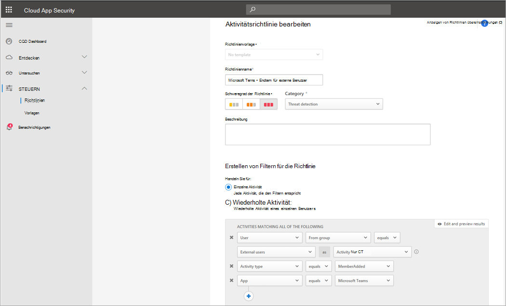

# Suchen nach Überwachungsprotokoll für Ereignisse in Microsoft Teams

> [!IMPORTANT]
> [!INCLUDE [new-teams-sfb-admin-center-notice](includes/new-teams-sfb-admin-center-notice.md)]

Mithilfe des Überwachungsprotokolls können Sie bestimmte Aktivitäten in allen Office 365-Diensten untersuchen. Für Microsoft Teams werden unter anderem die folgenden Aktivitäten überwacht:

- Teamerstellung

- Löschung von Teams

- Hinzufügen von Kanälen

- Ändern von Einstellungen

> [!NOTE]
> Überwachungsereignisse von privaten Kanälen werden auch so protokolliert, wie Sie für Teams und Standardkanäle gelten.

Eine vollständige Liste der in Office 365 überwachten Aktivitäten finden Sie unter [Durchsuchen des Überwachungsprotokolls im Office 365 Security & Compliance Center](https://support.office.com/article/0d4d0f35-390b-4518-800e-0c7ec95e946c).

## Aktivieren der Überwachung in Microsoft Teams

Bevor Sie sich die Überwachungsdaten ansehen können, müssen Sie zuerst die Überwachung im [Security & Compliance Center](https://protection.office.com)aktivieren. Hilfe zum Aktivieren der Überwachung finden Sie unter [Aktivieren oder Deaktivieren der Office 365-Überwachungsprotokollsuche](https://support.office.com/article/Turn-Office-365-audit-log-search-on-or-off-e893b19a-660c-41f2-9074-d3631c95a014).

> [!IMPORTANT]
> Überwachungsdaten sind erst ab dem Zeitpunkt verfügbar, an dem Sie die Überwachung aktiviert haben.

## Abrufen von Microsoft Teams-Daten aus dem Überwachungsprotokoll

1. Um Überwachungsprotokolle abzurufen, navigieren Sie zum [Security & Compliance Center](https://go.microsoft.com/fwlink/?linkid=855775). Wählen Sie unter **Suchen**die Option **Überwachungsprotokoll Suche**aus.
1. Verwenden Sie die Option **Suchen**, um nach den Aktivitäten, Datumswerten und Benutzern zu filtern, die Sie überwachen möchten.
1. Exportieren Sie die Ergebnisse zur weiteren Analyse nach Excel.

> [!IMPORTANT]
> Überwachungsdaten sind nur dann im Überwachungsprotokoll sichtbar, wenn die Überwachung aktiviert ist.

## Szenario eines externen Benutzers

Ein Szenario, auf das Sie möglicherweise im geschäftlichen Bereich achten sollten, ist das Hinzufügen externer Benutzer zu ihrer Teamumgebung. Wenn externe Benutzer aktiviert sind, ist es ratsam, deren Anwesenheit zu überwachen.

Der Screenshot dieser Richtlinie zum Überwachen externer Benutzer Adds ermöglicht Ihnen, die Richtlinie zu benennen, den Schweregrad entsprechend Ihren geschäftlichen Anforderungen festzulegen, ihn als (in diesem Fall) eine einzelne Aktivität festzulegen und dann die Parameter festzulegen, die speziell nur den Zusatz überwachen sollen. nicht interner Benutzer und beschränken Sie diese Aktivität auf Microsoft Teams.

Dann können Ergebnisse dieser Richtlinie im Aktivitätsprotokoll angezeigt werden:

Hier können Sie die Übereinstimmungen mit der von Ihnen eingerichteten Richtlinie überprüfen und nach Bedarf Anpassungen vornehmen oder die Ergebnisse exportieren, um Sie anderweitig zu verwenden.

## Massen Lösch Szenario

Wie bereits erwähnt, können Sie Lösch Szenarien überwachen. Es ist möglich, eine Richtlinie zu erstellen, die das Massenlöschen von Teams-Websites überwacht:

Wie der Screenshot zeigt, können Sie für diese Richtlinie viele verschiedene Parameter festlegen, um die Löschungen von Teams zu überwachen, einschließlich Schweregrad, einzelne oder wiederholte Aktionen und Parameter, die dies auf Teams und das Löschen von Websites einschränken. Dies kann unabhängig von einer Vorlage erfolgen, oder es kann eine Vorlage erstellt werden, um diese Richtlinie abhängig von Ihren organisatorischen Anforderungen zu deaktivieren.

Nachdem Sie eine Richtlinie eingerichtet haben, die für Ihr Unternehmen funktionieren wird, können Sie die Ergebnisse im Aktivitätsprotokoll überprüfen, wenn Ereignisse ausgelöst werden:

Sie können nach unten auf die Richtlinie filtern, die Sie festgelegt haben, um die Ergebnisse dieser Richtlinie anzuzeigen. Wenn die Ergebnisse, die Sie im Aktivitätsprotokoll erhalten, nicht zufrieden stellend sind (möglicherweise sehen Sie vielleicht viele Ergebnisse oder gar nichts), kann dies Ihnen helfen, die Abfrage zu optimieren, damit Sie für das, was Sie benötigen, relevanter ist.

## Video: TechTip: Verwenden der Überwachungsprotokollsuche in Microsoft Teams

Ansuman Acharya, Programm-Manager für Microsoft Teams, zeigt, wie Sie im Office 365 Security & Compliance Center eine Überwachungsprotokollsuche für Microsoft Teams durchführen.

> [!VIDEO https://www.youtube.com/embed/UBxaRySAxyE]
