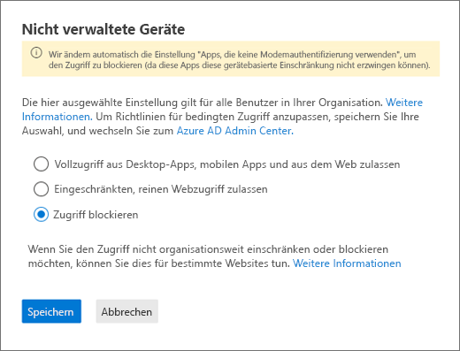

# Blockieren des Zugriffs auf SharePoint für bestimmte BenutzerBlock access to SharePoint for specific users

Eine Richtlinie für bedingten Zugriff (Conditional Access, AC) in SharePoint in Microsoft 365 wird auch auf Teams angewendet.Applying any Conditional Access (CA) policy on SharePoint in Microsoft 365 is also applied to Teams. Einige Organisationen möchten jedoch den Zugriff auf SharePoint-Dateien (hochladen, herunterladen, anzeigen, bearbeiten, erstellen) blockieren, ihren Mitarbeitern allerdings dennoch den Zugriff auf Desktop-, Web- und mobile Clients in Teams erlauben.However, some organizations want to block access to SharePoint files (upload, download, view, edit, create) yet allow their employees to use Teams desktop, mobile, and web clients on unmanaged devices. Gemäß den CA-Richtlinien würde eine Blockierung von SharePoint auch zu einer Blockierung von Teams führen.Under the CA policy rules, blocking Sharepoint would lead to blocking Teams as well. In diesem Artikel wird erklärt, wie Sie diese Beschränkung umgehen können, und es Ihren Mitarbeitern ermöglichen, weiterhin Teams zu nutzen, während der Zugriff auf in SharePoint gespeicherte Dateien komplett blockiert ist.This article explains how you can work around this limitation and allow your employees to continue using Teams while completely blocking access to files stored in SharePoint.

> [!Note]
> Das Blockieren oder Einschränken des Zugriffs auf nicht verwalteten Geräte basiert auf den Azure AD-Richtlinien für bedingten Zugriff.Blocking or limiting access on unmanaged devices relies on Azure AD conditional access policies. Erfahren Sie mehr über die [Azure AD-Lizenzierung](https://azure.microsoft.com/pricing/details/active-directory/).Learn about [Azure AD licensing](https://azure.microsoft.com/pricing/details/active-directory/). Einen Überblick über den bedingten Zugriff in Azure AD erhalten Sie unter [Bedingter Zugriff in Azure Active Directory](https://docs.microsoft.com/azure/active-directory/conditional-access/overview).For an overview of conditional access in Azure AD, see [Conditional access in Azure Active Directory](https://docs.microsoft.com/azure/active-directory/conditional-access/overview). Informationen zu empfohlenen Richtlinien für den SharePoint Online-Zugriff finden Sie unter [Richtlinienempfehlungen zur Sicherung von SharePoint-Websites und -Dateien](https://docs.microsoft.com/microsoft-365/enterprise/sharepoint-file-access-policies).For info about recommended SharePoint Online access policies, see [Policy recommendations for securing SharePoint sites and files](https://docs.microsoft.com/microsoft-365/enterprise/sharepoint-file-access-policies). Wenn Sie den Zugriff auf nicht verwalteten Geräten einschränken, müssen Benutzer mit verwalteten Geräten [unterstützte Betriebssysteme oder Browser-Kombinationen](https://docs.microsoft.com/azure/active-directory/conditional-access/technical-reference#client-apps-condition) verwenden, oder ihr Zugriff wird eingeschränkt.If you limit access on unmanaged devices, users on managed devices must use one of the [supported OS and browser combinations](https://docs.microsoft.com/azure/active-directory/conditional-access/technical-reference#client-apps-condition), or they will also have limited access.

Sie können den Zugriff blockieren oder einschränken für:You can block or limit access for:

- Benutzer in der Organisation oder nur bestimmte Benutzer oder Sicherheitsgruppen.Users in the organization or only some users or security groups.

- Alle Websites in der Organisation oder nur bestimmte Websites.All sites in the organization or only some sites.

Wenn der Zugriff blockiert wird, sehen die Benutzer eine Fehlermeldung.When access is blocked, users will see an error message. Das Blockieren des Zugriffs erhöht die Sicherheit und schützt sichere Daten.Blocking access helps provide security and protects secure data. Wenn der Zugriff blockiert wird, sehen die Benutzer eine Fehlermeldung.When access is blocked, users will see an error message.

1. Öffnen Sie das SharePoint Admin Center.Open the SharePoint Admin Center.

2. Erweitern der **Richtlinien** > **Zugriffsrichtlinien**.Expand **Policies** > **Access Policies**.

3. Wählen Sie im Abschnitt **Nicht verwaltete Geräte\*\*\*\*Zugriff blockieren**, und wählen Sie dann **Speichern**.In the **Unmanaged Devices** section,  select **Block Access** and select **Save**.

   

4. Öffnen Sie das Portal [Azure Active Directory](https://portal.azure.com/#blade/Microsoft_AAD_IAM/ConditionalAccessBlade/Policies) und navigieren Sie zu **Richtlinien für den bedingten Zugriff**.Open the [Azure Active Directory](https://portal.azure.com/#blade/Microsoft_AAD_IAM/ConditionalAccessBlade/Policies) portal and navigate to **Conditional Access Policies**.

    In SharePoint wird eine neue Richtlinie erstellt, die ähnlich wie dieses Beispiel aussieht:You'll see a new policy has been created by SharePoint that's similar to this example:

    

5. Aktualisieren Sie die Richtlinie, um nur bestimmte Benutzer oder eine Gruppe anzuvisieren.Update the policy to target only specific users or a group.

    

  > [!Note]
> Wenn Sie diese Richtlinie festlegen, wird Ihr Zugriff auf das SharePoint-Administratorportal eingeschränkt.Setting this policy will cut your access to the SharePoint admin portal. Wir empfehlen, dass Sie diese Ausschlussrichtlinie konfigurieren, und dann die globalen Administratoren und SharePoint-Administratoren auswählen.We recommended that you configure the exclusion policy and select the Global and SharePoint admins.

6. Stellen Sie sicher, dass nur SharePoint als gezielte Cloud-App ausgewählt istVerify that only SharePoint is selected as targeted Cloud App

    

7. Aktualisieren Sie die **Bedingungen**, um auch Desktop-Clients einzuschließen.Update **Conditions** to include desktop clients, as well.

    

8. Stellen Sie sicher, dass **Zugriff gewähren** aktiviert istMake sure that **Grant access** is enabled

    

9. Stellen Sie sicher, dass **Von der App erzwungene Einschränkungen** aktiviert ist.Make sure **Use app enforced restrictions** is enabled.

10. Aktivieren Sie Ihre Richtlinie und wählen Sie **Speichern**.Enable your policy and select **Save**.

    

Um Ihre Richtlinie zu testen, müssen Sie sich von allen Clients wie der Teams-Desktop-App oder OneDrive for Business-Synchronisierungsclient abmelden und wieder anmelden, um zu sehen, ob die Richtlinie funktioniert.To test your policy, you need to sign out from any client such as the Teams desktop app or the OneDrive for Business sync client and sign in again to see the policy working. Wenn Ihr Zugriff blockiert wurde, sehen Sie eine Nachricht in Teams, die angibt, dass das Element unter Umständen nicht existiert.If your access has been blocked, you'll see a message in Teams that states the item might not exist.

 

In SharePoint erhalten Sie die Fehlermeldung, dass der Zugriff verweigert wurde.In Sharepoint, you'll receive an access denied message.

## Verwandte ThemenRelated topics

[Steuern des Zugriffs auf nicht verwaltete Geräten in SharePointControl access for unmanaged devices in SharePoint](https://docs.microsoft.com/sharepoint/control-access-from-unmanaged-devices)
