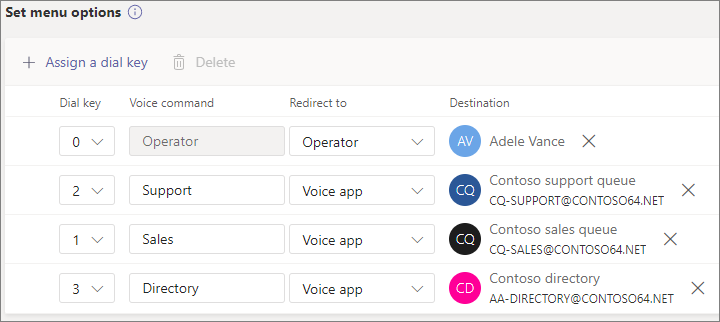

# Einrichten einer automatischen Attendant – Lernprogramm für kleine Unternehmen

Mithilfe von automatischen Telefonkonferenzen können Personen Ihre Organisation anrufen und in einem Menüsystem navigieren, um mit der richtigen Abteilung, Anrufwarteschlange, Person oder einem Operator zu sprechen. Sie können automatische Attendanten für Ihre Organisation mit dem Microsoft Teams Admin Center erstellen.

#### Bevor Sie beginnen

Holen Sie sich die Servicenummern, die Sie für die automatischen Telefonanten benötigen, auf die Sie barrierefrei sein möchten, indem Sie direkt von außerhalb Ihrer Organisation wählen. Dies kann das [Übertragen von Nummern von einem anderen Anbieter oder](../phone-number-calling-plans/transfer-phone-numbers-to-teams.md) das Anfordern neuer [Servicenummern umfassen.](../getting-service-phone-numbers.md)

Erwerben Sie [eine Lizenz für Telefonsystem – Virtueller Benutzer](../teams-add-on-licensing/virtual-user.md) für jede automatische Telefonanlage, die Sie erstellen möchten. Diese Lizenzen sind kostenlos, daher empfehlen wir, ein paar zusätzliche Lizenzen für den Fall zu erhalten, dass Sie in Zukunft Änderungen an Ihrem Setup vornehmen.

Wenn Ihre automatische Telefonanrufe an [Feiertagen](../set-up-holidays-in-teams.md) anders sein soll, erstellen Sie die Feiertage, die Sie verwenden möchten, bevor Sie die automatische Telefonwarte erstellen.

#### Führen Sie die folgenden Schritte aus, um ihre automatische Attendant zu einrichten

# [Schritt 1   Telefonnummer](#tab/phone-number)

Jede automatische Attendant, die Sie erstellen, erfordert ein Ressourcenkonto. Dies ist mit einem Benutzerkonto vergleichbar, es sei denn, das Konto ist einer automatischen Telefonwarteschlange oder Anrufwarteschleife anstelle einer Person zugeordnet. In diesem Schritt erstellen wir das Konto, weisen ihm eine *Microsoft 365 Phone System - Virtual User-Lizenz* zu und weisen dann eine Dienstnummer zu.

### Erstellen eines Ressourcenkontos

Sie können im Teams Admin Center ein Ressourcenkonto erstellen.

1. Erweitern Sie im Teams Admin Center **organisationsweite Einstellungen,** und klicken Sie dann auf **Ressourcenkonten.**

2. Klicken Sie auf **Hinzufügen**.

3. Füllen Sie **im Bereich Ressourcenkonto** hinzufügen anzeigename **,** **Benutzername** aus, und wählen Sie **automatische Attendant** für den **Ressourcenkontotyp aus.**

    

4. Klicken Sie auf **Speichern**.

Das neue Konto wird in der Liste der Konten angezeigt.

### Zuweisen einer Lizenz

Sie müssen dem Ressourcenkonto eine *Microsoft 365 Phone System - Virtual User-Lizenz* zuweisen.

1. Klicken Sie im Microsoft 365 Admin Center auf das Ressourcenkonto, dem Sie eine Lizenz zuweisen möchten.

2. Wählen Sie **auf der Registerkarte** Lizenzen und Apps unter **Lizenzen** die Option **Microsoft 365 Phone System – Virtueller Benutzer aus.**

3. Klicken **Sie auf Änderungen speichern.**

    

### Zuweisen einer Dienstnummer

Wenn sie über eine Telefonnummer erreichbar sein soll, weisen Sie diese Nummer dem Ressourcenkonto zu.

1. Wählen Sie im Teams  Admin Center auf der Seite Ressourcenkonten das Ressourcenkonto aus, dem Sie eine Dienstnummer zuweisen möchten, und klicken Sie dann auf **Zuweisen/Zuweisen.**

2. Wählen Sie **in der Dropdownliste** Telefonnummerntyp den Typ der Zu verwendende Nummer aus.

3. Suchen Sie **im Feld Zugewiesene** Telefonnummer nach der Zu verwendende Nummer, und klicken Sie auf **Hinzufügen.**

    

4. Klicken Sie auf **Speichern**.

> [!div class="nextstepaction"]
> [Schritt 2 : Allgemeine Informationen zur automatischen >](/microsoftteams/business-voice/create-a-phone-system-auto-attendant-smb?tabs=general-info#steps)

# [Allgemeine Informationen zur   Teilnehmerwarte in Schritt 2](#tab/general-info)

So richten Sie eine automatische Attendant ein

1. Erweitern Sie im Teams Admin Center **Voice,** klicken **Sie auf Automatische Telefonzentralen,** und klicken Sie dann auf **Hinzufügen.**

2. Geben Sie oben im Feld einen Namen für die automatische Attendant ein.

3. Wenn Sie einen Operator festlegen möchten, geben Sie das Ziel für Anrufe an den Operator an. Dies ist optional (aber empfohlen). Sie können die Option **Operator** so festlegen, dass Anrufer aus den Menüs ausbrechen und mit einer bestimmten Person sprechen können.

4. Geben Sie die Zeitzone für diese automatische Attendant an. Die Zeitzone wird zum Berechnen von Geschäftszeiten verwendet, wenn Sie einen separaten Anruffluss für nach Stunden erstellen.

5. Geben Sie eine Sprache für diese automatische Attendant an. Dies ist die Sprache, die für systemgenerierte Sprachanforderungen verwendet wird.

6. Wählen Sie aus, ob Sie Spracheingaben aktivieren möchten. Wenn diese Option aktiviert ist, wird der Name jeder Menüoption zu einem Schlüsselwort für die Spracherkennung. Anrufer können z. B. "One" sagen, um die Menüoption auszuwählen, die Der Taste 1 zugeordnet ist, oder sie können "Umsatz" sagen, um die Menüoption mit dem Namen "Vertrieb" auszuwählen.

    

7. Klicken Sie auf **Weiter**.

> [!div class="nextstepaction"]
> [Schritt 3 – Anruffluss >](/microsoftteams/business-voice/create-a-phone-system-auto-attendant-smb?tabs=call-flow#steps)

# [Schritt 3   Anruffluss](#tab/call-flow)

Wählen Sie Ihre Anrufflussoptionen aus.

1. Wählen Sie aus, ob sie eine Begrüßung wieder geben möchten, wenn die automatische Telefonkonferenz einen Anruf beantwortet.

    Wenn Sie **Audiodateien wiederverspielen auswählen,** können Sie die Schaltfläche **Datei** hochladen verwenden, um eine aufgezeichnete Begrüßungsnachricht hochzuladen, die als Audio in gespeichert ist. WAV, . MP3 oder . WMA-Format. Die Aufzeichnung darf nicht größer als 5 MB sein.

    Wenn Sie Grußnachricht **eingeben** auswählen, liest das System den Text vor, den Sie eingeben (bis zu 1.000 Zeichen), wenn die automatische Telefonkonferenz einen Anruf entgegen nimmt.

    

2. Wählen Sie aus, wie sie den Anruf weiterrouten möchten.

    Wenn Sie Trennen **auswählen,** hängt die automatische Telefonkonferenz den Anruf auf.

    Wenn Sie Anruf **umleiten auswählen,** können Sie eines der Anrufroutingziele auswählen.

    Wenn Sie Menüoptionen für "Wiedergabe" **auswählen,** können Sie eine Audiodatei wiedererwählen oder **eine** Grußnachricht eingeben und dann zwischen Menüoptionen und Verzeichnissuche auswählen. 

    

3. Wenn Anrufer die Wähltasten für die Navigation verwenden möchten, wählen Sie unter Menüoptionen festlegen **aus,** was geschehen soll, wenn Anrufer eine Wähltasten drücken. (Wenn Sie diese automatische Telefonwarte als Unternehmensverzeichnis erstellen, lassen Sie die Optionen für die Wähltaste leer.)

    Sie können eine der Wähltasten auf die folgenden Ziele festlegen:

    - **Person in der Organisation** – eine Person in Ihrer Organisation, die Sprachanrufe empfangen kann.
    - **Sprach-App** – eine andere automatische Telefonkonferenz oder Anrufwarteschlange.
    - **Externe Telefonnummer –** beliebige Telefonnummer. Verwenden Sie dieses Format: +[Ländercode][Vorwahl][Telefonnummer]
    - **Voicemail** – das Sprachpostfach, das einer von Ihnen angegebenen Microsoft 365-Gruppe zugeordnet ist.
    - **Operator** – der für die automatische Attendant definierte Operator. Das Definieren eines Operators ist optional. Der Operator kann als eines der anderen Ziele in dieser Liste definiert werden.

    Wir empfehlen, für den Operator die Taste 0 zu setzen.

    Geben Sie für jede Menüoption Folgendes an:

    - **WÄHLTA0** – die Taste auf der Telefontaste, um auf diese Option zu zugreifen.

    - **Sprachbefehl** : Definiert den Sprachbefehl, den ein Anrufer für den Zugriff auf diese Option geben kann, wenn Spracheingaben aktiviert sind. Sie kann mehrere Wörter wie "Kundendienst" oder "Vorgänge und Gründe" enthalten. 

    - **Umleiten zu** – an die Stelle, an der der Anruf gehen soll, wenn Anrufer diese Option auswählen. Wenn Sie an eine automatische Telefonleitung oder Anrufwarteschlange umleiten, wählen Sie das zugeordnete Ressourcenkonto aus.

    

4. Wenn Sie diese automatische Telefonwarte als Unternehmensverzeichnis verwenden möchten, wählen Sie unter Verzeichnissuche die Option **Nach Namen wählen aus.** Wenn Sie diese Option aktivieren, können Anrufer den Namen des Benutzers sagen oder ihn auf der Telefontaste eingeben. Jeder Onlinebenutzer mit einer Telefonsystemlizenz ist ein berechtigter Benutzer und kann mit Dial by name gefunden werden. 

    (Sie können Durchwahl **auswählen,** die Erweiterung muss jedoch in Azure Active Directory konfiguriert sein.)

5. Nachdem Sie eine Option für die **Verzeichnissuche ausgewählt haben,** klicken Sie auf **Weiter**.

> [!div class="nextstepaction"]
> [Schritt 4 – Anruffluss nach Stunden >](/microsoftteams/business-voice/create-a-phone-system-auto-attendant-smb?tabs=after-hours#steps)

# [Schritt 4   Nach Stunden](#tab/after-hours)

Geschäftszeiten können für jede automatische Attendant festgelegt werden. Wenn keine Geschäftszeiten festgelegt sind, gelten alle Tage und alle Stunden des Tages als Geschäftszeiten, da standardmäßig ein 24/7-Zeitplan festgelegt ist. Geschäftszeiten können mit Zeitumbrüchen während des Tages festgelegt werden, und alle Stunden, die nicht als Geschäftszeiten festgelegt sind, werden als Nachstunden betrachtet. Sie können unterschiedliche Optionen für die Anrufbehandlung und Begrüßungen für die Nachstunden festlegen.

Je nachdem, wie Sie Ihre automatischen Telefonwarteschlangen und Anrufwarteschlangen konfiguriert haben, müssen Sie möglicherweise nur das Anrufrouting nach stundenlangen Zeiten für automatische Telefonanten mit direkten Telefonnummern angeben.

Wenn Sie ein separates Anrufrouting für Anrufer nach stundenlangen Gesprächen wünschen, geben Sie Ihre Geschäftszeiten für jeden Tag an. Klicken **Sie auf Neue Uhrzeit hinzufügen,** um mehrere Stundensätze für einen bestimmten Tag anzugeben, z. B. um eine Mittagspause anzugeben.

Nachdem Sie Ihre Geschäftszeiten angegeben haben, wählen Sie ihre Anrufroutingoptionen für nach stundenlang aus. Die gleichen Optionen sind wie für das In-Stunden-Anrufrouting verfügbar, das Sie in **Schritt 3 – Anruffluss angegeben haben.**

Klicken **Sie auf** Weiter, wenn Sie fertig sind.

> [!div class="nextstepaction"]
> [Schritt 5 – Feiertags-Anruffluss >](/microsoftteams/business-voice/create-a-phone-system-auto-attendant-smb?tabs=holidays#steps)

# [Schritt 5   Feiertage](#tab/holidays)

Sie können Anrufe an Ihre automatische Telefon telefonieren lassen, die an Feiertagen anders als an anderen Tagen geroutet werden. (Wenn Sie keinen anderen Anruffluss für Feiertage wünschen, können Sie diesen Schritt überspringen.)

Ihre automatische Telefonkonferenz kann für jeden Feiertag, den Sie eingerichtet haben, einen Anruffluss haben. Sie können jeder automatische Telefonzentrale bis zu 20 geplante Feiertage hinzufügen.

1. Klicken Sie auf der Seite Feiertagsanrufeinstellungen auf **Hinzufügen.**

2. Geben Sie einen Namen für diese Feiertagseinstellung ein.

3. Wählen Sie **in der** Dropdownliste Feiertag den Feiertag aus, den Sie verwenden möchten.

4. Wählen Sie den Typ der Begrüßung aus, den Sie verwenden möchten.

    

5. Wählen Sie aus, ob **Sie** den Anruf trennen **oder umleiten** möchten.

6. Wenn Sie sich für die Umleitung entschieden haben, wählen Sie das Anrufroutingziel für den Anruf aus.

    

7. Klicken Sie auf **Speichern**.

Wiederholen Sie den Vorgang bei Bedarf für jeden weiteren Feiertag.

Wenn Sie alle Ihre Feiertage hinzugefügt haben, klicken Sie auf **Weiter**.

> [!div class="nextstepaction"]
> [Schritt 6 : Wählen Sie aus, wer sich im Verzeichnisverzeichnis >](/microsoftteams/business-voice/create-a-phone-system-auto-attendant-smb?tabs=dial-scope#steps)

# [Schritt 6   Verzeichnismitglieder](#tab/dial-scope)

Der *Wählbereich* definiert, welche Benutzer im Verzeichnis verfügbar sind, wenn ein Anrufer eine Nach-Name-Wähl- oder Durchwahl verwendet. Die Standardeinstellung **aller Onlinebenutzer umfasst** alle Benutzer in Ihrer Organisation, die Onlinebenutzer mit einer Telefonsystemlizenz sind.

Sie können bestimmte Benutzer ein- oder  ausschließen,  indem Sie unter Ein- oder Ausschließen benutzerdefinierte Benutzergruppe auswählen und eine oder mehrere Microsoft 365-Gruppen, Verteilerlisten oder Sicherheitsgruppen auswählen.  So können Sie beispielsweise Führungskräfte in Ihrer Organisation aus dem Wählverzeichnis ausschließen. (Wenn sich ein Benutzer in beiden Listen befindet, wird er aus dem Verzeichnis ausgeschlossen.)

> [!NOTE]
> Es kann bis zu 36 Stunden dauern, bis ein neuer Benutzer seinen Namen im Verzeichnis aufgelistet hat.

Wenn Sie mit dem Festlegen des Wählbereichs fertig sind, klicken Sie auf **Weiter**.

> [!div class="nextstepaction"]
> [Schritt 7 : Zuweisen eines Ressourcenkontos >](/microsoftteams/business-voice/create-a-phone-system-auto-attendant-smb?tabs=resource-accounts#steps)

# [Schritt 7   Ressourcenkonten](#tab/resource-accounts)

Alle automatischen Attendanten müssen über ein zugeordnetes Ressourcenkonto verfügen.  Automatische Teilnehmer der ersten Ebene benötigen mindestens ein Ressourcenkonto mit einer zugeordneten Dienstnummer. Wenn Sie möchten, können Sie einer automatischen Attendant mehrere Ressourcenkonten zuweisen, die jeweils eine separate Dienstnummer haben.

So fügen Sie ein Ressourcenkonto hinzu

1. Klicken **Sie auf Konto** hinzufügen, und suchen Sie nach dem Konto, das Sie hinzufügen möchten. Klicken **Sie auf** Hinzufügen , und klicken Sie dann auf **Hinzufügen.**

    

2. Wenn Sie das Hinzufügen von Dienstkonten abgeschlossen haben, klicken Sie auf **Absenden**.

    

Damit wird die Konfiguration der automatischen Attendant-Funktion abgeschlossen.

---

