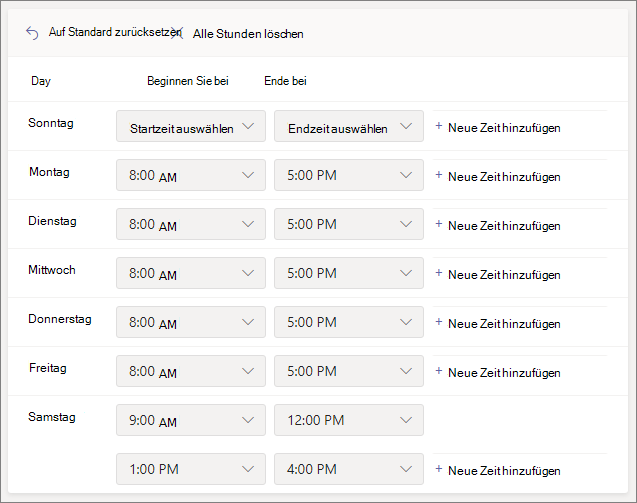
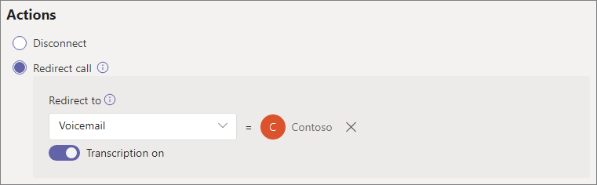

# Einrichten einer automatischen Attendant – Lernprogramm für kleine Unternehmen

Mit automatischen Telefonkonferenzen können Personen Ihre Organisation anrufen und in einem Menüsystem navigieren, um mit der richtigen Abteilung, der Anrufwarteschleife, einer Person oder einem Operator zu sprechen. Sie können automatische Attendzentralen für Ihre Organisation über das Microsoft Teams Admin Center erstellen.

#### Vorbereitung

Erhalten Sie die Servicenummern, die Sie für die automatischen Telefonieren benötigen, auf die Sie zugriffen möchten, indem Sie direkt von außerhalb Ihrer Organisation wählen. Dazu kann das [Übertragen von Nummern von einem anderen Anbieter](../phone-number-calling-plans/transfer-phone-numbers-to-teams.md) oder das Anfordern neuer [Servicenummern gehören.](../getting-service-phone-numbers.md)

Holen Sie [sich eine Telefonsystemlizenz – virtuelle Benutzerlizenz](../teams-add-on-licensing/virtual-user.md) für jede automatische Telefonanlage, die Sie erstellen möchten. Da diese Lizenzen kostenlos sind, empfehlen wir Ihnen, für den Fall, dass Sie in Zukunft Änderungen an Ihrem Setup vornehmen möchten, ein paar zusätzliche Lizenzen zu erhalten.

Wenn Die Routenanrufe der automatischen Telefonant an [Feiertagen](../set-up-holidays-in-teams.md) anders sein sollten, erstellen Sie die Feiertage, die Sie verwenden möchten, bevor Sie die automatische Telefon attendant erstellen.

#### Führen Sie die folgenden Schritte aus, um Ihre automatische Attendant zu einrichten

# [Schritt 1   Telefonnummer](#tab/phone-number)

Jede automatische Attendant, die Sie erstellen, erfordert ein Ressourcenkonto. Dies ähnelt einem Benutzerkonto, mit der Ausnahme, dass das Konto einer automatischen Telefonwarteschlange und nicht einer Person zugeordnet ist. In diesem Schritt erstellen wir das Konto, weisen ihm eine *Microsoft 365 Phone System - Virtual User-Lizenz* zu und weisen dann eine Servicenummer zu.

### Erstellen eines Ressourcenkontos

Sie können im Teams Admin Center ein Ressourcenkonto erstellen.

1. Erweitern Sie im Teams Admin Center **organisationsweite** Einstellungen, und klicken Sie dann auf **"Ressourcenkonten".**

2. Klicken Sie auf **Hinzufügen**.

3. Geben Sie **im Bereich "Ressourcenkonto** hinzufügen" **"Anzeigename"** und "Benutzername" **ein,** und wählen Sie **"Automatische Attendant"** für den **Ressourcenkontotyp aus.**

    

4. Klicken Sie auf **Speichern**.

Das neue Konto wird in der Liste der Konten angezeigt.

### Zuweisen einer Lizenz

Sie müssen dem Ressourcenkonto eine *Microsoft 365 Phone System – Virtual User-Lizenz* zuweisen.

1. Klicken Sie im Microsoft 365 Admin Center auf das Ressourcenkonto, dem Sie eine Lizenz zuweisen möchten.

2. Wählen Sie **auf der Registerkarte "Lizenzen** und **Apps"** unter "Lizenzen" die Option **"Microsoft 365-Telefonsystem – Virtueller Benutzer" aus.**

3. Klicken Sie **auf "Änderungen speichern".**

    

### Zuweisen einer Servicenummer

Wenn sie über eine Telefonnummer erreichbar sein soll, weisen Sie diese Nummer dem Ressourcenkonto zu.

1. Wählen Sie im Teams  Admin Center auf der Seite "Ressourcenkonten" das Ressourcenkonto aus, dem Sie eine Dienstnummer zuordnen möchten, und klicken Sie dann auf **"Zuweisen/Zuweisung** auf".

2. Wählen Sie **im Dropdownmenü "Telefonnummerntyp"** den Typ der Zu verwendende Nummer aus.

3. Suchen Sie **im Feld "Zugewiesene** Telefonnummer" nach der zu verwendende Nummer, und klicken Sie auf **"Hinzufügen".**

    

4. Klicken Sie auf **Speichern**.

> [!div class="nextstepaction"]
> [Schritt 2 – Allgemeine Informationen zur automatischen >](https://review.docs.microsoft.com/microsoftteams/business-voice/create-a-phone-system-auto-attendant-smb?branch=mikeplum-smb-voice&tabs=general-info#steps)

# [Allgemeine Informationen zu Schritt 2   Attendant](#tab/general-info)

So richten Sie eine automatische Attendant ein

1. Erweitern Sie im Teams Admin Center **"Sprache",** klicken Sie **auf "Automatische Telefonzentralen",** und klicken Sie dann auf **"Hinzufügen".**

2. Geben Sie einen Namen für die automatische Attendant in das Feld oben ein.

3. Wenn Sie einen Operator bestimmen möchten, geben Sie das Ziel für Aufrufe an den Operator an. Dies ist optional (aber empfohlen). Sie können die **Operatoroption** festlegen, damit Anrufer aus den Menüs ausbrechen und mit einer bestimmten Person sprechen können.

4. Geben Sie die Zeitzone für diese automatische Attendant an. Die Zeitzone wird zum Berechnen der Geschäftszeiten verwendet, wenn Sie für die Stunden einen separaten Anruffluss erstellen.

5. Geben Sie eine Sprache für diese automatische Attendant an. Dies ist die Sprache, die für vom System generierte Sprachanrufe verwendet wird.

6. Wählen Sie aus, ob Sie Spracheingaben aktivieren möchten. Wenn diese Option aktiviert ist, wird der Name jeder Menüoption zu einem Schlüsselwort für die Spracherkennung. Anrufer können z. B. "Eins" sagen, um die Menüoption auszuwählen, die der Taste "1" zugeordnet ist, oder "Vertrieb", um die Menüoption "Vertrieb" auszuwählen.

    

7. Klicken Sie auf **Weiter**.

> [!div class="nextstepaction"]
> [Schritt 3 – Anruffluss >](https://review.docs.microsoft.com/microsoftteams/business-voice/create-a-phone-system-auto-attendant-smb?branch=mikeplum-smb-voice&tabs=call-flow#steps)

# [Schritt 3   Anruffluss](#tab/call-flow)

Auswählen der Anrufflussoptionen

1. Wählen Sie aus, ob eine Begrüßung abspielen soll, wenn die automatische Telefonkonferenz einen Anruf beantwortet.

    Wenn Sie "Audiodatei **wiedergabe" auswählen,** können Sie die Schaltfläche "Datei hochladen" verwenden, um eine aufgezeichnete Begrüßungsnachricht hochzuladen, die als Audio gespeichert wurde.  WAV, . MP3 oder . WMA-Format. Die Aufzeichnung darf nicht größer als 5 MB sein.

    Wenn Sie **eine** Begrüßungsnachricht eingeben, liest das System den Text vor, den Sie eingeben (bis zu 1.000 Zeichen), wenn die automatische Telefonanlage einen Anruf entgegen nimmt.

    

2. Wählen Sie aus, wie sie den Anruf routen möchten.

    Wenn Sie **"Trennen"** auswählen, hängt die automatische Telefon attendant den Anruf auf.

    Wenn Sie **"Umleitungsanruf"** auswählen, können Sie eines der Anrufroutingziele auswählen.

    Wenn Sie **"Wiedergabe"-Menüoptionen auswählen,** können  Sie eine Audiodatei wiedergibt oder eine Begrüßungsnachricht eingeben und dann zwischen Menüoptionen und Verzeichnissuche auswählen. 

    

3. Wenn Anrufer die Wähltasten zum Navigieren verwenden möchten, wählen Sie unter "Menüoptionen festlegen" **aus,** was geschehen soll, wenn Anrufer eine Wähltasten drücken. (Wenn Sie diese automatische Telefon attendant als Unternehmensverzeichnis erstellen, lassen Sie die Optionen für die Wähltastoptionen leer.)

    Sie können jede der Wähltasten auf die folgenden Ziele festlegen:

    - **Person in der Organisation** – eine Person in Ihrer Organisation, die Sprachanrufe empfangen kann.
    - **Sprach-App** – eine andere automatische Telefon attendant oder eine Anrufwarteschleife.
    - **Externe Telefonnummer –** beliebige Telefonnummer. Verwenden Sie dieses Format: +[Landescode][Vorwahl][Telefonnummer]
    - **Voicemail –** das Sprachpostfach, das einer von Ihnen angegebenen Microsoft 365-Gruppe zugeordnet ist.
    - **Operator** – der für die automatische Attendant definierte Operator. Das Definieren eines Operators ist optional. Der Operator kann als eines der anderen Ziele in dieser Liste definiert werden.

    Es wird empfohlen, die Taste "0" für den Operator zu setzen.

    Geben Sie für jede Menüoption Folgendes an:

    - **Wähltastatur** – die Taste auf der Wähltastatur des Telefons, um auf diese Option zu zugreifen.

    - **Sprachbefehl :** Definiert den Sprachbefehl, den ein Anrufer für den Zugriff auf diese Option ausführen kann, wenn Spracheingaben aktiviert sind. Sie kann mehrere Wörter wie "Kundendienst" oder "Betrieb und Anlage" enthalten. 

    - **Redirect to** - where you want the call to go when callers choose this option. Wenn Sie an eine automatische Telefon attendant oder Anrufwarteschleife umleiten, wählen Sie das zugeordnete Ressourcenkonto aus.

    

4. Wenn Sie diese automatische Telefongesellschaft als Unternehmensverzeichnis verwenden möchten, wählen Sie unter **"Verzeichnissuche"** die Option **"Nach Name wählen" aus.** Wenn Sie diese Option aktivieren, können Anrufer den Namen des Benutzers sagen oder ihn auf der Tastatur des Telefons eingeben. Jeder Onlinebenutzer mit einer Telefonsystemlizenz ist berechtigter Benutzer und kann über die Namensanwahl gefunden werden. 

    (Sie können "Durchwahl **wählen",** die Erweiterung muss jedoch in Azure Active Directory konfiguriert werden.)

5. Nachdem Sie eine Option für die **Verzeichnissuche ausgewählt** haben, klicken Sie auf **"Weiter".**

> [!div class="nextstepaction"]
> [Schritt 4 – Anruffluss nach >](https://review.docs.microsoft.com/microsoftteams/business-voice/create-a-phone-system-auto-attendant-smb?branch=mikeplum-smb-voice&tabs=after-hours#steps)

# [Schritt 4   Nach Stunden](#tab/after-hours)

Die Geschäftszeiten können für jede automatische Attendant festgelegt werden. Wenn keine Geschäftszeiten festgelegt sind, werden alle Tage und alle Stunden des Tages als Geschäftszeiten betrachtet, da standardmäßig ein 24/7-Zeitplan festgelegt ist. Geschäftszeiten können mit Tagesferien festgelegt werden, und alle Stunden, die nicht als Geschäftszeiten festgelegt sind, werden als Arbeitsstunden betrachtet. Sie können verschiedene Optionen für die Anrufbehandlung und Begrüßungen für die Nachstunden festlegen.

Je nachdem, wie Sie Ihre automatischen Telefonkonferenzen und Anrufwarteschleifen konfiguriert haben, müssen Sie möglicherweise nur das Anrufrouting nach Stunden für automatische Telefonkonferenzen mit Direkttelefonnummern angeben.

Wenn Sie separate Anrufrouting für Anrufer nach Geschäftszeiten wünschen, geben Sie ihre Geschäftszeiten für jeden Tag an. Klicken **Sie auf "Neue Zeit hinzufügen",** um mehrere Stundensätze für einen bestimmten Tag anzugeben, z. B. eine Mittagspause.

Nachdem Sie Ihre Geschäftszeiten angegeben haben, wählen Sie ihre Anrufroutingoptionen für die folgenden Stunden aus. Die gleichen Optionen sind verfügbar wie für die Anrufrouting während der Geschäftszeiten, die Sie in **Schritt 3 – Anruffluss – angegeben haben.**

Wenn **Sie fertig** sind, klicken Sie auf "Weiter".

> [!div class="nextstepaction"]
> [Schritt 5 – Ablauf des Feiertagsanrufs >](https://review.docs.microsoft.com/microsoftteams/business-voice/create-a-phone-system-auto-attendant-smb?branch=mikeplum-smb-voice&tabs=holidays#steps)

# [Schritt 5   Feiertage](#tab/holidays)

Anrufe an Ihre automatische Telefon attendant können an Feiertagen anders als an anderen Tagen geroutet werden. (Wenn Sie keinen anderen Anruffluss für Feiertage wünschen, können Sie diesen Schritt überspringen.)

Ihre automatische Telefon attendant kann einen Anruffluss für jeden Feiertag haben, den Sie eingerichtet haben. Sie können jeder automatische Telefonzentrale bis zu 20 geplante Feiertage hinzufügen.

1. Klicken Sie auf der Seite mit den Einstellungen für den Feiertagsanruf auf **"Hinzufügen".**

2. Geben Sie einen Namen für diese Feiertagseinstellung ein.

3. Wählen Sie **in der** Dropdownliste "Feiertage" den Feiertag aus, den Sie verwenden möchten.

4. Wählen Sie den Typ der zu verwendende Begrüßung aus.

    

5. Wählen Sie aus, ob Sie den **Anruf** trennen **oder** umleiten möchten.

6. Wenn Sie sich für die Umleitung entschieden haben, wählen Sie das Anrufroutingziel für den Anruf aus.

    

7. Klicken Sie auf **Speichern**.

Wiederholen Sie den Vorgang bei Bedarf für jeden weiteren Feiertag.

Wenn Sie alle Feiertage hinzugefügt haben, klicken Sie auf **"Weiter".**

> [!div class="nextstepaction"]
> [Schritt 6: Auswählen, wer im Verzeichnisverzeichnis >](https://review.docs.microsoft.com/microsoftteams/business-voice/create-a-phone-system-auto-attendant-smb?branch=mikeplum-smb-voice&tabs=dial-scope#steps)

# [Schritt 6   Verzeichnismitglieder](#tab/dial-scope)

Der *Wählbereich* definiert, welche Benutzer im Verzeichnis verfügbar sind, wenn ein Anrufer die Namensanwahl oder die Durchwahl verwendet. Die Standardeinstellung **"Alle Onlinebenutzer" umfasst** alle Benutzer in Ihrer Organisation, bei der es sich um Onlinebenutzer mit einer Telefonsystemlizenz handelt.

Sie können bestimmte Benutzer ein- oder  ausschließen,  indem Sie unter "Ein- oder Ausschließen" die Option "Benutzerdefinierte Benutzergruppe" auswählen und dann eine oder mehrere Microsoft 365-Gruppen, Verteilerlisten oder Sicherheitsgruppen auswählen.  Sie können beispielsweise Leitende Geschäftsleitung in Ihrer Organisation aus dem Wählverzeichnis ausschließen. (Wenn sich ein Benutzer in beiden Listen befindet, wird er aus dem Verzeichnis ausgeschlossen.)

> [!NOTE]
> Es kann bis zu 36 Stunden dauern, bis ein neuer Benutzer seinen Namen im Verzeichnis aufgelistet hat.

Wenn Sie mit dem Festlegen des Wählbereichs fertig sind, klicken Sie auf **"Weiter".**

> [!div class="nextstepaction"]
> [Schritt 7: Zuweisen eines Ressourcenkontos >](https://review.docs.microsoft.com/microsoftteams/business-voice/create-a-phone-system-auto-attendant-smb?branch=mikeplum-smb-voice&tabs=resource-accounts#steps)

# [Schritt   7: Ressourcenkonten](#tab/resource-accounts)

Allen automatischen Attendanten muss ein Ressourcenkonto zugeordnet sein.  Automatische Telefonnummern der ersten Ebene benötigen mindestens ein Ressourcenkonto, das über eine zugeordnete Dienstnummer verfügt. Wenn Sie möchten, können Sie einer automatischen Attendant mehrere Ressourcenkonten zuordnen, die jeweils eine separate Dienstnummer haben.

So fügen Sie ein Ressourcenkonto hinzu

1. Klicken Sie **auf "Konto hinzufügen",** und suchen Sie nach dem Konto, das Sie hinzufügen möchten. Klicken Sie **auf**"Hinzufügen" und dann auf **"Hinzufügen".**

    

2. Wenn Sie mit dem Hinzufügen von Dienstkonten fertig sind, klicken Sie auf **"Absenden".**

    

Damit wird die Konfiguration der automatischen Attendant abgeschlossen.

---

