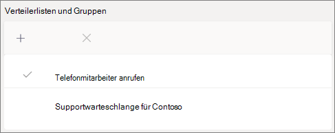

# Erstellen einer Anrufwarteschleife – Lernprogramm für kleine Unternehmen

Anrufwarteschleifen bieten eine Methode zum Weiterleiten von Anrufern an Personen in Ihrer Organisation, die ihnen bei einem bestimmten Problem oder einer bestimmten Frage helfen können. Anrufe werden an die Personen in der Warteschlange (die als Agents bezeichnet werden) immer nur einmal *verteilt.* 

Anrufwarteschleifen bieten:

- Eine Begrüßungsnachricht.

- Musik, während die Warteschleife in einer Warteschlange wartet.

- Anrufrouting – First *In, First Out* (FIFO)-Bestellung – an Agenten.

- Behandeln von Optionen für Warteschlangenüberlauf und Timeout.

#### Vorbereitung

Erwerben Sie [Telefonsystemlizenzen – virtuelle Benutzerlizenzen,](../teams-add-on-licensing/virtual-user.md) wenn Sie noch nicht über diese Lizenzen verfügen. Rufen Sie eine für jede Anrufwarteschleife und automatische Telefonwarteschlange ab, die Sie einrichten möchten. Da diese Lizenzen kostenlos sind, empfehlen wir Ihnen, für den Fall, dass Sie in Zukunft Änderungen an Ihrem Setup vornehmen möchten, ein paar zusätzliche Lizenzen zu erhalten.

Da telefonierende Mitarbeiter in einer Anrufwarteschleife anrufen können, um einen Kundenanruf zurückzukehren, sollten Sie die Anrufer-ID für Ihre Anrufer auf Ihre Haupttelefonnummer oder die Nummer einer entsprechenden automatischen Telefonwarteschleife festlegen. Weitere Informationen finden Sie unter "Verwalten [von Anrufer-ID-Richtlinien in Microsoft Teams".](../caller-id-policies.md)

#### Führen Sie die folgenden Schritte aus, um Ihre Anrufwarteschleife einrichten.

# [Schritt   1: Erstellen eines Teams](#tab/create-team)

Beim Erstellen einer Anrufwarteschleife können Sie der Warteschlange einzelne Benutzer hinzufügen oder eine vorhandene Sicherheitsgruppe, Microsoft 365-Gruppe oder ein Microsoft Teams-Team verwenden. Wir empfehlen die Verwendung eines Teams. Auf diese Weise können die Mitglieder der Warteschlange miteinander chatten, Ideen austauschen und Dokumente oder andere Ressourcen erstellen, um Ihren Kunden zu helfen. Ein Team bietet auch ein Sprachpostfach, über das Anrufer eine Nachricht nach Stunden hinterlassen können oder wenn die Warteschlange ihre maximale Kapazität erreicht.

So erstellen Sie ein Team

1. Klicken Sie zuerst **auf der** linken Seite der  App auf "Teams", und klicken Sie dann unten in Ihrer Teamliste auf "Einem Team beitreten" oder "Ein Team erstellen".

2. Klicken Sie dann **auf "Team erstellen"** (erste Karte, obere linke Ecke).

3. Wählen Sie **"Team ganz neu erstellen" aus.**

4. Wählen Sie als Nächstes aus, ob Sie ein öffentliches oder privates Team haben möchten. Wir empfehlen **"Privat"** für Ihre Anrufwarteschleife, um zu verhindern, dass Personen versehentlich der Warteschlange beitreten, indem sie dem Team beitreten.

5. Benennen Sie Ihr Team, und fügen Sie eine optionale Beschreibung hinzu.

6. Wenn Sie fertig sind, klicken Sie auf **"Erstellen".**

8. Geben Sie die Namen der Personen ein, die ihre Anrufwarteschleife enthalten soll, und klicken Sie dann auf **"Hinzufügen".**

9. Klicken Sie auf **Schließen**. Personen, die Sie einem Team hinzufügen, erhalten eine E-Mail, in der sie informiert werden, dass sie jetzt Mitglied Ihres Teams sind, und das Team wird in der Teamliste angezeigt.

> [!div class="nextstepaction"]
> [Schritt 2: Ressourcenkonten >](https://review.docs.microsoft.com/microsoftteams/business-voice/create-a-phone-system-call-queue-smb?branch=mikeplum-smb-voice&tabs=resource-account#steps)

# [Schritt 2   Ressourcenkonten](#tab/resource-account)

Jede Anrufwarteschleife, die Sie erstellen, erfordert ein Ressourcenkonto. Dies ähnelt einem Benutzerkonto, mit der Ausnahme, dass das Konto einer automatischen Telefonwarteschlange und nicht einer Person zugeordnet ist. In diesem Schritt erstellen wir das Konto, weisen ihm eine *Microsoft 365 Phone System - Virtual User-Lizenz* zu und beginnen dann damit, die Anrufwarteschleife zu erstellen.

### Erstellen eines Ressourcenkontos

Sie können im Teams Admin Center ein Ressourcenkonto erstellen.

1. Erweitern Sie im Teams Admin Center **organisationsweite** Einstellungen, und klicken Sie dann auf **"Ressourcenkonten".**

2. Klicken Sie auf **Hinzufügen**.

3. Geben Sie im **Bereich "Ressourcenkonto hinzufügen"** den  Anzeigenamen **und** den Benutzernamen **ein,** und wählen Sie "Anrufwarteschleife" für den **Ressourcenkontotyp aus.**

    

4. Klicken Sie auf **Speichern**.

Das neue Konto wird in der Liste der Konten angezeigt.

### Zuweisen einer Lizenz

Sie müssen dem Ressourcenkonto eine *Microsoft 365 Phone System – Virtual User-Lizenz* zuweisen.

1. Klicken Sie im Microsoft 365 Admin Center auf das Ressourcenkonto, dem Sie eine Lizenz zuweisen möchten.

2. Wählen Sie **auf der Registerkarte "Lizenzen** und **Apps"** unter "Lizenzen" die Option **"Microsoft 365-Telefonsystem – Virtueller Benutzer" aus.**

3. Klicken Sie **auf "Änderungen speichern".**

    

### Erstellen einer Anrufwarteschlange

Als Nächstes erstellen wir eine neue Anrufwarteschleife und weisen das Ressourcenkonto zu.

1. Erweitern Sie im Teams Admin Center **"Sprache",** klicken Sie auf **"Anrufwarteschleifen",** und klicken Sie dann auf "Hinzufügen". 

1. Geben Sie einen Namen für die Anrufwarteschleife ein. Agents wird dieser Name angezeigt, wenn sie einen eingehenden Anruf aus der Warteschlange erhalten.

2. Klicken **Sie auf "Konten hinzufügen",** suchen Sie nach dem Ressourcenkonto, das Sie mit dieser Anrufwarteschleife verwenden möchten, klicken Sie auf "Hinzufügen", und klicken Sie dann auf "Hinzufügen".  

3. Wählen Sie eine Sprache aus. Diese Sprache wird für systemgenerierte Sprachanrufe und Voicemail-Transkription verwendet (wenn Sie sie aktivieren).

    

4. Geben Sie an, ob Anrufern eine Begrüßung vorkommt, wenn sie in der Warteschlange eintreffen. Sie müssen eine MP3-, WAV- oder WMA-Datei hochladen, die die abspielende Begrüßung enthält.

5. Teams bietet Anrufern Standardmusik, während sie sich in einer Warteschlange befinden. Wenn Sie eine bestimmte Audiodatei wiedergibt, wählen Sie **"Audiodatei** wiedergabe" aus, und laden Sie eine MP3-, WAV- oder WMA-Datei hoch.

> [!NOTE]
> Die hochgeladene Aufzeichnung darf nicht größer als 5 MB sein.
> Die in Anrufwarteschleifen in Teams bereitgestellte Standardmusik ist kostenlos und kann von Ihrer Organisation bezahlt werden. 

> [!div class="nextstepaction"]
> [Schritt 3: Anrufen von >](https://review.docs.microsoft.com/microsoftteams/business-voice/create-a-phone-system-call-queue-smb?branch=mikeplum-smb-voice&tabs=call-agents#steps)

# [Schritt 3   : Telefonanrufmitarbeiter](#tab/call-agents)

Um der Anrufwarteschleife Agents hinzuzufügen, fügen wir das zuvor erstellte Team hinzu.

1. Klicken Sie **auf "Gruppen hinzufügen".**
2. Geben Sie den Namen des Teams ein, das Sie erstellt haben.
3. Klicken Sie **auf**"Hinzufügen" und dann auf **"Hinzufügen".**

    

Sie können bis zu 20 Agents einzeln und bis zu 200 Agents über Gruppen oder Teams hinzufügen.

> [!NOTE]
> Wenn neue Benutzer zum Team hinzugefügt werden, kann es bis zu acht Stunden dauern, bis der erste Anruf eintrifft.

> [!div class="nextstepaction"]
> [Schritt 4: Ressourcenkonten >](https://review.docs.microsoft.com/microsoftteams/business-voice/create-a-phone-system-call-queue-smb?branch=mikeplum-smb-voice&tabs=call-routing#steps)

# [Schritt 4   Anrufrouting](#tab/call-routing)

Wählen Sie die Anrufroutingmethode aus, die Sie verwenden möchten.

1. Legen Sie **den Konferenzmodus auf** **"Auto" festgelegt.**

2. Wählen Sie **die Routingmethode aus,** die Sie verwenden möchten. Dadurch wird die Reihenfolge bestimmt, in der Agents Anrufe von der Warteschlange empfangen. Wir empfehlen **serielles Routing oder** **Round-Sorn.** Wählen Sie eine der folgenden Optionen aus:

    - **Die Telefonleitung ringt** alle Agents in der Warteschlange gleichzeitig. Der erste Anrufer, der den Anruf abbekommt, erhält den Anruf.

    - **Durch das serielle** Routing werden alle Telefonanrufer eins nach dem anderen ringen. Wenn ein Agent den Anruf schließt oder nicht an nimmt, klingelt der Anruf beim nächsten Mitarbeiter und versucht alle Agenten, bis er abgeholt wird oder ein Zeit raus ist.

    - **Round balances** the routing of incoming calls so that each call agent gets the same number of calls from the queue. Dies kann in einer eingehenden Verkaufsumgebung wünschenswert sein, um die gleiche Chance für alle Telefonmitarbeiter zu gewährleisten.

    - **Der längste Leerlauf** leitet jeden Anruf an den Agent weiter, der die längste Zeit im Leerlauf war. (Agents, deren Anwesenheitsstatus für mehr als 10 Minuten "Ab jetzt" war, sind nicht enthalten.)

    

3. Aktivieren **Sie anwesenheitsbasiertes** Routing. Dadurch werden Anrufe an Agenten weitervermittelt, deren Anwesenheitsstatus verfügbar **ist.**

4. Wählen Sie aus, ob Sie es Den Agents gestatten möchten, Anrufe zu melden.

5. Legen Sie **eine Agentbenachrichtigungszeit fest,** um anzugeben, wie lange das Telefon eines Agents klingelt, bevor die Warteschlange den Anruf an den nächsten Agent weiterleitelt.

    

> [!div class="nextstepaction"]
> [Schritt 5 – Anrufüberlauf >](https://review.docs.microsoft.com/microsoftteams/business-voice/create-a-phone-system-call-queue-smb?branch=mikeplum-smb-voice&tabs=call-overflow#steps)

# [Schritt 5   Anrufüberlauf](#tab/call-overflow)

Wählen Sie aus, wie Anrufe zu behandeln sind, die den maximal zulässigen Wert in der Warteschlange überschreiten.

1. Legen Sie **die maximale Anzahl von Anrufen in der Warteschlange ein.**

2. Wählen Sie aus, was Sie tun möchten, wenn die maximale Anzahl von Anrufen erreicht ist. Sie können den Anruf trennen oder umleiten. Wir empfehlen, den Anruf an eines der folgenden Ziele umzuleiten:
    - **Person in der Organisation** – eine Person in Ihrer Organisation, die Sprachanrufe empfangen kann
    - **Sprach-App** – eine automatische Telefonwarteschlange oder eine andere Anrufwarteschleife. (Wählen Sie das Ressourcenkonto aus, das der automatischen Telefonwarteschlange oder Anrufwarteschleife zugeordnet ist, wenn Sie dieses Ziel auswählen.)
    - **Externe Telefonnummer –** beliebige Telefonnummer. Verwenden Sie dieses Format: +[Landescode][Vorwahl][Telefonnummer]
    - **Voicemail** – Sie können das Sprachpostfach des von Ihnen erstellten Teams verwenden.

    

> [!div class="nextstepaction"]
> [Schritt 6 – Anruftimeout >](https://review.docs.microsoft.com/microsoftteams/business-voice/create-a-phone-system-call-queue-smb?branch=mikeplum-smb-voice&tabs=call-timeout#steps)

# [Schritt 6   Anruftimeout](#tab/call-timeout)

Wählen Sie aus, was geschehen soll, wenn Anrufe zu lange in der Warteschlange warteten.

1. Legen Sie das **Timeout für Anrufe als maximale Wartezeit ein.**

2. Wählen Sie aus, was Sie tun möchten, wenn ein Anruf nicht mehr zeitweise zu sehen ist. Sie können den Anruf trennen oder umleiten. Wir empfehlen, den Anruf an eines der folgenden Ziele umzuleiten:
    - **Person in der Organisation** – eine Person in Ihrer Organisation, die Sprachanrufe empfangen kann
    - **Sprach-App** – eine automatische Telefonwarteschlange oder eine andere Anrufwarteschleife. (Wählen Sie das Ressourcenkonto aus, das der automatischen Telefonwarteschlange oder Anrufwarteschleife zugeordnet ist, wenn Sie dieses Ziel auswählen.)
    - **Externe Telefonnummer –** beliebige Telefonnummer. Verwenden Sie dieses Format: +[Landescode][Vorwahl][Telefonnummer]
    - **Voicemail** – Sie können das Sprachpostfach des von Ihnen erstellten Teams verwenden.

    

3. Klicken Sie auf **Speichern**.

Damit wird die Einrichtung Ihrer Anrufwarteschleife abgeschlossen. Als Nächstes können Sie eine [automatische Attendant einrichten.](create-a-phone-system-auto-attendant-smb.md)

---

