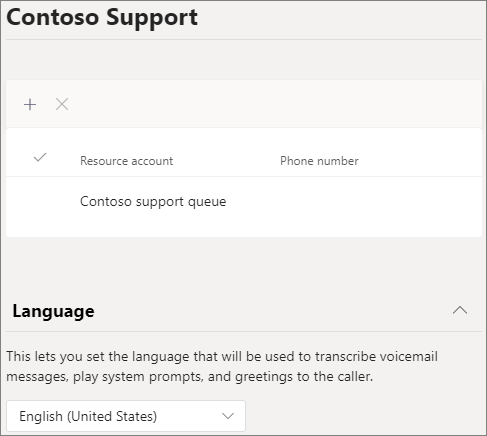

# Erstellen einer Anrufwarteschlange – Lernprogramm für kleine Unternehmen

Anrufwarteschleifen ermöglichen es, Anrufe an Personen in Ihrer Organisation weiterzuleiten, die bei einem bestimmten Problem oder einer bestimmten Frage helfen können. Die einzelnen Anrufe werden nach und nach an die Personen (sog. *Telefonberater*) in der Warteschleife verteilt. 

Für Anrufwarteschleifen gibt es die folgenden Optionen:

- Eine Begrüßungsnachricht.

- Musik, während Anrufer in der Warteschleife warten.

- Weiterleitung der Anrufe *nach Eingang* an Telefonberater.

- Optionen für das Vorgehen bei überzähligen Anrufen und Erreichen des Zeitlimits.

#### Videodemonstration

In diesem Video wird gezeigt, wie Sie eine Anrufwarteschlange in Teams erstellen.

> [!VIDEO https://www.microsoft.com/videoplayer/embed/RWCF23?autoplay=false]

#### Bevor Sie beginnen

Holen Sie [sich einige Lizenzen für Telefonsystem – Virtuelle Benutzer,](../teams-add-on-licensing/virtual-user.md) wenn Sie noch nicht über diese Lizenzen verfügen. Rufen Sie eine für jede Anrufwarteschlange und automatische Telefonwarteschlange ab, die Sie einrichten möchten. Diese Lizenzen sind kostenlos, daher empfehlen wir, ein paar zusätzliche Lizenzen für den Fall zu erhalten, dass Sie in Zukunft Änderungen an Ihrem Setup vornehmen.

Da sich Die Mitarbeiter in einer Anrufwarteschlange abwählen können, um einen Kundenanruf zurückzukehren, sollten Sie die Anrufer-ID für Ihre Anrufer auf Ihre Haupttelefonnummer oder die Nummer einer geeigneten automatischen Telefonkonferenz festlegen. Weitere Informationen finden Sie unter [Verwalten von Anrufer-ID-Richtlinien in Microsoft Teams](../caller-id-policies.md).

#### Führen Sie die folgenden Schritte aus, um ihre Anrufwarteschlange zu einrichten

# [Schritt 1   Erstellen eines Teams](#tab/create-team)

Beim Erstellen einer Anrufwarteschlange können Sie der Warteschlange einzelne Benutzer hinzufügen oder eine vorhandene Sicherheitsgruppe, eine Microsoft 365-Gruppe oder ein Microsoft Teams-Team verwenden. Wir empfehlen [die Verwendung eines Teamkanals.](https://support.microsoft.com/office/9f07dabe-91c6-4a9b-a545-8ffdddd2504e) Auf diese Weise können Mitglieder der Warteschlange miteinander chatten, Ideen teilen und Dokumente oder andere Ressourcen erstellen, um ihren Kunden zu helfen. Ein Team stellt auch ein Sprachpostfach für Anrufer zum Verlassen einer Nachricht nach Stunden oder wenn die Warteschlange die maximale Kapazität erreicht.

So erstellen Sie ein Team

1. Klicken Sie zuerst **auf der** linken Seite der  App auf Teams, und klicken Sie dann unten in Ihrer Teamliste auf Teilnehmen oder ein Team erstellen.

2. Klicken Sie dann **auf Team erstellen** (erste Karte, obere linke Ecke).

3. Wählen **Sie Team von Grund auf erstellen aus.**

4. Wählen Sie als Nächstes aus, ob Sie ein öffentliches oder privates Team wünschen. Wir empfehlen **Private** für Ihre Anrufwarteschlange, um zu verhindern, dass Personen versehentlich Teil der Warteschlange werden, indem Sie dem Team beitreten.

5. Benennen Sie Ihr Team, und fügen Sie eine optionale Beschreibung hinzu.

6. Wenn Sie fertig sind, klicken Sie auf **Erstellen.**

8. Geben Sie die Namen der Personen ein, die Sie in ihrer Anrufwarteschlange haben möchten, und klicken Sie dann auf **Hinzufügen.**

9. Klicken Sie auf **Schließen**. Personen, die Sie einem Team hinzufügen, erhalten eine E-Mail, in der sie darüber informiert werden, dass sie jetzt Mitglied Ihres Teams sind, und das Team wird in seiner Teamliste angezeigt.

Als Nächstes fügen wir einen Kanal hinzu, der mit der Anrufwarteschlange verwendet werden kann.

So fügen Sie einen Kanal hinzu

1. Suchen Sie in Teams das gerade erstellte Team, klicken Sie auf **Weitere Optionen** (...), und klicken Sie dann auf **Kanal hinzufügen.**

2. Geben Sie einen Namen und eine Beschreibung für den Kanal ein, und klicken Sie dann auf **Hinzufügen.**

> [!div class="nextstepaction"]
> [Schritt 2 : Ressourcenkonten >](/microsoftteams/business-voice/create-a-phone-system-call-queue-smb?tabs=resource-account#steps)

# [Schritt 2   Ressourcenkonten](#tab/resource-account)

Jede von Ihnen erstellte Anrufwarteschlange erfordert ein Ressourcenkonto. Dies ist mit einem Benutzerkonto vergleichbar, es sei denn, das Konto ist einer automatischen Telefonwarteschlange oder Anrufwarteschleife anstelle einer Person zugeordnet. In diesem Schritt erstellen wir das Konto, weisen ihm eine *Microsoft 365 Phone System - Virtual User-Lizenz* zu, und verwenden es dann, um mit dem Erstellen der Anrufwarteschlange zu beginnen.

### Erstellen eines Ressourcenkontos

Sie können im Teams Admin Center ein Ressourcenkonto erstellen.

1. Erweitern Sie im Teams Admin Center **organisationsweite Einstellungen,** und klicken Sie dann auf **Ressourcenkonten.**

2. Klicken Sie auf **Hinzufügen**.

3. Füllen Sie **im Bereich Ressourcenkonto** hinzufügen anzeigename **,** **Benutzername** aus, und wählen Sie Anrufwarteschlange **für** den **Ressourcenkontotyp aus.** Agents sehen den Anzeigenamen, wenn sie einen eingehenden Anruf aus der Warteschlange erhalten.

    

4. Klicken Sie auf **Speichern**.

   Das neue Konto wird in der Liste der Konten angezeigt.

   

### Zuweisen einer Lizenz

Sie müssen dem Ressourcenkonto eine *Microsoft 365 Phone System - Virtual User-Lizenz* zuweisen.

1. Klicken Sie im Microsoft 365  Admin Center in der Liste Aktive Benutzer auf das Ressourcenkonto, dem Sie eine Lizenz zuweisen möchten.

2. Wählen Sie **auf der Registerkarte** Lizenzen und Apps unter **Lizenzen** die Option **Microsoft 365 Phone System – Virtueller Benutzer aus.**

3. Klicken **Sie auf Änderungen speichern.**

    

### Erstellen einer Anrufwarteschleife

Als Nächstes erstellen wir eine neue Anrufwarteschlange und weisen das Ressourcenkonto zu.

1. Erweitern Sie im Teams Admin Center **Voice,** klicken Sie auf **Anrufwarteschlangen,** und klicken Sie dann auf **Hinzufügen.**

1. Geben Sie einen Namen für die Anrufwarteschleife ein.

2. Klicken Sie auf **Konten hinzufügen**, suchen Sie nach dem Ressourcenkonto, das Sie für diese Anrufwarteschleife verwenden möchten, klicken Sie auf **Hinzufügen** und dann nochmals auf **Hinzufügen**.

3. Wählen Sie eine Sprache aus. Diese Sprache wird für vom System generierte Sprachansagen und Voicemailtranskripte verwendet (sofern Sie diese aktivieren).

    

4. Legen Sie fest, ob eine Begrüßung abgespielt werden soll, wenn Anrufer in der Warteschleife eintreffen. Die gewünschte Begrüßung muss in Form einer MP3-, WAV- oder WMA-Datei hochgeladen werden.

5. In Microsoft Teams wird für Anrufer in der Warteschleife Standardmusik wiedergegeben. Wenn Sie möchten, dass eine bestimmte Audiodatei wiedergegeben wird, klicken Sie auf **Audiodatei wiedergeben**, und laden Sie eine MP3-, WAV- oder WMA-Datei hoch.

   > [!NOTE]
   > Die hochgeladene Aufzeichnung darf nicht größer als 5 MB sein.
   > Für die in Microsoft Teams-Anrufwarteschleifen wiedergegebene Standardmusik muss Ihre Organisation keine Lizenzgebühren zahlen. 

> [!div class="nextstepaction"]
> [Schritt 3 : Anrufer >](/microsoftteams/business-voice/create-a-phone-system-call-queue-smb?tabs=call-agents#steps)

# [Schritt   3: Anrufer](#tab/call-agents)

Um der Anrufwarteschlange Agents hinzuzufügen, fügen wir sie dem Team und kanal hinzu, den wir zuvor erstellt haben.

1. Wählen Sie die **Option Team auswählen** aus, und klicken Sie auf Kanal **hinzufügen.**
2. Geben Sie den Namen des teams ein, das Sie erstellt haben, wählen Sie es aus, und klicken Sie auf **Hinzufügen.**
3. Wählen Sie den Kanal aus, den Sie für die Warteschlange erstellt haben.
3. Klicken Sie auf **Anwenden**.

    

> [!NOTE]
> Wenn neue Benutzer zum Team hinzugefügt werden, kann es bis zu acht Stunden dauern, bis der erste Anruf eintrifft.

> [!div class="nextstepaction"]
> [Schritt 4 : Ressourcenkonten >](/microsoftteams/business-voice/create-a-phone-system-call-queue-smb?tabs=call-routing#steps)

# [Schritt 4   Anrufrouting](#tab/call-routing)

Wählen Sie die Anrufroutingmethode aus, die Sie verwenden möchten.

1. Festlegen **des Konferenzmodus** auf **Auto**.

2. Wählen Sie **die Routingmethode** aus, die Sie verwenden möchten. Dadurch wird die Reihenfolge bestimmt, in der Agenten Anrufe aus der Warteschlange empfangen. Wir empfehlen **serielles Routing oder**  **Round robin**. Wählen Sie eine der folgenden Optionen aus:

    - Bei der **Weiterleitung durch Telefonzentrale** werden alle Telefonberater in der Warteschleife gleichzeitig angerufen. Der Anruf wird dem ersten Telefonberater, der den Anruf annimmt, zugewiesen.

    - **Durch serielles** Routing werden alle Anrufer eins nach dem anderen umringt. Wenn ein Telefonberater einen Anruf ablehnt oder nicht annimmt, wird der nächste auf der Liste angerufen usf., bis der Anruf angenommen wird oder das Zeitlimit in der Warteschleife erreicht hat.

    - Beim **Round Robin** werden die eingehenden Anrufe gleichmäßig verteilt, sodass jeder Telefonberater dieselbe Anzahl von Anrufen aus der Warteschleife erhält. Dies kann in einer Inbound-Vertriebsumgebung erwünscht sein, um für gleiche Chancen für alle Telefonberater zu sorgen.

    - Bei der Option **Längste Inaktivität** wird jeder Anruf an den am längsten inaktiven Telefonberater weitergeleitet. (Agents, deren Anwesenheitsstatus seit mehr als 10 Minuten entfernt ist, sind nicht enthalten.)

    

3. Aktivieren **Sie anwesenheitsbasiertes** Routing. Dadurch werden Anrufe an Agents weitervermittelt, deren Anwesenheitsstatus **verfügbar ist.**

4. Wählen Sie aus, ob Sie agenten das Abmelden von Anrufen gestatten möchten.

5. Legen Sie **eine Agentbenachrichtigungszeit** fest, um anzugeben, wie lange das Telefon eines Agenten klingelt, bevor die Warteschlange den Anruf an den nächsten Agenten weiterleite.

    

> [!div class="nextstepaction"]
> [Schritt 5 : Anrufüberlauf >](/microsoftteams/business-voice/create-a-phone-system-call-queue-smb?tabs=call-overflow#steps)

# [Schritt 5   Anrufüberlauf](#tab/call-overflow)

Wählen Sie aus, wie Sie Anrufe behandeln möchten, die das Maximum in der Warteschlange überschreiten.

1. Legen Sie **die maximale Anzahl von Anrufen in der Warteschlange ein.**

2. Wählen Sie aus, was Sie tun möchten, wenn die maximale Anzahl von Anrufen erreicht ist. Sie können den Anruf trennen oder umleiten. Wir empfehlen, den Anruf an eines der folgenden Ziele umzuleiten:
    - **Person in der Organisation** – eine Person in Ihrer Organisation, die Sprachanrufe empfangen kann
    - **Sprach-App** – eine automatische Telefonkonferenz oder eine andere Anrufwarteschlange. (Wählen Sie das Ressourcenkonto aus, das der automatischen Telefonkonferenz oder Anrufwarteschlange zugeordnet ist, wenn Sie dieses Ziel auswählen.)
    - **Externe Telefonnummer –** beliebige Telefonnummer. Verwenden Sie dieses Format: +[Ländercode][Vorwahl][Telefonnummer]
    - **Voicemail** : Sie können das Sprachpostfach des teams verwenden, das Sie erstellt haben.

    

> [!div class="nextstepaction"]
> [Schritt 6 – Anruftimeout >](/microsoftteams/business-voice/create-a-phone-system-call-queue-smb?tabs=call-timeout#steps)

# [Schritt 6   Anruftimeout](#tab/call-timeout)

Wählen Sie aus, was geschehen soll, wenn Anrufe zu lange in der Warteschlange gewartet haben.

1. Legen Sie die **maximale Wartezeit ein.**

2. Wählen Sie aus, was Sie tun möchten, wenn ein Anruf abfing. Sie können den Anruf trennen oder umleiten. Wir empfehlen, den Anruf an eines der folgenden Ziele umzuleiten:
    - **Person in der Organisation** – eine Person in Ihrer Organisation, die Sprachanrufe empfangen kann
    - **Sprach-App** – eine automatische Telefonkonferenz oder eine andere Anrufwarteschlange. (Wählen Sie das Ressourcenkonto aus, das der automatischen Telefonkonferenz oder Anrufwarteschlange zugeordnet ist, wenn Sie dieses Ziel auswählen.)
    - **Externe Telefonnummer –** beliebige Telefonnummer. Verwenden Sie dieses Format: +[Ländercode][Vorwahl][Telefonnummer]
    - **Voicemail** : Sie können das Sprachpostfach des teams verwenden, das Sie erstellt haben.

    

3. Klicken Sie auf **Speichern**.

Damit wird die Einrichtung Der Anrufwarteschlange abgeschlossen. Als Nächstes möchten Sie möglicherweise [eine automatische Attendant einrichten.](create-a-phone-system-auto-attendant-smb.md)

---

