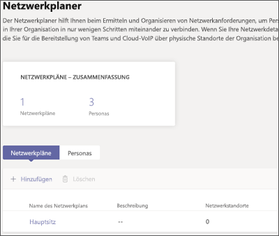
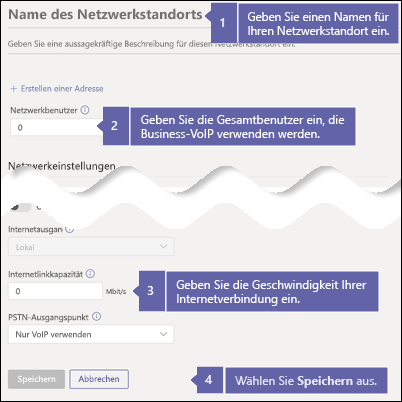
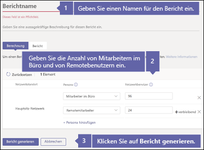
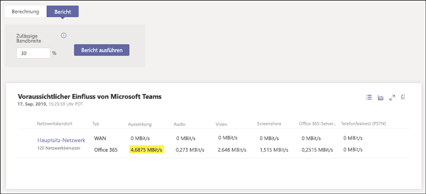

# Überprüfen Ihrer Internetverbindung für Business VoiceCheck your Internet connection for Business Voice

Business Voice befindet sich in der Cloud mit Microsoft 365.Business Voice is located in the cloud with Microsoft 365. Für jeden Computer und jedes Gerät, auf dem Microsoft Teams und Business Voice verwendet werden, ist eine Verbindung mit dem Internet erforderlich.Every device that uses Microsoft Teams and Business Voice needs a connection to the Internet.

Um Business Voice optimal nutzen zu können, benötigen Sie eine Breitband-Internetverbindung, die die maximale Anzahl von gleichzeitig in Ihrer Organisation ausgeführten Telefonanrufen unterstützt.To get the best Business Voice experience, you need a broadband Internet connection that can support the maximum number of phone calls that your organization might make at any one time. Außerdem müssen Sie sicherstellen, dass die Computer in Ihrem Netzwerk auf Microsoft 365-Server zugreifen können.You also need to make sure that the computers on your network can reach Microsoft 365 servers.

Um diese Schritte auszuführen, müssen Sie über einen Mandanten mit einem der folgenden Abonnements verfügen:To follow these steps, you need to have a tenant with one of the following subscriptions:

* Microsoft 365 Business BasicMicrosoft 365 Business Basic
* Microsoft 365 Business StandardMicrosoft 365 Business Standard
* Office 365 E1Office 365 E1
* Office 365 E3Office 365 E3
* Office 365 F1Office 365 F1
* Microsoft 365 A1Microsoft 365 A1
* Microsoft 365 A3Microsoft 365 A3
* Microsoft 365 E3Microsoft 365 E3
* Microsoft 365 BusinessMicrosoft 365 Business

Sie benötigen keine Business Voice-Lizenz, um diese Schritte ausführen zu können.You don't need a Business Voice license to follow these steps.

## Überprüfen der Geschwindigkeit Ihrer InternetverbindungCheck your Internet connection speed

Dieser Artikel hilft Ihnen zu ermitteln, ob Ihre Internetverbindung schnell genug für die Anzahl der Personen ist, die in der Lage sein müssen, Telefonanrufe zu tätigen und Videokonferenzen zu hosten.This article helps determine whether your Internet connection is fast enough for the number of people who need to make phone calls and host video conferences. Sie geben bestimmte Informationen zu Ihrer Organisation ein und erhalten einen Bericht, der angibt, welcher Anteil Ihrer Internetverbindung von Microsoft Teams und Business Voice verwendet wird.You'll provide information about your organization and get back a report that shows how much of your Internet connection will be used by Teams and Business Voice.

### Sammeln von Informationen zu Ihrer Internetverbindung und den BenutzernGather information about your Internet connection and users

Bevor Sie beginnen, benötigen Sie die folgenden Informationen:Before you start, you need the following information:

* Die Geschwindigkeit Ihrer InternetverbindungThe speed of your Internet connection
* Wie viele Personen Business Voice überwiegend aus Ihrem Büro nutzen werdenHow many people will use Business Voice mainly from your office
* Wie viele Personen Business Voice überwiegend von einem Remotestandort aus verwenden werden, z. B. in einem Home-OfficeHow many people will use Business Voice mainly from a remote location, such as a home office

### Eingeben Ihrer Informationen in den NetzwerkplanerEnter your information into the network planner

Führen Sie die folgenden Schritte aus:Follow these steps:

1. Gehen Sie in einem Browser zu https://admin.teams.microsoft.com.In a browser, go to https://admin.teams.microsoft.com. Melden Sie sich mit einem Konto an, das über die Berechtigungen eines globalen Administrators verfügt.Sign in by using an account that has Global Administrator permissions. Das Konto, mit dem Sie sich bei Office 365 registriert haben, verfügt über diese Berechtigungen.The account that you used to sign up for Office 365 has these permissions.
2. Öffnen Sie **Planung** und dann **Netzwerkplaner** aus.Open **Planning** and select **Network planner**.
3. Wählen Sie unter **Netzwerkpläne** die Option **Hinzufügen** aus.Under **Network plans**, select **Add**. Weisen Sie Ihrem Plan einen Namen zu, und wählen Sie dann **Übernehmen** aus.Enter a name for your plan, and then select **Apply**. Ihr Netzwerkplan sollte wie folgt aussehen:Your network plan should look like this:

    
1. Wählen Sie den Namen Ihres Netzwerkplans aus.Select the name of your network plan. (Es entspricht **Hauptsitz** im vorhergehenden Bild.)(It's **Main office** in the preceding picture.)
2. Wählen Sie auf der nächsten Seite auf der Registerkarte **Netzwerkstandorte** die Option **Netzwerkstandort hinzufügen** aus.On the next page, select **Add a network site** on the **Network sites** tab.
3. Füllen Sie nur die im folgenden Screenshot angegebenen Felder aus, und wählen Sie dann **Speichern**.Fill in only the fields that are indicated in the following screenshot, and then select **Save**. Lassen Sie die anderen Felder auf diesem Bildschirm leer, und wählen Sie weder die Option **ExpressRoute** noch die Option **Verbunden mit WAN** aus.Leave the other fields on this screen blank, and don't select the **ExpressRoute** or **Connected to WAN** options.

    
1. Wählen Sie auf der Registerkarte **Bericht** die Option **Bericht starten** aus.On the **Report** tab, select **Start a report**.
1. Geben Sie die folgenden Informationen ein, und wählen Sie dann **Bericht erstellen** aus, um einen Bericht mit den Bandbreitenanforderungen für Microsoft Teams zu erstellen.Enter the following information, and then select **Generate report** to create a report that shows the bandwidth requirements for Teams. Im nächsten Abschnitt wird beschrieben, wie Sie den Bericht lesen.We show you how to read the report in the next section.

    

### Ermitteln der Mindestgeschwindigkeit Ihrer InternetverbindungFind your minimum Internet connection speed

Wenn Sie **Bericht generieren** auswählen, erstellt Office 365 einen Bericht, der wie folgt aussieht:When you select **Generate report**, Office 365 creates a report that looks like this:

Die hervorgehobene Zahl gibt an, welcher Anteil ihrer Internetverbindung von Teams und Business Voice verwendet wird.The highlighted number shows how much of your Internet connection Teams and Business Voice will use. Wir empfehlen, dass dieser Wert nicht mehr als 30 % der Gesamtgeschwindigkeit der Internetverbindung ausmacht.We recommend that this number is no more than 30 percent of your total Internet connection speed. Wenn Ihre Internetverbindung z. B. 60 MBit/s beträgt, sollten auf Microsoft Teams und Business Voice nicht mehr als 18 MBit/s entfallen.For example, if your Internet connection is 60 Mbps, Teams and Business Voice should use no more than 18 Mbps.

Verwenden Sie diese Gleichung zur Ermittlung Ihrer Mindest-Verbindungsgeschwindigkeit: *\<hervorgehobene Zahl> / 0,3*.Use this equation to determine your minimum Internet connection speed: *\<highlighted number> / 0.3*. Mit der im vorherigen Bild hervorgehobenen Zahl lautet die Berechnung *4,6875 / 0,3 = 15,6*.With the number that's highlighted in the preceding image, the calculation is *4.6875 / 0.3 = 15.6*. In diesem Fall sollte sich die Geschwindigkeit der Internetverbindung auf mindestens 15,6 MBit/s belaufen.In this case, the Internet connection speed should be at least 15.6 Mbps.

Wenn auf Teams und Business Voice mehr als 30 % der Gesamtgeschwindigkeit Ihrer Internetverbindung entfallen, wird die hervorgehobene Zahl rot angezeigt.If Teams and Business Voice will use more than 30 percent of your total Internet connection speed, the highlighted number will appear red. In diesem Fall müssen Sie möglicherweise ein Upgrade Ihrer Internetverbindung durchführen.In that case, you may need to upgrade your Internet connection.

## Feststellen, ob Computer und Geräte in Ihrem Netzwerk Microsoft 365 erreichen könnenMake sure the computers and devices on your network can reach Microsoft 365

Computer und Geräte, die Business Voice verwenden, müssen bestimmte Netzwerkports für die Kommunikation mit Microsoft 365-Servern verwenden.Computers and devices that use Business Voice must use specific network ports to communicate with Microsoft 365 servers. Diese Netzwerkports sind im Wesentlichen Türen, durch die Geräte in einem Netzwerk oder über das Internet miteinander kommunizieren können.These ports are essentially doors through which devices talk to each other over a network or the Internet. Ihre Firewall muss zulassen, dass die Geräte in Ihrem Netzwerk Microsoft 365 über die folgenden *ausgehenden* Netzwerkports erreichen können:Your firewall needs to allow devices on your network to reach Microsoft 365 through the following *outbound* network ports:

* **TCP-Ports** 80 und 443**TCP ports** 80 and 443
* **UDP-Ports** 3478, 3479, 3480 und 3481**UDP ports** 3478, 3479, 3480, and 3481

Die einfachste Möglichkeit, um zu überprüfen, ob Ihre Firewall die Kommunikation über diese Netzwerkports zulässt, besteht darin, einen Testanruf in Microsoft Teams durchzuführen.The easiest way to check whether your firewall allows communication on these network ports is to make a test call in Teams:

1. Wechseln Sie zu https://aka.ms/getteams auf einem Computer in Ihrem Netzwerk, und installieren Sie Microsoft Teams.Go to https://aka.ms/getteams on a computer on your network and install Teams. Vergewissern Sie sich, dass der Computer über Lautsprecher und ein Mikrofon verfügt.Make sure that the computer has speakers and a microphone.
2. Öffnen Sie Microsoft Teams und melden Sie sich mit einem Microsoft 365-Konto an.Open Teams and sign in by using a Microsoft 365 account.
3. Wählen Sie in Teams Ihr Profilbild aus, und gehen Sie dann zu **Einstellungen** > **Geräte**.In Teams, select your profile picture, and then go to **Settings** > **Devices**.
4. Wählen Sie unter **Audiogeräte** die Option **Testanruf führen** aus.Under **Audio devices**, select **Make a test call**.
5. Führen Sie die Schritte aus, um eine Nachricht zu hinterlassen und diese abzuspielen.Follow the steps to leave a message and have it played back to you.

   * Wenn der Anruf eine Verbindung herstellt und Sie Ihre Nachricht hören können, ist Ihre Firewall ordnungsgemäß eingerichtet.If the call connects and you hear your message, your firewall is set up correctly.
   * Wenn der Anruf eine Verbindung herstellt, Sie aber die Anweisungen nicht hören oder die Nachricht nicht wiedergegeben wird, überprüfen Sie, ob Ihre Lautsprecher und das Mikrofon ordnungsgemäß eingerichtet sind und vom Computer erkannt werden. Versuchen Sie es anschließend erneut.If the call connects, but you can't hear the instructions or your message, make sure that your speakers and microphone are set up correctly, and then try again.
   * Wenn der Anruf keine Verbindung herstellt oder wenn die Verbindung hergestellt wird, Sie aber die Wiedergabe der Nachricht nicht hören, müssen Sie Ihre Firewall möglicherweise so aktualisieren, dass sie den Zugang zu den oben aufgeführten Netzwerkports zulässt.If the call doesn't connect or it connects but you can't hear your message, you might need to update your firewall to allow access to the required network ports. Sehen Sie in der Dokumentation zu Ihrer Firewall nach, oder wenden Sie sich an einen IT-Spezialisten.Check your firewall's documentation, or contact an IT specialist for help.

 Wenn Sie ein IT-Experte sind und weitere Informationen zur Vorbereitung größerer oder komplexerer Netzwerke für die Unterstützung von Business Voice benötigen, schauen Sie sich [Bewerten der Umgebung](../3-envision-evaluate-my-environment.md) an.If you're an IT professional and want more information about how to prepare larger or more complex networks to support Business Voice, see [Evaluate my environment](../3-envision-evaluate-my-environment.md). In diesem Artikel finden Sie weitere Informationen zu den Anforderungen für Bandbreite, Proxy und Firewall sowie zum Testen Ihres Netzwerks mithilfe des [Netzwerkbewertungstools](../3-envision-evaluate-my-environment.md#test-the-network).This article provides information about bandwidth, proxy and firewall requirements, and how to use the [Network Assessment Tool](../3-envision-evaluate-my-environment.md#test-the-network) to test your network.

