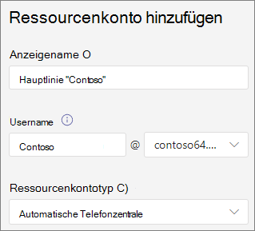

# Schritt 4: Einrichten eines Business Voice-Ressourcenkontos

In Microsoft Teams ist für jede automatische Telefonkonferenz oder Anrufwarteschlange ein Ressourcenkonto erforderlich. Ressourcenkonten können auch Diensttelefonnummern zugewiesen werden. Auf diese Weise weisen Sie automatischen Telefonkonferenzen und Anrufwarteschlangen Telefonnummern zu, sodass Anrufer von außerhalb Teams die automatische Telefonkonferenz oder Anrufwarteschlange erreichen können.

## Abrufen virtueller Benutzerlizenzen

Ressourcenkonten erfordern eine Lizenz, um mit automatischen Telefonanten und Anrufwarteschlangen arbeiten zu können. Sie können eine kostenlose Microsoft 365 Telefonsystem *- Virtual User-Lizenz* verwenden.

1. Melden Sie sich beim Microsoft 365 Admin Center an.
2. Wechseln Sie **zu**  >  **Abrechnungskaufdienste-Add-Ons**  >    >  **Alle Add-Ons-Produkte sehen**
3. Scrollen Sie bis zum Ende, um die **Microsoft 365 Telefonsystem – Virtual User-Lizenz zu** finden. Wählen **Sie Details** und dann Kaufen **aus.**
4. Wählen Sie auf der Seite Lizenzkauf die Anzahl der virtuellen Benutzerlizenzen aus, die Sie benötigen. Sie benötigen eine virtuelle Lizenz für jede automatische Telefonkonferenz und Anrufwarteschlange, die Sie einrichten möchten. Es wird empfohlen, mindestens fünf Lizenzen zu wählen, damit Sie in Zukunft problemlos mehr automatische Telefonwarteschlangen und Anrufwarteschlangen einrichten können, ohne sofort weitere Lizenzen erwerben zu müssen.
5. Deaktivieren Sie **Automatisches Zuweisen für alle Benutzer ohne Lizenzen.**
6. Wählen **Sie Jetzt auschecken aus.**
7. Bestätigen Sie Ihre Bestellung, wählen **Sie Weiter** und dann Bestellung **platzieren aus.**

> [!NOTE]
> Denken Sie daran, dass  **Sie** die Lizenz trotzdem kaufen müssen, obwohl die Kosten gleich null sind.

## Erstellen eines Ressourcenkontos

Nachdem Sie Ihre Lizenz für *"Microsoft 365 Telefonsystem – Virtueller Benutzer"* erhalten haben, können Sie Ihr Ressourcenkonto erstellen.

1. Erweitern Sie im Teams Admin Center **organisationsweite** Einstellungen, und klicken Sie dann **auf Ressourcenkonten**.
2. Klicken Sie auf **Hinzufügen**.
3. Füllen Sie **im Bereich Ressourcenkonto** hinzufügen **den Anzeigenamen** und dann Benutzername **aus.** Wählen Sie einen beschreibenden Anzeigenamen wie "automatische Hauptleitungswarte" aus, um den Zweck des Ressourcenkontos zu beschreiben.
4. Wählen **Sie unter Ressourcenkontotyp** die Option **Automatische Attendant aus.**
5. Klicken Sie auf **Speichern**.

## Zuweisen einer Lizenz

Nachdem Sie Ihr Ressourcenkonto erstellt haben, müssen Sie eine *Microsoft 365 Telefonsystem - Virtual User-Lizenz* oder eine Telefonsystem *zuweisen.*

1. Wechseln Sie Microsoft 365 Admin Center zu **Aktive Benutzer**  >  **.**
2. Wählen Sie Ihr Ressourcenkonto aus.
1. Wählen Sie **auf der Registerkarte** Lizenzen und Apps unter **Lizenzen** die Option Microsoft 365 Telefonsystem **– Virtueller Benutzer aus.**
1. Wählen **Sie Änderungen speichern** und dann Schließen **aus.**

## Zuweisen einer Dienstnummer

1. Wechseln Sie Teams Admin Center zu **Organisationsweite Einstellungen** und dann **Ressourcenkonten.** 
1. Wählen Sie das gerade erstellte Ressourcenkonto aus, und klicken Sie dann auf **Zuweisen/Zuweisen.**
1. Wählen Sie **in Telefon Dropdownliste Nummertyp** die Option **Online aus.**
1. Suchen Sie **im Feld Zugewiesene** Telefonnummer nach der Zu verwendende Nummer, und klicken Sie auf **Hinzufügen.** Geben Sie unbedingt die Ländercode ein (z. B. **+1** 250 555 0012).
1. Klicken Sie auf **Speichern**.
    > [!NOTE]
    > Sie müssen unter Zuweisen zu keine  automatische Attendant auswählen, da die automatische Attendant, der Sie die Nummer hinzufügen möchten, bereits ausgewählt ist.

> [!div class="nextstepaction"]
> [Nächster Schritt: Zuweisen von Telefonnummern zu Ihren Benutzern](set-up-assign-numbers.md)
