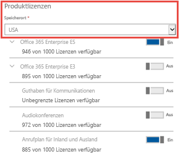
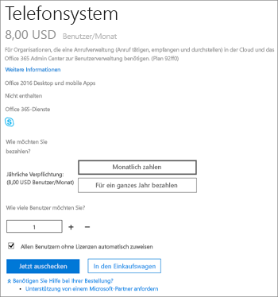

# Anrufpläne für Microsoft 365

Anrufe an andere Skype for Business-und Microsoft Teams-Nutzer sind kostenlos, aber wenn Sie möchten, dass Ihre Benutzer normale Telefone anrufen können, und Sie noch keinen Dienstanbieter für Sprachanrufe haben, müssen Sie einen Anrufplan kaufen. Weitere Informationen finden Sie unter [Telefon System und Anrufpläne](calling-plan-landing-page.md).
  
Hier sind die Optionen für Anrufpläne:
  
- **Plan für Inlandsanrufe**: lizenzierte Benutzer können Nummern in dem Land/der Region anrufen, in dem Sie in Microsoft 365 oder Office 365 zugewiesen sind.
    
- **Plan für Inlands-und Auslandsanrufe**: lizenzierte Benutzer können Nummern in dem Land/der Region anrufen, in dem die Microsoft 365-oder Office 365-Lizenz dem Benutzer basierend auf dem Standort des Benutzers und internationalen Nummern in [196 Ländern/Regionen](country-and-region-availability-for-audio-conferencing-and-calling-plans/users-can-make-outbound-calls-to-these-countries-and-regions.md)zugewiesen ist.
    
Besuchen Sie die [Verfügbarkeit von Ländern und Regionen](country-and-region-availability-for-audio-conferencing-and-calling-plans/country-and-region-availability-for-audio-conferencing-and-calling-plans.md) , um zu erfahren, welche monatlichen Minuten für jede Organisation in jedem Land/jeder Region zur Verfügung stehen.
  
> [!IMPORTANT]
> Das Land/die Region basiert auf dem Standort der Benutzerlizenz in den aktiven Benutzern **des Microsoft 365 admin Centers**  >  **Active users** und **nicht** auf der Rechnungsadresse, die unter dem **Organisationsprofil** im **Microsoft 365 Admin Center**aufgeführt ist.   

  
Detaillierte Informationen zu den Nutzungsbeschränkungen und Nutzungsbestimmungen finden Sie unter [Kostenlose Dial-Out-Zeiten für Audiokonferenzen](complimentary-dial-out-period.md).
  
## So erwerben Sie einen Anrufplan

1. <strong>Sie müssen zunächst eine * * Phone System</strong> -Add-on-Lizenz kaufen<strong>. Wenn Sie dies tun möchten, [müssen Sie sich beim Microsoft 365 Admin Center anmelden und die](https://portal.office.com/adminportal/home?add=sub&amp;adminportal=1#/catalog) Option * * Abrechnungs</strong>  >  **Kauf Services**  >  **-Add-on-Abonnements**  >  **Jetzt kaufen**auswählen.
    
    
  
    > [!NOTE]
    > Je nach Plan müssen Sie möglicherweise weitere Add-ons kaufen, bevor Sie Telefon System Lizenzen kaufen können. Weitere Informationen finden Sie unter [Lizenzierung für Microsoft Teams-Add-On](https://docs.microsoft.com/microsoftteams/teams-add-on-licensing/microsoft-teams-add-on-licensing).
  
2. Nachdem Sie die Telefon System Lizenzen gekauft haben, können Sie den Anrufplan kaufen, indem Sie sich beim **Microsoft 365 Admin Center**anmelden, Abonnements für das **Abrechnungs**  >  **Kauf Services**  >  **-Add-on**auswählen und dann auf **Jetzt kaufen**klicken. Dort sehen Sie die Anrufpläne.
    
    
  
Sie können abhängig von den Anforderungen Ihrer Organisation verschiedene Anrufpläne für verschiedene Benutzer kaufen und zuweisen. Nachdem Sie den gewünschten Anrufplan ausgewählt haben, fahren Sie mit Checkout fort. Sie weisen jedem Benutzer im Microsoft 365 Admin Center einen Plan zu. Informationen dazu finden Sie unter [Zuweisen von Microsoft Teams-Add-on-Lizenzen](https://docs.microsoft.com/microsoftteams/teams-add-on-licensing/microsoft-teams-add-on-licensing).
  
## Verfügen Sie über einen Dienstanbieter, der lokale PSTN-Konnektivität für Hybrid Benutzer bereitstellt?

Wenn dies der Fall ist, müssen Sie keinen Tarif für Anrufe kaufen. Office 365 Enterprise E5 enthält das **Telefon System** -Add-on, damit Sie zur Kasse gehen können.
  
Weisen Sie anschließend den Benutzern im Microsoft 365 Admin Center die Enterprise E5-oder **Phone System** -Add-on-Lizenzen zu. Informationen dazu finden Sie unter [Zuweisen von Microsoft Teams-Add-on-Lizenzen](https://docs.microsoft.com/microsoftteams/teams-add-on-licensing/microsoft-teams-add-on-licensing).
  
## Preisinformationen

- [Preise für Anrufpläne](https://go.microsoft.com/fwlink/?LinkId=799761)
    
- [Preise für das Telefonsystem](https://go.microsoft.com/fwlink/?linkid=799763)
    
- [Preise für Audiokonferenzen](https://go.microsoft.com/fwlink/?linkid=799762)
    
## Weitere Informationen

Hier sind weitere Artikel, die erläutern, wie Sie Ihre Anrufpläne einrichten:
  
- [Einrichten von Anrufplänen](set-up-calling-plans.md)
    
- [Lizenzierung für Microsoft Teams-Add-On](https://docs.microsoft.com/microsoftteams/teams-add-on-licensing/microsoft-teams-add-on-licensing)
    
- [So erhalten Sie das Telefon System in Microsoft 365 oder Office 365](https://docs.microsoft.com/MicrosoftTeams/here-s-what-you-get-with-phone-system)
    
   
## Verwandte Themen

- [Einrichten von Skype for Business Online](/SkypeForBusiness/set-up-skype-for-business-online/set-up-skype-for-business-online)
    
- [Einrichten von Cloud-Voicemail – Administratorhilfe](set-up-phone-system-voicemail.md)
    
- [Einrichten von Anrufplänen](set-up-calling-plans.md)
    
- [Hinzufügen und Verwalten von Guthaben für Kommunikationen](add-funds-and-manage-communications-credits.md)
 
