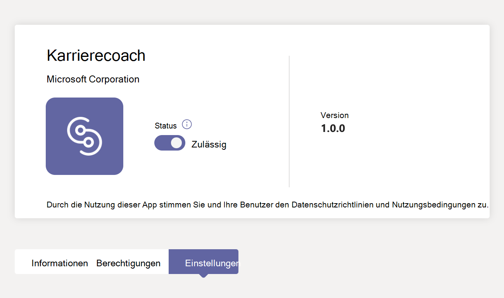
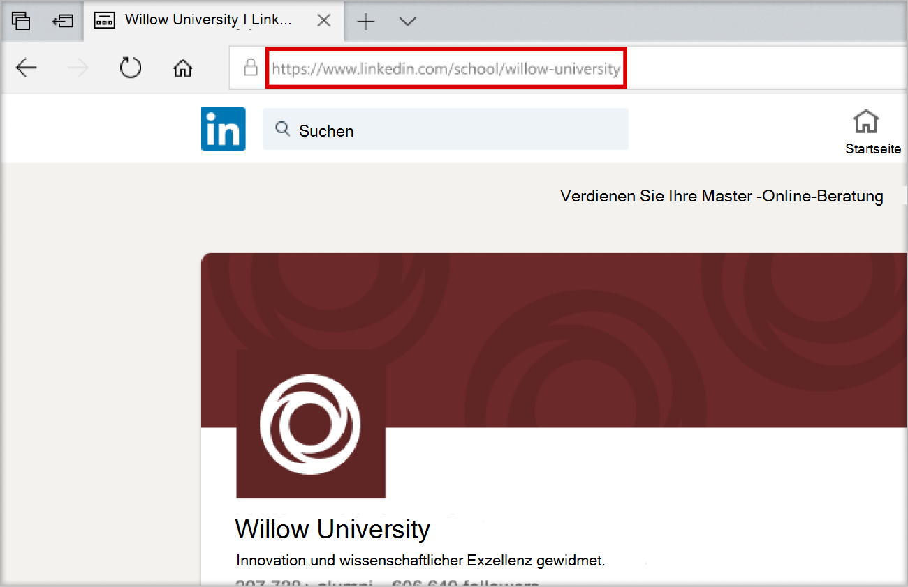
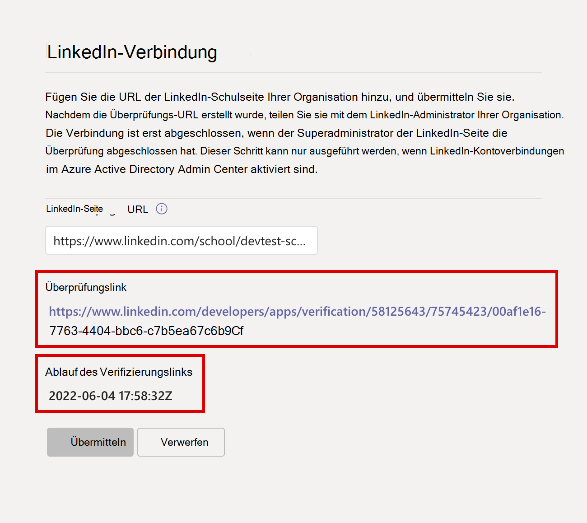
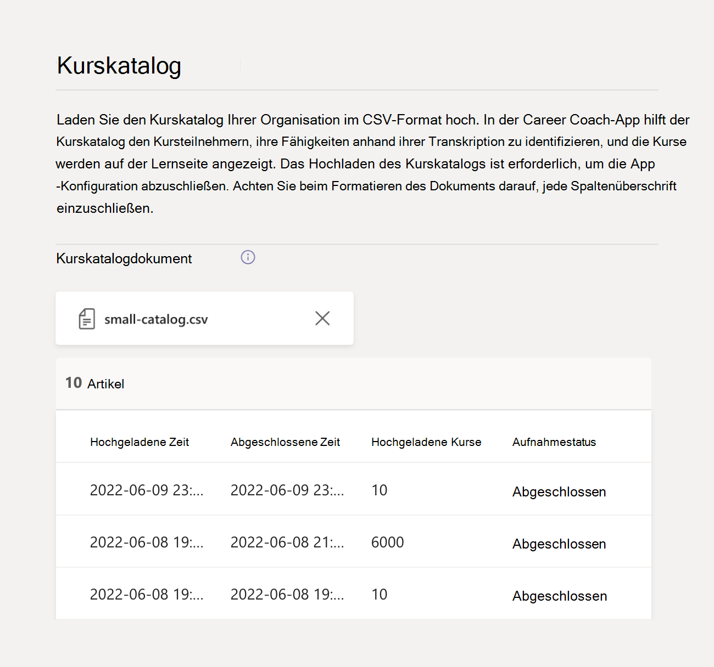

# Erwerben, Konfigurieren und Aktivieren von Career Coach für Microsoft Teams

Career Coach ist eine Microsoft Teams für Education-App, die von LinkedIn unterstützt wird und Hochschulstudenten personalisierte Anleitungen für die Navigation auf ihrer Karrierereise bietet. Career Coach bietet Bildungseinrichtungen eine einheitliche Karrierelösung für Studenten, um ihren Karrierepfad zu entdecken, reale Fähigkeiten zu erweitern und ihr Netzwerk an einem Ort aufzubauen.

## Unterstützte Sprachen

Career Coach ist in den folgenden Sprachen lokalisiert:

- Chinesisch (vereinfacht, Festlandchina)
- Chinesisch (traditionell, Taiwan)
- Englisch (USA)
- Englisch (Großbritannien)
- Französisch (Kanada)
- Französisch (Frankreich)
- Deutsch (Deutschland)
- Japanisch (Japan)
- Portugiesisch (Brasilien)
- Spanisch (Spanien)
- Spanisch (Mexiko)

Erfahren Sie mehr über [Career Coach](https://aka.ms/career-coach).

> [!TIP]
> Verwenden Sie die bewährten Methoden und hilfreichen Tipps in diesem Leitfaden, um die Funktionen von Career Coach für Studierende, Lehrkräfte und Mitarbeiter zu aktivieren. Weitere Informationen finden Sie im Artikel ["Schnellplanungshandbuch"](https://support.microsoft.com/office/c5d0b934-bfcf-4fe7-8a85-ba7bbb1b6ad4) .

## Überprüfen der Anforderungen

Um Career Coach für Ihre Bildungseinrichtung zu aktivieren, überprüfen Sie, was Sie benötigen, um Career Coach in Gang zu bringen.

### Technische Anforderungen

- Office 365 Mandant mit aktivierten LinkedIn-Kontoverbindungen in Azure Active Directory.
- Microsoft Teams.
- LinkedIn School Page.

### Daten und Dateien von Ihrer Bildungseinrichtung

- Logo und grafische Objekte der Bildungseinrichtung [im erforderlichen Format](#brand-and-preferences).

- Kurskatalogdaten. [Beispieldatei](https://aka.ms/career-coach/docs/it-admins/sample-catalog) - und [Dokumentformat](#course-catalog-document-format-and-schema) anzeigen.

- Liste der angebotenen Studienfelder. [Beispieldatei anzeigen](https://aka.ms/career-coach/docs/it-admins/sample-fieldsofstudy).

- [Die LinkedIn School Page-URL](https://www.linkedin.com/help/linkedin/answer/40133/differences-between-a-linkedin-page-for-a-school-and-company?lang=en) der Bildungseinrichtung.

- Datenschutzrichtlinien-URL der Bildungseinrichtung.

- Bildungseinrichtung verweist auf karrierebezogene Ressourcen wie eine Karriere-Service-Website und Stellenausschreibungen für Studierende (optional).

## Prüfliste einrichten

In Vorbereitung auf die Veröffentlichung von Career Coach für Ihren Mandanten gibt es mehrere Administratorrollen, die benötigt werden. Diese Rollen und Berechtigungen können einer Einzelnen zugewiesen werden oder die Zusammenarbeit mit IT-Experten in Ihrer Organisation erfordern. Verwenden Sie diesen Leitfaden, um die Personen zu identifizieren, die zum Ausführen der erforderlichen Aufgaben erforderlich sind.

Sie können die zugewiesenen Rollen Ihres Kontos überprüfen, indem Sie die [Microsoft 365 Admin Center > Benutzer > Aktive Benutzer besuchen](https://go.microsoft.com/fwlink/p/?linkid=834822) > Ihren Benutzernamen auswählen, um Ihre Rolle zu bestätigen.

Weitere Informationen zu [Administratorrollen in der Microsoft 365 Admin Center](/microsoft-365/admin/add-users/about-admin-roles).

### [Microsoft 365 Admin Center](https://go.microsoft.com/fwlink/p/?linkid=2024339)

Rolle: [Globale Administrator](/azure/active-directory/roles/permissions-reference#global-administrator) Career Coach Aufgaben:

- [Lizenzen kaufen](#purchase-career-coach-licenses)
- [Zuweisen von Lizenzen](#assign-career-coach-licenses-to-users)

### [Azure Active Directory Admin Center](https://go.microsoft.com/fwlink/p/?linkid=2067268)

Rolle: [Global Administrator](/azure/active-directory/roles/permissions-reference#global-administrator) Career Coach Aufgabe:

- [Aktivieren von LinkedIn-Kontoverbindungen](#turn-on-linkedin-account-connections)

### [Teams Admin Center](https://admin.teams.microsoft.com/dashboard)

Rolle: [Teams-Administrator](/azure/active-directory/roles/permissions-reference#teams-administrator) Career Coach Aufgaben:

- [Hinzufügen von Career Coach als installierte App](#add-career-coach-as-an-installed-app)
- [Konfigurieren der Einstellungen der Career Coach-App](#configure-career-coach-settings)
  - [Marke und Präferenzen](#brand-and-preferences)  - erforderlich
  - [LinkedIn-Verbindung](#linkedin-connection)  - erforderlich
  - [Kurskatalog](#course-catalog)  - erforderlich
  - [Studiengebiete](#fields-of-study)  - erforderlich
  - [Anpassung](#customization) – optional
- [Setuprichtlinien](#setup-policies-and-pin-the-app)
- [Anheften der App](#setup-policies-and-pin-the-app)

### LinkedIn-Entwicklerportal

Rolle: [LinkedIn School Page Super Admin](https://www.linkedin.com/help/linkedin/answer/a541981) Career Coach Aufgabe:

- [Überprüfen der LinkedIn-Schulseite](#verify-the-linkedin-school-page)

## Erwerben von Career Coach-Lizenzen

### Lizenztypen

Career Coach benötigt eine Lizenz für den Zugriff auf die Anwendung.

Es sind zwei Lizenztypen verfügbar.

- Die **Student-Lizenz** ist für Schüler/Studenten ausgelegt.
- Die **Lehrpersonallizenz** wurde für Lehrkräfte, Mitarbeiter und IT-Experten entwickelt, die an der Unterstützung von Studierenden mit Career Coach beteiligt sind.

> [!IMPORTANT]
> Eine Career Coach **Faculty-Lizenz** muss dem IT-Administrator zugewiesen werden, der die Konfiguration abschließt.

### Lizenzen kaufen

Career Coach ist weltweit (außer China und Russland) für qualifizierte Hochschulen als Add-On-Lizenz über Enrollment for Education Solutions (EES), Cloud Service Providers (CSP) und Microsoft 365 Admin Center (Web Direct) verfügbar.

Als Microsoft Teams-App muss der Mandant über Microsoft 365 A3/A5 oder Office 365 A1/A3/A5 verfügen, um die Lizenz für den Karrierecoach des Add-Ons erwerben zu können. Für Studierende und Lehrkräfte werden separate Lizenzen angeboten.

### Registrieren für eine kostenlose Testversion

Eine standardmäßige kostenlose Testversion von 90 Tagen ist für 25 Studierende und 25 Lehrpersonal-/Mitarbeiterlizenzen verfügbar. Pro berechtigter Mandant ist eine Testversion verfügbar. Testlizenzen können von Microsoft 365 Admin Center durch Mandanten aktiviert werden, die für den Kauf von Career Coach qualifiziert sind.

Melden Sie sich für die Testaktivierung [bei Microsoft 365 Admin Center > Abrechnung > Dienste kaufen > suchen Sie nach Career Coach](https://go.microsoft.com/fwlink/p/?linkid=868433), um die Testversion der [Studentenlizenz](https://signup.microsoft.com/signup?OfferId=b3a40ff2-3d0d-481e-a0ed-f4de1069f201) und die [Lizenz für Lehrkräfte](https://signup.microsoft.com/signup?OfferId=6f6e7db5-b9ab-4baa-86be-f13d0ae6a2c8) zu finden.

## Vorbereitung auf Karrierecoach

### Aktivieren von LinkedIn-Kontoverbindungen

Es gibt zwei Möglichkeiten, wie LinkedIn-Kontoverbindungen von Career Coach verwendet werden.

- Damit Studierende, Lehrkräfte und Mitarbeiter ihr Microsoft 365-Konto mit ihrem LinkedIn-Konto verbinden und [LinkedIn-Einladungen vom Career Coach senden](https://support.microsoft.com/topic/career-coach-quick-start-guide-for-students-c419db47-9290-4961-9684-c3f86a9b3708#bkmk_connect_your_linkedin_account) können.
- So aktivieren Sie die Features ["Netzwerk aufbauen"](https://support.microsoft.com/topic/career-coach-quick-start-guide-for-students-c419db47-9290-4961-9684-c3f86a9b3708#bkmk_build_your_network) und " [Karriere erkunden](https://support.microsoft.com/topic/career-coach-quick-start-guide-for-students-c419db47-9290-4961-9684-c3f86a9b3708#bkmk_discover_your_career_path) " mit öffentlichen Alumni-Daten von LinkedIn.

1. Melden Sie sich mit einem [globalen Administratorkonto](#setup-checklist) für die Azure [AD-Organisation beim Azure AD Admin Center](https://go.microsoft.com/fwlink/p/?linkid=2067268) an.

2. Wählen Sie **"Benutzer**" aus.

3. Wählen Sie auf der Seite **"Benutzer** " **die Option "Benutzereinstellungen"** aus.

4. **LinkedIn-Kontoverbindungen** müssen auf **"Ja** " oder " **Ausgewählte Gruppe** " festgelegt sein, damit Career Coach ordnungsgemäß konfiguriert ist.

   - Wählen Sie **"Ja** " aus, um den Dienst für alle Benutzer in Ihrer Bildungseinrichtung zu aktivieren.
   - Wählen Sie **"Ausgewählte Gruppe** " aus, um den Dienst nur für eine Gruppe ausgewählter Benutzer in Ihrer Bildungseinrichtung zu aktivieren.

Weitere Informationen finden Sie [unter LinkedIn-Kontoverbindungen in Azure Active Directory](/azure/active-directory/enterprise-users/linkedin-integration).

> [!NOTE]
> Ohne Zustimmung des Benutzers werden keine Daten freigegeben.

### Zulassen von Microsoft-Apps in Teams

Career Coach ist eine Microsoft-Anwendung und muss daher in Den Teams-App-Berechtigungsrichtlinien zulässig sein.

1. Melden Sie sich beim **[Teams Admin Center](https://admin.teams.microsoft.com)** an.

2. Wählen Sie im linken Navigationsbereich die **[Berechtigungsrichtlinien](https://admin.teams.microsoft.com/policies/manage-apps)** für **Teams-Apps** >  aus.

3. Wählen Sie Ihre bevorzugte Richtlinie aus.
    1. Wenn Sie nicht sicher sind, welche Richtlinie sie verwenden soll, lesen Sie die [Microsoft Teams-Richtlinienverwaltungsdokumentation](policy-packages-edu.md) , oder verwenden Sie den Assistenten  für [Education-Richtlinien](easy-policy-setup-edu.md), um eine Richtlinie für Microsoft Teams zu konfigurieren.

Weitere Informationen zum [Konfigurieren von Berechtigungsrichtlinien](teams-app-permission-policies.md).

### Hinzufügen von Career Coach als installierte App

Mit diesem Schritt wird sichergestellt, dass Career Coach für Ihre Organisation ordnungsgemäß konfiguriert ist und die Schüler/Studenten Career Coach finden.

1. Melden Sie sich beim [Teams Admin Center](https://go.microsoft.com/fwlink/p/?linkid=2066851) an.

2. Wählen Sie **Setuprichtlinien** für **Teams-Apps** > und dann Ihre bevorzugte Richtlinie aus.
    1. Wenn Sie nicht sicher sind, welche Richtlinie sie verwenden soll, lesen Sie die [Microsoft Teams-Richtlinienverwaltungsdokumentation](policy-packages-edu.md) , oder verwenden Sie den Assistenten  für [Education-Richtlinien](easy-policy-setup-edu.md), um eine Richtlinie für Microsoft Teams zu konfigurieren.

3. Wählen Sie unter **"Installierte Apps**"  **die Option "Apps hinzufügen"** aus.

4. Suchen Sie im Bereich " **Installierte Apps hinzufügen** " nach den Apps, die Sie automatisch für Benutzer installieren möchten, wenn sie Teams starten. Sie können Apps auch nach App-Berechtigungsrichtlinie filtern.

5. Wenn Sie Ihre Liste der Apps ausgewählt haben, wählen Sie **"Hinzufügen"** aus.

6. Wählen Sie "**Speichern bestätigen"**  **aus** > .

> [!NOTE]
> Das Bearbeiten oder Zuweisen einer Richtlinie kann einige Stunden dauern, bis Änderungen wirksam werden. Der Karrierecoach ist erst in Microsoft Teams verfügbar, wenn die Änderungen abgeschlossen sind.

## Konfigurieren von Einstellungen für karrierecoachs

### Zugreifen auf die Einstellungen der Career Coach-App

Um Career Coach-Einstellungen zu konfigurieren und für Benutzer zu aktivieren, müssen Sie ein globaler Administrator oder Teams-Dienstadministrator sein, um auf die Seite zugreifen zu können.

1. Melden Sie sich beim [Teams Admin Center](https://go.microsoft.com/fwlink/p/?linkid=2066851) an.
2. Wählen Sie im linken Navigationsbereich **die Option "Teams-Apps** > **verwalten**" aus.
3. Suchen oder suchen Sie nach **Career Coach**.
4. Wählen Sie **"Karrierecoach**" und dann **"Einstellungen"** aus.

### Konfigurationskategorien für Karrierecoachs

Um Career Coach für Studierende, Lehrkräfte und Mitarbeiter effektiv zu aktivieren, sind die folgenden Einstellungen erforderlich:

- [Marke und Präferenzen](#brand-and-preferences)
- [LinkedIn-Verbindung](#linkedin-connection)
- [Kurskatalog](#course-catalog)
- [Studiengebiete](#fields-of-study)

Sie können auch optionale [Anpassungseinstellungen](#customization) festlegen.

> [!TIP]
> Navigieren Sie schnell von einer Kategorie zu einer anderen, indem Sie den **Career Coach-Pfad** oben auf der Seite im Format `Manage apps\Career Coach\Setting label`auswählen.

### Marke und Präferenzen

Passen Sie Career Coach an die Marke Ihrer Bildungseinrichtung an. Sie sind dafür verantwortlich, die Rechte anderer Personen zu respektieren, einschließlich des Urheberrechts und der Markenrechte.

> [!IMPORTANT]
> Dies ist ein erforderlicher Abschnitt. Career Coach kann nicht aktiviert werden, ohne **dass "Marke" und "Präferenzen"** übermittelt werden.

1. Melden Sie sich beim **[Teams Admin Center](https://go.microsoft.com/fwlink/p/?linkid=2066851)** an.

2. Auswählen von **Teams-Apps** > **Verwalten von Apps** > **Karrierecoacheinstellungen** >  > **Marke und Einstellungen bearbeiten**.

3. Fügen Sie unter **"Branding**" **den Namen der Organisation hinzu**.

4. Laden Sie das **Symbol "Organisation" hoch**. Das Symbol wird im gesamten Career Coach verwendet, um inhalte zu identifizieren, die für Ihre Bildungseinrichtung eindeutig sind, Kurskatalogressourcen in der gesamten App und im Abschnitt "Reale Erfahrungen" des Dashboards.

    Das Symbol ist am besten formatiert als:

    - Ein transparentes PNG
    - Seitenverhältnis von 1:1
    - Maximale Größe von 64 px x 64 px

5. Laden Sie die **Miniaturansicht des Lerninhalts hoch**. Die Miniaturansicht wird für Kurskatalog-Lernressourcen in der gesamten App verwendet, wenn für einen Kurs, der von Ihrer Bildungseinrichtung angeboten wird, kein bestimmtes Bild angegeben wird.

    Die Miniaturansicht ist am besten formatiert als:

    - A PNG
    - Seitenverhältnis von 16:9
    - Maximale Größe von 360 px x 200 px

6. Fügen Sie die **URL der Datenschutzrichtlinie der Organisation hinzu**. Wenn diese hinzugefügt werden, steht die Datenschutzrichtlinie der Bildungseinrichtung den Kursteilnehmern zur Überprüfung im Career Coach zur Verfügung.

7. Wählen Sie **"Absenden" aus**.

8. Um zu bestätigen, dass die Einstellungen erfolgreich übermittelt wurden, überprüfen Sie den [Konfigurationsstatus des Karrierecoachs](#configuration-status) auf **"Abgeschlossen**".

### LinkedIn-Verbindung

Die LinkedIn-Verbindungseinstellung verbindet Career Coach mit öffentlichen Alumni-Daten von der LinkedIn School Page Ihrer Bildungseinrichtung.

Dieser Schritt kann nur ausgeführt werden, wenn [LinkedIn-Kontoverbindungen in Azure Active Directory aktiviert sind](#turn-on-linkedin-account-connections). Die LinkedIn-Verbindungseinstellung aktiviert die Features ["Netzwerk erstellen"](https://support.microsoft.com/topic/career-coach-quick-start-guide-for-students-c419db47-9290-4961-9684-c3f86a9b3708#bkmk_build_your_network) und ["Karriere erkunden](https://support.microsoft.com/topic/career-coach-quick-start-guide-for-students-c419db47-9290-4961-9684-c3f86a9b3708#bkmk_discover_your_career_path) ".

> [!IMPORTANT]
> Dies ist ein erforderlicher Abschnitt. Career Coach kann nicht aktiviert werden, ohne dass die LinkedIn School Page-Verbindung überprüft wurde.

#### Hinzufügen der LinkedIn-Schulseiten-URL

Der Vorgang zum Hinzufügen der LinkedIn School Page-URL wird von einem Teams-Administrator behandelt. Der nachfolgende Schritt zur Überprüfung der URL wird vom LinkedIn School Page Super-Administrator Ihrer Bildungseinrichtung abgeschlossen.

1. Melden Sie sich beim **[Teams Admin Center](https://go.microsoft.com/fwlink/p/?linkid=2066851)** an.

2. Auswählen von **Teams-Apps** > **Verwalten von Apps** > **Karrierecoacheinstellungen** >  > **LinkedIn-Verbindung**.

3. Wählen Sie **"Mit LinkedIn verbinden**" aus.

4. Suchen Sie die LinkedIn School Page Ihrer Bildungseinrichtung, indem Sie nach LinkedIn suchen **und den** Schulfilter auswählen. Oder stellen Sie eine Verbindung mit einem Marketingmitarbeiter in Ihrer Einrichtung her, um die richtige LinkedIn-Schulseite zu ermitteln. Weitere Informationen finden Sie unter [Identifizieren von LinkedIn-Seiten](https://www.linkedin.com/help/linkedin/answer/40133/differences-between-a-linkedin-page-for-a-school-and-company?lang=en).

    

5. Fügen Sie die **LinkedIn School Page-URL hinzu**. Die URL muss eine *Schulseite* und keine *Unternehmensseite* sein und ist in der Regel als `https://www.linkedin.com/school/willow-university/`formatiert.

   

6. Wählen Sie **"Absenden" aus**.

7. Nachdem die **LinkedIn School Page-URL** erfolgreich übermittelt wurde, wird die Einstellungsseite aktualisiert, um den  **Überprüfungslink** und den  **Ablauf des Verifizierungslinks** anzuzeigen. Der Überprüfungslink läuft nach 30 Tagen ab.

8. Kopieren Sie den **Link "Überprüfung"** , und teilen Sie ihn mit dem LinkedIn School Page Super-Administrator Ihrer Bildungseinrichtung.

9. Der LinkedIn School Page Super-Administrator verwendet den eindeutigen Überprüfungslink, um [die LinkedIn School-Seite zu überprüfen](#verify-the-linkedin-school-page) und mit Career Coach zu verknüpfen.

10. Um zu bestätigen, dass die Überprüfung und die Einstellungen erfolgreich übermittelt wurden, überprüfen Sie, ob der [Career Coach-Konfigurationsstatus](#configuration-status) als **abgeschlossen** markiert ist.

#### Überprüfen der LinkedIn-Schulseite

Die LinkedIn School Page-Überprüfung muss vom [LinkedIn School Page Super-Administrator](https://www.linkedin.com/help/linkedin/answer/a541981) Ihrer Bildungseinrichtung abgeschlossen werden.

Sie können die Administratorrollen Ihres LinkedIn-Kontos überprüfen, indem Sie sich bei LinkedIn anmelden und die LinkedIn-Schulseite Ihrer Bildungseinrichtung besuchen. Wenn Ihrem Konto eine Superadministratorrolle zugewiesen ist, wird auf der LinkedIn-Seite die **Ansicht "Superadministrator"** neben dem Namen Ihrer Bildungseinrichtung aufgeführt. Wenn das **Ansichtstag "Super-Administrator** " nicht angezeigt wird, sind Sie kein Superadministrator für die Seite Ihrer Schule.

1. Nachdem die **LinkedIn School Page-URL** vom Teams-Administrator übermittelt wurde, wird auf der Seite der **Überprüfungslink** und der **Ablauf des Verifizierungslinks** angezeigt. Der Überprüfungslink läuft nach 30 Tagen ab.

     

2. Kopieren Sie den Überprüfungslink, und teilen Sie ihn mit Ihrem LinkedIn School Page Super-Administrator.

3. Die LinkedIn-Seite "Super admin" öffnet den Verifizierungslink, um Career Coach der Seite Ihrer Bildungseinrichtung zuzuordnen. Weitere Informationen finden Sie [in der zusätzlichen Dokumentation zur LinkedIn-Seitenüberprüfung](https://www.linkedin.com/help/linkedin/answer/102672).

4. Sobald die Überprüfung abgeschlossen ist, kann der Teams-Administrator anzeigen, ob die Einstellungen erfolgreich übermittelt wurden, indem er überprüft, ob der [Konfigurationsstatus des Karrierecoachs](#configuration-status) als **abgeschlossen** markiert ist.

   

### Kurskatalog

Der Kurskatalog zeichnet die Kurse und Kurse auf, die von Ihrer Bildungseinrichtung angeboten werden.

Career Coach verwendet Kurskatalogdaten, um die Fähigkeiten eines Kursteilnehmers anhand seiner Transkription zu identifizieren und Kurse vorzuschlagen, die er belegen soll.

> [!IMPORTANT]
> Dies ist ein erforderlicher Abschnitt. Career Coach kann ohne einen Kurskatalog nicht aktiviert werden.

Diese Kurse werden innerhalb von Career Coach in zwei Bereichen eingesetzt:

- Kurse werden als Teil der [Lernressourcen](https://support.microsoft.com/topic/career-coach-quick-start-guide-for-students-c419db47-9290-4961-9684-c3f86a9b3708#bkmk_grow_real_world_skills) zurückgegeben.  

- Kurse und Kursmetadaten, z. B. Kurstitel und -beschreibungen, werden verwendet, um den Kursteilnehmern zu helfen, ihre Fähigkeiten beim [Hochladen eines Transkripts](https://support.microsoft.com/topic/career-coach-quick-start-guide-for-students-c419db47-9290-4961-9684-c3f86a9b3708#bkmk_Set_up_your_profile) zu identifizieren.

Um den Kurskatalog zu erstellen, erstellen Sie eine Liste aller Kurse, die an Ihrer Bildungseinrichtung unterrichtet werden, und laden Sie sie als CSV-Datei mithilfe des [Kurskatalogdokumentformats und -schemas](#course-catalog-document-format-and-schema) hoch.

> [!TIP]
> Beginnen Sie mit dem [Beispielkurskatalogdokument](https://aka.ms/career-coach/docs/it-admins/sample-catalog) , um die richtige Formatierung sicherzustellen.Sie können auch auf das [Dokumentformat und die Schemaabschnitte des Kurskatalogs](#course-catalog-document-format-and-schema) verweisen, um Details zu erforderlichen und empfohlenen Feldern zu erhalten.

#### Hinzufügen des Kurskatalogs

1. Melden Sie sich beim **[Teams Admin Center](https://go.microsoft.com/fwlink/p/?linkid=2066851)** an.

2. Auswählen von **Teams-Apps** > **Verwalten von Apps** >**Suchkatalog** für **Karrierecoacheinstellungen** >  > .

3. Wählen Sie **Kurskatalog hochladen** > Kurse im CSV-Format mit den erforderlichen Spalten hochladen: courseId, title und sourceLink.
    1. Jede Zeile muss Daten für jede der erforderlichen Spalten enthalten.
    1. *Die Einbeziehung der empfohlenen Felder verbessert die Erfahrung für Schüler und Studenten, indem bessere Suchergebnisse und die Identifizierung von Fähigkeiten zurückgegeben werden.*

4. Als Referenz wird eine Vorschau eines Abschnitts des hochgeladenen Kurskatalogs angezeigt.

5. Wählen Sie **"Absenden** " aus, wenn Sie bereit sind.

6. Der [Status des hochgeladenen Dokuments](#course-catalog-status) wird auf der Einstellungsseite angezeigt.

7. Überprüfen Sie, ob der [Konfigurationsstatus des Karrierecoachs](#configuration-status) als **abgeschlossen** markiert ist, um zu bestätigen, dass die Einstellungen erfolgreich übermittelt wurden.

> [!TIP]
> Um eine neue Datei hochzuladen, stellen Sie sicher, dass die letzte Datei gelöscht wird, indem Sie (X) auswählen, um die Dokumentvorschau zu schließen. Mit dieser Aktion kann die Schaltfläche " **Hochladen** " erneut angezeigt werden.

#### Format und Schema des Kurskatalogdokuments

Das Dokument muss im CSV-Format mit einer maximalen Größe von 18 MB vorliegen. Große Dateien sollten für eine erfolgreiche Verarbeitung in mehrere kleinere Dateien aufgeteilt werden, die maximal 15.000 Zeilen enthalten.

Das Dokument muss die erforderlichen Kursmetadaten enthalten: **Kurstitel**,  **Kurs-ID** und  **Kurs-URL**.

> [!TIP]
> Beginnen Sie mit dem [Beispielkurskatalogdokument]( https://aka.ms/career-coach/docs/it-admins/sample-catalog) , um die richtige Formatierung sicherzustellen. *Die Einbeziehung der empfohlenen Felder verbessert die Erfahrung für Schüler und Studenten, indem bessere Suchergebnisse und die Identifizierung von Fähigkeiten zurückgegeben werden.*

In der folgenden Tabelle sind die Elemente aufgeführt, die in den Kurskatalog aufgenommen werden sollen:

| Name             | Status      | Typ   | Beschreibung                                                                    |
|------------------|-------------|--------|--------------------------------------------------------------------------------|
| courseId         | Erforderlich    | Schnur | Die courseId entspricht dem, was in der Transkription der Kursteilnehmer generiert wird.             |
| Titel            | Erforderlich    | Schnur | Der Kurstitel.                                                              |
| sourceLink       | Erforderlich    | URL    | Websitelink zur Kursseite, um mehr über den Kurs und den Lehrplan zu erfahren.   |
| Beschreibung      | Empfohlen | Schnur | Einführungstext für den Kurs, der die Lernziele beschreibt.       |
| language         | Empfohlen | Schnur | Sprache des Kurses. Verwenden Sie Standardsprachcodes.                           |
| Format           | Empfohlen | Schnur | Unterrichtsmodus (online, Video, persönlich).                                   |
| thumbnailLink    | Empfohlen | URL    | Miniaturansichtenlink zum Kursbild.                                            |
| thumbnailAltText | Empfohlen | Schnur | Barrierefreiheits-Alternativtext für das Bild                                           |
| educationLevel   | Empfohlen | Schnur | Studienstufe, z. B. Bachelor/Absolvent.                                       |
| Themen           | Empfohlen | Schnur | Themen oder Tags, die mit den Fähigkeiten verknüpft sind, die in den Kursen vermittelt werden.          |

### Kurskatalogstatus

Der Kurskatalogstatus wird auf der Seite "Einstellungen des Kurskatalogs" angezeigt, sobald ein Dokument hochgeladen wurde, und es werden Details zum Dokumentupload und zum Verarbeitungsstatus bereitgestellt.

Während der Verarbeitung analysiert Career Coach Ihr Dokument auf Duplikate, normalisiert und bereichert Ihren Katalog, indem er Fähigkeiten aus Titeln und Beschreibungen extrahiert und für die Verwendung auf der Seite "Lernen" und während der Uploads von Studententranskripten zur Identifizierung von Fähigkeiten speichert.

| Spalte           | Wert     | Beschreibung                                                                                        |
| ---------------- | --------- | -------------------------------------------------------------------------------------------------- |
| Hochgeladene Zeit    | Timestamp | Datum und Uhrzeit, zu der ein IT-Administrator ein Dokument hochgeladen hat.                                                     |
| Abgeschlossene Zeit   | Timestamp | Datum und Uhrzeit der vollständigen Verarbeitung des Dokuments.                                               |
| Hochgeladene Kurse | Ganze Zahl   | Anzahl der Im Dokument gefundenen Kurse.                                                           |
| Aufnahmestatus | Ausstehend   | Dokument in der Warteschlange für die Verarbeitung.                                                                  |
| Aufnahmestatus | Ausgeführte   | Das Dokument wird zurzeit verarbeitet. Dieser Vorgang kann je nach Größe Ihres Dokuments bis zu 6 Stunden dauern. |
| Aufnahmestatus | Erfolg   | Der Aufnahmeprozess ist abgeschlossen, und die Kurse sind im Career Coach verfügbar, sobald alle erforderlichen Einstellungen konfiguriert sind. |
| Aufnahmestatus | Fehlgeschlagen    | Überprüfen Sie das Dokumentformat, und laden Sie es erneut.                                                           |
| Duplikate       | Ganze Zahl   | Anzahl der doppelten Kurse, die im Dokument gefunden wurden.                                                 |

> [!NOTE]
> Wenn eine Spalte im Kurskatalogstatus leer ist, wird das Dokument zurzeit verarbeitet, und diese Werte sind nicht verfügbar. Dieser Vorgang kann je nach Größe Ihres Katalogs bis zu 6 Stunden dauern. Nachdem das Dokument verarbeitet wurde, werden die Werte aufgefüllt. Sie können die Seite aktualisieren, um nach Updates zu suchen.

### Studiengebiete

Die Studienfelder sind gleichbedeutend mit wichtigen Interessengebieten, akademischen Haupt- und Studiengängen. Auf diese Studienfelder wird von den Studierenden verwiesen, wenn sie mit der Nutzung von Career Coach beginnen und mit der Einrichtung ihres personalisierten Profils beginnen.

Die Liste der Felder ermöglicht es Studierenden, Studienfelder zu entdecken, die sie interessieren können, und ihren geplanten akademischen Schwerpunkt zu ihrem Profil im Career Coach hinzuzufügen.

> [!IMPORTANT]
> Dies ist ein erforderlicher Abschnitt. Karrierecoach kann ohne eine Liste der Studienfelder nicht aktiviert werden.
>
> Fügen Sie alle Studienfelder hinzu, die für Studierende verfügbar sind, z. B. Engineering, Englisch, Business usw.

#### Hinzufügen der Studienfelder

1. Melden Sie sich beim **[Teams Admin Center](https://go.microsoft.com/fwlink/p/?linkid=2066851)** an.

2. **Teams-Apps** >  auswählen **Apps verwalten** > **Karrierecoacheinstellungen** >  >  **durchsuchen Studienfelder**.

3. Wählen Sie **"Hochladen** " aus, um die Felder der Studiendatei im CSV-Format hochzuladen. Eine Vorschau der Felder des Studiendokuments wird angezeigt.

4. Wählen Sie **"Absenden" aus**.

5. Um zu bestätigen, dass die Einstellungen erfolgreich übermittelt wurden, überprüfen Sie, ob der [Konfigurationsstatus des Karrierecoachs](#configuration-status) als **abgeschlossen** markiert ist.

#### Studiendokumentformat und -schema

Das Dokument muss im CSV-Format mit einer maximalen Größe von 18 MB vorliegen. Das Dokument muss die erforderlichen Metadaten enthalten: **Feld des Studiennamens**.

In der folgenden Tabelle sind die Elemente aufgeführt, die in die Studienfelder aufgenommen werden sollen:

| Name          | Status   | Typ   | Beschreibung                    |
|---------------|----------|--------|--------------------------------|
| fieldsOfStudy | Erforderlich | Schnur | Der Name des Studienfachs |

### Anpassung

Die Einstellung "Anpassung" unterstützt das Hinzufügen von Möglichkeiten, um dem Dashboard, das Ihre Bildungseinrichtung Kursteilnehmern bietet, praktische Erfahrungen zu bieten.

Die empfohlenen Links sind solche, die Schülern helfen, praktische Erfahrungen zu sammeln, z. B. Jobboards, Veranstaltungen, Büro für Karrieredienstleistungen, karrierebezogene Veranstaltungen und Studentenclubs.

1. Melden Sie sich beim **[Teams Admin Center](https://go.microsoft.com/fwlink/p/?linkid=2066851)** an.

2. Wählen Sie **Teams-Apps** > **"Apps verwalten**" > "**Karrierecoacheinstellungen** >  durchsuchen **"** aus.

3. Wählen Sie **"Benutzeroberfläche** >  anpassen **+ Hinzufügen"** aus.

4. Fügen Sie jeden **Titel**, jede **URL** und jede **Info-Tippbeschreibung** hinzu, > Wählen Sie **"Übernehmen"** aus.

5. Eine Vorschau der hinzugefügten Informationen wird angezeigt.

6. Wählen Sie **"Absenden" aus**.

## Einstellungsstatus des Karrierecoachs

Die Einstellungsseite des Karrierecoachs im Teams Admin Center enthält eine Statuszusammenfassung unvollständiger, ausstehender, abgeschlossener und fehlgeschlagener Schritte zum Konfigurieren von Career Coach.

Mithilfe der Statusmeldung können Sie ermitteln, ob Career Coach ordnungsgemäß konfiguriert und bereit für die Freigabe für Ihren Mandanten ist.

### Konfigurationsstatus

Im Abschnitt "Konfigurationsstatus" der Seite "App-Einstellungen" wird der Echtzeitstatus mithilfe der folgenden Legende angezeigt.

| Kategorie                    | Status                                        | Beschreibung                                                 |
| --------------------------- | --------------------------------------------- | ----------------------------------------------------------- |
| Dienstbereitstellungsstatus | Career Coach initialisiert Ihren Mandanten.     | Die Dienstbereitstellung erfolgt automatisch beim Zugriff auf die Einstellungsseite des Career Coach. Konfigurationsänderungen werden erst akzeptiert, wenn die erste Einrichtung abgeschlossen ist. Die geschätzte Zeit für die Dienstbereitstellung beträgt bis zu 15 Minuten. |
| Dienstbereitstellungsstatus | Career Coach ist bereit, konfiguriert zu werden.       | Die Einstellungsseite des Karrierecoachs ist für IT-Administratoren bereit, Einstellungen zu übermitteln. |
| Marke und Präferenzen       | Nicht gestartet                                   | Einstellungen müssen übermittelt werden. |
| Marke und Präferenzen       | Fehlt: Symbol "Lernen"                        | Laden Sie die Miniaturansicht fehlender Lerninhalte hoch. |
| Marke und Präferenzen       | Fehlt: Logo                                 | Laden Sie das fehlende Organisationssymbol hoch. |
| Marke und Präferenzen       | Fehlender Name: Name der Institution                     | Laden Sie den fehlenden Organisationsnamen hoch. |
| Marke und Präferenzen       | Vollständig                                      | Weitere Maßnahmen sind nicht erforderlich. Die Einstellung ist abgeschlossen. |
| Kurskatalog hochladen       | Nicht gestartet                                   | Die CSV-Datei des Kurskatalogs muss übermittelt werden. |
| Kurskatalog hochladen       | Fehlt: ein erfolgreicher Kurskatalogupload   | Überprüfen Sie den Kurskatalogstatus, um Details zur Kurskatalogverarbeitung zu erhalten. |
| Kurskatalog hochladen       | Vollständig                                      | Weitere Maßnahmen sind nicht erforderlich. Die Einstellung ist abgeschlossen. |
| LinkedIn-Schulverbindung  | Nicht gestartet                                   | Die LinkedIn School Page-URL muss übermittelt werden. |
| LinkedIn-Schulverbindung  | Fehlt: eine genehmigte LinkedIn-Schulseiten-URL | Warten auf die Genehmigung der Überprüfung durch den Superadministrator von LinkedIn School Page. |
| LinkedIn-Schulverbindung  | Vollständig                                      | Weitere Maßnahmen sind nicht erforderlich. Die Einstellung ist abgeschlossen. |
| Studienfelder hochladen      | Nicht gestartet                                   | Das Studienfeld CSV muss eingereicht werden. |
| Studienfelder hochladen      | Fehlende: Interessante Bereiche                    | Überprüfen Sie, ob das Studienfeld erfolgreich hochgeladen wurde. |
| Studienfelder hochladen      | Vollständig                                      | Weitere Maßnahmen sind nicht erforderlich. Die Einstellung ist abgeschlossen. |

> [!NOTE]
> Sobald alle erforderlichen Schritte als abgeschlossen gekennzeichnet sind, kann Career Coach erfolgreich für Ihren Mandanten freigegeben werden.

## Karrierecoach für Ihre Organisation verfügbar machen

An diesem Punkt wurde Career Coach für Ihre Organisation konfiguriert.

Führen Sie als Nächstes die folgenden Schritte aus, um sicherzustellen, dass Career Coach für Ihre Organisation in Microsoft Teams verfügbar ist.

### Zuweisen von Career Coach-Lizenzen zu Benutzern

Eine schrittweise Anleitung finden Sie unter [Zuweisen von Lizenzen zu Benutzern](/microsoft-365/admin/manage/assign-licenses-to-users).

### Einrichten von Richtlinien und Anheften der App

Das Anheften des Karrierecoachs fügt es an der linken Leiste des Microsoft Teams-Fensters hinzu, um es für Schüler und Studenten zugänglicher und sichtbarer zu machen. Wenn Sie Career Coach für eine Teilmenge Ihrer Benutzer anheften möchten, müssen Sie eine [Setuprichtlinie](teams-app-setup-policies.md) mit dieser Gruppe implementieren.

1. Melden Sie sich beim **[Teams Admin Center](https://go.microsoft.com/fwlink/p/?linkid=2066851)** an.

2. Wählen Sie **Setuprichtlinien** für **Teams-Apps** >  und dann Ihre bevorzugte Richtlinie aus.

    Wenn Sie nicht sicher sind, welche Richtlinie sie verwenden soll, lesen Sie die [Microsoft Teams-Richtlinienverwaltungsdokumentation](policy-packages-edu.md) , oder verwenden Sie den [Assistenten für Education-Richtlinien](easy-policy-setup-edu.md) , um eine Richtlinie für Microsoft Teams zu konfigurieren.

3. Wählen Sie unter **"Angeheftete Apps**" die Option **"Apps hinzufügen"** aus.

4. Wählen Sie ihre bevorzugte Richtlinie unter **"Suchen" basierend auf dieser App-Berechtigungsrichtlinie** aus.

5. Suchen Sie unter **"Nach Namen suchen**" nach **Karrierecoach**, und wählen Sie dann  **"Hinzufügen"** >  aus, um den Bereich zu schließen.

6. Wählen Sie die Reihenfolge aus, in der die App angezeigt werden soll, und wählen Sie **"Bestätigen"** aus.

> [!NOTE]
> Die Kursteilnehmer werden in Microsoft Teams benachrichtigt, dass der Karrierecoach angeheftet wurde.

## Barrierefreiheit im Career Coach

Career Coach hat die Verantwortung, eine Oberfläche zu schaffen, die für alle Benutzer zugänglich ist. Career Coach entspricht WCAG 2.1 A, AA und AAA und übernimmt alle globalen Barrierefreiheitsstandards.

Zu den Barrierefreiheitsfeatures von Career Coach gehören:

- Eine logische Überschriftenstruktur und klare Fokusanzeigen zur Unterstützung der Navigation per Maus, Tastatur oder Stimme.
- Überspringen Sie Links, damit Benutzer schneller zu wichtigen Features gelangen können.
- Klarer und präziser Text, um das Lesen und Verstehen von Career Coach für alle Benutzer zu vereinfachen.
- Farbkontrast mit den Modi "Dunkel" und "Hoher Kontrast" für unterschiedliche Anforderungen und Einstellungen.
- Eine Benutzererfahrung in der richtigen Größe, die in allen Formaten (PC, Mac, Android und iPhone) mithilfe [von Section 508 Trusted Testers](https://www.dhs.gov/trusted-tester) überprüft wird.

## Problembehandlung

### Fehlende erforderliche Konfigurationsdaten

Wenn in der Career Coach-Erfahrung "Career Coach ist zurzeit so eingerichtet, dass Sie es bald verwenden können" angezeigt wird, **wurden nicht alle erforderlichen Konfigurationsdaten hinzugefügt**.

Die folgenden **Abschnitte müssen abgeschlossen sein** , bevor Career Coach verwendet werden kann:

- [Marke und Präferenzen](#brand-and-preferences)
- [LinkedIn-Verbindung](#linkedin-connection)
- [Kurskatalog](#course-catalog)
- [Studiengebiete](#fields-of-study)

Verweisen Sie auf den [Konfigurationsstatus des Karrierecoachs](#configuration-status) , um zu sehen, welche Einstellungen abgeschlossen werden müssen.

### Falsche Formatierung des Kurskatalogs oder der Studienfelder

CsVs für Kurskatalog und Studienfeld haben erforderliche Formate und eine maximale Größe von 18 MB.

Verweisen Sie auf das [Career Coach-Kurskatalog-Dokumentschema](#course-catalog-document-format-and-schema) und [die Career Coach-Felder des Studiendokumentschemas](#fields-of-study-document-format-and-schema) , um eine ordnungsgemäße Konfiguration sicherzustellen.

Darüber hinaus sollte eine Kurskatalogdatei nicht mehr als 15.000 Zeilen enthalten, um eine erfolgreiche Verarbeitung sicherzustellen.

### Fehlende Felder auf den Einstellungsseiten des Karrierecoachs

Die Einstellungsseiten des Karrierecoachs verfügen über erforderliche Felder. Wenn die erforderlichen Felder nicht ausgefüllt werden, wird die Seite nicht übermittelt.

Möglicherweise wird keine Warnmeldung angezeigt. die Seite wird nicht übermittelt.

Die Übermittlung ist erfolgreich, wenn oben auf der Seite ein grünes Banner angezeigt wird.

### Setuprichtlinienänderungen sind nicht abgeschlossen.

Wenn Career Coach in Microsoft Teams für Benutzer nicht angezeigt wird, sind die Setuprichtlinienänderungen möglicherweise noch nicht wirksam. Career Coach wird für Benutzer in Microsoft Teams erst installiert und angeheftet, wenn die Setuprichtlinienänderungen wirksam werden. Es kann einige Stunden dauern, bis Richtlinienänderungen wirksam werden.

Career Coach kann jedoch direkt aus dem Microsoft Teams App Store installiert werden.

- Wenn Benutzer Career Coach im Microsoft Teams App Store nicht finden können, überprüfen Sie Ihre App-Berechtigungsrichtlinien, und stellen Sie sicher, dass Career Coach keine blockierte App ist.
- Career Coach ist eine Microsoft-App, und es ist eine bewährte Methode, Microsoft-Apps nach Berechtigungsrichtlinien zuzulassen. Weitere Informationen zum [Konfigurieren von Berechtigungsrichtlinien](teams-app-permission-policies.md).

### Die Initialisierung des Karrierecoachs ist noch nicht abgeschlossen

Möglicherweise tritt die folgende Fehlermeldung auf: "Wir können die App-Einstellungen nicht abrufen. Versuchen Sie es erneut. Wenn Weiterhin Probleme auftreten, wenden Sie sich an den Microsoft-Kundensupport."

Überprüfen Sie den **Dienstbereitstellungsstatus** auf der Einstellungsseite des Karrierecoachs.

Wenn Ihr Mandant noch initialisiert wird, warten Sie 15 Minuten, und versuchen Sie es erneut. Öffnen Sie ein Supportticket, wenn Sie den Fehler weiterhin erhalten.

## Ressourcen

Die folgenden Ressourcen helfen Ihnen bei der Planung Ihrer Career Coach-Implementierung mit Microsoft Teams.

- [Kurzplanungsleitfaden für Karrierecoachs](https://support.microsoft.com/topic/career-coach-quick-planning-guide-c5d0b934-bfcf-4fe7-8a85-ba7bbb1b6ad4)
- [Career Coach – Schnellstarthandbuch für Schüler/Studenten](https://support.microsoft.com/topic/career-coach-quick-start-guide-for-students-c419db47-9290-4961-9684-c3f86a9b3708)
- [Einbeziehen von Kursteilnehmern mit Career Coach-Unterrichtsplänen](https://support.microsoft.com/topic/get-started-with-career-coach-goals-and-activities-086ce412-05de-4259-a9fd-c96471cef1b0?preview=true)
- [Willkommen bei Microsoft Teams](Teams-overview.md)
- [Bereitstellen von Teams](get-started-with-teams-resources-for-org-wide-rollout.md?tabs=SmallBusiness)
- [Übersicht über Teams und Kanäle in Microsoft Teams](teams-channels-overview.md)
- [Verwalten von Apps im Microsoft Teams Admin Center](manage-apps.md)
- [Schneller Einstieg mit der Administrator-Schulung für Microsoft Teams](ITAdmin-readiness.md)
- [Teams-Problembehandlung](/microsoftteams/troubleshoot/teams-welcome)
- [Verwalten von Richtlinien für App-Berechtigungen in Microsoft Teams](teams-app-permission-policies.md)
