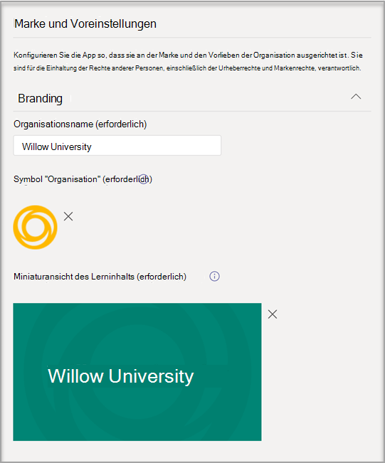
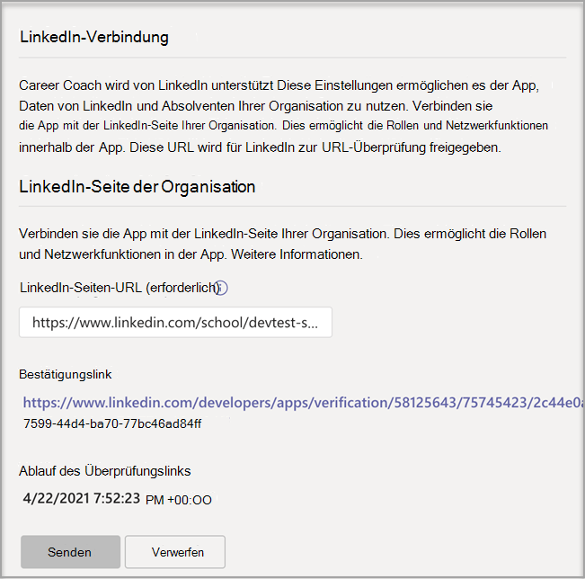

# Erwerben, Konfigurieren und Aktivieren von Karrierecoach für Microsoft Teams

Karrierecoach ist eine von LinkedIn Microsoft Teams für Education App, die personalisierte Anleitungen für Schüler/Studenten aus höheren Bildungseinrichtungen bietet, auf ihren Karriereweg zu navigieren. Karrierecoach bietet Bildungseinrichtungen eine einheitliche Karrierelösung für Studenten, um ihren Karrierepfad zu entdecken, ihre echten Fähigkeiten zu erweitern und ihr Netzwerk an einem Ort zusammen aufzubauen.

## Unterstützte Sprachen

Karrierecoach wird in den folgenden Sprachen lokalisiert:

- Chinesisch (vereinfacht, Kontinental china)
- Chinesisch (traditionell, Taiwan)
- Englisch (USA)
- Englisch (Großbritannien)
- Französisch (Kanada)
- Französisch (Frankreich)
- Deutsch (Deutschland)
- Japanisch (Japan)
- Portugiesisch (Brasilien)
- Spanisch (Spanien)
- Spanisch (Mexiko)

Weitere Informationen zu [Karrierecoach.](https://aka.ms/career-coach)

> [!NOTE]
> Verwenden Sie die bewährten Methoden und hilfreichen Tipps in diesem Handbuch, um die Karrierecoach für Studierende, Lehrkräfte und Mitarbeiter zu aktivieren. Weitere Informationen finden [Sie im Artikel zum Schnellplanungshandbuch.](https://support.microsoft.com/office/c5d0b934-bfcf-4fe7-8a85-ba7bbb1b6ad4)

## Überprüfen der Anforderungen

Wenn Sie Karrierecoach Bildungseinrichtung aktivieren möchten, überprüfen Sie, was Sie benötigen, um die App zu starten.

**Technische Anforderungen**

- Office 365-Mandant mit Azure Active Directory

- Microsoft Teams

- LinkedIn-Kontoverbindungen in Azure Active Directory

**Lizenzen**

- Lehrpersonal

- Schüler/Studenten

> [!NOTE]
> Dem IT-Karrierecoach muss beim Abschließen der Konfiguration eine Lizenz für Lehrpersonal zugewiesen werden.

**Daten und Dateien von Ihrer Bildungseinrichtung**

- Kurskatalogdaten

- Angebotene Studienfelder

- LinkedIn-Seite der Bildungseinrichtung

- LinkedIn Learning Campus-Abonnement (bevorzugt)

## Erwerben der Karrierecoach Lizenzen

Karrierecoach ist weltweit (mit Ausnahme von China und Russland) für qualifizierte Hochschulen als Add-On-Lizenz über die Registrierung für Education Solutions (EES), Cloud Service Providers (CSP) und Microsoft 365 Admin Center (Web Direct) verfügbar. Als Microsoft Teams müssen Kunden über Microsoft 365 A3/A5 oder Office 365 A1/A3/A5 verfügen, um das Add-On Karrierecoach kaufen zu können.

### Zuweisen von App-Lizenzen zu Benutzern

Eine schrittweise Anleitung finden Sie unter [Zuweisen von Lizenzen zu Benutzern.](/microsoft-365/admin/manage/assign-licenses-to-users)

### Aktivieren von LinkedIn-Kontoverbindungen

Karrierecoach **müssen die** Benutzer Ihrer Bildungseinrichtung in der Lage sein, ihr Microsoft 365-Konto mit ihrem LinkedIn-Konto zu verbinden, das innerhalb eines Karrierecoach

1. Melden Sie sich beim [Azure AD Admin Center](https://aad.portal.azure.com/) mit einem Konto an, das ein globaler Administrator für die Azure AD-Organisation ist.

2. Wählen Sie **Benutzer aus.**

3. Wählen Sie **auf der** Seite Benutzer die Option **Benutzereinstellungen aus.**

4. Erlauben **Sie Benutzern unter LinkedIn-Kontoverbindungen,** ihre Konten zu verbinden, um innerhalb einiger Microsoft-Apps auf ihre LinkedIn-Verbindungen zu zugreifen. Es werden keine Daten freigegeben, bis die Benutzer der Verbindung ihrer Konten zustimmen.

   - Wählen **Sie Ja** aus, um den Dienst für alle Benutzer in Ihrer Bildungseinrichtung zu aktivieren.

   - Wählen **Sie Ausgewählte Gruppe** aus, um den Dienst nur für eine Gruppe ausgewählter Benutzer in Ihrer Bildungseinrichtung zu aktivieren.

   - Wählen Sie **Nein aus,** um die Zustimmung aller Benutzer in Ihrer Bildungseinrichtung zu widerrufen.

Erfahren Sie, wie [Sie LinkedIn-Kontoverbindungen in Ihre Azure Active Directory](/azure/active-directory/enterprise-users/linkedin-integration)

## Konfigurieren Karrierecoach im Teams Admin Center

Mithilfe der Administratoreinstellungen im Microsoft Teams Admin Center können Sie Karrierecoach für Ihre Bildungseinrichtung konfigurieren und für Benutzer aktivieren.

**Zu berücksichtigende Dinge**

- Die folgenden Abschnitte müssen abgeschlossen sein, bevor Karrierecoach verwendet werden kann – Marke und Einstellungen, LinkedIn
- CSVs für den Kurskatalog und das Studienfeld verfügen über erforderliche Formate und eine maximale Größe von 18 MB.

- Wenn in der Karrierecoach-App die Karrierecoach wird zurzeit für Sie eingerichtet" angezeigt wird, wurden die erforderlichen Abschnitte nicht abgeschlossen.

- Auf Einstellungsseiten mit Pflichtfeldern wird die Seite nicht übermittelt, wenn die Felder nicht vollständig sind
  - Benutzern wird keine Warnmeldung angezeigt, die Seite wird einfach nicht übermittelt.

## Zugreifen auf die Karrierecoach-App-Einstellungen

Auf der [Seite "Apps verwalten"](/microsoftteams/manage-apps) können Sie Teams Apps im App-Katalog Ihrer Bildungseinrichtung anzeigen.

1. Melden Sie sich beim **Teams Admin Center an.**

2. Wählen Sie im linken Navigationsbereich die Option **Teams Apps**  >  **verwalten aus.**  

    > [!NOTE]
    > Sie müssen ein globaler Administrator oder ein Dienstadministrator Teams sein, um auf die Seite zugreifen zu können.

3. Suchen Oder suchen Sie nach **Karrierecoach.**  

4. Wählen **Karrierecoach** aus, und wählen Sie dann **Einstellungen.**  

    

### Konfigurieren der Karrierecoach-App-Einstellungen

Karrierecoach verfügt über fünf Konfigurationskategorien:

- [Marke und Voreinstellungen](#brand-and-preferences)

- [LinkedIn-Verbindung](#linkedin-connection)

- [Kurskatalog](#course-catalog)

- [Studienfelder](#fields-of-study)

- [Anpassung](#customization)

> [!NOTE]
> Marke und Einstellungen, LinkedIn-Konfiguration, Kurskatalog und  Studienfelder sind erforderlich, um die App effektiv für Studierende, Lehrkräfte und Mitarbeiter zu aktivieren.

#### Marke und Voreinstellungen

Legen Sie den Namen, das Logo und die Standardsprache Ihrer Bildungseinrichtung auf der Seite mit den Einstellungen für Marke und Einstellungen festgelegt.

> [!NOTE]
> Dies ist ein erforderlicher Abschnitt– Karrierecoach kann nur aktiviert werden, wenn die Marke und die Einstellungen übermittelt werden.

##### Symbol für Bildungseinrichtung

Das Symbol für Die Bildungseinrichtung wird überall Karrierecoach zum Identifizieren von Inhalten verwendet, die für Ihre Bildungseinrichtung eindeutig sind, Kurskatalogressourcen in der gesamten App sowie im Abschnitt "Reale Erfahrungen" des Dashboards. Das Symbol ist am besten wie folgt formatiert:

- Eine transparente PNG-Datei
- Seitenverhältnis von 1:1
- Maximale Größe von 64 px x 64 px.

##### Miniaturansicht der Bildungseinrichtung

Das Symbol für die Bildungseinrichtung wird für Kurskatalogressourcen in der gesamten App verwendet, wenn kein bestimmtes Bild für einen Kurs verfügbar ist. Das Symbol ist am besten wie folgt formatiert:

- PNG-Datei
- Seitenverhältnis von 16:9
- Maximale Größe von 360 px x 200 px.

#### LinkedIn-Verbindung

Die LinkedIn-Konfiguration verbindet Karrierecoach mit öffentlichen Absolventendaten von LinkedIn.

> [!NOTE]
> Dies ist ein erforderlicher Abschnitt– Karrierecoach kann nur aktiviert werden, wenn die LinkedIn-Seitenverbindung überprüft wurde.

##### Hinzufügen und Bestätigen der LinkedIn-Seite

Ermitteln Sie die LinkedIn-Seite der Bildungseinrichtung. Suchen Sie die LinkedIn-Seite, indem Sie auf LinkedIn suchen oder eine Verbindung mit einem Mitarbeiter für Career Services herstellen, um die richtige Seite zu bestimmen.  
  
1. Melden Sie sich beim **Teams Admin Center an.**

1. Wählen **Teams Apps Apps** verwalten  >    >  **Karrierecoach**  >  **LinkedIn-Verbindung aus.**

2. Suchen Sie die LinkedIn-Seite, indem Sie linkedIn suchen und School filter auswählen. Oder setzen Sie sich mit einem Mitarbeiter aus dem Karrieredienst in Verbindung, um die richtige LinkedIn-Schulseite zu bestimmen. [Identifizieren von LinkedIn-Seiten](https://www.linkedin.com/help/linkedin/answer/40133/differences-between-a-linkedin-page-for-a-school-and-company?lang=en)

    

3. Fügen Sie die LINKEDIn-Schulseiten-URL hinzu. Die URL muss eine Schulseite und keine Unternehmensseite sein und ist normalerweise als `https://www.linkedin.com/school/willow-university/` formatiert.

   

4. Wählen Sie **Absenden aus.**

5. Wenn die Bestätigung erfolgreich übermittelt wurde,  wird die Seite aktualisiert, damit der Bestätigungslink und der Ablauf **des Bestätigungslinks angezeigt werden.** Der Bestätigungslink läuft nach 30 Tagen ab.

     

6. Kopieren Sie den Bestätigungslink, und teilen Sie ihn mit dem Superadministrator der LinkedIn-Seite Ihrer Bildungseinrichtung. Weitere Informationen zur Superadministratorrolle auf der LinkedIn-Seite finden Sie in der [Dokumentation für Administratoren der LinkedIn-Seite.](https://www.linkedin.com/help/linkedin/answer/102672)

7. Der Superadministrator der LinkedIn-Seite verwendet den eindeutigen Bestätigungslink, um Karrierecoach Ihrer Seite Ihrer Schule zuzuordnen. [Zusätzliche Dokumentation zur LinkedIn-Seitenüberprüfung.](https://www.linkedin.com/help/linkedin/answer/102672)

> [!NOTE]
> Die Überprüfung durch den LinkedIn-Seiten-Superadministrator ist erforderlich, um die LinkedIn-Verbindung für den Karrierecoach.

   

#### Kurskatalog

Der Kurskatalog stellt die Kurse und Kurse dar, die Schülern von Ihrer Bildungseinrichtung angeboten werden.

> [!NOTE]
> Dies ist ein erforderlicher Abschnitt Karrierecoach ohne einen Kurskatalog nicht aktiviert werden kann.

Diese Kurse werden innerhalb der App in zwei Bereichen verwendet:

- Kurse werden als Teil von Lernressourcen zurückgegeben.  

- Kurse und Metadaten des Kurses, z. B. Beschreibungen, werden verwendet, um Kursteilnehmern dabei zu helfen, ihre Fähigkeiten beim Hochladen eines Transkripts zu identifizieren.  

Um den Kurskatalog zu erstellen, erstellen Sie eine Liste aller Kurse, die an Ihrer Bildungseinrichtung vermittelt werden, und laden Sie sie als CSV-Datei hoch. Die App zeichnet aus dem Kurskatalog, um die Fähigkeiten eines Kursteilnehmers aus deren Transkription zu identifizieren und Kurse für den Kurs vorschlagen zu können.

##### Formatieren und Schema von Kurskatalogdokumenten

Das Dokument muss im CSV-Format mit einer maximalen Größe von 18 MB vorliegen. Das Dokument muss die erforderlichen Felder **(Kurstitel,** **Kurs-ID** und **Kurs-URL) enthalten.** Die Einbeziehung der empfohlenen Felder verbessert die Benutzererfahrung für Schüler/Studenten durch die Rückgabe besserer Suchergebnisse und der Fähigkeitserkennung.

> [!NOTE]
> Beginnen Sie mit dem [Beispielkurskatalogdokument,]( https://aka.ms/career-coach/docs/it-admins/sample-catalog) um zu beginnen.

In der folgenden Tabelle sind die Elemente aufgeführt, die in den Kurskatalog enthalten sein müssen:

| Name             | Status      | Typ   | Beschreibung                                                                    |
|------------------|-------------|--------|--------------------------------------------------------------------------------|
| courseId         | Erforderlich    | Zeichenfolge | In der Regel ist die Kurs-ID dem zugeordnet, was in der Aufzeichnung generiert wird. |
| Title            | Erforderlich    | Zeichenfolge | In der Regel der Kurstitel.                                                      |
| sourceLink       | Erforderlich    | URL    | Websitelink zur Kursseite.                                               |
| Beschreibung      | Empfohlen | Zeichenfolge | Einführungstext für den Kurs.                                              |
| language         | Empfohlen | Zeichenfolge | Die Sprache des Kurses. Verwenden Sie Standardsprachcodes.                           |
| Format           | Empfohlen | Zeichenfolge | Unterrichtsmodus (Online, Video, persönlich).                              |
| thumbnailLink    | Empfohlen | URL    | Link zur Miniaturansicht des Kursbilds.                                            |
| thumbnailAltText | Empfohlen | Zeichenfolge | Alternativtext zur Barrierefreiheit für das Bild                                           |
| educationLevel   | Empfohlen | Zeichenfolge | Lernstufe, z. B. Undergraduate/Graduate.                                       |
| Themen           | Empfohlen | Zeichenfolge | Themen oder Tags, die mit den in den Kursen vermittelten Fähigkeiten verknüpft sind.          |

##### Hinzufügen des Kurskatalogs

1. Melden Sie sich beim **Teams Admin Center an.**

1. Wählen **Teams Apps Verwalten von** &gt; **Apps** Karrierecoach &gt;  &gt; **Einstellungen** &gt; **Kurskatalog aus.**  

2. Hochladen Kurse im CSV-Format mit den erforderlichen Spalten: courseId, title, sourceLink. Jede Zeile muss Daten für jede der erforderlichen Spalten enthalten.

Die Einbeziehung der empfohlenen Felder verbessert die Benutzererfahrung für Schüler/Studenten durch die Rückgabe besserer Suchergebnisse und der Fähigkeitserkennung.

4. Wählen Sie **Absenden aus.**

   

#### Studienfelder

Die Studienfelder sind Synonyme für Hauptbereiche von Interesse, akademischer Haupt- und Abschluss abschluss. Auf diese Titel verweisen Schüler/Studenten, wenn sie mit der Nutzung der App beginnen und mit dem Einrichten ihres personalisierten Profils beginnen.

> [!NOTE]
> Dies ist ein Erforderlicher Abschnitt Karrierecoach ohne eine Liste von Studienfeldern nicht aktiviert werden kann.

Fügen Sie alle für Schüler/Studierenden verfügbaren Lernfelder hinzu, z. B. Technik, Englisch, Unternehmen und so weiter. Mit der Feldliste können Schüler/Studenten Lernfelder entdecken, die sie möglicherweise interessieren, und ihren Schwerpunktbereich zu ihrem Profil hinzufügen.

> [!NOTE]
> Beginnen Sie mit [dem Beispielfeld des Lerndokuments.](https://aka.ms/career-coach/docs/it-admins/sample-fieldsofstudy)

In der folgenden Tabelle sind die Elemente aufgeführt, die in die Felder der Untersuchung ein-/aus-werden müssen:

| Name          | Status   | Typ   | Beschreibung                    |
|---------------|----------|--------|--------------------------------|
| fieldsOfStudy | Erforderlich | Zeichenfolge | Der Name des Lernfelds |

##### Hinzufügen der Lernfelder

1. Melden Sie sich beim **Teams Admin Center an.**
1. Wählen **Teams Apps Apps** verwalten &gt; **Karrierecoach** &gt;  &gt; **Einstellungen** &gt; **Studienfelder aus.**  

2. Hochladen ein Studienfeld im CSV-Format.

3. Wählen Sie **Absenden aus.**

#### Anpassung

Karrierecoach können so angepasst werden, dass sie für Ihre Bildungseinrichtung eindeutig sind. Die Anpassung unterstützt das Hinzufügen von Erfahrungen zum Dashboard. Es wird empfohlen, Links zu Jobcentern, Veranstaltungen, Karrierediensten, karrierebezogenen Veranstaltungen, Student-Clubs und anderen Ressourcen hinzuzufügen, die Schülern dabei helfen, echte Erfahrungen zu sammeln.

##### Hinzufügen von benutzerdefinierten Benutzerdefinierten Benutzerdefinierten

1. Melden Sie sich beim **Teams Admin Center an.**

1. Wählen **Teams Apps Apps verwalten** &gt; **Karrierecoach** &gt;   >  **Einstellungen** &gt; **aus.**

2. Fügen Sie jede URL, einen Titel und eine kurze Beschreibung hinzu.  
  
3. Wählen Sie **Absenden aus.**

## Verfügbar Karrierecoach für Ihre Organisation

Nachdem Karrierecoach für Ihre Organisation konfiguriert wurde. Führen Sie die folgenden Schritte aus, um sicherzustellen, Karrierecoach Organisation in einer Organisation zur Verfügung Microsoft Teams.

### Aktivieren der App

Nachdem Sie die Konfiguration abgeschlossen haben, aktivieren Sie die App für Schüler/Studierende und lizenzierte Benutzer, damit diese zugriffen können, Karrierecoach.  
  
> [!NOTE]
> Sie müssen über globale oder Teams Administratorrolle verfügen.

1. Melden Sie sich beim **Teams Admin Center an.**

1. Wählen Teams **Apps Apps** &gt; **verwalten** &gt; **Karrierecoach** aus.

2. Verschieben Sie den Umschalter Status auf **Zulässig.**  

  > [!NOTE]
  > Zulässig bedeutet, dass die App für Benutzer in Ihrer Bildungseinrichtung verfügbar ist. Blockiert bedeutet, dass die App für Schüler/Studierende nicht verfügbar ist.

### Hinzufügen Karrierecoach als installierte App

> [!NOTE]
> Mit diesem Schritt wird sichergestellt, dass 1) Karrierecoach für Ihre Organisation ordnungsgemäß konfiguriert ist(2), die die Schüler/Studenten Karrierecoach.

1. Melden Sie sich beim **Teams Admin Center an.**

2. Wählen sie **Teams** &gt; **Setuprichtlinien Für Apps Ihre** Richtlinie &gt; *aus.*

3. Wählen Sie unter Installierte Apps die Option Apps hinzufügen aus.

4. Suchen Sie im Bereich Installierte Apps hinzufügen nach den Apps, die Sie automatisch installieren möchten, wenn Benutzer Teams. Sie können Apps auch nach der App-Berechtigungsrichtlinie filtern. Wenn Sie Ihre App-Liste ausgewählt haben, wählen Sie Hinzufügen aus.

### Anheften der App

Durch das anheften Karrierecoach wird die App für Schüler barrierefreier und besser sichtbar.

1. Melden Sie sich beim **Teams Admin Center an.**

2. Wählen sie **Teams** &gt; **Setuprichtlinien Für Apps Ihre** Richtlinie &gt; *aus.*

3. Wählen **Sie unter Angeheftet Apps** die Option Apps hinzufügen **aus.**

4. Suchen Sie **nach Karrierecoach**, und wählen Sie dann **Hinzufügen aus.**

5. Wählen Sie die Reihenfolge aus, in der die App angezeigt werden soll, und wählen Sie **dann Speichern aus.**

> [!NOTE]
> Die Kursteilnehmer werden in der Microsoft Teams, Karrierecoach angeheftet wurde.

Weitere Details finden Sie unter Verwalten [von App-Setuprichtlinien in Microsoft.](/microsoftteams/teams-app-setup-policies)

## Ressourcen

Die folgenden Ressourcen helfen Ihnen bei der Planung Ihrer Karrierecoach App.

- [Willkommen bei Microsoft Teams](Teams-overview.md)

- [Bereitstellen von Teams](get-started-with-teams-resources-for-org-wide-rollout.md?tabs=SmallBusiness)

- [Übersicht über Teams und Kanäle in Microsoft Teams](teams-channels-overview.md)

- [Verwalten von Apps im Microsoft Teams Admin Center](manage-apps.md)

- [Online Virtual Orientation Kit](https://www.microsoft.com/education/remote-learning/virtual-orientation)

- [Beschränkungen und Spezifikation Teams Kanälen](limits-specifications-teams.md)

- [Schneller Einstieg mit der Administrator-Schulung für Microsoft Teams](ITAdmin-readiness.md)

- [Teams-Problembehandlung](/microsoftteams/troubleshoot/teams-welcome)

- [Verwalten von Richtlinien für App-Berechtigungen in Microsoft Teams](teams-app-permission-policies.md)
