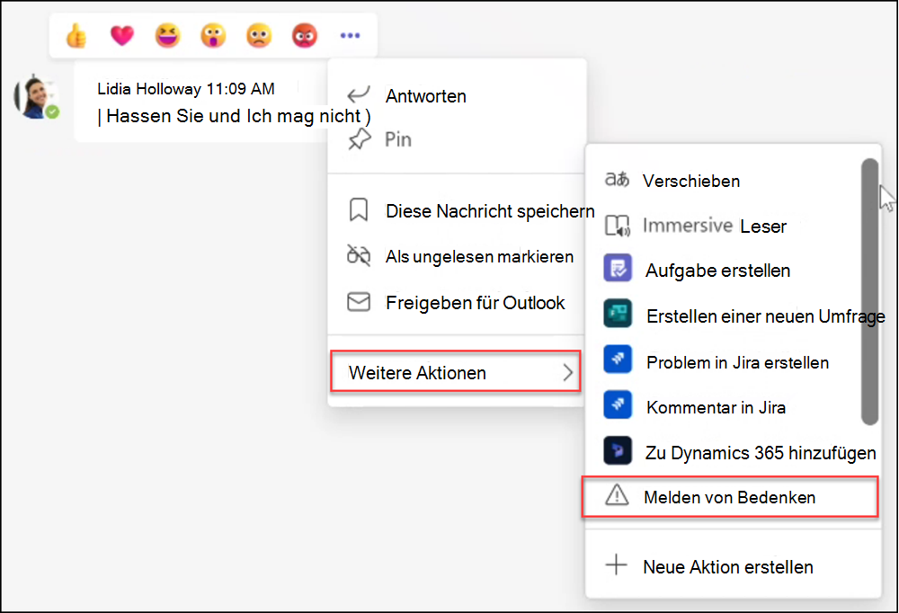

# Kommunikationscompliance mit Microsoft Teams

Microsoft Purview Communication Compliance ist eine Insider-Risikolösung in Microsoft 365, die Ihnen hilft, Kommunikationsrisiken zu minimieren, indem Sie unangemessene Nachrichten in Ihrer Organisation erkennen, erfassen und darauf reagieren können.

Für Microsoft Teams hilft die Kommunikationscompliance dabei, die [folgenden Arten](/microsoft-365/compliance/communication-compliance-feature-reference) unangemessener Inhalte in Teams Kanälen, privaten Teams Kanälen oder in 1:1- und Gruppenchats zu identifizieren:

- Anstößige, profane und belästigende Sprache
- Erwachsene, rassige und gory Bilder
- Freigabe vertraulicher Informationen

Weitere Informationen zur Kommunikationscompliance und zum Konfigurieren von Richtlinien für Ihre Organisation finden [Sie unter "Informationen zur Kommunikationscompliance"](/microsoft-365/compliance/communication-compliance).

## Verwenden der Kommunikationscompliance in Microsoft Teams

Kommunikationscompliance und Microsoft Teams sind eng integriert und können dazu beitragen, Kommunikationsrisiken in Ihrer Organisation zu minimieren. Nachdem Sie Ihre ersten Richtlinien zur Kommunikationscompliance konfiguriert haben, können Sie unangemessene Microsoft Teams Nachrichten und Inhalte, die automatisch in Warnungen gekennzeichnet werden, aktiv verwalten.

### Erste Schritte

Die ersten Schritte mit der Kommunikationscompliance in Microsoft Teams beginnen mit der [Planung](/microsoft-365/compliance/communication-compliance-plan) und Erstellung vordefinierter oder benutzerdefinierter Richtlinien, um unangemessene Benutzeraktivitäten in Teams Kanälen oder in 1:1 und Gruppen zu identifizieren. Denken Sie daran, dass Sie im Rahmen des Konfigurationsprozesses einige Berechtigungen und grundlegende Voraussetzungen [konfigurieren](/microsoft-365/compliance/communication-compliance-configure) müssen.

Teams Administratoren können Kommunikationscompliancerichtlinien auf den folgenden Ebenen konfigurieren:

- **Benutzerebene**: Richtlinien auf dieser Ebene gelten für einen einzelnen Teams Benutzer oder können auf alle Teams Benutzer in Ihrer Organisation angewendet werden. Diese Richtlinien decken Nachrichten ab, die diese Benutzer möglicherweise in 1:1- oder Gruppenchats senden. Die Chatkommunikation für die Benutzer wird automatisch in allen Microsoft Teams überwacht, in denen die Benutzer Mitglied sind.
- **Teams Ebene**: Richtlinien auf dieser Ebene gelten für einen Microsoft Teams Kanal, einschließlich eines privaten Kanals. Diese Richtlinien decken nur Nachrichten ab, die im Teams Kanal gesendet werden.

### Melden eines Anliegens in Microsoft Teams

>[!NOTE]
>Vom Benutzer gemeldete Nachrichten sind ab Mai 2022 für Organisationen verfügbar, die für [Kommunikationscompliance](/microsoft-365/compliance/communication-compliance-configure#subscriptions-and-licensing) und Microsoft Teams lizenziert sind. Dieses Feature sollte bis zum 31. August 2022 für alle lizenzierten Organisationen verfügbar sein.

Die Option *"Problem melden*" in Teams Nachrichten ist standardmäßig aktiviert und kann über Teams Messagingrichtlinien im [Teams Admin Center](/microsoftteams/manage-teams-in-modern-portal) gesteuert werden. Auf diese Weise können Benutzer in Ihrer Organisation unangemessene Nachrichten zur Überprüfung durch Kommunikationscomplianceprüfer für die Richtlinie übermitteln. Weitere Informationen zu vom Benutzer gemeldeten Nachrichten in der Kommunikationscompliance finden Sie unter [Kommunikationscompliancerichtlinien](/microsoft-365/compliance/communication-compliance-policies#user-reported-messages-policy).

Nachdem die Nachricht zur Überprüfung übermittelt wurde, erhält der Benutzer eine Bestätigung der Übermittlung in Microsoft Teams. Anderen Teilnehmern des Chats wird diese Benachrichtigung nicht angezeigt.

Benutzer in Ihrer Organisation erhalten automatisch die globale Richtlinie, es sei denn, Sie erstellen und weisen eine benutzerdefinierte Richtlinie zu. Bearbeiten Sie die Einstellungen in der globalen Richtlinie, oder erstellen und weisen Sie eine oder mehrere benutzerdefinierte Richtlinien zu, um dieses Feature zu aktivieren oder zu deaktivieren. Weitere Informationen finden [Sie unter Verwalten von Nachrichtenrichtlinien in Teams](/microsoftteams/messaging-policies-in-teams).

### Reagieren auf unangemessene Nachrichten in Microsoft Teams

Nachdem Sie Ihre Richtlinien konfiguriert und Kommunikationscompliancewarnungen für Microsoft Teams-Nachrichten erhalten haben, ist es an der Zeit, dass Complianceprüfer in Ihrer Organisation auf diese Nachrichten reagieren. Dies schließt auch vom Benutzer gemeldete Nachrichten ein, wenn sie für Ihre Organisation aktiviert sind. Prüfer können Ihre Organisation schützen, indem sie Warnungen zur Kommunikationscompliance überprüfen und gekennzeichnete Nachrichten in Microsoft Teams aus der Ansicht entfernen.

Entfernte Nachrichten und Inhalte werden durch Benachrichtigungen für Benutzer ersetzt, die erklären, dass die Nachricht oder der Inhalt entfernt wurde und welche Richtlinie auf das Entfernen anwendbar ist. Der Absender der entfernten Nachricht oder des entfernten Inhalts wird auch über den Entfernungsstatus benachrichtigt und mit dem ursprünglichen Nachrichteninhalt für den Kontext im Zusammenhang mit seiner Entfernung bereitgestellt. Der Absender kann auch die spezifische Richtlinienbedingung anzeigen, die für das Entfernen von Nachrichten gilt.

Beispiel für einen Richtlinientipp, der vom Absender angezeigt wird:

Beispiel für eine Richtlinienbenachrichtigung, die vom Absender angezeigt wird:

Beispiel für einen Richtlinientipp, der vom Empfänger angezeigt wird:

