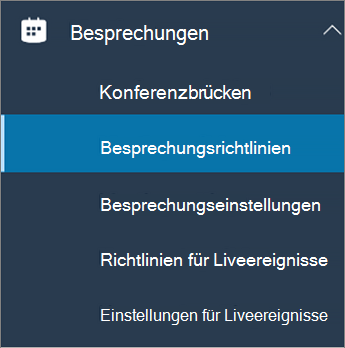
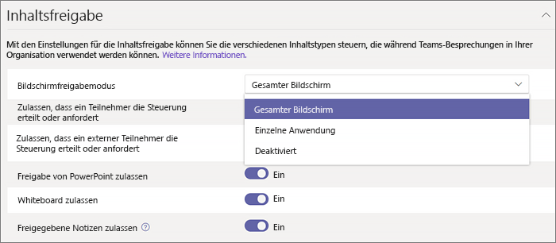

Konfigurieren der Desktopfreigabe in Microsoft Teams
============================================

Mit der Desktop Freigabe können Benutzer während einer Besprechung oder eines Chats einen Bildschirm oder eine APP präsentieren. Administratoren können die Bildschirmfreigabe in Microsoft Teams so konfigurieren, dass Benutzer einen ganzen Bildschirm, eine APP oder eine Datei freigeben können. Sie können zulassen, dass Benutzer die Steuerung erteilen oder anfordern, PowerPoint-Freigabe zulassen, ein Whiteboard hinzufügen und freigegebene Notizen zulassen. Sie können auch konfigurieren, ob anonyme oder externe Benutzer die Steuerung des freigegebenen Bildschirms anfordern können.

Wenn Sie die Bildschirmfreigabe konfigurieren möchten, erstellen Sie eine neue Besprechungsrichtlinie, und weisen Sie diese den Benutzern zu, die Sie verwalten möchten.

**Im [Microsoft Teams Admin Center](https://admin.teams.microsoft.com/)**

1. Wählen Sie**Besprechungsrichtlinien**für **Besprechungen** > aus.

    

2. Wählen Sie auf der Seite **Besprechungsrichtlinien** die Option **neue Richtlinie**aus.

    

3. Geben Sie Ihrer Richtlinie einen eindeutigen Titel, und geben Sie eine kurze Beschreibung ein.

4. Wählen Sie unter **Inhaltsfreigabe**einen **Bildschirmfreigabe Modus** aus der Dropdownliste aus:

   - **Ganzer Bildschirm** – ermöglicht Benutzern das Freigeben Ihres gesamten Desktops.
   - **Einzelne Anwendung** – ermöglicht Benutzern, die Bildschirmfreigabe auf eine einzelne aktive Anwendung zu begrenzen.
   - **Deaktiviert** – deaktiviert die Bildschirmfreigabe.

    

5. Aktivieren oder deaktivieren Sie die folgenden Einstellungen:

    - **Zulassen, dass ein Teilnehmer die Steuerung erteilt oder anfordert** – ermöglicht es Mitgliedern des Teams, die Steuerung des Desktops oder der Anwendung des Referenten zu erteilen oder anzufordern.
    - **Einem externen Teilnehmer erlauben, die Kontrolle zu erteilen oder anzufordern** – ermöglicht es Gästen und externen (verbundenen) Benutzern, die Steuerung des Desktops oder der Anwendung des Referenten zu erteilen oder anzufordern.
    - **PowerPoint-Freigabe zulassen** – ermöglicht Benutzern das Erstellen von Besprechungen, mit denen PowerPoint-Präsentationen hochgeladen und freigegeben werden können.
    - **Whiteboard zulassen** – ermöglicht Benutzern das Freigeben eines Whiteboards.
    - **Freigegebene Notizen zulassen** – ermöglicht Benutzern die Freigabe von Notizen.

6. Klicken Sie auf **Speichern**.

## Verwenden von PowerShell zum Konfigurieren des freigegebenen Desktops

Sie können auch das Cmdlet " [Satz-CsTeamsMeetingPolicy](https://docs.microsoft.com/powershell/module/skype/set-csteamsmeetingpolicy?view=skype-ps) " verwenden, um die Desktopfreigabe zu steuern. Setzen Sie die folgenden Parameter:

- Beschreibung
- ScreenSharingMode
- AllowParticipantGiveRequestControl
- AllowExternalParticipantGiveRequestControl
- AllowPowerPointSharing
- AllowWhiteboard
- AllowSharedNotes

[Weitere Informationen zur Verwendung des csTeamsMeetingPolicy-Cmdlets](https://docs.microsoft.com/powershell/module/skype/set-csteamsmeetingpolicy?view=skype-ps).

