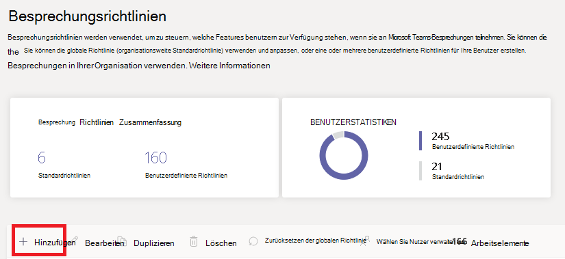

# Konfigurieren der Desktopfreigabe in Microsoft Teams

Die Desktopfreigabe ermöglicht es Benutzern, während einer Besprechung oder eines Chats einen Bildschirm oder eine App anzuzeigen. Administratoren können die Bildschirmfreigabe in Microsoft Teams so konfigurieren, dass Benutzer einen gesamten Bildschirm, eine App oder eine Datei freigeben können. Sie können zulassen, dass Benutzer die Steuerung ermöglichen oder anfordern können, die PowerPoint-Freigabe zulassen, ein Whiteboard hinzufügen und das Freigebe zulassen. Sie können auch festlegen, ob anonyme oder externe Benutzer die Steuerung des freigegebenen Bildschirms anfordern können. Externe Teilnehmer an Microsoft Teams-Besprechungen können wie folgt kategorisiert werden:

- Anonymer Benutzer
- Gastbenutzer
- B2B-Benutzer
- Verbundbenutzer

Um die Bildschirmfreigabe zu konfigurieren, erstellen Sie eine neue Besprechungsrichtlinie und weisen Sie diese dann den Benutzern zu, die Sie verwalten möchten.

**Im [Microsoft Teams Admin Center](https://admin.teams.microsoft.com/)**

1. Wählen Sie **Besprechungen** > **Besprechungsrichtlinien**.

    

2. Wählen Sie auf der Seite **Besprechungsrichtlinien** die Option **Hinzufügen** aus.

    

3. Weisen Sie Ihrer Richtlinie einen eindeutigen Titel zu und geben Sie eine kurze Beschreibung ein.

4. Wählen Sie aus der Dropdownliste unter **Inhaltsfreigabe** die gewünschte Option für den **Bildschirmfreigabemodus** aus:

   - **Gesamter Bildschirm**: Ermöglicht Benutzern die Freigabe des gesamten Bildschirms.
   - **Einzelne Anwendung**: Ermöglicht Benutzern die Beschränkung der Bildschirmfreigabe auf eine einzelne aktive Anwendung.
   - **Deaktiviert** – Deaktiviert die Bildschirmfreigabe.

    

  > [!Note]
  > Sie brauchen die Anrufrichtlinie nicht zu aktivieren, damit Benutzer die Bildschirmfreigabe vom Chat aus verwenden können. Der Ton wird jedoch ausgeschaltet, bis sie die Stummschaltung selbst aufheben. Darüber hinaus kann der Benutzer, der den Bildschirm freigibt, auf **Audio hinzufügen** klicken, um Audio zu aktivieren. Ist die Anrufrichtlinie deaktiviert, können Benutzer der Bildschirmfreigabe aus einer Chatsitzung heraus kein Audio hinzufügen.

5. Aktivieren oder deaktivieren Sie die folgenden Einstellungen:

    - **Zulassen, dass ein Teilnehmer die Steuerung erteilt oder anfordert**: Ermöglicht Mitgliedern des Teams die Steuerung des Desktops oder der Anwendung des Referenten zuzulassen oder anzufordern.
    - **Zulassen, dass ein externer Teilnehmer die Steuerung erteilt oder anfordert**: Hierbei handelt es sich um eine benutzerspezifische Richtlinie. Wenn dies von einer Organisation für einen Benutzer festgelegt wurde, wird dadurch nicht gesteuert, was externe Teilnehmer tun können – unabhängig davon, was der Besprechungsorganisator festgelegt hat. Über diesen Parameter wird gesteuert, ob externen Teilnehmern die Steuerung des von jemand anderen freigegebenen Bildschirms übergeben werden kann bzw. ob sie dies anfordern können, je nachdem, was der freigebende Benutzer in den Besprechungsrichtlinien seiner Organisation festgelegt hat.
    - **PowerPoint-Freigabe zulassen**: Ermöglicht Benutzern das Erstellen von Besprechungen, die das Hochladen und Freigeben von PowerPoint-Präsentationen zulassen.
    - **Whiteboard zulassen**: Ermöglicht Benutzern die Freigabe eines Whiteboards.
    - **Freigabe von Notizen zulassen**: Ermöglicht Benutzern, freigegebene Notizen zu erstellen.

6. Klicken Sie auf **Speichern**.

## Verwenden von PowerShell zum Konfigurieren des freigegebenen Desktops

Sie können auch das Cmdlet [Set-CsTeamsMeetingPolicy](/powershell/module/skype/set-csteamsmeetingpolicy) verwenden, um die Desktopfreigabe zu steuern. Legen Sie die folgenden Parameter fest:

- Description
- ScreenSharingMode
- AllowPrivateCalling
- AllowParticipantGiveRequestControl
- AllowExternalParticipantGiveRequestControl
- AllowPowerPointSharing
- AllowWhiteboard
- AllowSharedNotes

[Erfahren Sie mehr über das csTeamsMeetingPolicy-Cmdlet ](/powershell/module/skype/set-csteamsmeetingpolicy).