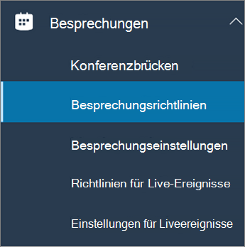

Konfigurieren der Desktopfreigabe in Microsoft TeamsConfigure desktop sharing in Microsoft Teams
============================================

Die Desktopfreigabe ermöglicht es Benutzern, während einer Besprechung oder eines Chats einen Bildschirm oder eine App anzuzeigen.Desktop sharing lets users present a screen or app during a meeting or chat. Administratoren können die Bildschirmfreigabe in Microsoft Teams so konfigurieren, dass Benutzer einen gesamten Bildschirm, eine App oder eine Datei freigeben können.Admins can configure screen sharing in Microsoft Teams to let users share an entire screen, an app, or a file. Sie können zulassen, dass Benutzer die Steuerung ermöglichen oder anfordern können, die PowerPoint-Freigabe zulassen, ein Whiteboard hinzufügen und das Freigebe zulassen.You can let users give or request control, allow PowerPoint sharing, add a whiteboard, and allow shared notes. Sie können auch festlegen, ob anonyme oder externe Benutzer die Steuerung des freigegebenen Bildschirms anfordern können.You can also configure whether anonymous or external users can request control of the shared screen.

Um die Bildschirmfreigabe zu konfigurieren, erstellen Sie eine neue Besprechungsrichtlinie und weisen Sie diese dann den Benutzern zu, die Sie verwalten möchten.To configure screen sharing, you create a new meetings policy and then assign it to the users you want to manage.

**Im [Microsoft Teams Admin Center](https://admin.teams.microsoft.com/)****In the [Microsoft Teams admin center](https://admin.teams.microsoft.com/)**

1. Wählen Sie **Besprechungen** > **Besprechungsrichtlinien**.Select **Meetings** > **Meeting policies**.

    

2. Wählen Sie auf der Seite **Besprechungsrichtlinien** die Option **Neue Richtlinie** aus.On the **Meeting policies** page, select **New policy**.

    

3. Weisen Sie Ihrer Richtlinie einen eindeutigen Titel zu und geben Sie eine kurze Beschreibung ein.Give your policy a unique title and enter a brief description.

4. Wählen Sie aus der Dropdownliste unter **Inhaltsfreigabe** die gewünschte Option für den **Bildschirmfreigabemodus** aus:Under **Content sharing**, choose a **Screen sharing mode** from the drop-down list:

   - **Gesamter Bildschirm**: Ermöglicht Benutzern die Freigabe des gesamten Bildschirms.**Entire screen** – lets users share their entire desktop.
   - **Einzelne Anwendung**: Ermöglicht Benutzern die Beschränkung der Bildschirmfreigabe auf eine einzelne aktive Anwendung.**Single application** – lets users limit screen sharing to a single active application.
   - **Deaktiviert** – Deaktiviert die Bildschirmfreigabe.**Disabled** – Turns off screen sharing.

    

5. Aktivieren oder deaktivieren Sie die folgenden Einstellungen:Turn the following settings on or off:

    - **Zulassen, dass ein Teilnehmer die Steuerung erteilt oder anfordert** – ermöglicht es Mitgliedern des Teams, die Steuerung des Desktops oder der Anwendung des Referenten zu erteilen oder anzufordern.**Allow a participant to give or request control** – lets members of the team give or request control of the presenter's desktop or application.
    - **Einem externen Teilnehmer erlauben, die Kontrolle zu erteilen oder anzufordern** – ermöglicht es Gästen und externen (verbundenen) Benutzern, die Steuerung des Desktops oder der Anwendung des Referenten zu erteilen oder anzufordern.**Allow an external participant to give or request control** – lets guests and external (federated) users give or request control of the presenter's desktop or application.
    - **PowerPoint-Freigabe zulassen**: Ermöglicht Benutzern das Erstellen von Besprechungen, die das Hochladen und Freigeben von PowerPoint-Präsentationen zulassen.**Allow PowerPoint sharing** - lets users create meetings that allow PowerPoint presentations to be uploaded and shared.
    - **Whiteboard zulassen**: Ermöglicht Benutzern die Freigabe eines Whiteboards.**Allow whiteboard** – lets users share a whiteboard.
    - **Freigabe von Notizen zulassen**: Ermöglicht Benutzern, freigegebene Notizen zu erstellen.**Allow shared notes** – lets users take shared notes.

6. Klicken Sie auf **Speichern**.Click **Save**.

## Verwenden von PowerShell zum Konfigurieren des freigegebenen DesktopsUse PowerShell to configure shared desktop

Sie können auch das Cmdlet [Set-CsTeamsMeetingPolicy](https://docs.microsoft.com/powershell/module/skype/set-csteamsmeetingpolicy?view=skype-ps) verwenden, um die Desktopfreigabe zu steuern.You can also use the [Set-CsTeamsMeetingPolicy](https://docs.microsoft.com/powershell/module/skype/set-csteamsmeetingpolicy?view=skype-ps) cmdlet to control desktop sharing. Legen Sie die folgenden Parameter fest:Set the following parameters:

- DescriptionDescription
- ScreenSharingModeScreenSharingMode
- AllowParticipantGiveRequestControlAllowParticipantGiveRequestControl
- AllowExternalParticipantGiveRequestControlAllowExternalParticipantGiveRequestControl
- AllowPowerPointSharingAllowPowerPointSharing
- AllowWhiteboardAllowWhiteboard
- AllowSharedNotesAllowSharedNotes

[Erfahren Sie mehr über das csTeamsMeetingPolicy-Cmdlet ](https://docs.microsoft.com/powershell/module/skype/set-csteamsmeetingpolicy?view=skype-ps).[Learn more about using the csTeamsMeetingPolicy cmdlet](https://docs.microsoft.com/powershell/module/skype/set-csteamsmeetingpolicy?view=skype-ps).

