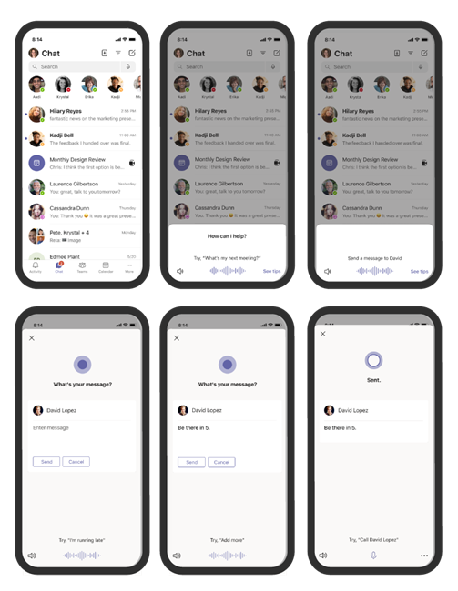

# <a name="cortana-voice-assistance-in-teams"></a>Cortana Sprachunterstützung in Teams

> [!Note]
> Cortana Sprachunterstützung wird in mobilen Microsoft Teams-Apps für iOS und Android und Microsoft Teams-Anzeigen für Benutzer in den USA, Großbritannien, Kanada, Indien und Australien unterstützt. Microsoft Teams-Räume auf Windows wird nur für Geräte unterstützt, für die das Locale auf "en-us" festgelegt ist. Cortana-Sprachunterstützung ist derzeit für Mandanten von GCC, GCC-High, DoD und nicht in den USA verfügbaren EDU-Mandanten nicht verfügbar. Cortana Sprachunterstützung in der mobilen Teams-App ist jetzt für EDU-Kunden in en-US verfügbar. Die Erweiterung auf weitere Sprachen und Regionen wird im Rahmen zukünftiger Versionen sein.


Cortana Sprachunterstützung in der mobilen Teams-App, in Microsoft Teams-Räume auf Windows und auf Microsoft Teams-Anzeigegeräten ermöglicht es Microsoft 365 Enterprise-Benutzern, Kommunikation, Zusammenarbeit und Besprechungsbezogene Aufgaben in gesprochener natürlicher Sprache. Benutzer können mit Cortana sprechen, indem sie die Mikrofonschaltfläche auswählen, die sich oben rechts in der mobilen Teams-App befindet, oder indem sie &#8220;Cortana&#8221; im Microsoft Teams Room sagen oder eine Microsoft Teams verwenden. Für eine schnelle Verbindung mit dem Team – freihändig und unterwegs – können Benutzer Abfragen wie &#8220;anrufen Megan&#8221; oder &#8220;eine Nachricht an meine nächste Besprechungs-E-Mail senden&#8221;. Benutzer können an Besprechungen teilnehmen, indem sie sagen&#8220;an meiner nächsten Besprechung teilnehmen&#8221; und mithilfe von Sprachunterstützung Dateien freigeben, ihren Kalender überprüfen und vieles mehr. Diese Sprachunterstützungserfahrungen werden mithilfe von [Cortana-Diensten](/microsoft-365/admin/misc/cortana-integration?view=o365-worldwide) auf Unternehmensklasse übermittelt, die gemäß den Onlinedienstbedingungen [(OST)](https://www.microsoft.com/licensing/product-licensing/products?rtc=1)vollständig den Datenschutz-, Sicherheits- und Compliance-Zusagen von Office 365 entsprechen.

## <a name="admin-control-and-limitations"></a>Administratorkontrolle und -beschränkungen

Cortana Sprachunterstützung in Teams wird mithilfe von Diensten übermittelt, die gemäß den Bedingungen für Onlinedienste (OST) vollständig den Zusagen auf Office 365 Unternehmensebene hinsichtlich Datenschutz, Sicherheit und Compliance entsprechen. Das Feature wird für Mandanten standardmäßig aktiviert.

Mandantenadministratoren können mithilfe einer Richtlinie (TeamsCortanaPolicy) steuern, wer in ihrem Mandanten Cortana Sprachunterstützung in Teams verwenden kann. Diese Richtlinie wird entweder auf Benutzerkonto- oder Mandantenebene festgelegt. Administratoren können das Feld CortanaVoiceInvocationMode innerhalb dieses Richtliniensteuerelements verwenden, um festzustellen, ob Cortana deaktiviert ist, ob es nur über den Aufruf von Schaltflächen oder auch über den Aufruf eines Reaktivierungsworts aktiviert ist (gilt für Geräte, die dies unterstützen, z. B. die Microsoft Teams-Anzeige).

Administratoren können diese Richtlinie mithilfe der folgenden PowerShell-Cmdlets verwalten (die Richtlinie ist Microsoft Teams Admin Center derzeit nicht verfügbar).

- [New-CsTeamsCortanaPolicy](/powershell/module/skype/New-CsTeamsCortanaPolicy)

- [Get-CsTeamsCortanaPolicy](/powershell/module/skype/Get-CsTeamsCortanaPolicy)

- [Grant-CsTeamsCortanaPolicy](/powershell/module/skype/Grant-CsTeamsCortanaPolicy)

- [Set-CsTeamsCortanaPolicy](/powershell/module/skype/Set-CsTeamsCortanaPolicy)

- [Remove-CsTeamsCortanaPolicy](/powershell/module/skype/Remove-CsTeamsCortanaPolicy)

Mit dem folgenden Befehl wird beispielsweise eine neue Richtlinie mit dem Namen &#8220;EmployeeCortanaPolicy&#8221; erstellt, Cortana sprachunterstützung in Microsoft Teams deaktiviert ist.  

```PowerShell
PS C:\> New-CsTeamsCortanaPolicy -Identity EmployeeCortanaPolicy -CortanaVoiceInvocationMode Disabled
```

Dieses Beispiel zeigt das Aktualisieren einer vorhandenen Richtlinie mit dem Namen &#8220;EmployeeCortanaPolicy&#8221; und das Aktivieren von Cortana-Sprachunterstützung in Microsoft Teams nur durch Den Aufruf von Schaltflächen. Benutzer können Ihr Mikrofon aufrufen, indem Cortana die Schaltfläche Cortana Mikrofons im Teams. Der Reaktivierungsaufruf &#8220;Hey Cortana&#8221; oder &#8220;Cortana&#8221; wird deaktiviert.  

```PowerShell
PS C:\> Set-CsTeamsCortanaPolicy -Identity EmployeeCortanaPolicy -CortanaVoiceInvocationMode PushToTalkUserOverride
```

In diesem Beispiel wird gezeigt, wie die Richtlinie aktualisiert und Cortana Sprachunterstützung durch Drücken und Reaktivierung des Worts aktiviert wird.

```PowerShell
PS C:\> Set-CsTeamsCortanaPolicy -Identity EmployeeCortanaPolicy -CortanaVoiceInvocationMode WakeWordPushToTalkUserOverride
```

Zum Zeitpunkt der ersten Version für Microsoft 365 Enterprise Benutzer in den USA in Englisch sind die folgenden verfügbaren Funktionen verfügbar:

- Die Teams mobilen App unterstützt nicht die Aktivierung von Reaktivierungsworten, wird aber in Zukunft unterstützt.  

- Microsoft Teams-Räume auf Windows und Microsoft Teams-Anzeigegeräten die Aktivierung von Reaktivierungsworten unterstützt.

## <a name="user-control"></a>Benutzersteuerelement

Einzelne Benutzer können versuchen, Cortana Sprachunterstützung auf verschiedenen Geräten zu erhalten:

- Wählen Sie in der mobilen Teams Mikrofonschaltfläche aus.

- Wählen Sie die Mikrofonschaltfläche aus, oder sagen Cortana Mikrofon", Microsoft Teams-Räume.

- Sagen Sie "Cortana", Microsoft Teams Geräte angezeigt werden.

Sie können steuern, Cortana in Teams Gerät aktiviert ist, indem Sie eine Einstellung auf dem Gerät verwenden.



### <a name="microsoft-teams-rooms-on-windows"></a>Microsoft Teams-Räume auf Windows

Das Vornehmen von Änderungen auf Geräteebene ist nur verfügbar, Cortana auf Mandantenebene aktiviert ist. 

Auf Geräteebene können Sie die Cortana für die Verwendung auf zwei verschiedene Arten konfigurieren. Sie können beide Optionen oder beide gleichzeitig aktivieren: 
- durch Tippen auf ein Mikrofon, das als _Cortana"Push to talk" bezeichnet wird._
- indem Sie "Hey, Cortana" sagen. Dies Cortana _Sprachaktivierung_

Cortana _"Push-to-Talk"_ ist standardmäßig aktiviert, wenn Ihr Gerät für die Verwendung des Locale de-DE eingerichtet ist. [Weitere Informationen.](/MicrosoftTeams/rooms/console#to-apply-your-desired-language)  Cortana Symbol wird die Schaltfläche Präsentieren _unter_ dem Symbol _Mehr..._ in Ihrer Teams Raumkonsole. Verwenden Sie PowerShell, Cortana _Push-to-Talk zu deaktivieren._ [Weitere Informationen.](/powershell/module/skype/new-csteamscortanapolicy?view=skype-ps#example-1)

Zum Aktivieren Cortana _Sprachaktivierung_ müssen die folgenden Bedingungen erfüllt sein:
- ein Cortana Gerät muss mit Ihrem Raum Teams sein. Eine Liste der zertifizierten Geräte finden Sie am Ende dieses Artikels.
- der Teams-Raum muss für die Verwendung des Locale en-us eingerichtet sein. Weitere Sprachen werden zu einem späteren Zeitpunkt zur Verfügung stehen.
- muss eine der folgenden Konfigurationsänderungen vorgenommen werden:
  - aktivieren Sie das Feature im Teams Admin [Center Weitere Informationen.](/microsoftteams/rooms/rooms-manage)
  - Fügen Sie der SKYPESettings-XML-Datei das folgende XML-Attribut hinzu:
```xml
<SkypeSettings>  
        <CortanaWakewordEnabled>true</CortanaWakewordEnabled>  
</SkypeSettings> 
```
Auf Besprechungsebene sind Änderungen nur verfügbar, wenn Cortana _Sprachaktivierung_ auf Geräteebene aktiviert ist.  Um die Cortana _Sprachaktivierung während_ einer Besprechung zu aktivieren, verschieben Sie den Umschalter auf **Ein** oder Aus, **um** die Sprachaktivierung zu deaktivieren. Sobald die Besprechung beendet ist, Cortana sie zu den auf Geräteebene festgelegten Einstellungen zurück.


Das Vornehmen von Änderungen auf Besprechungsebene ist verfügbar, Cortana auf Geräteebene aktiviert ist.

Um die Cortana _während_ einer Besprechung zu aktivieren, verschieben Sie den Umschalter auf **Ein** oder **Aus.** Sobald die Besprechung beendet ist, Cortana sie zu den auf Geräteebene festgelegten Einstellungen zurück.


## <a name="cortana-certified-devices-for-teams-rooms"></a>Cortana Geräte für die Teams-Räume
Cortana _Sprachaktivierung_ kann aktiviert werden, wenn Sie ein Lenovo Hub 500 verwenden oder wenn eines dieser Geräte mit Ihrem Raum verbunden ist:
- Jabra Ausschnur 50 
- Mikrofone aus Mikrofonen von Mikrofonen aus Mikrofonen
- Bose Video Bar VB1 __
