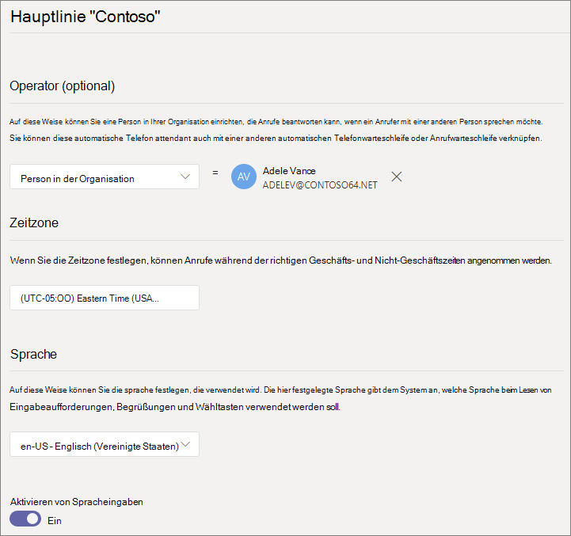
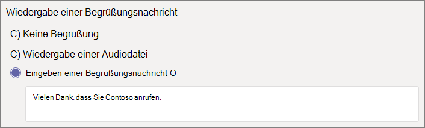
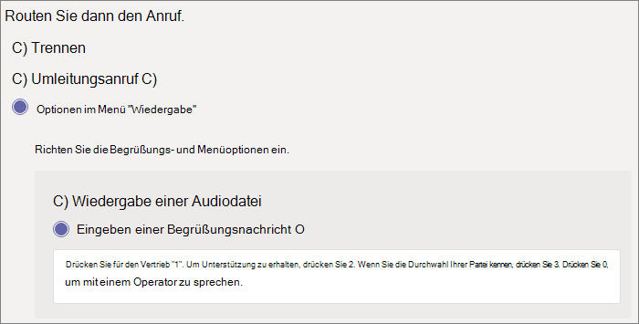
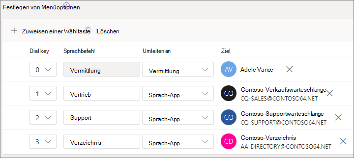
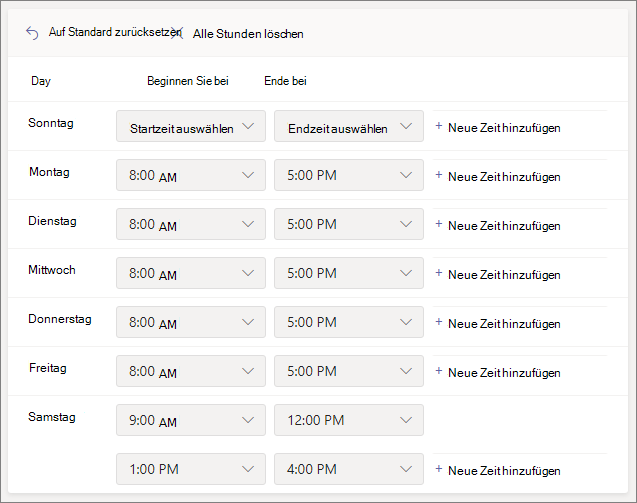
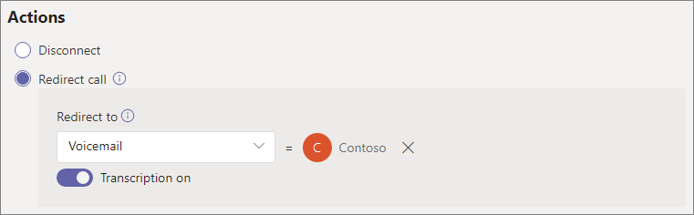
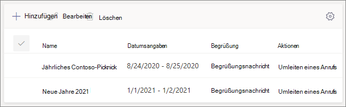
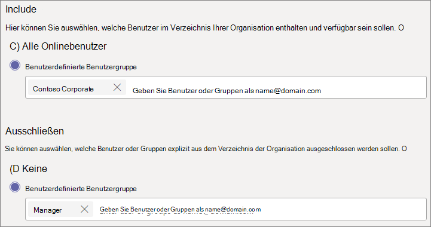
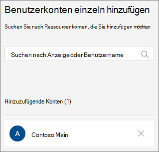
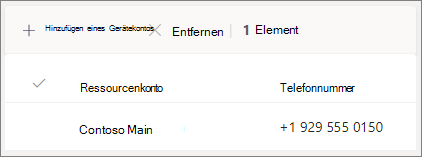

# Einrichten einer automatischen Attendant

Mit automatischen Telefonkonferenzen können Personen Ihre Organisation anrufen und in einem Menüsystem navigieren, um mit der richtigen Abteilung, einer Anrufwarteschleife, einer Person oder einem Operator zu sprechen. Sie können automatische Attendants für Ihre Organisation mit dem Microsoft Teams Admin Center oder mit PowerShell erstellen.

Vergewissern Sie sich, dass Sie [den](plan-auto-attendant-call-queue.md) Artikel Planen Teams automatische  Telefonkonferenzen und Anrufwarteschleifen gelesen und die Ersten Schritte befolgt haben, bevor Sie die In diesem Artikel erläuterten Schritte ausführen.

Automatische Telefon attendants can direct calls, based on callers' input, to one of the following destinations: 

- **Operator** : Der für die automatische Attendant definierte Operator. Das Definieren eines Operators ist optional. Der Operator kann als jedes der anderen Ziele in dieser Liste definiert werden.
- **Person in der Organisation–** eine Person in Ihrer Organisation, die Sprachanrufe empfangen kann. Bei dieser Person kann es sich um einen Onlinebenutzer oder einen Lokal gehosteten Benutzer Skype for Business Server.
- **Sprach-App** – eine andere automatische Telefon attendant oder eine Anrufwarteschleife. (Wählen Sie das Ressourcenkonto aus, das der automatischen Telefon attendant oder der Anrufwarteschleife zugeordnet ist, wenn Sie dieses Ziel auswählen.)
- **Voicemail:** Das Sprachpostfach, das einer bestimmten Microsoft 365-Gruppe zugeordnet ist.
- **Externe Telefonnummer –** beliebige Telefonnummer. (Siehe [technische Details zur externen Übertragung).](create-a-phone-system-auto-attendant.md#external-phone-number-transfers---technical-details)
- **Ankündigung (Audiodatei)** – Gibt eine Audiodatei wieder. Eine aufgezeichnete Ankündigungsmeldung, die Sie hochladen und die als Audio in gespeichert wird. WAV, .MP3 oder . WMA-Format. Die Aufzeichnung darf nicht größer als 5 MB sein. Das System gibt die Ankündigung wieder und kehrt dann zum Menü der automatischen Attendant zurück.
- **Ankündigung (Typ) –** Geben Sie eine Nachricht ein. Text, der vom System gelesen werden soll. Sie können bis zu 1.000 Zeichen eingeben. Das System gibt die Ankündigung wieder und kehrt dann zum Menü der automatischen Attendant zurück.

Sie werden aufgefordert, eine dieser Optionen in verschiedenen Phasen beim Einrichten einer automatischen Attendant zu wählen.

> [!NOTE]
> Wenn Sie Voicemail als Ziel auswählen, stehen zwei zusätzliche Optionen zur Verfügung:
> - **Transkription** (Standard: Aus) – Wenn die Option aktiviert ist, wird die Voicemail-Nachricht transkribiert und als Teil der E-Mail einbezogen.
> - **Begrüßung unterdrücken** (Standard: Aus) – wenn aktiviert, wird die Standardsystemmeldung "Bitte hinterlassen Sie eine Nachricht nach dem Ton. Wenn Sie fertig sind, können Sie auflegen oder die Hashtaste drücken, um weitere Optionen anzuzeigen." werden unterdrückt.

Um eine automatische Telefonzentrale zu einrichten, erweitern Sie im Teams **Admin Center** Sprachanrufe , wählen Sie **Automatische** Telefonzentralen aus, und wählen Sie dann **Hinzufügen aus.**

## Videodemo

Dieses Video zeigt ein einfaches Beispiel für das Erstellen einer automatischen Attendant in Teams.

> [!VIDEO https://www.microsoft.com/videoplayer/embed/RWEnCG?autoplay=false]

## Allgemeine Informationen

1. Geben Sie oben im Feld einen Namen für die automatische Attendant ein.

2. Um einen Operator anzugeben, geben Sie das Ziel für Aufrufe an den Operator an. Diese Festlegung ist optional (aber empfohlen). Legen Sie **die Option "Operator"** so festgelegt, dass Anrufer aus den Menüs ausbrechen und mit einer bestimmten Person sprechen können.

3. Geben Sie die Zeitzone für diese automatische Attendant an. Die Zeitzone wird zum Berechnen der Geschäftszeiten verwendet, wenn Sie einen separaten Anruffluss für [die Nachstunden erstellen.](#call-flow-for-after-hours)

4. Geben Sie [eine unterstützte Sprache für](create-a-phone-system-auto-attendant-languages.md) diese automatische Attendant an. Dies ist die Sprache, die für systemgenerierte Sprachanrufe verwendet wird.

5. Wählen Sie aus, ob Sie Spracheingaben aktivieren möchten. Wenn die Option aktiviert ist, wird der Name jeder Menüoption zu einem Schlüsselwort für die Spracherkennung. So können Anrufer beispielsweise "Eins" sagen, um die Menüoption auszuwählen, die der Taste "1" zugeordnet ist, oder "Vertrieb", um die Menüoption "Vertrieb" auszuwählen.

> [!NOTE]
> Wenn Sie in Schritt 4 eine Sprache auswählen, die keine Spracheingaben unterstützt, wird diese Option deaktiviert.

6. Wählen Sie **Weiter aus.**

## Anruffluss

Wählen Sie aus, ob eine Begrüßung abspielen soll, wenn die automatische Telefonhalterin einen Anruf beantwortet.

Wenn Sie Audiodatei **wiedergabe auswählen,** können Sie die Schaltfläche **Hochladen-Datei** verwenden, um eine aufgezeichnete Begrüßungsnachricht hochzuladen, die als Audio in gespeichert wurde. WAV, .MP3 oder . WMA-Format. Die Aufzeichnung darf nicht größer als 5 MB sein.

Wenn Sie Grußnachricht **eingeben** auswählen, liest das System den text vor, den Sie eingeben (bis zu 1.000 Zeichen), wenn die automatische Telefonanlage einen Anruf entgegen nimmt.

Wählen Sie aus, wie Sie den Anruf routen möchten.

Wenn Sie Trennen **auswählen,** hängt die automatische Telefon attendant den Anruf auf.

Wenn Sie Anruf **umleiten auswählen,** können Sie eines der Anrufroutingziele auswählen.

Wenn Sie Menüoptionen **für "Wiedergabe"** auswählen, können Sie auf Audiodateien oder  **Grußnachricht** eingeben klicken und dann zwischen Menüoptionen und Verzeichnissuche wählen.

### Menüoptionen

Weisen Sie bei Wähloptionen einem der Anrufroutingziele die 0-9-Tasten auf der Wähltasten des Telefons zu. (Die Tasten \* (Wiederholen) und (Zurück) werden vom System reserviert und \# können nicht erneut zugewiesen werden.)

Schlüsselzuordnungen müssen nicht fortlaufend sein. Es ist möglich, ein Menü mit den Tasten 0, 1 und 3 zu den Optionen zu erstellen, während die Taste 2 nicht verwendet wird.

Es wird empfohlen, die Nulltaste dem Operator zuzuordnen, wenn Sie eine konfiguriert haben. Wenn der Operator nicht auf eine Taste festgelegt ist, ist auch der Sprachbefehl "Operator" deaktiviert.

Geben Sie für jede Menüoption die folgenden Einstellungen an:

- **DFÜ-TASTE** – die Taste auf der Wähltastatur des Telefons, um auf diese Option zu zugreifen. Wenn Spracheingaben verfügbar sind, können Anrufer auch diese Nummer sagen, um auf die Option zu zugreifen.

- **Sprachbefehl:** Definiert den Sprachbefehl, den ein Anrufer für den Zugriff auf diese Option ausführen kann, wenn Spracheingaben aktiviert sind. Sie kann mehrere Wörter wie "Kundendienst" oder "Betrieb und Anlage" enthalten. So kann der Anrufer beispielsweise "2" drücken, "zwei" sagen oder "Umsatz" sagen, um die Option auszuwählen, die den beiden Tasten zugeordnet ist. Dieser Text wird auch per Text zu Sprache für die Bestätigungsaufforderung des Diensts gerendert, was ähnlich wie "Ihren Anruf an den Umsatz überträgt".

- **Umleiten an:** das Anrufroutingziel, das verwendet wird, wenn Anrufer diese Option auswählen. Wenn Sie an eine automatische Telefonleitung oder Anrufwarteschleife umleiten, wählen Sie das zugeordnete Ressourcenkonto aus.

### Verzeichnissuche

Wenn Sie Ziele Wähltasten zuweisen, empfiehlt es sich, für die Verzeichnissuche **die Option** Keine **zu wählen.** Wenn ein Anrufer versucht, einen Namen oder eine Durchwahl mithilfe von Schlüsseln zu wählen, die bestimmten Zielen zugewiesen sind, wird er möglicherweise unerwartet an ein Ziel geroutet, bevor er die Eingabe des Namens oder der Durchwahl abgeschlossen hat. Wir empfehlen, eine separate automatische Telefon attendant für die Verzeichnissuche zu erstellen und mit einer Wähltaste eine Verknüpfung zur automatischen Haupttelefon attendant zu erstellen.

Wenn Sie keine Wähltasten zugewiesen haben, wählen Sie eine Option für die **Verzeichnissuche aus.**

**Nach Namen wählen** – Wenn Sie diese Option aktivieren, können Anrufer den Namen des Benutzers sagen oder ihn auf der Wähltastatur des Telefons eingeben. Jeder Onlinebenutzer oder jeder lokal mit Skype for Business Server gehostete Benutzer ist berechtigter Benutzer und kann mit namenswählen gefunden werden. (Auf der Seite Wählbereich können Sie festlegen, wer im Verzeichnis enthalten ist [und nicht.)](#dial-scope)

**Durchwahl:** Wenn Sie diese Option aktivieren, können Anrufer eine Verbindung mit Benutzern in Ihrer Organisation herstellen, indem sie deren Telefonerweiterung wählen. Jeder Onlinebenutzer oder jeder lokal mit Skype for Business Server gehostete Benutzer ist ein berechtigter Benutzer und kann mit der **Durchwahl-Erweiterung gefunden werden.** (Auf der Seite Wählbereich können Sie festlegen, wer im Verzeichnis enthalten ist [und nicht.)](#dial-scope)

Benutzer, die für die Durchwahlerweiterung verfügbar sein möchten, müssen über eine Durchwahl verfügen, die als  Teil eines der folgenden Telefonattribute angegeben ist, die in Active Directory oder Azure Active Directory definiert sind . (Weitere Informationen finden Sie unter Hinzufügen von einzelnen Benutzern oder Massenbenutzern.)

- OfficePhone
- HomePhone
- Mobilgeräte/Mobiltelefone
- TelephoneNumber/PhoneNumber
- OtherTelephone

Das für die Eingabe der Durchwahl in das Feld für die Telefonnummer des Benutzers erforderliche Format kann eines der folgenden Formate sein:

- *+\<phone number>;ext=\<extension>*
- *+\<phone number>x\<extension>*
- *x\<extension>*

- Beispiel 1: Set-MsolUser -UserPrincipalName usern@domain.com -Phonenumber "+15555555678;ext=5678"
- Beispiel 2: Set-MsolUser -UserPrincipalName usern@domain.com -Phonenumber "+15555555678x5678"
- Beispiel 3: Set-MsolUser -UserPrincipalName usern@domain.com -Phonenumber "x5678"

Sie können die Erweiterung im Microsoft 365 [Admin Center](https://admin.microsoft.com/) oder Azure Active Directory Admin [Center festlegen.](https://aad.portal.azure.com) Es kann bis zu 12 Stunden dauern, bis Änderungen für automatische Telefonkonferenzen und Anrufwarteschleifen verfügbar sind.

> [!NOTE]
> Wenn Sie sowohl die  Funktionen "Nach Name wählen" als auch "Nach Namen wählen" verwenden möchten, können Sie in Ihrer automatischen Haupttelefon attendant eine Wähltaste zuweisen, um eine automatische Telefon attendant zu erreichen, die für "Nach Namen wählen" **aktiviert ist.**  Innerhalb dieser automatischen Telefon attendant können Sie die 1-Taste (der  keine Buchstaben zugeordnet sind) zuweisen, um die automatische Telefon attendant für Die Durchwahl zu erreichen.

Nachdem Sie eine Option für die **Verzeichnissuche ausgewählt haben,** wählen Sie Weiter **aus.**

## Anruffluss nach Stunden

Geschäftszeiten können für jede automatische Attendant festgelegt werden. Wenn keine Geschäftszeiten festgelegt sind, werden alle Tage und alle Stunden des Tages als Geschäftszeiten betrachtet, da standardmäßig ein Rund-um-die-Uhr-Zeitplan festgelegt ist. Geschäftszeiten können mit Tagesumbrüchen festgelegt werden, und alle Stunden, die nicht als Geschäftszeiten festgelegt sind, werden als Nachstunden betrachtet. Sie können verschiedene Optionen für die Anrufbehandlung und Begrüßungen für die Nachstunden festlegen.

Je nachdem, wie Sie Ihre automatischen Telefonkonferenzen und Anrufwarteschleifen konfiguriert haben, müssen Sie möglicherweise nur das Routing von Anrufen nach Stunden für automatische Telefonkonferenzen mit Direkttelefonnummern angeben.

Wenn Sie eine separate Anrufrouting für Anrufer nach Geschäftszeiten wünschen, geben Sie Ihre Geschäftszeiten für jeden Tag an. Wählen **Sie Neue Zeit hinzufügen** aus, um mehrere Stunden für einen bestimmten Tag anzugeben, z. B. eine Mittagspause.

Nachdem Sie Ihre Geschäftszeiten angegeben haben, wählen Sie Ihre Optionen für die Anrufrouting nach Geschäftszeiten aus. Die gleichen Optionen sind verfügbar wie für die Anrufrouting während der Geschäftszeiten, die Sie oben angegeben haben.

Wenn **Sie fertig** sind, wählen Sie Weiter aus.

## Anrufflüsse während der Feiertage

Ihre automatische Telefon attendant kann einen Anruffluss für jeden Feiertag haben, [den Sie eingerichtet haben.](set-up-holidays-in-teams.md) Sie können jeder automatische Telefonzentrale bis zu 20 geplante Feiertage hinzufügen.

1. Wählen Sie auf der Seite mit den Einstellungen für die Urlaubsanrufe die Option **Hinzufügen aus.**

2. Geben Sie einen Namen für diese Feiertagseinstellung ein.

3. Wählen Sie **in** der Dropdownliste Feiertage den Feiertag aus, den Sie verwenden möchten.

4. Wählen Sie den Typ der Begrüßung aus, die Sie verwenden möchten.

    

5. Wählen Sie aus, ob Sie **den Anruf trennen** oder **umleiten** möchten.

6. Wenn Sie die Umleitung ausgewählt haben, wählen Sie das Anrufroutingziel für den Anruf aus.

7. Klicken Sie auf **Speichern**.

Wiederholen Sie den Vorgang bei Bedarf für jeden weiteren Feiertag.

Wenn Sie alle Feiertage hinzugefügt haben, wählen Sie Weiter **aus.**

## Wählbereich

Der *Wählbereich* definiert, welche Benutzer im Verzeichnis verfügbar sind, wenn ein Anrufer eine Namensanwahl oder eine Durchwahl verwendet. Die Standardeinstellung von **Alle Onlinebenutzer umfasst** alle Benutzer in Ihrer Organisation, die Onlinebenutzer sind oder lokal mithilfe eines Skype for Business Server.

Sie können bestimmte Benutzer ein- oder  ausschließen,  indem Sie unter Ein- oder Ausschließen die Option Benutzerdefinierte Benutzergruppe auswählen und dann eine oder mehrere Microsoft 365-, Verteiler- oder Sicherheitsgruppen auswählen.  Beispielsweise können Sie Manager in Ihrer Organisation aus dem Wählverzeichnis ausschließen. (Wenn sich ein Benutzer in beiden Listen befindet, wird er aus dem Verzeichnis ausgeschlossen.)

> [!NOTE]
> Es kann bis zu 36 Stunden dauern, bis ein neuer Benutzer seinen Namen im Verzeichnis aufgeführt hat.

Wenn Sie mit dem Festlegen des Wählbereichs fertig sind, wählen Sie **Weiter aus.**

## Ressourcenkonten

Allen automatischen Attendants muss ein Ressourcenkonto zugeordnet sein.  Automatische Telefonnummern der ersten Ebene benötigen mindestens ein Ressourcenkonto, das über eine zugeordnete Dienstnummer verfügt. Wenn Sie möchten, können Sie einer automatischen Attendant mehrere Ressourcenkonten zuordnen, die jeweils eine separate Dienstnummer haben.

Um ein Ressourcenkonto hinzuzufügen, wählen Sie **Konto hinzufügen aus,** und suchen Sie nach dem Konto, das Sie hinzufügen möchten. Wählen **Sie Hinzufügen** und dann Hinzufügen **aus.**

Wenn Sie mit dem Hinzufügen von Dienstkonten fertig sind, wählen Sie **Absenden aus,** um die Konfiguration der automatischen Attendant zu abschließen.

## Übertragungen von externen Telefonnummern – technische Details

Lesen Sie die [Angaben unter Voraussetzungen,](plan-auto-attendant-call-queue.md#prerequisites) um zu ermöglichen, dass automatische Telefon attendants Anrufe extern übertragen.  Außerdem:

- Für ein Ressourcenkonto mit einer Anrufplan-Lizenz muss die telefonnummer für externe Übertragungen im E.164-Format (+[Landeskennzahl][Ortskennzahl][Telefonnummer]) eingegeben werden.

- Bei einem Ressourcenkonto mit einer Telefonsystem-Lizenz und einer Direct Routing Online Voice Routing-Richtlinie ist das Format der Telefonnummer für externe Übertragungen von den Einstellungen des [Session Border Controllers (SBC)](direct-routing-connect-the-sbc.md) abhängig.

Die ausgehende Telefonnummer, die angezeigt wird, wird wie folgt bestimmt:

  - Für Anrufplannummern wird die ursprüngliche Telefonnummer des Anrufers angezeigt.
  - Bei Direct Routing-Nummern basiert die gesendete Zahl wie folgt auf der Einstellung P-Asserted-Identity (ODER) auf dem SBC:
    - Wenn dies auf Deaktiviert festgelegt ist, wird die Telefonnummer des ursprünglichen Anrufers angezeigt. Dies ist die empfohlene Standardeinstellung.
    - Ist diese Option aktiviert, wird die Telefonnummer des Ressourcenkontos angezeigt.

Um in Skype for Business Hybridumgebung einen Anruf einer automatischen Telefonkonferenz an das PSTN zu übertragen, erstellen Sie einen neuen lokalen Benutzer, für den die Anruf weiterleitung auf die PSTN-Nummer festgelegt ist. Dem Benutzer muss eine Sprachrichtlinie Enterprise-VoIP aktiviert sein. Weitere Informationen finden Sie unter [Anrufübertragung der automatischen Telefonant an das PSTN.](/SkypeForBusiness/plan/exchange-unified-messaging-online-migration-support#auto-attendant-call-transfer-to-pstn)

### Erstellen einer automatischen Attendant mit PowerShell

Sie können auch PowerShell verwenden, um automatische Attendants zu erstellen und zu einrichten. Dies sind die Cmdlets, die Sie zum Verwalten einer automatischen Attendant benötigen:

- [New-CsAutoAttendant](/powershell/module/skype/new-csautoattendant)  
- [Set-CsAutoAttendant](/powershell/module/skype/set-csautoattendant)
- [Get-CsAutoAttendant](/powershell/module/skype/get-csautoattendant)
- [Get-CsAutoAttendantHolidays](/powershell/module/skype/get-csautoattendantholidays)
- [Remove-CsAutoAttendant](/powershell/module/skype/remove-csautoattendant)
- [New-CsAutoAttendantMenu](/powershell/module/skype/new-csautoattendantmenu)
- [New-CsOnlineAudioFile](/powershell/module/skype/new-CsOnlineAudioFile)
- [New-CsAutoAttendantCallFlow](/powershell/module/skype/New-CsAutoAttendantCallFlow)
- [Export-CsAutoAttendantHolidays](/powershell/module/skype/export-csorganizationalautoattendantholidays)
- [New-CsOnlineTimeRange](/powershell/module/skype/new-csonlinetimerange)
- [New-CsOnlineDateTimeRange](/powershell/module/skype/new-csonlinedatetimerange)
- [New-CsOnlineSchedule](/powershell/module/skype/New-CsOnlineSchedule)
- [Get-CsAutoAttendantSupportedTimeZone](/powershell/module/skype/Get-CsAutoAttendantSupportedTimeZone)
- [New-CsAutoAttendantCallHandlingAssociation](/powershell/module/skype/New-CsAutoAttendantCallHandlingAssociation)
- [Get-CsAutoAttendantSupportedLanguage](/powershell/module/skype/Get-CsAutoAttendantSupportedLanguage)
- [Import-CsAutoAttendantHolidays](/powershell/module/skype/import-csautoattendantholidays)
- [New-CsAutoAttendantCallableEntity](/powershell/module/skype/New-CsAutoAttendantCallableEntity)

## Verwandte Themen

[Vorteile des Telefonsystems](./here-s-what-you-get-with-phone-system.md)

[Servicetelefonnummern erhalten](./getting-service-phone-numbers.md)

[Verfügbarkeit von Audiokonferenzen und Anrufplänen nach Ländern und Regionen](./country-and-region-availability-for-audio-conferencing-and-calling-plans/country-and-region-availability-for-audio-conferencing-and-calling-plans.md)

[Einführung in Windows PowerShell und Skype for Business Online](/SkypeForBusiness/set-up-your-computer-for-windows-powershell/set-up-your-computer-for-windows-powershell)
