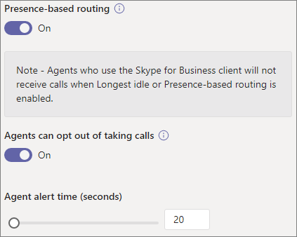

# Erstellen einer Anrufwarteschleife

Anrufwarteschleifen ermöglichen es, Anrufe an Personen in Ihrer Organisation weiterzuleiten, die bei einem bestimmten Problem oder einer bestimmten Frage helfen können. Die einzelnen Anrufe werden nach und nach an die Personen (sog. *Telefonberater*) in der Warteschleife verteilt. 

> [!TIP]
> Dieser Artikel richtet sich an große Organisationen. Wenn Ihre Organisation ein kleines Unternehmen ist, lesen Sie stattdessen das [Lernprogramm "Erstellen einer Anrufwarteschleife – Kleinunternehmen](/microsoftteams/business-voice/create-a-phone-system-call-queue-smb) ".

Für Anrufwarteschleifen gibt es die folgenden Optionen:

- Eine Begrüßungsnachricht.

- Musik, während Anrufer in der Warteschleife warten.

- Weiterleitung der Anrufe *nach Eingang* an Telefonberater.

- Optionen für das Vorgehen bei überzähligen Anrufen und Erreichen des Zeitlimits.

Stellen Sie sicher, dass Sie ["Plan for Teams auto attendants and call queues](plan-auto-attendant-call-queue.md)" gelesen haben und die [ersten Schritte](plan-auto-attendant-call-queue.md#getting-started) ausgeführt haben, bevor Sie die Verfahren in diesem Artikel ausführen.

**Weitere Informationen finden Sie unten in der [Kompatibilitätsmatrix für Anrufwarteschleifenfeatures](#call-queue-feature-compatibility) .**

## Videodemonstration

Dieses Video zeigt ein einfaches Beispiel zum Erstellen einer Anrufwarteschleife in Teams.

> [!VIDEO https://www.microsoft.com/videoplayer/embed/RWCF23?autoplay=false]

## Erstellen der Anrufwarteschleife

Gehen Sie zum Einrichten einer Anrufwarteschleife zum Microsoft Teams Admin Center, erweitern Sie **VoIP**, klicken Sie auf **Anrufwarteschleifen** und dann auf **Hinzufügen**.

Geben Sie einen Namen für die Anrufwarteschleife ein.

## Ressourcenkonten

Klicken Sie auf **Konten hinzufügen**, suchen Sie nach dem Ressourcenkonto, das Sie für diese Anrufwarteschleife verwenden möchten, klicken Sie auf **Hinzufügen** und dann nochmals auf **Hinzufügen**. (Agents sehen den Namen des Ressourcenkontos, wenn sie einen eingehenden Anruf erhalten.)

Weitere Informationen finden [Sie unter Verwalten Teams Ressourcenkonten](manage-resource-accounts.md).

## Dynamische Anrufer-ID

**Verfügbar für Teams Kanal-/Collaborative Calling-Desktopbenutzer und Teams mobile Clientbenutzer mit Standardanrufwarteschleifen**

Sie können ausgehende Anrufer-ID-Nummern für die Agents zuweisen, indem Sie ein oder mehrere Ressourcenkonten mit einer Telefonnummer angeben. Agents können auswählen, welche ausgehende Anrufer-ID-Nummer für jeden ausgehenden Anruf verwendet werden soll.

Klicken Sie auf **"Hinzufügen"**, suchen Sie nach den Ressourcenkonten, die Agents für Anrufer-ID-Zwecke bei ausgehenden Anrufen verwendet werden sollen, klicken Sie auf **"Hinzufügen"** und dann auf **"Hinzufügen"**.

**Standardanrufwarteschleifen**

Für Teams Sollten Desktopbenutzer und Standardanrufwarteschleifen die Anrufer-ID für Mitglieder der Anrufwarteschleife direkt auf die Dienstnummer der Anrufwarteschleife oder die entsprechende automatische Telefonzentrale festlegen. Weitere Informationen finden [Sie unter Verwalten von Anrufer-ID-Richtlinien in Microsoft Teams](caller-id-policies.md).

> [!NOTE]
> Dem Ressourcenkonto, das für Anruf-ID-Zwecke verwendet wird, muss eine Microsoft Teams Telefon System Virtual User-Lizenz und eine der folgenden zugewiesen sein:
>
> - Eine Anrufplanlizenz und eine zugewiesene Telefonnummer
> - Eine Telefonieanbieter zugewiesene Telefonnummer
> - Eine Online-VoIP-Routingrichtlinie (Telefonnummernzuweisung ist optional, wenn Direct Routing verwendet wird)

## Sprache

Wählen Sie eine [unterstützte Sprache](create-a-phone-system-call-queue-languages.md) aus. Diese Sprache wird für vom System generierte Sprachansagen und Voicemailtranskripte verwendet (sofern Sie diese aktivieren).

## Begrüßung und Musik während des Wartens in der Warteschleife

Legen Sie fest, ob eine Begrüßung abgespielt werden soll, wenn Anrufer in der Warteschleife eintreffen. Die gewünschte Begrüßung muss in Form einer MP3-, WAV- oder WMA-Datei hochgeladen werden. Die hochgeladene Aufzeichnung darf nicht größer als 5 MB sein.

In Microsoft Teams wird für Anrufer in der Warteschleife Standardmusik wiedergegeben. Für die in Microsoft Teams-Anrufwarteschleifen wiedergegebene Standardmusik muss Ihre Organisation keine Lizenzgebühren zahlen. Wenn Sie möchten, dass eine bestimmte Audiodatei wiedergegeben wird, klicken Sie auf **Audiodatei wiedergeben**, und laden Sie eine MP3-, WAV- oder WMA-Datei hoch.

> [!NOTE]
> Sie sind dafür verantwortlich, alle erforderlichen Rechte und Berechtigungen zur Verwendung von Musik oder Audiodateien mit Ihrem Microsoft Teams-Dienst unabhängig zu löschen und zu sichern, was geistiges Eigentum und andere Rechte an Musik, Soundeffekten, Audio, Marken, Namen und anderen Inhalten in der Audiodatei von allen relevanten Rechteinhabern umfassen kann, zu denen Künstler, Schauspieler gehören können.  Interpreten, Musiker, Songwriter, Komponisten, Plattenlabels, Musikverleger, Gewerkschaften, Gilden, Rechtsgesellschaften, Verwertungsgesellschaften und alle anderen Parteien, die die Urheberrechte, Soundeffekte, Audio- und andere Rechte an geistigem Eigentum besitzen, kontrollieren oder lizenzieren.

## Telefonberater

Überprüfen Sie die [Voraussetzungen für das Hinzufügen von Agents zu einer Anrufwarteschleife](plan-auto-attendant-call-queue.md#prerequisites).

##### Teams Kanal

Sie können bis zu 200 Agents über einen Teams Kanal hinzufügen. Sie müssen Mitglied des Teams oder ersteller oder Besitzer des Kanals sein, um der Warteschlange einen Kanal hinzufügen zu können.

Wenn Sie [einen Teams Kanal zum Verwalten der Warteschlange verwenden](https://support.microsoft.com/office/9f07dabe-91c6-4a9b-a545-8ffdddd2504e) möchten, wählen Sie die Option **"Team auswählen**" aus, und klicken Sie auf **"Kanal hinzufügen"**. Suchen Sie nach dem Team, das Sie verwenden möchten, wählen Sie es aus, und klicken Sie auf **"Hinzufügen"**. Wählen Sie den Kanal aus, den Sie verwenden möchten (nur Standardkanäle werden unterstützt), und klicken Sie auf **"Übernehmen"**. 

Die folgenden Clients werden unterstützt, wenn Sie einen Teams-Kanal für Anrufwarteschleifen verwenden: 

  - Microsoft Teams Windows-Client
  - Microsoft Teams Mac-Client

> [!NOTE]
> Wenn Sie diese Option verwenden, kann es bis zu 24 Stunden dauern, bis die Anrufwarteschleife voll funktionsfähig ist.

##### Benutzer und Gruppen

Sie können bis zu 20 Telefonberater einzeln und bis zu 200 über Gruppen hinzufügen.

Wenn Sie einzelne Benutzer oder Gruppen zur Warteschlange hinzufügen möchten, wählen Sie die Option **"Benutzer und Gruppen auswählen** " aus. 

Um einen Benutzer zur Warteschleife hinzuzufügen, klicken Sie auf **Benutzer hinzufügen**, Suchen Sie nach dem Benutzer, klicken Sie auf **Hinzufügen** und dann erneut auf **Hinzufügen**.

Um der Warteschleifee eine Gruppe hinzuzufügen, klicken Sie auf **Gruppen hinzufügen**, suchen Sie nach der Gruppe, klicken Sie auf **Hinzufügen** und dann erneut auf **Hinzufügen**. Sie können Verteilerlisten, Sicherheitsgruppen und Microsoft 365-Gruppen oder Microsoft Teams-Teams verwenden.

> [!NOTE]
> Bei Benutzern, die einer Gruppe neu hinzugefügt wurden, kann es bis zu acht Stunden dauern, bis sie den ersten Anruf erhalten.

## Anrufweiterleitung

Im **Konferenzmodus** wird die Zeit, bis ein Anrufer mit einem Telefonberater verbunden wird, nachdem dieser den Anruf akzeptiert hat, erheblich reduziert. Damit der Konferenzmodus funktioniert, müssen die Telefonberater in der Anrufwarteschleife einen der folgenden Clients verwenden:

  - Die neueste Version des Microsoft Teams-Desktopclients, der Android-App oder der iOS-App
  - Microsoft Teams Telefon Version 1449/1.0.94.2020051601 oder höher
  
Die Teams Konten von Agents müssen auf Teams-Only-Modus festgelegt werden. Telefonberater, die diese Anforderungen nicht erfüllen, werden nicht in die Anrufweiterleitungsliste aufgenommen. Es wird empfohlen, den Konferenzmodus für Ihre Anrufwarteschleifen zu aktivieren, wenn alle Ihre Telefonberater kompatible Clients verwenden.

> [!NOTE]
> Der Konferenzmodus wird nicht unterstützt, wenn Telefonanrufe von einem Direct Routing-Gateway, das für standortbasiertes Routing aktiviert ist, an die Warteschlange weitergeleitet werden.

> [!TIP]
> Das Festlegen des **Konferenzmodus** auf **"Ein** " ist die empfohlene Einstellung.

Die **Routingmethode** bestimmt die Reihenfolge, in der Anrufe aus der Warteschleife an die Telefonberater weitergeleitet werden. Wählen Sie eine der folgenden Optionen aus:

- Bei der **Weiterleitung durch Telefonzentrale** werden alle Telefonberater in der Warteschleife gleichzeitig angerufen. Der Anruf wird dem ersten Telefonberater, der den Anruf annimmt, zugewiesen.

- Bei der **seriellen Weiterleitung** werden alle Telefonberater nacheinander in der Reihenfolge angerufen, in der sie in der Liste der **Telefonberater** aufgeführt sind. Wenn ein Agent einen Anruf schließt oder nicht entgegennimmt, wird der nächste Agent angerufen. Dies wird wiederholt, bis der Anruf angenommen wird oder ein Timesout vorliegt.

- Beim **Round Robin** werden die eingehenden Anrufe gleichmäßig verteilt, sodass jeder Telefonberater dieselbe Anzahl von Anrufen aus der Warteschleife erhält. Diese Routingmethode kann in einer Eingehenden Vertriebsumgebung wünschenswert sein, um die Chancengleichheit aller Telefonisten sicherzustellen.

- Bei der Option **Längste Inaktivität** wird jeder Anruf an den am längsten inaktiven Telefonberater weitergeleitet. Ein Agent gilt als im Leerlauf, wenn sein Anwesenheitsstatus verfügbar ist. Agents, deren Anwesenheitsstatus nicht verfügbar ist, sind erst dann zum Empfangen von Anrufen berechtigt, wenn sie ihren Anwesenheitsstatus in "Verfügbar" ändern. 

> [!TIP]
> Das Festlegen **der Routingmethode** auf **Roundrobin** oder **längsten Leerlauf** ist die empfohlene Einstellung.

> [!NOTE]
> Wenn die [Complianceaufzeichnung](teams-recording-policy.md) für die Agents aktiviert ist, wird die Kombination aus **Konferenzmodus** und **Telefonzentralenrouting** nicht unterstützt. Wenn Sie den **Konferenzmodus** verwenden müssen, wählen Sie **serielles Routing**, **Roundrobin** oder **längsten Leerlauf** als **Routingmethode** aus. Wenn Sie **das Telefonzentralenrouting** verwenden müssen, legen Sie den **Konferenzmodus** auf **"Aus**" fest.
> 
> Bei Verwendung des **längsten Leerlaufs** und wenn weniger Anrufe in der Warteschleife als verfügbare Agents vorhanden sind, werden nur die ersten beiden längsten Agents im Leerlauf mit Anrufen aus der Warteschleife angezeigt.
> 
> Bei Verwendung des **längsten Leerlaufs** kann es vorkommen, dass ein Agent einen Anruf aus der Warteschleife erhält, kurz nachdem er nicht mehr verfügbar ist, oder eine kurze Verzögerung beim Empfangen eines Anrufs aus der Warteschleife, nachdem er verfügbar wurde.
> 
> Anrufpräsentationen in der Anrufwarteschleife für Agents können mit einschränkungen für standortbasiertes Routing in Konflikt stehen. In diesem Fall erhält der Agent ein Popup-Popup, kann den Anruf jedoch nicht annehmen. Diese Bedingung wird fortgesetzt, bis ein anderer Agent verfügbar ist, um den Anruf zu beantworten, der Anrufer hängt auf, oder die Timeoutbedingung für die Anrufwarteschleife tritt auf.  

Bei der **Anwesenheitsbasierten Weiterleitung** wird anhand des Verfügbarkeitsstatus der Telefonberater festgestellt, ob ein Telefonberater in die Anrufweiterleitungsliste für die ausgewählte Routingmethode eingeschlossen werden soll. Telefonberater, deren Verfügbarkeitsstatus **Verfügbar** lautet, werden in die Anrufweiterleitungsliste aufgenommen und können Anrufe erhalten. Telefonberater, deren Verfügbarkeitsstatus auf einen anderen Status festgelegt ist, werden von der Anrufweiterleitungsliste ausgeschlossen und erhalten erst dann Anrufe, wenn ihr Verfügbarkeitsstatus wieder **Verfügbar** lautet. 

Sie können die anwesenheitsbasierte Anrufweiterleitung mit jeder der Weiterleitungsmethoden aktivieren.

Wenn ein Telefonberater den Empfang von Anrufen deaktiviert hat, wird er unabhängig von seinem aktuellen Verfügbarkeitsstatus nicht in die Anrufweiterleitungsliste aufgenommen. 

> [!NOTE]
> Wenn der **längste Leerlauf** als Routingmethode ausgewählt wird, ist anwesenheitsbasiertes Routing erforderlich und automatisch aktiviert, obwohl der Umschalter "Anwesenheitsbasiertes Routing" **deaktiviert** und abgeblendet ist.
>
> Wenn die anwesenheitsbasierte Weiterleitung nicht aktiviert ist und sich mehrere Anrufe in der Warteschleife befinden, wird das System diese Anrufe an die Telefonberater gleichzeitig und unabhängig von ihrem Anwesenheitsstatus weiterleiten. Dies führt zu mehreren Anrufbenachrichtigungen an Telefonberater, insbesondere, wenn einige den anfänglichen an sie weitergeleiteten Anruf nicht beantworten.
>
> Bei Verwendung des **anwesenheitsbasierten Routings** kann es vorkommen, dass ein Agent einen Anruf aus der Warteschleife erhält, kurz nachdem er nicht verfügbar wurde, oder eine kurze Verzögerung beim Empfangen eines Anrufs aus der Warteschleife, nachdem er verfügbar wurde.
> 
> Telefonberater, die den Skype for Business-Client verwenden, werden nicht in die Anrufweiterleitungsliste aufgenommen, wenn die anwesenheitsbasierte Weiterleitung aktiviert ist. Wenn Telefonberater in Ihrer Organisation Skype for Business verwenden, aktivieren Sie die anwesenheitsbasierte Anrufweiterleitung nicht.

> [!TIP]
> Das Festlegen des **anwesenheitsbasierten Routings** auf **"Ein** " ist die empfohlene Einstellung.

Die **Telefonberater-Benachrichtigungszeit** gibt an, wie lange das Telefon eines Telefonberaters klingelt, bevor die Warteschleife den Anruf an den nächsten Telefonberater umleitet.

> [!TIP]
> Es wird empfohlen, die **Agent-Benachrichtigungszeit** auf **20 Sekunden** festzulegen.

## Vorgehen bei überzähligen Anrufen

Über die Option **Maximale Anrufe in der Warteschleife** wird festgelegt, wie viele Anrufe zu einem beliebigen Zeitpunkt maximal in der Warteschleife warten können. Der Standardwert lautet "50", möglich ist jedoch 0 bis 200. Wenn dieses Limit erreicht ist, wird ein Anruf gemäß der Angabe für die Einstellung **Wenn die maximale Anzahl von Anrufen erreicht ist** (siehe unten) behandelt.

Der Anruf kann beendet oder an eines der Anrufweiterleitungsziele umgeleitet werden. Beispielsweise könnte dem Anrufer die Möglichkeit gegeben werden, eine Voicemail für die Telefonberater in der Warteschleife zu hinterlassen. Informationen zu externen [Übertragungen finden Sie unter Voraussetzungen](plan-auto-attendant-call-queue.md#prerequisites) und externe [Telefonnummernübertragungen – technische Details](create-a-phone-system-auto-attendant.md#external-phone-number-transfers---technical-details) zur Nummernformatierung.

> [!NOTE]
> Wenn die maximale Anzahl von Anrufen auf "0" festgelegt ist, wird die Begrüßungsnachricht nicht abgespielt.

## Vorgehen bei Erreichen des Zeitlimits

Über die Einstellung **Zeitlimit für Anrufe: maximale Wartezeit** wird festgelegt, wie lange ein Anruf maximal in der Warteschleife gehalten werden kann, bevor er umgeleitet oder beendet wird. Sie können eine Dauer von 0 Sekunden bis 45 Minuten festlegen.

Der Anruf kann beendet oder an eines der Anrufweiterleitungsziele umgeleitet werden. Beispielsweise könnte dem Anrufer die Möglichkeit gegeben werden, eine Voicemail für die Telefonberater in der Warteschleife zu hinterlassen. Informationen zu externen [Übertragungen finden Sie unter Voraussetzungen](plan-auto-attendant-call-queue.md#prerequisites) und externe [Telefonnummernübertragungen – technische Details](create-a-phone-system-auto-attendant.md#external-phone-number-transfers---technical-details) zur Nummernformatierung.

Wenn Sie Ihre Zeitlimitoptionen für Anrufe ausgewählt haben, klicken Sie auf **Speichern**.

## Zusammenfassung der empfohlenen Einstellungen für die Anrufwarteschleife

Die folgenden Konfigurationen werden empfohlen:

- **Konferenzmodus** auf **"Ein**"
- **Weiterleitungsmethode** auf **Round Robin** oder **Am längsten inaktiv**
- **Anwesenheitsbasierte Weiterleitung** auf **Ein**
- **Telefonberater-Benachrichtigungszeit:** auf **20 Sekunden**

## Kompatibilität der Anrufwarteschleifenfeatures

|Feature                          |Teams Desktop1 |Teams Mobile2 |Lync |IP-Telefone | Standardanrufwarteschleifen |Kanalbasierte Anrufwarteschleifen | Kommentar |
|:--------------------------------|:------------------------:|:-----------------------:|:---:|:--------:|:--------------------:|:------------------------:|:-------------|
|**Agent-Routingmethoden**        |                          |                         |     |          |                      |                          |              |
|`Attendant Routing`              |J                         |J                        |J    |J         |J                     |J                         |*Standard*     |
|`Longest Idle`3       |J                         |J                        |N    |J         |J                     |J                         |*Empfohlen* |
|`Round Robin`                    |J                         |J                        |J    |J         |J                     |J                         |*Empfohlen* |
|`Serial`                         |J                         |J                        |J    |J         |Y4         |Y4             |              |
|**Übertragungsmodi**               |                          |                         |     |          |                      |                          |              |
|`Conference Mode`5    |J                         |J                        |N    |Y6|J                  |J                         |*Empfohlen* |
|`Transfer Mode`                  |J                         |J                        |J    |J         |J                     |J                         |              |
|Anwesenheitsbasiertes Routing3|J                        |J                        |N    |J         |J                     |J                         |*Empfohlen* |
|Agents können sich abmelden               |J                         |J                        |Y7|Y7|J          |J                         |*Standard*     |
|Kanalbasierte Warteschlangen             |J                         |N                        |N    |N         |n/a                   |Y8             |              |
|Call toast shows Resource Account Name |Y9       |J                        |J    |          |J                     |J                         |              |
|**Dynamische Anrufer-ID**            |                          |                         |     |          |                      |                          |              |
|`Standard call queue`            |N                         |J                        |N    |N         |J                     |n/a                       |              |
|`Channel based call queue`       |J                         |n/a                      |n/a  |n/a       |n/a                   |J                         |              |
|**PSTN-Konnektivitätsmethoden**    |                          |                         |     |          |                      |                          |Siehe Hinweis 10   |
|`Calling Plans`                  |J                         |J                        |J    |J         |J                     |J                         |              |
|`Direct Routing`                 |J                         |J                        |N    |N         |J                     |J                         |              |
|`Operator Connect`               |J                         |J                        |     |          |J                     |J                         |              |

Hinweise:
1. Microsoft Teams Windows Client, Microsoft Teams Mac-Client, Microsoft Teams auf virtualisierter Desktopinfrastruktur Microsoft Teams Webclient.
2. Microsoft Teams iPhone App Microsoft Teams Android-App.
3. Wenn Sie "Längster Leerlauf" für die Agent-Routingmethode auswählen, wird das anwesenheitsbasierte Routing automatisch aktiviert.
4. Die Reihenfolge kann nur festgelegt werden, wenn einzelne Benutzer als Teil der Standardanrufwarteschleifen hinzugefügt werden. Wenn eine Verteilerliste oder Teams Kanal verwendet wird, ist die Reihenfolge alphabetisch.
5. Der Konferenzmodus wird nicht unterstützt, wenn Telefonanrufe von einem Direct Routing-Gateway, das für standortbasiertes Routing aktiviert ist, an die Warteschlange weitergeleitet werden.
6. nur Microsoft Teams Telefon.
7. Über die Seite "User Einstellungen Portal" unterhttps://aka.ms/vmsettings
8. Es werden nur öffentliche Kanäle unterstützt.
9. Ausschließen Teams Webclients.
10. Automatische Telefonzentralen und Anrufwarteschleifen können keine Anrufe zwischen PSTN-Konnektivitätsmethoden übertragen.

## Unterstützte Clients

Die folgenden Clients werden für Telefonberater in einer Anrufwarteschleife unterstützt:

  - Skype for Business 2016-Desktopclient (32- und 64-Bit-Version)
  - Lync 2013-Desktopclient (32- und 64-Bit-Version)
  - Alle von Microsoft Teams unterstützten IP-Telefonmodelle. Weitere Informationen finden Sie unter [Erwerben von Telefonen für Skype for Business Online](/skypeforbusiness/what-is-phone-system-in-office-365/getting-phones-for-skype-for-business-online/getting-phones-for-skype-for-business-online).
  - Mac Skype for Business-Client (Version 16.8.196 und höher)
  - Android Skype for Business-Client (Version 6.16.0.9 und höher)
  - iPhone Skype for Business-Client (Version 6.16.0 und höher)
  - Mac Skype for Business-Client (Version 6.16.0 und höher)
  - Microsoft Teams Windows-Client (32- und 64-Bit-Versionen)
  - Microsoft Teams Mac-Client
  - Microsoft Teams auf [virtualisierter Desktopinfrastruktur](/microsoftteams/teams-for-vdi) (Windows Virtual Desktop, Citrix und VMware)
  - Microsoft Teams iPhone-App
  - Microsoft Teams Android-App

    > [!NOTE]
    > Anrufwarteschleifen, denen eine direkte Routingnummer zugewiesen ist, unterstützen keine Skype for Business-Clients, Lync-Clients oder Skype for Business-IP-Telefone als Telefonberater. Der Teams-Client wird nur mit einem [Koexistenzmodus von "Nur Teams"](/microsoftteams/setting-your-coexistence-and-upgrade-settings) unterstützt.

## Cmdlets für Anrufwarteschleifen

Windows PowerShell ermöglicht es Ihnen, Anrufwarteschleifen batch- oder programmgesteuert über die Befehlszeile zu erstellen und zu verwalten.

Mit den folgenden Cmdlets können Sie eine Anrufwarteschleife verwalten:

- [New-CsCallQueue](/powershell/module/skype/New-CsCallQueue)
- [Get-CsCallQueue](/powershell/module/skype/Get-CsCallQueue)
- [Set-CsCallQueue](/powershell/module/skype/Set-CsCallQueue)
- [Remove-CsCallQueue](/powershell/module/skype/Remove-CsCallQueue)

Die folgenden zusätzlichen Cmdlets sind auch erforderlich, um die Benutzer, Ressourcenkonten, Microsoft Teams Telefon Lizenzen, Telefonnummern, Audiodateien und die unterstützte Sprache zu verwalten, die in Anrufwarteschleifen verwendet werden:

Benutzer/Teams

- Benutzer
- - [Get-CsOnlineUser](/powershell/module/skype/Get-CsOnlineUser)

- Teams: 
- - [Get-Team](/powershell/module/teams/Get-Team)
- - [Get-TeamChannel](/powershell/module/teams/Get-TeamChannel)

Ressourcenkonten:

- [New-CsOnlineApplicationInstance](/powershell/module/skype/New-CsOnlineApplicationInstance)
- [Find-CsOnlineApplicationInstance](/powershell/module/skype/Find-CsOnlineApplicationInstance)
- [Get-CsOnlineApplicationInstance](/powershell/module/skype/Get-CsOnlineApplicationInstance)
- [Set-CsOnlineApplicationInstance](/powershell/module/skype/Set-CsOnlineApplicationInstance)
- [New-CsOnlineApplicationInstanceAssociation](/powershell/module/skype/New-CsOnlineApplicationInstanceAssociation)
- [Get-CsOnlineApplicationInstanceAssociation](/powershell/module/skype/Get-CsOnlineApplicationInstanceAssociation)
- [Remove-CsOnlineApplicationInstanceAssociation](/powershell/module/skype/Remove-CsOnlineApplicationInstanceAssociation)
- [Get-CsOnlineApplicationInstanceAssociationStatus](/powershell/module/skype/Get-CsOnlineApplicationInstanceAssociationStatus)

Virtuelle Teams Telefon-Lizenzen:

- [Get-MsolAccountSku](/powershell/module/msonline/get-msolaccountsku)
- [Set-MsolUserLicense](/powershell/module/msonline/set-msoluserlicense)

Telefon Nummernzuweisung:

- [Get-CsOnlineTelephoneNumber](/powershell/module/skype/Get-CsOnlineTelephoneNumber)
- [Set-CsPhoneNumberAssignment](/powershell/module/teams/Set-csphonenumberassignment)

Audiodateien

- [Get-CsOnlineAudioFile](/powershell/module/skype/Get-CsOnlineAudioFile)
- [Import-CsOnlineAudioFile](/powershell/module/skype/Import-CsOnlineAudioFile)
- [Export-CsOnlineAudioFile](/powershell/module/skype/Export-CsOnlineAudioFile)
- [Remove-CsOnlineAudioFile](/powershell/module/skype/Remove-CsOnlineAudioFile)

Sprachunterstützungslisten

- [Get-CsAutoAttendantSupportedLanguage](/powershell/module/skype/Get-CsAutoAttendantSupportedLanguage)

Eine schrittweise Anleitung zum Erstellen von Anrufwarteschleifen mit PowerShell finden [Sie unter Erstellen von Anrufwarteschleifen mit PowerShell-Cmdlets](create-a-phone-system-call-queue-via-cmdlets.md)

## Diagnosetool für die Anrufwarteschleife

Als Administrator können Sie mit dem folgenden Diagnosetool überprüfen, ob eine Anrufwarteschleife Anrufe empfangen kann:

1. Wählen Sie unten **Tests ausführen** aus, um das Diagnosetool im Microsoft 365 Admin füllen. 

   > [!div class="nextstepaction"]
   > [Ausführen von Tests: Teams Anrufwarteschleife](https://aka.ms/TeamsCallQueueDiag)

2. Geben Sie im Diagnosebereich "Ausführen" das Ressourcenkonto in das Feld **"Benutzername" oder "E-Mail** " ein, und wählen Sie dann **"Tests ausführen**" aus.

3. Die Tests geben die besten nächsten Schritte zurück, um alle Mandanten-, Richtlinien- und Ressourcenkontokonfigurationen zu adressieren, um zu überprüfen, ob die Anrufwarteschleife In der Lage ist, Anrufe zu empfangen.

## Verwandte Themen

[Hier erfahren Sie, was Sie mit Microsoft Teams Telefon](here-s-what-you-get-with-phone-system.md)

[Servicetelefonnummern erhalten](getting-service-phone-numbers.md)

[Verfügbarkeit von Audiokonferenzen und Anrufplänen nach Ländern und Regionen](country-and-region-availability-for-audio-conferencing-and-calling-plans/country-and-region-availability-for-audio-conferencing-and-calling-plans.md)
