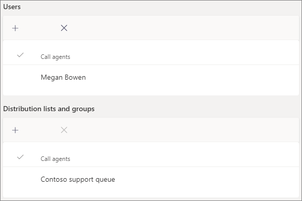

# Erstellen einer Anrufwarteschlange

Anrufwarteschleifen bieten eine Methode zum Weiterleiten von Anrufern an Personen in Ihrer Organisation, die ihnen bei einem bestimmten Problem oder einer bestimmten Frage helfen können. Anrufe werden immer nur einmal an die Personen in der Warteschlange (die als Agents bezeichnet *werden) verteilt.* 

Anrufwarteschleifen bieten:

- Eine Begrüßungsnachricht.

- Musik, während die Warteschleife in einer Warteschlange wartet.

- Anrufrouting – First *In, First Out* (FIFO)-Bestellung – an Agenten.

- Behandeln von Optionen für Warteschlangenüberlauf und Timeout.

Vergewissern Sie sich, dass Sie die Planung für automatische  Telefonisten in [Teams](plan-auto-attendant-call-queue.md) und Anrufwarteschleifen gelesen und die Schritte für die ersten Schritte befolgt haben, bevor Sie die In diesem Artikel verwendeten Verfahren ausführen.

Wenn Sie eine Anrufwarteschleife einrichten möchten, erweitern Sie im Teams Admin Center **"Sprache",** klicken Sie auf "Anrufwarteschleifen", und klicken Sie dann auf **"Hinzufügen".**

## Ressourcenkonto und Sprache

1. Geben Sie einen Namen für die Anrufwarteschleife ein. Agents wird dieser Name angezeigt, wenn sie einen eingehenden Anruf aus der Warteschlange erhalten.

2. Klicken **Sie auf "Konten hinzufügen",** suchen Sie nach dem Ressourcenkonto, das Sie mit dieser Anrufwarteschleife verwenden möchten, klicken Sie auf "Hinzufügen", und klicken Sie dann auf "Hinzufügen".  

3. Wählen Sie eine Sprache aus. Diese Sprache wird für systemgenerierte Sprachanforderungen und Voicemail-Transkription verwendet (wenn Sie sie aktivieren).

## Begrüßungen und Musik, die sich in der Warteschlange befinden

Geben Sie an, ob Anrufern eine Begrüßung vorkommt, wenn sie in der Warteschlange eintreffen. Sie müssen eine MP3-, WAV- oder WMA-Datei hochladen, die die Ansing enthält, die Sie abspielen möchten.

Teams bietet Anrufern Standardmusik, während sie sich in einer Warteschlange befinden. Wenn Sie eine bestimmte Audiodatei wiedergibt, wählen Sie **"Audiodatei** wiedergabe" aus, und laden Sie eine MP3-, WAV- oder WMA-Datei hoch.

> [!NOTE]
> Die hochgeladene Aufzeichnung darf nicht größer als 5 MB sein.
> Die in Teams-Anrufwarteschleifen bereitgestellte Standardmusik ist kostenlos und kann von Ihrer Organisation bezahlt werden. 

## Telefonmitarbeiter anrufen

Lesen Sie bitte die [Voraussetzungen,](plan-auto-attendant-call-queue.md#prerequisites) um Agents zu einer Anrufwarteschleife hinzufügen zu können.

Sie können bis zu 20 Agents einzeln und bis zu 200 Agents über Gruppen hinzufügen.

Um der Warteschlange einen Benutzer hinzuzufügen, klicken Sie auf "Benutzer hinzufügen", suchen Sie nach dem Benutzer, klicken Sie auf "Hinzufügen", und klicken Sie dann auf "Hinzufügen". 

Wenn Sie der Warteschlange eine Gruppe hinzufügen möchten, klicken Sie auf "Gruppen hinzufügen", suchen Sie nach der Gruppe, klicken Sie auf "Hinzufügen", und klicken Sie dann auf "Hinzufügen".  Sie können Verteilerlisten, Sicherheitsgruppen und Microsoft 365-Gruppen oder Microsoft Teams verwenden.

> [!NOTE]
> Neue Benutzer, die einer Gruppe hinzugefügt wurden, können bis zu acht Stunden dauern, bis ihr erster Anruf eintrifft.

## Anrufweiterleitung

**Im Konferenzmodus** wird die Zeit, die ein Anrufer benötigt, um mit einem Mitarbeiter verbunden zu werden, erheblich reduziert, nachdem der Agent den Anruf akzeptiert hat. Damit der Konferenzmodus funktioniert, müssen die Telefonmitarbeiter in der Anrufwarteschleife einen der folgenden Clients verwenden:

  - Die neueste Version des Microsoft Teams-Desktopclients, der Android-App oder der iOS-App
  - Microsoft Teams Phone, Version 1449/1.0.94.2020051601 oder höher
  
Die Teams-Konten der Agents müssen auf den Nur-Teams-Modus festgelegt sein. Agents, die die Anforderungen nicht erfüllen, sind nicht in der Anrufroutingliste enthalten. Es wird empfohlen, den Konferenzmodus für Ihre Anrufwarteschleifen zu aktivieren, wenn ihre Agents alle kompatible Clients verwenden.

**Die Routingmethode** bestimmt die Reihenfolge, in der Agents Anrufe von der Warteschlange empfangen. Wählen Sie eine der folgenden Optionen aus:

- **Die Telefonleitung ringt** alle Agents in der Warteschlange gleichzeitig. Der erste Anrufer, der den Anruf abbekommt, erhält den Anruf.

- **Durch das serielle** Routing werden alle Telefonanrufer in der in der Anruferliste angegebenen Reihenfolge **eins nach dem anderen** ringen. Wenn ein Mitarbeiter den Anruf schließt oder nicht an nimmt, klingelt der Anruf beim nächsten Mitarbeiter und versucht alle Mitarbeiter, bis er abgeholt wird oder ein Zeit raus ist.

- **Round balances** the routing of incoming calls so that each call agent gets the same number of calls from the queue. Dies kann in einer eingehenden Verkaufsumgebung wünschenswert sein, um die gleiche Chance für alle Telefonmitarbeiter zu gewährleisten.

- **Der längste Leerlauf** leitet jeden Anruf an den Agent weiter, der die längste Zeit im Leerlauf war. Ein Agent gilt als im Leerlauf, wenn sein Anwesenheitsstatus verfügbar ist oder wenn sein Anwesenheitsstatus für weniger als 10 Minuten "Abgang" war. Agents, deren Anwesenheitsstatus für mehr als 10 Minuten "Abgang" war, werden nicht als "Leerlauf" betrachtet und sind nicht berechtigt, Anrufe zu empfangen, bis sie ihren Anwesenheitsstatus in "Verfügbar" ändern. 

**Bei anwesenheitsbasiertem Routing** wird anhand des Verfügbarkeitsstatus von Telefonanrufmitarbeitern ermittelt, ob ein Agent in die Anrufroutingliste für die ausgewählte Routingmethode aufgenommen werden soll. Telefonmitarbeiter, deren Verfügbarkeitsstatus auf **"Verfügbar"** festgelegt ist, sind in der Anrufroutingliste enthalten und können Anrufe empfangen. Agents, deren Verfügbarkeitsstatus auf einen anderen Status festgelegt ist, werden aus der Anrufroutingliste ausgeschlossen und empfangen erst dann Anrufe, wenn sich ihr Verfügbarkeitsstatus wieder in "Verfügbar" **ändert.** 

Sie können das anwesenheitsbasierte Anrufrouting mit jeder der Routingmethoden aktivieren.

Wenn ein Agent das Erhalten von Anrufen abmeldet, wird er nicht in die Anrufroutingliste aufgenommen, unabhängig davon, wie der Verfügbarkeitsstatus festgelegt ist. 

> [!NOTE]
> Agents, die den Skype for Business-Client verwenden, werden nicht in die Anrufroutingliste aufgenommen, wenn anwesenheitsbasiertes Routing aktiviert ist. Wenn Sie über Agenten verfügen, die Skype for Business verwenden, aktivieren Sie die anwesenheitsbasierte Anrufrouting nicht.

**Die Warnungszeit des** Agents gibt an, wie lange das Telefon eines Agents klingelt, bevor die Warteschlange den Anruf an den nächsten Agent weiterleitelt.

Für Warteschlangen mit hoher Lautstärke empfehlen wir die folgenden Einstellungen:

- **Konferenzmodus in** **"Auto"**
- **Routingmethode zum** **Routing an die Attendant**
- **Anwesenheitsbasiertes Routing** an **"Ein"**
- **Agentbenachrichtigungszeit:** bis **20 Sekunden**

## Anrufüberlaufbehandlung

**Die maximale Anzahl von Anrufen in** der Warteschlange gibt die maximale Anzahl von Anrufen an, die zu einem bestimmten Zeitpunkt in der Warteschlange warten können. Der Standardwert ist 50, kann aber zwischen 0 und 200 liegen. Wenn dieses Limit erreicht ist, wird der Anruf wie durch die Einstellung "Wenn die maximale Anzahl von Anrufen erreicht ist" **angegeben** behandelt.

Sie können den Anruf trennen oder an eines der Anrufroutingziele umleiten. So könnten Sie beispielsweise den Anrufer dazu anstellen lassen, eine Voicemail für die Telefonmitarbeiter in der Warteschlange zu hinterlassen. Informationen zu externen Übertragungen finden Sie [unter](plan-auto-attendant-call-queue.md#prerequisites) "Voraussetzungen" und "Übertragungen von externen Telefonnummern [– technische Details](create-a-phone-system-auto-attendant.md#external-phone-number-transfers---technical-details) zur Zahlenformatierung".

> [!NOTE]
> Wenn die maximale Anzahl von Anrufen auf 0 festgelegt ist, wird die Begrüßungsnachricht nicht abspielen.

## Behandlung von Anruftimeouts

**Anruftimeout: Die maximale Wartezeit** gibt an, wie lange ein Anruf in der Warteschlange maximal halten kann, bevor er umgeleitet oder getrennt wird. Sie können einen Wert zwischen 0 Sekunden und 45 Minuten angeben.

Sie können den Anruf trennen oder an eines der Anrufroutingziele umleiten. So könnten Sie beispielsweise den Anrufer dazu anstellen lassen, eine Voicemail für die Telefonmitarbeiter in der Warteschlange zu hinterlassen. Informationen zu externen Übertragungen finden Sie [unter](plan-auto-attendant-call-queue.md#prerequisites) "Voraussetzungen" und "Übertragungen von externen Telefonnummern [– technische Details](create-a-phone-system-auto-attendant.md#external-phone-number-transfers---technical-details) zur Zahlenformatierung".

Wenn Sie die Optionen für die Anruftimeout ausgewählt haben, klicken Sie auf **"Speichern".**

## Anrufer-ID für ausgehende Anrufe

Da telefonierende Mitarbeiter in einer Anrufwarteschleife anrufen können, um einen Kundenanruf zurückzukehren, sollten Sie die Anrufer-ID für Mitglieder einer Anrufwarteschleife auf die Servicenummer einer entsprechenden automatischen Telefonwarteschleife festlegen. Weitere Informationen finden Sie unter "Verwalten [von Anrufer-ID-Richtlinien in Microsoft Teams".](caller-id-policies.md)

## Unterstützte Clients

Die folgenden Clients werden für Telefonmitarbeiter in einer Anrufwarteschleife unterstützt:

  - Skype for Business Desktop client 2016 (32-Bit- und 64-Bit-Version)
  - Lync Desktop Client 2013 (32-Bit- und 64-Bit-Version)
  - Alle für Microsoft Teams unterstützten IP-Telefonmodelle. Weitere Informationen finden Sie unter [Kauf von Telefonen für Skype for Business Online](/skypeforbusiness/what-is-phone-system-in-office-365/getting-phones-for-skype-for-business-online/getting-phones-for-skype-for-business-online).
  - Mac Skype for Business-Client (Version 16.8.196 und höher)
  - Android Skype for Business-Client (Version 6.16.0.9 und höher)
  - iPhone Skype for Business-Client (Version 6.16.0 und höher)
  - Mac Skype for Business-Client (Version 6.16.0 und höher)
  - Microsoft Teams Windows Client (32-Bit- und 64-Bit-Version)
  - Microsoft Teams Mac-Client
  - Microsoft Teams iPhone-App
  - Microsoft Teams -Android-App

    > [!NOTE]
    > Anrufwarteschleifen, denen eine direkte Routingnummer zugewiesen ist, unterstützen keine Skype for Business-Clients, Lync-Clients oder Skype for Business-IP-Telefone als Agents.

## Cmdlets für Anrufwarteschleifen

Sie können auch Windows PowerShell verwenden, um automatische Telefonzentralen zu erstellen und einzurichten. Dies sind die Cmdlets, die Sie zum Verwalten einer Anrufwarteschleife verwenden.

- [New-CsCallQueue](https://docs.microsoft.com/powershell/module/skype/new-CsCallQueue)

- [Set-CsCallQueue](https://docs.microsoft.com/powershell/module/skype/set-CsCallQueue)

- [Get-CsCallQueue](https://docs.microsoft.com/powershell/module/skype/get-CsCallQueue)

- [Remove-CsCallQueue](https://docs.microsoft.com/powershell/module/skype/remove-CsCallQueue)

## Verwandte Themen

[Das Telefonsystem bietet Ihnen Folgendes](here-s-what-you-get-with-phone-system.md)

[Abrufen von Diensttelefonnummern](getting-service-phone-numbers.md)

[Verfügbarkeit von Audiokonferenzen und Anrufplänen nach Ländern und Regionen](country-and-region-availability-for-audio-conferencing-and-calling-plans/country-and-region-availability-for-audio-conferencing-and-calling-plans.md)

[New-CsOnlineApplicationInstance](https://docs.microsoft.com/powershell/module/skype/new-csonlineapplicationinstance)

[Einführung in Windows PowerShell und Skype for Business Online](/SkypeForBusiness/set-up-your-computer-for-windows-powershell/set-up-your-computer-for-windows-powershell)
