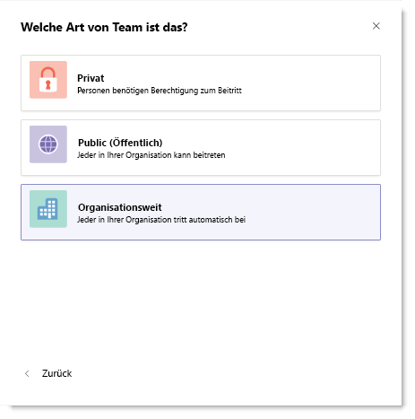

# Erstellen Sie ein Team Org geltende in Microsoft-TeamsCreate an org-wide team in Microsoft Teams

Org geltende Teams bieten eine automatische Möglichkeit für alle Benutzer in einem kleinen, mittelgroßen Unternehmen angehören eines einzelnen Teams für die Zusammenarbeit.Org-wide teams provide an automatic way for everyone in a small to medium-sized organization to be a part of a single team for collaboration. 
 
Mit Org geltende-Teams können globale Administratoren auf einfache Weise öffentliche Teams erstellen, die in jeder Benutzer in der Organisation abruft und hält die Mitgliedschaft Stand mit Active Directory als Benutzer teilnehmen und die Organisation verlassen.With org-wide teams, global administrators can easily create a public team that pulls in every user in the organization and keeps the membership up to date with Active Directory as users join and leave the organization. Nur globale Administratoren können Org geltende Teams erstellen und ein gesamte Org Team ist derzeit auf Organisationen mit nicht mehr als 2.500 Benutzer beschränkt.Only global admins can create org-wide teams and currently an org-wide team is limited to organizations with no more than 2,500 users. Wenn diese Anforderungen erfüllt sind, sehen Admins **Org geltende** als Option unter **Datenschutz** , wenn ein Team erstellen.If these requirements are met, admins will see **Org-wide** as an option under **Privacy** when creating a team.

![Screenshot der Option zum Erstellen eines Teams Org geltende Org geltende] (media/create-org-wide-team.png "Screenshot der Option zum Erstellen eines Teams Org geltende Org geltende")

> [!NOTE]
> Wenn die Option **gesamte Org** nicht angezeigt werden, wenn Sie ein Team erstellen und Sie ein globaler Administrator sind, das Feature möglicherweise noch Rollout oder Ihrer Organisation möglicherweise mehr als die aktuelle maximale Größe der 2.500 Elemente.If you don't see the **Org-wide** option when creating a team and you're a global admin, the feature might still be rolling out or your organization might have more than the current size limit of 2,500 members. Wir suchen, um diese in Zukunft erhöhen.We're looking to increase this limit in future.

Wenn ein Team Org geltende erstellt wird, werden alle globale Administratoren als Team Besitzer hinzugefügt, und alle aktiven Benutzer werden als Teammitglieder hinzugefügt.When an org-wide team is created, all global admins are added as team owners and all active users are added as team members. Benutzer, die für Teams, Gastbenutzer und die meisten Chatrooms deaktiviert sind, werden nicht an das Team hinzugefügt.Users who are disabled for Teams, guest users, and most rooms aren't added to the team. Verzeichnis Ihrer Organisation wird aktualisiert, sodass neue aktive Benutzer enthalten oder wenn der Benutzer ist nicht mehr in Ihrem Unternehmen arbeiten und die Lizenz Teams deaktiviert ist, automatisch Änderungen werden synchronisiert, und die Benutzer hinzugefügt oder aus dem Team entfernt werden.As your organization's directory is updated to include new active users or if users no longer work at your company and their Teams license is disabled, changes are automatically synced and the users are added or removed from the team. Teammitglieder können kein gesamte Org Team lassen.Team members can't leave an org-wide team. Sie können als Teambesitzer manuell hinzufügen oder Entfernen von Benutzern bei Bedarf.As a team owner, you can manually add or remove users if needed.

> [!NOTE]
> Chatrooms, die nicht Teil einer Raum Liste, Equipment und Ressource Konten sind möglicherweise hinzugefügt oder an das Team der gesamte Org synchronisiert werden.Rooms that aren't a part of a room list, equipment, and resource accounts might be added or synced to the org-wide team. Team Besitzer können auf einfache Weise diese Konten aus dem Team entfernen.Team owners can easily remove these accounts from the team.

## Bewährte MethodenBest practices
Wenn die für die optimale Nutzung Ihrer Org geltende Team erhalten möchten, empfehlen wir Team Besitzer die folgenden Schritte aus.To get the most out of your org-wide team, we recommend team owners do the following.

### Zulassen Sie nur Team Besitzer für die Bereitstellung auf den allgemeinen KanalAllow only team owners to post to the General channel
Rauschen Sie DDE-Kanal Ausführungsstapel nur Team aus, dem Besitzer der allgemeinen Kanal veröffentlichen.Reduce channel noise by having only team owners post to the General channel. Besuchen Sie das Team aus, und klicken Sie auf **Weitere Optionen (...)**  >  **Team verwalten**.Go to the team and click **More options (…)** > **Manage Team**. Klicken Sie auf der Registerkarte **Einstellungen** auf **Member Berechtigungen** > Wählen Sie **nur die Eigentümer Nachrichten senden können**.On the **Settings** tab, click **Member permissions** > select **Only owners can post messages**.
### Deaktivieren Sie @team und @ erwähnungen [Teamname]Turn off @team and @[team name] mentions
 Reduzieren Sie um zu verhindern, dass die gesamte Organisation überladen @mentions.Reduce @mentions to keep them from overloading the entire organization. Besuchen Sie das Team aus, und klicken Sie auf **Weitere Optionen (...)**  >  **Team verwalten**.Go to the team and click **More options (…)** > **Manage Team**. Klicken Sie auf der Registerkarte **Einstellungen** auf **@mentions** > deaktivieren **Member anzeigen die Option zum @team oder @[Teamname]**.On the **Settings** tab, click **@mentions** > turn off **Show members the option to @team or @[team name]**. 
### Automatisch bevorzugte wichtige KanäleAutomatically favorite important channels
 Bevorzugte wichtige Kanäle sicherzustellen, dass jede Person in Ihrer Organisation bestimmte Unterhaltungen abwickelt.Favorite important channels to ensure everyone in your organization engages in specific conversations. Finden Sie weitere Informationen finden Sie unter [Automatische Favoriten Kanäle für das gesamte Team](https://support.office.com/article/auto-favorite-channels-for-the-whole-team-a948272c-5aa5-429c-863c-4e1e1cd6b0f6).To learn more, see [Auto-favorite channels for the whole team](https://support.office.com/article/auto-favorite-channels-for-the-whole-team-a948272c-5aa5-429c-863c-4e1e1cd6b0f6).

### Entfernen von Konten, die möglicherweise nicht angehören.Remove accounts that might not belong
Obwohl die Mitglieder einer Organisation geltende Team, als Teambesitzer, lassen Sie können nicht können Sie das Teammitglied durch Entfernen von Konten, die nicht gehören verwalten.Even though members can’t leave an org-wide team, as a team owner, you can manage the team roster by removing accounts that don’t belong. Stellen Sie sicher, dass Sie Teams verwenden, um Benutzer von Ihrem Team Org geltende zu entfernen.Make sure you use Teams to remove users from your org-wide team.  Wenn Sie eine andere Möglichkeit zum Entfernen eines Benutzers, wie beispielsweise Microsoft 365 Administrationscenter oder aus einer Gruppe in Outlook verwenden, kann der Benutzer zurück an das Team der gesamte Org hinzugefügt.If you use another way to remove a user, such as the Microsoft 365 admin center or from a group in Outlook, the user might be added back to the org-wide team. 
