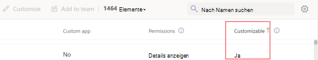
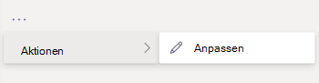
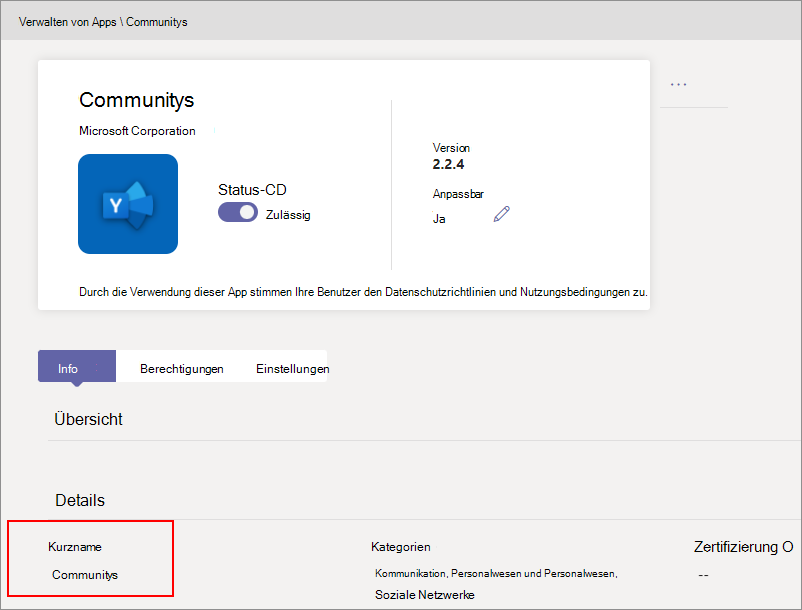
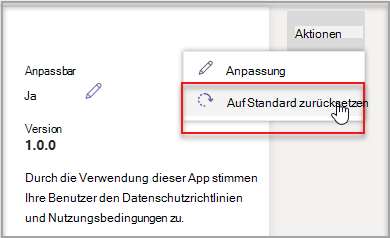

# Anpassen von Apps in Microsoft Teams

 Microsoft Teams bietet App-Anpassungen, um die Benutzererfahrung Teams verbessern. Einige App-Entwickler lassen zu, dass eine App vom Administrator Teams werden kann. Der Administrator kann die App-Eigenschaften basierend auf den Organisationsanforderungen über die Seite Teams Admin Center Apps verwalten anpassen **oder umbenennen.** Die Details können Sie anpassen:

- Kurzname
- Kurzbeschreibung
- Vollständige Beschreibung
- URL der Datenschutzrichtlinie
- Website-URL
- URL der Nutzungsbedingungen
- Symbol "Farbe"
- Symbol "Gliederung"
- Akzentfarbe

Details zu [den Teams,](/microsoftteams/platform/resources/schema/manifest-schema) die Sie anpassen können, finden Sie im Schema "Manifest Teams".

> [!NOTE]
> Das Anpassen von Apps wird in Government Community Cloud High (GCCH) oder Department of Defense (DoD) derzeit nicht unterstützt.
> Derzeit ist dieses Feature für seitengeladene Apps Microsoft Teams verfügbar.

## Anpassen der App-Details

Führen Sie die folgenden Schritte aus, um mit dem Anpassen einer App zu beginnen:

1. Melden Sie sich beim Microsoft Teams Admin Center an.
2. Erweitern Teams **Apps, und** wählen Sie **Apps verwalten aus.**
3. Überprüfen Sie die **Spalte Anpassbar** der App-Liste, und sortieren Sie nach anpassbaren Apps.

   

   Es gibt drei Einstiegspunkte für den Zugriff auf das Feature "Anpassen":

   - Wählen Sie neben der App aus, die Sie anpassen möchten, und wählen Sie dann **Anpassen aus.**

     

   - Wählen Sie den App-Namen und dann **Anpassbar aus.**

     

   - Wählen Sie den App-Namen und dann in **der Dropdownliste** Aktionen die Option **Anpassen** aus.

     

4. Erweitern Sie den **Abschnitt Details,** und passen Sie die folgenden Felder an:

    - Kurzname
    - Kurzbeschreibung
    - Vollständige Beschreibung
    - Website
    - URL der Datenschutzrichtlinie
    - URL der Nutzungsbedingungen

   

> [!Note]
> Nur die Felder, die der App-Entwickler als anpassbar zugewiesen hat, sind sichtbar.

5. Erweitern Sie **den Bereich Symbol.**

   a. Hochladen symbol Verwenden Sie ein Vollfarbsymbol (192 x 192) Pixel im PNG-Format.

   b. Wählen Sie eine Symbolkonturfarbe aus. Verwenden Sie ein transparentes Gliederungspixel (32 x 32) im PNG-Format.

   c. Wählen Sie eine App-Akzentfarbe aus, die dem Symbol entspricht.

    

6. Nachdem Die App angepasst wurde, wählen Sie **Übernehmen aus.**

7. Wählen Sie **Veröffentlichen** aus, um die angepasste App zu veröffentlichen.

   Die angepasste App wird jetzt auf der Seite **Apps verwalten** aufgeführt. Sie verfügen nur über eine Version der App, da beim Anpassen der App-Features keine Kopie der App erstellt wird.

Jetzt können Teams Benutzer ihren Client Teams öffnen, um die angepasste App zu sehen.

   

### Besondere Aspekte beim Anpassen einer App

Die folgende Notiz enthält wichtige Details zum Anpassen einer App.

> [!Note]
> - Achten Sie beim Anpassen von Apps und beschreibungen im Zusammenhang mit einer App darauf, dass Sie alle Anpassungsrichtlinien befolgen, die vom App-Herausgeber in der Dokumentation oder den Nutzungsbedingungen bereitgestellt werden. Sie sind auch für die Einhaltung der Rechte anderer im Hinblick auf Bilder von Drittanbietern verantwortlich, die Sie möglicherweise verwenden.
> - Vom Administrator bereitgestellte Anpassungsdaten werden in der nächstgelegenen Region gespeichert.
> - Sie sind dafür verantwortlich sicherzustellen, dass Links zu Nutzungsbedingungen oder Datenschutzrichtlinien gültig sind.
> - Falls der App-Herausgeber ein Feld nicht mehr anpassen kann, wird auf der Seite mit den App-Details eine Meldung angezeigt, die den Administrator über die Felder informiert, die nicht mehr angepasst werden können. Alle an diesem Feld vorgenommenen Änderungen werden auf die ursprünglichen Werte zurückgesetzt.
> - Wir empfehlen, Änderungen an der App-Anpassung in einem Teams zu testen, bevor Sie diese Änderungen in der Produktionsumgebung vornehmen.
> - Bei Änderungen am Branding kann es bis zu 24 Stunden dauern, bis die Benutzer die Änderungen sehen können.

## Überprüfen von App-Details

Möglicherweise möchten Sie die App-Details sehen, um die Informationen zu überprüfen.

1. Melden Sie sich beim Microsoft Teams Admin Center an.

2. Erweitern Sie **Microsoft Teams-Apps**, und wählen Sie **Apps verwalten** aus.

3. Wählen Sie den App-Namen aus.

4. Zeigen Sie die App-Details an, einschließlich des ursprünglichen App-Namens **Kurzname von Herausgeber**.

   

   Das **Feld "Kurzname aus** Herausgeber" ist nur sichtbar, wenn Sie den Kurznamen der App geändert haben.

## App-Details auf Standard zurücksetzen

Sie können die App-Details jederzeit auf die ursprünglichen Einstellungen zurücksetzen.

1. Melden Sie sich beim Microsoft Teams Admin Center an.

2. Erweitern Teams **Apps, und** wählen Sie **Apps verwalten aus.**

3. Wählen Sie den App-Namen aus.

4. Wählen **Sie in der Dropdownliste** Aktionen die Option Auf Standard **zurücksetzen** aus.

   

## Häufig gestellte Fragen

**Wie lange dauert es, bis meine Benutzer die angepasste App sehen?**

Obwohl der Administrator die Änderungen sofort im Teams Admin Center sehen kann, kann es bis zu 24 Stunden dauern, bis die Endbenutzer die Änderungen sehen.  

**Kann der App-Anbieter die App für seine Kunden anpassen?**

 Nein, der Administrator eines Mandanten muss die App für seinen Mandanten über das Admin Center Teams anpassen.

**Wird die angepasste App automatisch bereitgestellt, um meine aktuelle benutzerdefinierte App in einem Mandanten zu ersetzen?**

Nein, die Mandantenadministratoren müssen jede benutzerdefinierte App manuell entfernen und die angepasste Version der App veröffentlichen. Wenn Sie eine App angepasst und als benutzerdefinierte App veröffentlicht haben, ersetzt die neue App die aktuelle benutzerdefinierte App nicht durch die App-Anpassung.  

**Werden im Bericht zur App-Verwendung auch die angepassten Werte wie angepasste Kurznamen angezeigt?**

 Nein, im Bericht zur App-Verwendung wird weiterhin der ursprüngliche Name der App angezeigt, die vom Herausgeber gesendet wurde.

**Welche Apps kann ich mithilfe des Features zum Anpassen der App anpassen?**

Sie können nur Apps anpassen, die vom App-Herausgeber angepasst werden können. Der App-Herausgeber muss sich dafür entscheiden, um es seinen Kunden zu ermöglichen, die App anzupassen.

**Werden die angepassten Eigenschaften auf dem Bildschirm mit der Diagrammberechtigung angezeigt?**

Nein, auf dem Bildschirm mit der Zustimmung wird weiterhin der ursprüngliche Wert angezeigt, der vom Herausgeber gesendet wurde.

## Verwandter Artikel

- [Verwalten von Apps](manage-apps.md)
- [Anpassen Ihres App Store](customize-your-app-store.md)
- [Umbenennen Ihrer Apps](https://techcommunity.microsoft.com/t5/microsoft-teams-blog/rebrand-apps-to-your-own-organization-s-branding-with-app/ba-p/2376296)
