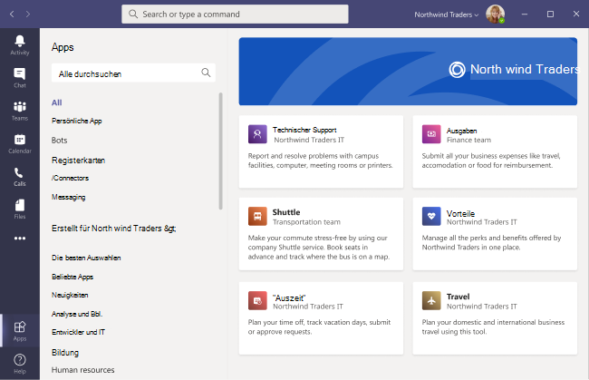

# Store für benutzerdefinierte Apps in Microsoft Teams

Jetzt können Sie den App Store Ihrer Organisation in Teams mit Ihrem Unternehmensbranding anpassen, indem Sie Ihr Logo, benutzerdefinierte Hintergründe und benutzerdefinierte Textfarben hinzufügen, um den Store für Endbenutzer noch einladender zu gestalten.

> [!Note]
> Änderungen am Branding benötigen 24 Stunden, bis sie wirksam werden.

Sie können im Admin Center auf den Store zum Anpassen zugreifen, indem Sie Teams  >  **Store anpassen auswählen.**

  

In diesem Artikel werden die Store-Features von benutzerdefinierten Apps und deren Verwendung beschrieben.

## Anpassen Ihres Organisationslogos

<!-- Bookmark used by Context Sensitive Help (CSH). Do not delete. -->

<!-- Do not remove the bookmark link above. -->

Hier können Sie Ihr Organisationslogo hochladen. Das ausgewählte Logo wird auf dem Teams in **"Apps,**  >  **die für Ihren Mandanten erstellt wurden"** angezeigt.

Wenn Sie die Option **Bild auswählen** auswählen auswählen, können Sie die Datei Ihrer Wahl hochladen. Das Logo sollte 240 x 60 Groß sein, oder es wird auf diese Größe skaliert. Er sollte nicht größer als 5 MB sein. Die unterstützten Formate sind:

- SVG
- .png
- .jpg

Das Logo wird in der oberen rechten Ecke des Mandanten-App-Katalogs im Teams angezeigt.

## Anpassen Ihres kleinen Logos

<!-- Bookmark used by Context Sensitive Help (CSH). Do not delete. -->

<!-- Do not remove the bookmark link above. -->

Das Logo Ihrer Organisation oder ein kleines Logo ist ein Bild oder Symbol, das Ihre Organisationsmarke darstellt und Ihren Firmennamen nicht enthält. Die Lovemark hilft Teammitgliedern, den App-Store zu identifizieren. Das ausgewählte Logo wird auf der Seite "Teams"-Client angezeigt.

Wenn Sie die Option **Bild auswählen** auswählen auswählen, können Sie die Datei Ihrer Wahl hochladen. Das Logo sollte 32 x 32 Pixel groß sein, oder es wird auf diese Größe skaliert. Er sollte nicht größer als 5 MB sein. Die unterstützten Formate sind:

- SVG
- .png
- .jpg

Das kleine Logo wird  neben dem Abschnittstitel Für Mandanten erstellt auf der Startseite des Teams angezeigt.

## Anpassen der Hintergrundfarbe

<!-- Bookmark used by Context Sensitive Help (CSH). Do not delete. -->

<!-- Do not remove the bookmark link above. -->

Stellen Sie sicher, dass der Hintergrund genügend Kontrast zum Text hat, damit die Benutzer den Text deutlich lesen können. Der Hintergrund wird im Teams in **Apps angezeigt,**  >  **die für Ihren Mandantenheader erstellt** wurden.

Sie haben nun die folgenden Optionen:

- Verwenden Teams standardhintergrunddesigns des Clients
- Wählen Sie ein Bild aus. Wenn Sie das Hintergrundbild auswählen, können Sie die Datei Ihrer Wahl hochladen. Der Hintergrund sollte 1212 x 100 Pixel groß sein, oder er wird auf diese Größe skaliert. Er sollte nicht größer als 5 MB sein. Die unterstützten Formate sind:
  - SVG
  - .png
  - .jpg
- Wählen Sie einen benutzerdefinierten Hintergrund aus. Wenn Sie **Benutzerdefinierte Farbe auswählen**, wird eine Farbauswahl geöffnet. Wählen Sie die farbe aus, die Sie wünschen, indem Sie die Skalierung der Farbauswahl anpassen.

Das Hintergrundbild oder die Hintergrundfarbe wird als Hintergrund für das oberste Banner im Katalog Teams Mandanten-App verwendet.

## Anpassen der Textfarbe Ihres Namens

<!-- Bookmark used by Context Sensitive Help (CSH). Do not delete. -->

<!-- Do not remove the bookmark link above. -->

Stellen Sie sicher, dass die Textfarbe genügend Kontrast zum Hintergrund hat, damit die Benutzer den Namen Ihrer Organisation deutlich lesen können. Der Text wird im Client Teams in **Apps angezeigt,**  >  **die für Ihren Mandantenkopf erstellt** wurden.

Wenn Sie **Benutzerdefinierte Farbe auswählen**, wird eine Farbauswahl geöffnet. Wählen Sie die farbe aus, die Sie wünschen, indem Sie die Skalierung der Farbauswahl anpassen.

 

## Abschließen der Anpassung Des Store für Team-Apps

Wenn Sie mit dem Anpassen Ihres App Store fertig sind, stellen Sie sicher, dass Sie Speichern **auswählen,** um Ihre Änderungen zu speichern.
Wenn Sie eine Vorschau Ihrer Änderungen anzeigen möchten, wählen Sie **App Store in** der Vorschau anzeigen aus, um eine Darstellung Ihrer angepassten Apps anzuzeigen.

> [!Note]
> Die Darstellung kann sich von der endgültigen Version Ihres benutzerdefinierten App-Store unterscheiden, da einige Standardfarben auf der Version Ihres Teams basieren.

## Verwandter Artikel

[Verwalten Ihrer Apps](manage-apps.md)
