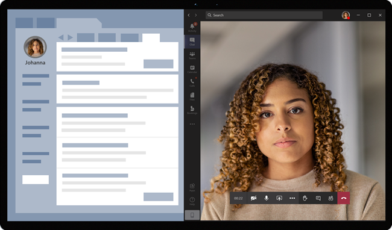

# Virtuelle Besuche mit Teams - Integration in epische EHR

Der Microsoft Teams Connector für elektronische Krankenakten (EHR) erleichtert Klinikbetreibern die Einführung eines virtuellen Patientenbesuchs oder die Abstimmung mit einem anderen Anbieter in Microsoft Teams direkt aus dem Epischen EHR-System. Das auf der Microsoft 365-Cloud Teams-Programm ermöglicht einfache, sichere Zusammenarbeit und Kommunikation mit Chat-, Video-, Sprach- und Gesundheitstools in einem einzigen Hub, der die Einhaltung von HIPAA, HITECH-Zertifizierung und mehr unterstützt.

Die Kommunikations- und Zusammenarbeitsplattform von Teams macht es für Klinikisten einfach, die Unübersichtlichkeit fragmentierter Systeme zu durchschneiden, sodass sie sich auf die Bereitstellung der bestmöglichen Behandlung konzentrieren können. Mit dem Teams EHR-Verbinder können Sie:

- Starten Teams virtuelle Besuche mit Ihrem Epischen EHR-System mit einem integrierten klinischen Workflow.
- Ermöglichen Sie es Patienten, an Teams Visiten über das Patientenportal oder per SMS teil zu nehmen.
- Unterstützen Sie andere Szenarien für virtuelle Visite, z. B. Für mehrere Teilnehmer, Gruppenbesuche und Kundendienstdienste.
- Schreiben Sie Metadaten über virtuelle Besuche Teams an das EHR-System zurück, um zu zeichnen, wenn Teilnehmer eine Verbindung herstellen, die Verbindung trennen und die automatische Überwachung und Aufbewahrung von Aufzeichnungen aktivieren.
- Zeigen Sie Verbrauchsdatenberichte und anpassbare Informationen zur Anrufqualität für mit EHR verbundene Besuche an.

Schauen Sie sich dieses Video an, um einen Überblick über das Verwalten virtueller Besuche über das EHR-Portal zu erhalten.

> [!VIDEO https://www.microsoft.com/videoplayer/embed/RE4HAtn]

In diesem Artikel wird beschrieben, wie Sie den Connector Teams EHR für die Integration in die Epische Plattform in Ihrer Gesundheitsorganisation einrichten und konfigurieren. Darüber hinaus erhalten Sie einen Überblick über Teams Erfahrung mit virtuellen Besuchen aus dem Epischen EHR-System.

## Bevor Sie beginnen

Bevor Sie beginnen, müssen Sie sich auf die Integration vorbereiten.

### Machen Sie sich mit dem Integrationsprozess vertraut

Lesen Sie die folgenden Informationen, um einen Überblick über den gesamten Integrationsprozess zu erhalten.

:::image type="content" source="media/ehr-connector-epic-flow.png" alt-text="Bild mit einer Zusammenfassung der Schritte im gesamten Integrationsprozess.":::

||||||
|---------|---------|---------|---------|---------|
|**Aktion**: Sie [fordern Zugriff auf die App Teams an](#request-access-to-the-teams-app).   **Ergebnis**: Wir autorisieren Ihre Organisation für Tests.|**Aktion**: Wir erstellen ein Zertifikat für einen öffentlichen und einen privaten Schlüssel und laden es in "Episch" hoch.   **Ergebnis**: Epische Synchronisierung des Zertifikats für den öffentlichen Schlüssel.|**Aktion**: Sie führen die Konfigurationsschritte im Konfigurationsportal für den EHR-Connector aus.   **Ergebnis**: Sie erhalten FDI-Einträge für epische Konfiguration.| **Aktion**: Sie arbeiten mit Ihrem epischen technischen Experten zusammen, um FDI-Einträge in Epe zu konfigurieren.  **Ergebnis**: Die Konfiguration wurde abgeschlossen. Bereit zum Testen.|**Aktion**: Sie führen die Tests in Ihrer Testumgebung durch.  **Ergebnis**: Vollständige Überprüfung der Flüsse und Entscheidung für den Umzug in die Produktion.|

### Anfordern des Zugriffs auf die Teams-App

Sie müssen den Zugriff auf die App Teams anfordern.

1. Fordern Sie das Herunterladen der Teams-App im [Marketplace "Epische App-Obstplantage" an](https://apporchard.epic.com/Gallery?id=6153). Dadurch wird eine Anforderung von Epe an das Microsoft EHR-Connectorteam ausgelöst.
1. Nachdem Sie Ihre Anforderung gestellt haben, senden Sie eine E-Mail an [TeamsForHealthcare@microsoft.com](mailto:TeamsForHealthcare@microsoft.com) mit dem Namen Ihrer Organisation, der Mandanten-ID und der E-Mail-Adresse Ihres epischen technischen Kontakts.
1. Das Microsoft EHR-Connectorteam antwortet auf Ihre E-Mail mit der Bestätigung der Aktivierung.

### Lesen des Epic-Microsoft Teams zur Telehealth-Integration

Überprüfen Sie den [Epic – Microsoft Teams Telemedizin-Integrationsleitfaden](https://galaxy.epic.com/Search/GetFile?Url=1!68!100!100100357) mit Ihrem technischen Epic-Spezialisten. Stellen Sie sicher, dass alle Voraussetzungen erfüllt sind.

## Voraussetzungen

- Ein aktives Abonnement für Microsoft Cloud für das Gesundheitswesen oder ein Abonnement des Microsoft Teams EHR Connector (nur erzwungen beim Testen in einer EHR-Produktionsumgebung).
- Epische Version November 2018 oder höher.
- Benutzer verfügen über eine geeignete Microsoft 365 oder Office 365 Lizenz, die Teams umfasst.
- Teams in Ihrer Gesundheitsorganisation verbreitet und verwendet.
- Ihre Systeme erfüllen alle [Software- und Browseranforderungen für](../../hardware-requirements-for-the-teams-app.md) Teams.

> [!IMPORTANT]
> Stellen Sie sicher, dass Sie die Schritte vor der Integration abgeschlossen haben und dass alle Voraussetzungen erfüllt sind, bevor Sie die Integration weiter ausführen.

Die Integrationsschritte werden von den folgenden Personen in Ihrer Organisation ausgeführt:

- **Microsoft 365 globaler Administrator**: Die Hauptperson, die für die Integration zuständig ist. Der Administrator konfiguriert den Connector, aktiviert SMS (falls erforderlich) und fügt den Epischen Kundenanalysten hinzu, der die Konfiguration genehmigt.
- **Epischer Kundenanalyst**: Eine Person in Ihrer Organisation, die über Anmeldeinformationen für Epe verfügt. Sie genehmigen die vom Administrator eingegebenen Konfigurationseinstellungen und stellen epische Konfigurationseinträge zur Verfügung.

Der Microsoft 365 und Epischer Kundenanalyst können dieselbe Person sein.

## Einrichten des EHR Teams Verbinders

Das Konnektor-Setup erfordert Folgendes:

- [Starten des Konfigurationsportals für EHR-Connectors](#launch-the-ehr-connector-configuration-portal)
- [Eingeben von Konfigurationsinformationen](#enter-configuration-information)
- [Aktivieren von SMS-Benachrichtigungen (optional)](#enable-sms-notifications-optional)
- [Genehmigen oder Anzeigen der Konfiguration](#approve-or-view-the-configuration)
- [Überprüfen und Beenden der Konfiguration](#review-and-finish-the-configuration)

### Starten des Konfigurationsportals für EHR-Connectors

Um zu beginnen, startet Microsoft 365 Administrator das [Konfigurationsportal für den EHR-Connector](https://ehrconnector.teams.microsoft.com) und meldet sich mit seinen Anmeldeinformationen Microsoft 365 an.

Ihr Microsoft 365 kann eine einzelne Organisation oder mehrere Organisationen konfigurieren, um die Integration zu testen. Konfigurieren Sie die Test- und Produktions-URL im Konfigurationsportal. Stellen Sie sicher, dass Sie die Integration aus der Epe-Testumgebung testen, bevor Sie in die Produktion um stellen.

> [!NOTE]
> Ihr Microsoft 365 und Epischer Kundenanalyst müssen die Integrationsschritte im Konfigurationsportal ausführen. Wenn Sie Epen-Konfigurationsschritte ausführen möchten, wenden Sie sich an den Epischen Technischen Experten, der Ihrer Organisation zugewiesen ist.

### Eingeben von Konfigurationsinformationen

Als Nächstes führt Der Administrator Ihres Microsoft 365 die folgenden Schritte aus, um die Integration zu einrichten:

1. Fügt eine Fast Health Interoperability Resources (FSCHI)-Basis-URL von Ihrem technischen Epen-Experten hinzu und gibt die Umgebung an. Konfigurieren Sie je nach Anforderungen Ihrer Organisation und den umgebungen, die Sie testen möchten, so viele F URL-Basis-URLs wie erforderlich.

    - Die F ZAHL-Basis-URL ist eine statische Adresse, die Ihrem Server-FSTAT-API-Endpunkt entspricht. Eine Beispiel-URL ist `https://lamnahealthcare.org/fihr/auth/connect-ocurprd-oauth/api/FHDST`.

    - Sie können die Integration für Test- und Produktionsumgebungen einrichten. Für die Ersteinrichtung sollten Sie den Connector in einer Testumgebung konfigurieren, bevor Sie in die Produktion um einstiegen.

1. Fügt den Benutzernamen des epischen Kundenanalysten hinzu, der die Konfiguration in einem späteren Schritt genehmigt.

    :::image type="content" source="media/ehr-connector-epic-configure.png" alt-text="Screenshot der Seite "Konfiguration" mit der genehmigende Genehmigende, die hinzugefügt wird." lightbox="media/ehr-connector-epic-configure.png":::

### Aktivieren von SMS-Benachrichtigungen (optional)

> [!NOTE]
> SMS-Benachrichtigungen sind derzeit nur in den USA verfügbar. Wir arbeiten daran, dieses Feature in zukünftigen Versionen von Teams auch in anderen Regionen zur Verfügung zu stellen und werden diesen Artikel aktualisieren, wenn er verfügbar ist. 

Führen Sie diesen Schritt aus, wenn Ihre Organisation möchte, dass Microsoft SMS-Benachrichtigungen für Ihre Patienten verwaltet. Wenn Sie SMS-Benachrichtigungen aktivieren, erhalten Ihre Patienten Bestätigungs- und Erinnerungsmeldungen für geplante virtuelle Besuche.

Zum Aktivieren von SMS-Benachrichtigungen geht Microsoft 365 Administrator wie folgt vor:

1. Aktivieren Sie auf der Seite SMS-Benachrichtigungen die beiden Kontrollkästchen für die Zustimmung für:

    - Erlauben Sie Microsoft, SMS-Benachrichtigungen an Patienten im Namen Ihrer Organisation zu senden.
    - Bestätigen Sie, dass Sie sicherstellen, dass die Teilnehmer dem Senden und Empfangen von SMS-Nachrichten zugestimmt haben.
    
    :::image type="content" source="media/ehr-connector-epic-sms-notifications.png" alt-text="Screenshot der Seite "SMS-Benachrichtigungen" mit Kontrollkästchen für die Zustimmung und der Option zum Generieren einer Telefonnummer" lightbox="media/ehr-connector-epic-sms-notifications.png":::

1. Wählen **Sie unter Ihre Telefonnummern** die Option **Neue Telefonnummer generieren** aus, um eine Telefonnummer für Ihre Organisation zu generieren. Dadurch wird der Vorgang zum Anfordern und Generieren einer neuen Telefonnummer gestartet. Dieser Vorgang kann bis zu 2 Minuten dauern.

    Nachdem die Telefonnummer generiert wurde, wird sie auf dem Bildschirm angezeigt. Diese Nummer wird verwendet, um SMS-Bestätigungen und Erinnerungen an Ihre Patienten zu senden. Die Zahl wurde bereitgestellt, ist aber noch nicht mit der F ZAHL-Basis-URL verknüpft. Dies ist im nächsten Schritt der Schritt.

    :::image type="content" source="media/ehr-connector-epic-phone-number.png" alt-text="Screenshot mit einem Beispiel für die generierte Telefonnummer" lightbox="media/ehr-connector-epic-phone-number.png":::

    Wählen **Sie Fertig** und dann Weiter **aus**.

1. Wählen Sie zum Verknüpfen der Telefonnummer mit einer F ZAHL-Basis-URL **unter** Telefon SMS-Konfiguration  die Nummer aus. Verwenden Sie diese Option für jede F NICHT-Benachrichtigungsbasis-URL, für die Sie SMS-Benachrichtigungen aktivieren möchten.

    :::image type="content" source="media/ehr-connector-epic-link-phone-number.png" alt-text="Screenshot, der zeigt, wie eine Telefonnummer mit einer F ZAHL-Basis-URL linkiert wird." lightbox="media/ehr-connector-epic-link-phone-number.png":::

    Wenn Sie den Connector zum ersten Mal konfigurieren, wird die im früheren Schritt eingegebene F UNTR-Basis-URL angezeigt. Dieselbe Telefonnummer kann mit mehreren URLs der FSCHI-Basis verknüpft werden, was bedeutet, dass Patienten SMS-Benachrichtigungen von derselben Telefonnummer für verschiedene Organisationen und/oder Abteilungen erhalten.

1. Wählen **Sie neben jeder** FANZEIGE-Basis-URL SMS-Setup aus, um die Arten von SMS-Benachrichtigungen zum Senden an Ihre Patienten ein richten.

    :::image type="content" source="media/ehr-connector-epic-sms-setup.png" alt-text="Screenshot mit SMS-Setupeinstellungen" lightbox="media/ehr-connector-epic-sms-setup.png":::

    - **Bestätigungs-SMS**: Benachrichtigungen werden an Patienten gesendet, wenn ein virtueller Besuch im EHR-System geplant, aktualisiert oder storniert wird.
    - **Erinnerungs-SMS**: Benachrichtigungen werden nach dem von Ihnen angegebenen Zeitintervall und der geplanten Uhrzeit des virtuellen Visite an Patienten gesendet.

    Klicken Sie auf **Speichern**.

1. Wählen Hochladen **Zertifikat aus,** um ein Zertifikat für einen öffentlichen Schlüssel hochzuladen. Sie müssen für jede Umgebung ein codiertes CER-Zertifikat von Base64 (nur öffentlichem Schlüssel) hochladen.

    Für den Empfang von Termininformationen zum Senden von SMS-Benachrichtigungen ist ein Zertifikat mit öffentlichem Schlüssel erforderlich. Das Zertifikat wird benötigt, um zu überprüfen, ob die eingehenden Informationen von einer gültigen Quelle stammen.

    Wenn der Connector zum Senden von SMS-Erinnerungen verwendet wird, wird die Telefonnummer des Patienten von Episch in einer HL7v2-Nutzlast gesendet, wenn Termine in Episch erstellt werden. Diese Nummern werden für jeden Termin in der Geografie Ihrer Organisation gespeichert und bleiben erhalten, bis der Termin stattfindet. Weitere Informationen zum Konfigurieren von HL7v2-Nachrichten finden Sie im [Handbuch zur Epen-Microsoft Teams-Integration](https://galaxy.epic.com/Search/GetFile?Url=1!68!100!100100357).

    Wählen Sie **Weiter aus**.

> [!NOTE]
> Ihr Administrator kann jederzeit Microsoft 365 SMS-Einstellungen aktualisieren. Denken Sie daran, dass das Ändern von Einstellungen zu einer Einstellungsunterbrechung des SMS-Diensts führen kann. Weitere Informationen zum Anzeigen von SMS-Berichten finden Sie unter Erstellen [Teams EHR-Connectoradministratorberichte](ehr-admin-reports.md).

### Genehmigen oder Anzeigen der Konfiguration

Der Epische Kundenanalyst in Ihrer Organisation, der als genehmigende Benutzer hinzugefügt wurde, startet das [Konfigurationsportal für EHR-Connectors](https://ehrconnector.teams.microsoft.com) und meldet sich mit Microsoft 365 Anmeldeinformationen an. Nach erfolgreicher Überprüfung wird die genehmigende Benutzerin aufgefordert, sich mit ihren epischen Anmeldeinformationen zur Überprüfung der Epen-Organisation anmelden.

> [!Note]
> Wenn der Microsoft 365 und Epischer Kundenanalyst dieselbe Person sind, müssen Sie sich noch bei Epe anmelden, um Ihren Zugriff zu überprüfen. Die epische Anmeldung wird nur zum Überprüfen der F IMMER-Basis-URL verwendet. Mit dieser Anmeldung wird Microsoft keine Anmeldeinformationen speichern oder auf EHR-Daten zugreifen.

:::image type="content" source="media/ehr-connector-epic-login-approve.png" alt-text="Screenshot der Seite "Konfiguration genehmigen oder anzeigen" mit der Option "Anmelden und genehmigen"" lightbox="media/ehr-connector-epic-login-approve.png":::

Nach der erfolgreichen Anmeldung bei "Episch" muss der  Epische Kundenanalyst die Konfiguration genehmigen. Wenn die Konfiguration nicht korrekt ist, Microsoft 365 Administrator sich beim Konfigurationsportal anmelden und die Einstellungen ändern.

:::image type="content" source="media/ehr-connector-epic-approve.png" alt-text="Screenshot der Seite "Konfiguration genehmigen oder anzeigen" mit der Option "Genehmigen"" lightbox="media/ehr-connector-epic-approve.png":::

### Überprüfen und Beenden der Konfiguration

Wenn die Konfigurationsinformationen vom Epic-Administrator genehmigt wurden, werden Ihnen Integrationsdatensätze für den Start von Patienten und Anbietern angezeigt. Die Integrationseinträge umfassen Folgendes:

- Patienten- und Anbieterdatensätze
- Direct SMS-Eintrag
- SMS-Konfigurationsdatensatz
- Konfigurationsdatensatz für Gerätetest

Der Epische Kundenanalyst muss diese Einträge für "Episch" bereitstellen, um die Konfiguration für virtuelle Visite in Epe abschließen zu können. Weitere Informationen finden Sie im [Leitfaden zur epischen Microsoft Teams der Telehealth-Integration](https://galaxy.epic.com/Search/GetFile?Url=1!68!100!100100357).

> [!Note]  
> Der Kundenanalyst Microsoft 365 Epe kann sich jederzeit beim Konfigurationsportal anmelden, um Integrationseinträge anzeigen und die Organisationskonfiguration bei Bedarf ändern.

:::image type="content" source="media/ehr-connector-epic-finish.png" alt-text="Screenshot der Seite "Überprüfen und fertig stellen" mit Integrationsinformationen" lightbox="media/ehr-connector-epic-finish.png":::

> [!Note]
> Der Epische Kundenanalyst muss den Genehmigungsprozess für jede F IMMER-Basis-URL abschließen, die vom Administrator Microsoft 365 wird.

## Starten von virtuellen Besuchen in Teams

Nach Abschluss der Schritte EHR-Connector und epischer Konfiguration kann Ihre Organisation Videobesuche mit Teams.

### Voraussetzungen für einen virtuellen Besuch

- Ihre Systeme müssen alle Software- [und Browseranforderungen für die](../../hardware-requirements-for-the-teams-app.md) Teams.

- Sie haben die Integrationseinrichtung zwischen der Epe-Organisation und Ihrer Microsoft 365 abgeschlossen.

### Anbietererfahrung

Anbieter im Gesundheitswesen in Ihrer Organisation können mit Ihren epischen Teams (Hyperspace, Cyberku, Canto) an virtuellen Besuchen teilnehmen. Die Schaltfläche **Virtuellen Besuch beginnen** ist in den Fluss des Providers eingebettet.

Hauptmerkmale der Anbietererfahrung:

- Anbieter können virtuelle Besuche mithilfe unterstützter Browser oder der App Teams teilnehmen.

- Anbieter müssen sich einmalig mit ihrem Microsoft 365-Konto anmelden, wenn sie zum ersten Mal an einem virtuellen Besuch teilnehmen.

- Nach der einmal ausgeführten Anmeldung wird der Anbieter direkt zu dem virtuellen Termin in der Teams. (Der Anbieter muss bei der Teams.

- Anbieter können Echtzeitupdates für Teilnehmer sehen, die für einen bestimmten Termin eine Verbindung herstellen oder die Verbindung trennen. Anbieter können sehen, wann der Patient mit einem virtuellen Besuch verbunden ist.

  

> [!NOTE]
> Alle im Besprechungschat eingegebenen Informationen, die für die Kontinuität oder Aufbewahrung von Krankenakten erforderlich sind, sollten vom Gesundheitswesen heruntergeladen, kopiert und notiert werden. Der Chat stellt weder eine juristische Kranken- noch eine festgelegte Datensatzsatz dar. Nachrichten aus dem Chat werden basierend auf einstellungen gespeichert, die vom Administrator Microsoft Teams wurden.

### Patientenerfahrung

Der Konnektor unterstützt Patienten, die über MyChart Web und Mobile an virtuellen Besuchen teilnehmen. Zum Zeitpunkt des Termins können Patienten über die Schaltfläche **Virtuellen Besuch beginnen** einen virtuellen Besuch von MyChart aus starten.

Hauptmerkmale der Patientenerfahrung:

- Patienten können an virtuellen Visiten in modernen Webbrowsern auf dem Desktop und mobilen Gerät teilnehmen, ohne die App Teams [installieren zu müssen](../mobile-browser-join.md).

- Die Patienten können mit einem einzigen Klick an virtuellen Visiten teilnehmen, und es ist kein anderes Konto oder keine Anmeldung erforderlich.

- Patienten müssen kein Microsoft-Konto erstellen oder sich anmelden, um einen virtuellen Besuch zu starten.

- Die Patienten werden in einem Wartebereich platziert, bis der Anbieter dem Termin beitritt und sie zu dem virtuellen Besuch zugibt.

- Patienten können ihr Video und Mikrofon im Wartebereich testen, bevor sie am virtuellen Besuch teilnehmen.

  

> [!Note]
> Epic, MyChart, Haiku und Canto sind Marken der Epic Systems Corporation.

### Datenschutz und Speicherort der Daten

Teams Integration in EHR-Systeme wird die Datenmenge optimiert, die während der Integration und der virtuellen Visite verwendet und gespeichert wird. Die Lösung folgt den allgemeinen Grundsätzen und Richtlinien für den Datenschutz und das Datenmanagement von Teams, die unter Datenschutz für Teams aufgeführt sind.

Der Teams EHR-Connector enthält keine identifizierbaren persönlichen Daten oder Krankenakten von Patienten oder Gesundheitswesensanbietern vom EHR-System. Die einzigen Daten, die vom EGA-Konnektor gespeichert werden, sind die eindeutigen IDs des EGA-Benutzers, die beim Einrichten der Teambesprechungen verwendet werden.

Die eindeutige ID des EGA-Benutzers wird in einer der drei geografischen Regionen gespeichert, die unter [Wo Ihre Microsoft 365-Kundendaten gespeichert sind](/microsoft-365/enterprise/o365-data-locations) beschrieben sind. Alle Chats, Aufzeichnungen und anderen von Teams freigegebenen Daten werden gemäß den vorhandenen Speicherrichtlinien gespeichert. Weitere Informationen zum Speicherort von Daten in einer Teams Sie unter [Speicherort der Daten in Teams](../../location-of-data-in-teams.md).

## Verwandte Artikel

- [Teams EHR-Connectoradministratorberichte](ehr-admin-reports.md)
- [Erste Schritte mit Teams im Gesundheitswesen](teams-in-hc.md)
