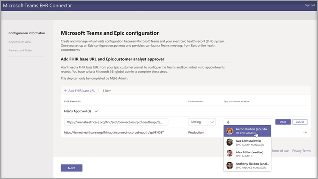
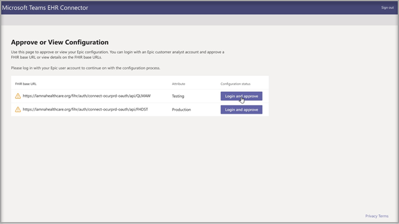
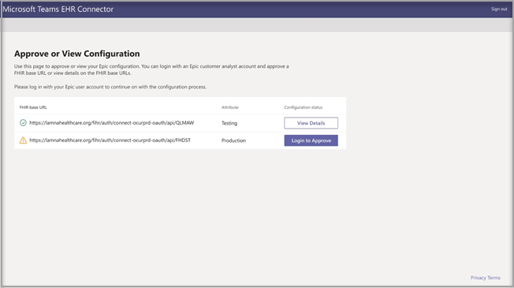

# Virtuelle Besuche mit Teams – Integration in die EGA

Microsoft Teams Der Connector für elektronische Krankenakten (Electronic Health Record, EHR) erleichtert Es Kliniken, direkt vom EHR-System aus einen virtuellen Patientenbesuch zu starten oder mit einem anderen Anbieter in Teams zu beraten. Microsoft Teams basiert auf der Microsoft 365-Cloud und ermöglicht die einfache und sichere Zusammenarbeit und Kommunikation mit Chat-, Video-, Sprach- und Gesundheitstools in einem einzigen Hub, der die Einhaltung der HIPAA- (Health Insurance Portability and Accountability Act), HITECH-Zertifizierung und mehr unterstützt.
Die Kommunikations- und Kollaborationsplattform von Teams erleichtert es Klinikern, die Unordnung fragmentierter Systeme zu beseitigen, damit sie Zeit für die bestmögliche Pflege aufwenden können. Microsoft Teams Der EHR-Connector (Electronic Health Record) kann:

- Starten Teams virtuelle Besuche vom Anbieter-EHR-System mit einem integrierten klinischen Workflow.
- Ermöglichen Sie Patienten die Teilnahme Teams virtuellen Visiten über das Patientenportal.
- Schreiben Sie Metadaten in das EHR-System zurück, um Teams besuche zu aufzeichnen, wenn Teilnehmer eine Verbindung herstellen und trennen und die automatische Überwachung und Aufbewahrung von Aufzeichnungen aktivieren.

  Sehen Sie sich das Video zum Verwalten virtueller Besuche über das EGA-Portal an.

> [!VIDEO https://www.microsoft.com/videoplayer/embed/RE4HAtn]

## Bevor Sie beginnen

Sie müssen sicherstellen, dass Sie die folgenden Voraussetzungen haben, bevor Sie den EGA-Konnektor integrieren können:

- Zugriff auf die Microsoft Teams-App auf dem [Epic’s App Orchard-Marktplatz](https://apporchard.epic.com/Gallery?id=6153).

- Aktives Abonnement der Microsoft Cloud im Gesundheitswesen oder Abonnement für Microsoft Teams eigenständiges EHR-Connectorangebot (nur bei Produktionstests erzwungen).

- Benutzer müssen über eine entsprechende Microsoft 365- oder Office 365-Lizenz verfügen, die Microsoft Teams-Besprechungen enthält.

- Microsoft Teams sollten innerhalb der Organisation übernommen und verwendet werden.

- Organisationen müssen mit Epic Version November 2018 oder höher haben.

- Ihre Systeme müssen alle [Software- und Browservoraussetzungen](../../hardware-requirements-for-the-teams-app.md) erfüllen.

Sie benötigen außerdem Informationen von folgenden Personen in Ihrer Organisation:

- Microsoft 365-Administrator

- Epic Kundenanalyst

> [!Note]
> Überprüfen Sie den [Epic – Microsoft Teams Telemedizin-Integrationsleitfaden](https://galaxy.epic.com/Search/GetFile?Url=1!68!100!100100357) mit Ihrem technischen Epic-Spezialisten. Stellen sie sicher, dass alle Voraussetzungen abgeschlossen sind. 

## Konnektor-Setup

Das Konnektor-Setup erfordert Folgendes:

- [Starten des Konfigurationsportals für den EHR-Connector](ehr-admin.md#launch-the-ehr-connector-configuration-portal)
- [Konfigurationsinformationen](ehr-admin.md#configuration-information)
- [Genehmigen oder Anzeigen Konfiguration](ehr-admin.md#approve-or-view-configuration)
- [Überprüfen und Beenden der Konfiguration](ehr-admin.md#review-and-finish-the-configuration)

### [Starten des Konfigurationsportals für den EHR-Connector](#launch-the-ehr-connector-configuration-portal)

Die Konfiguration Ihrer Organisation im Gesundheitswesen für die Einführung virtueller Besuche Microsoft Teams mit dem Starten des Konfigurationsportals für den EHR-Connector. Sie konfigurieren eine einzelne oder mehrere Organisationen, um die Integration zu testen. Konfigurieren Sie die Test- und Produktions-URL im Konfigurationsportal. Testen Sie die Integration aus der Testumgebung von Epic, bevor Sie zur Produktion übergehen.
  
- Konfigurations-URL für den EGA-Konnektor: [https://ehrconnector.teams.microsoft.com](https://ehrconnector.teams.microsoft.com)

Der Microsoft 365-Administrator und Epic-Kundenanalyst Ihres Unternehmens muss die Informations- und Integrationsschritte im Konfigurationsportal ausführen. Wenden Sie sich für Epic-Konfigurationsschritte an die technische Ressource von Epic, die Ihrer Organisation zugewiesen ist.

### [Konfigurationsinformationen](#configuration-information)

Dieser Schritt muss vom **Microsoft 365-Administrator** ausgeführt werden. Der Microsoft 365-Administrator muss das Konnektor-Konfigurationsportal starten und sich mit Microsoft-Anmeldeinformationen anmelden, um den Konfigurationsprozess zu starten.

Um diesen Schritt auszuführen, muss der Microsoft 365-Administrator eine gültige FHIR-Basis-URL (Fast Health Interoperability Resources) von Ihrem technischen Epic-Spezialisten und den Benutzernamen des Epic-Kundenanalysten erhalten, der die Konfiguration genehmigt. Der Microsoft 365-Administrator muss die Konnektor-Konfigurationsseite starten und sich mit Microsoft-Anmeldeinformationen anmelden, um den Konfigurationsprozess zu starten.

- Die FHIR-Basis-URL ist eine statische Adresse, die dem FHIR-API-Endpunkt Ihres Servers entspricht. Eine Beispiel-URL ist `https://lamnahealthcare.org/fihr/auth/connect-ocurprd-oauth/api/FHDST`.

- Der Name der genehmigenden Person für die Konfiguration ist der Name des Epic-Kundenanalysten, der im nächsten Schritt für die Genehmigung der Konfiguration verantwortlich ist. Der Epic-Kundenanalyst ist eine Person in Ihrem Unternehmen mit Anmeldezugriff auf Epic.

  

### [Konfiguration genehmigen oder anzeigen](#approve-or-view-configuration)

Der Epische Kundenanalyst für Ihre Gesundheitsorganisation, der als genehmigende Organisation hinzugefügt wurde, muss jetzt dieselbe EHR-Connector-URL aus dem vorherigen Schritt verwenden, um sich mit ihren Anmeldeinformationen für Microsoft 365 anmelden. Nach erfolgreicher Validierung wird der Genehmigende aufgefordert, sich mit seinen Epic-Anmeldeinformationen anzumelden, um die Epic-Organisation zu validieren.

> [!Note]
> Der Microsoft 365-Administrator und der Epic-Kundenanalyst in Ihrer Organisation können dieselbe Person sein. Fügen Sie in diesem Fall Ihren eigenen Benutzernamen als Genehmiger hinzu. Sie müssen sich noch bei Epic anmelden, um Ihren Zugriff zu überprüfen. Die Epic-Anmeldung wird nur zur Überprüfung Ihrer FHIR-Basis-URL verwendet. Microsoft speichert mit dieser Anmeldung keine Anmeldeinformationen und greift nicht auf EGA-Daten zu.

  

Nach einer erfolgreichen Epic-Anmeldung **muss** der Epic-Kundenanalyst die Konfiguration genehmigen. Wenn die Konfiguration nicht korrekt ist, kann der Microsoft 365-Administrator die ursprünglichen Konfigurationen ändern, indem er sich erneut beim Microsoft EGA Konnektor-Portal anmeldet. 

### [Überprüfen und Beenden der Konfiguration](#review-and-finish-the-configuration)

Wenn die Konfigurationsinformationen vom Epic-Administrator genehmigt wurden, werden Ihnen Integrationsdatensätze für den Start von Patienten und Anbietern angezeigt. Diese Datensätze sind erforderlich, um die Konfiguration des virtuellen Besuchs in Epic abzuschließen. Weitere Informationen finden Sie im Handbuch zur Telemedizin-Integration von Epic-Microsoft Teams.

> [!Note]  
> Der Microsoft 365- oder Epic-Kundenanalyst kann sich jederzeit beim Konfigurationsportal anmelden, um Integrationsdatensätze anzuzeigen und die Organisationskonfiguration bei Bedarf zu ändern.

> [!Note]
> Der Genehmigungsprozess muss vom Epic-Kundenanalysten für jede zuvor vom Microsoft-Administrator konfigurierte FHIR-URL abgeschlossen werden.

## Starten von virtuellen Besuchen in Teams

Nach Abschluss der Schritte EHR-Connector und epischer Konfiguration kann Ihre Organisation Videobesuche mit Microsoft Teams.

### Voraussetzungen für einen virtuellen Besuch

- Ihre Systeme müssen alle [Software- und Browservoraussetzungen](../../hardware-requirements-for-the-teams-app.md) erfüllen.

- Die Organisation im Gesundheitswesen muss die Einrichtung zwischen der Epic-Organisation und der Microsoft 365-Organisation abgeschlossen haben.

### Anbietererfahrung

Gesundheitsdienstleister aus Ihrem Unternehmen können über ihre Epic-Anbieteranwendungen (Hyperspace, Haiku, Canto) auch an virtuellen Besuchen mit Microsoft Teams teilnehmen. Die Schaltfläche **Virtuellen Besuch beginnen** ist in den Fluss des Providers eingebettet.

Hauptmerkmale der Anbietererfahrung:

- Anbieter können mit unterstützten Browsern oder der Microsoft Teams-Anwendung an virtuellen Besuchen teilnehmen.

- Anbieter müssen sich einmalig mit ihrem Microsoft 365-Konto anmelden, wenn sie zum ersten Mal an einem virtuellen Besuch teilnehmen.

- Nach der einmaligen Anmeldung wird der Anbieter direkt zum virtuellen Termin in Microsoft Teams weitergeleitet. (Anbieter müssen bei Microsoft Teams angemeldet sein).

- Der Anbieter kann in Echtzeit Aktualisierungen der Teilnehmer, die für einen bestimmten Termin eine Verbindung herstellen oder trennen, sehen. Der Anbieter kann sehen, wann der Patient mit einem virtuellen Besuch verbunden ist.

  

### Patientenerfahrung

Der Konnektor unterstützt Patienten, die über MyChart Web und Mobile an virtuellen Besuchen teilnehmen. Zum Zeitpunkt des Termins können Patienten über die Schaltfläche **Virtuellen Besuch beginnen** einen virtuellen Besuch von MyChart aus starten.

Hauptmerkmale der Patientenerfahrung:

- Patienten können virtuelle Besuche von modernen Webbrowsern auf Desktop und Mobile ohne App-Installation besuchen.

- Patienten können mit einem einzigen Klick an virtuellen Besuchen teilnehmen, ohne dass ein anderes Konto oder eine andere Anmeldung erforderlich ist.

- Patienten müssen kein Microsoft-Konto erstellen oder sich anmelden, um einen virtuellen Besuch zu starten.

- Die Patienten werden in eine Lobby gebracht, bis der Gesundheitsdienstleister dem Termin beitritt und sie zum virtuellen Besuch zulässt.

- Das Testen des Videos und des Mikrofons ist in der Lobby möglich, bevor Sie an dem virtuellen Besuch teilnehmen.

  

> [!Note]
> Epic, MyChart, Haiku und Canto sind Marken der Epic Systems Corporation.

### Datenschutz und Speicherort der Daten

Die Teams-Integration in EGA-Systeme optimiert die Datenmenge, die während der Integration und des virtuellen Besuchsflusses verwendet und gespeichert wird. Die Lösung folgt den allgemeinen Grundsätzen und Richtlinien für den Datenschutz und das Datenmanagement von Teams, die unter Datenschutz für Teams aufgeführt sind.

Der Microsoft Teams EGA-Konnektor speichert oder überträgt keine identifizierbaren persönlichen Daten oder Gesundheitsakten von Patienten oder Gesundheitsdienstleistern aus dem EGA-System. Die einzigen Daten, die vom EGA-Konnektor gespeichert werden, sind die eindeutigen IDs des EGA-Benutzers, die beim Einrichten der Teambesprechungen verwendet werden. Die eindeutige ID des EGA-Benutzers wird in einer der drei geografischen Regionen gespeichert, die unter [Wo Ihre Microsoft 365-Kundendaten gespeichert sind](/microsoft-365/enterprise/o365-data-locations) beschrieben sind. Alle Chats, Aufzeichnungen und sonstigen Daten, die von den Besprechungsteilnehmern in Teams eingegeben wurden, werden gemäß den vorhandenen Speicherrichtlinien gespeichert. Weitere Informationen zum Speicherort von Daten in Microsoft Teams finden Sie unter [Speicherorte von Daten in Teams](../../location-of-data-in-teams.md).

## Verwandte Themen

[Teams virtueller Besuche](ehr-admin-reports.md)