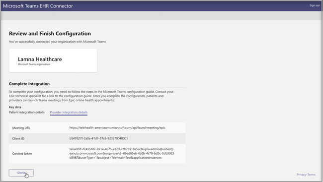

# Virtuelle Besuche mit Teams – Integration in EHR

Microsoft Teams Electronic Health Record (EHR) Connector erleichtert Den Kliniken die Einführung eines virtuellen Patientenbesuchs oder einer Beratung mit einem anderen Anbieter in Teams direkt über das EHR-System. Microsoft Teams, das auf der Microsoft 365-Cloud aufgebaut ist, ermöglicht eine einfache, sichere Zusammenarbeit und Kommunikation mit Chat-, Video-, Sprach- und Gesundheitstools in einem einzigen Hub, der die Einhaltung von HIPAA, der HITECH-Zertifizierung und vielem mehr unterstützt.
Die Kommunikations- und Zusammenarbeitsplattform von Teams macht es für Kliniklaborer einfach, die Unübersichtlichkeit fragmentierter Systeme zu überschneiden, sodass sie Zeit für die bestmögliche Pflege auf verwenden können. Microsoft Teams Electronic Health Record (EHR) Connector kann:
- Starten Sie virtuelle Besuche von Teams sowohl über Anbieter- als auch Patientenportale.
- Schreiben Sie beim Verbinden und Trennen von Ereignissen zurück in die EHR-Metadaten, um die automatische Überwachung und Datensatzspeicherung zu ermöglichen.
- Integrieren Sie sie in vorhandene Workflows von Kliniken und Patienten, und ermöglichen Sie ihnen die Verwendung von Microsoft Teams.

  Schauen Sie sich das Video zum Verwalten virtueller Besuche vom EHR-Portal an.

> [!VIDEO https://www.microsoft.com/videoplayer/embed/RE4HAtn]

## Vorbereitung

Sie müssen sicherstellen, dass Sie über die folgenden Voraussetzungen verfügen, bevor Sie den EHR-Connector integrieren können:

- Zugriff auf die Microsoft Teams-App im [Marketplace für Epische App-Obstplantage.](https://apporchard.epic.com/Gallery?id=6153)

- Aktives Abonnement für Die Microsoft Cloud im Gesundheitswesen oder Abonnement des eigenständigen Microsoft Teams EHR Connector-Angebots (nur bei Produktionstests erzwungen).

- Benutzer müssen über eine geeignete Microsoft 365- oder Office 365-Lizenz verfügen, die Microsoft Teams-Besprechungen umfasst.

- Microsoft Teams sollte innerhalb der Organisation verbreitet und verwendet werden.

- Organisationen müssen über eine epische Version (November 2018 oder höher) verfügen.

- Ihre Systeme müssen alle Voraussetzungen [für Software und Browser erfüllen.](https://docs.microsoft.com/microsoftteams/hardware-requirements-for-the-teams-app)

Darüber hinaus benötigen Sie Informationen von den folgenden Personen in Ihrer Organisation:

- Microsoft 365-Administrator

- Epischer Kundenanalyst

> [!Note]
> Bitten Sie Ihren technischen Experten für Epe, ihnen Epic-Microsoft Teams Telehealth Integration Guide zur Verfügung zu stellen, der auf dem Marketplace für Epe verfügbar ist.

## Einrichtung des Verbinders

Für die Einrichtung des Verbinders ist es erforderlich, dass Sie:

- [Starten des Konfigurationsportals für EHR Connector](ehr-admin.md#launch-the-ehr-connector-configuration-portal)
- [Konfigurationsinformationen](ehr-admin.md#configuration-information)
- [Genehmigen oder Anzeigen der Konfiguration](ehr-admin.md#approve-or-view-configuration)
- [Überprüfen und Fertig stellen der Konfiguration](ehr-admin.md#review-and-finish-the-configuration)

### [Starten des Konfigurationsportals für EHR Connector](#launch-the-ehr-connector-configuration-portal)

Das Konfigurieren Ihres Gesundheitswesens für virtuelle Besuche mit Microsoft Teams beginnt mit dem Starten des Konfigurationsportals von EHR Connector. Sie konfigurieren eine oder mehrere Organisationen, um die Integration zu testen. Konfigurieren Sie die Test- und Produktions-URL im Konfigurationsportal. Testen Sie die Integration aus der Testumgebung von Epe, bevor Sie in die Produktion überfingen.
  
- KONFIGURATIONS-URL des EHR-Connectors: [https://ehrconnector.teams.microsoft.com](https://ehrconnector.teams.microsoft.com)

Der Microsoft 365-Administrator und epische Kundenanalyst ihrer Organisation muss die Informations- und Integrationsschritte im Konfigurationsportal ausführen. Wenn Sie Epische Konfigurationsschritte ausführen möchten, wenden Sie sich an die Ihrem Unternehmen zugewiesene Technische Spezialressource für Epe.

### [Konfigurationsinformationen](#configuration-information)

Dieser Schritt muss vom **Microsoft 365-Administrator abgeschlossen werden.** Der Microsoft 365-Administrator muss das Connectorkonfigurationsportal starten und sich mit den Anmeldeinformationen von Microsoft anmelden, um den Konfigurationsprozess zu starten.

Um diesen Schritt ausführen zu können, muss der Microsoft 365-Administrator eine gültige F URL (Fast Health Interoperability Resources) von Ihrem epischen technischen Experten und den Benutzernamen des Epischen Kundenanalysten erhalten, der die Konfiguration genehmigen wird. Der Microsoft 365-Administrator muss die Connectorkonfigurationsseite starten und sich mit den Microsoft-Anmeldeinformationen anmelden, um den Konfigurationsprozess zu starten.

- Die FSCHI-Basis-URL ist eine statische Adresse, die Ihrem Server-FSCHI-API-Endpunkt entspricht. Beispiel-URL: `https://lamnahealthcare.org/fihr/auth/connect-ocurprd-oauth/api/FHDST`

- Der Name der genehmigenden Person für die Konfiguration ist der Name des epischen Kundenanalysten, der für die Genehmigung der Konfiguration im nächsten Schritt zuständig ist. Der Epische Kundenanalyst ist eine Person in Ihrer Organisation mit Anmeldezugriff auf Episch.

  

### [Genehmigen oder Anzeigen der Konfiguration](#approve-or-view-configuration)

Der epische Kundenanalyst für Ihre Gesundheitsorganisation, der als genehmigende Mitarbeiter hinzugefügt wurde, muss jetzt die gleiche URL für EHR Connector aus dem vorherigen Schritt verwenden, um sich mit den Microsoft 365-Anmeldeinformationen anmelden zu können. Nach erfolgreicher Überprüfung wird die genehmigende Benutzerin aufgefordert, sich mit ihren epischen Anmeldeinformationen zur Überprüfung der Organisation "Episch" anmelden.

> [!Note]
> Der Microsoft 365-Administrator und Epischer Kundenanalyst in Ihrer Organisation kann dieselbe Person sein. Fügen Sie in diesem Fall Ihren eigenen Benutzernamen als genehmigende Benutzer hinzu. Sie müssen sich weiterhin bei "Episch" anmelden, um Ihren Zugriff zu überprüfen. Die epische Anmeldung wird nur zum Überprüfen Ihrer FSCHI-Basis-URL verwendet. Microsoft kann keine Anmeldeinformationen speichern oder mit dieser Anmeldung auf die Daten der EHR zugreifen.

  

Nach einer erfolgreichen Epischen Anmeldung  muss der Epische Kundenanalyst die Konfiguration genehmigen. Wenn die Konfiguration nicht korrekt ist, hat der Microsoft 365-Administrator die Möglichkeit, die ursprünglichen Konfigurationen zu ändern, indem er sich erneut beim Microsoft EHR-Connectorportal anmelden. 

### [Überprüfen und Fertig stellen der Konfiguration](#review-and-finish-the-configuration)

Wenn die Konfigurationsinformationen vom Epischen Administrator genehmigt wurden, erhalten Sie Integrationsaufzeichnungen für die Einführung eines Patienten und Anbieters. Diese Einträge sind erforderlich, um die Konfiguration für den virtuellen Besuch in Episch abschließen zu können. Weitere Details finden Sie Epic-Microsoft Teams Telehealth Integration.

> [!Note]  
> Der Microsoft 365- oder Epische Kundenanalyst kann sich jederzeit beim Konfigurationsportal anmelden, um Integrationseinträge anzeigen und die Organisationskonfiguration bei Bedarf ändern zu können.

> [!Note]
> Der Genehmigungsprozess muss vom epischen Kundenanalysten für jede zuvor vom Administrator konfigurierte F URL abgeschlossen werden.

## Starten virtueller Besuche in Teams

Nach Abschluss der Schritte "EHR Connector" und der Konfiguration "Episch" ist Ihre Organisation bereit, Videobesuche mit Microsoft Teams zu unterstützen.

### Voraussetzungen für virtuellen Besuch

- Ihre Systeme müssen alle Voraussetzungen [für Software und Browser erfüllen.](https://docs.microsoft.com/microsoftteams/hardware-requirements-for-the-teams-app)

- Die Organisation im Gesundheitswesen muss die Einrichtung zwischen der Organisation Epe und Microsoft 365 abgeschlossen haben.

### Anbietererfahrung

Gesundheitswesensanbieter in Ihrer Organisation können auch an virtuellen Besuchen mit Microsoft Teams aus ihren Epischen Anbieteranwendungen (Hyperspace, Cubeku, Canto) teilnehmen. Die **Schaltfläche "Virtuellen Besuch** beginnen" ist in den Anbieterfluss eingebettet.

Wichtige Features der Anbietererfahrung:

- Anbieter können über unterstützte Browser oder die Microsoft Teams-Anwendung an virtuellen Besuchen teilnehmen.

- Anbieter müssen sich bei einem ersten virtuellen Besuch mit ihrem Microsoft 365-Konto einmal anmelden.

- Nach der einmal ausgeführten Anmeldung wird der Anbieter direkt zu dem virtuellen Termin in Microsoft Teams weitergenommen. (Der Anbieter muss bei Microsoft Teams angemeldet sein.)

- Der Anbieter kann In-Echtzeit-Updates von Teilnehmern sehen, die sich für einen bestimmten Termin verbinden oder trennen. Der Anbieter kann sehen, wann der Patient mit einem virtuellen Besuch verbunden ist.

  

### Patientenerfahrung

Der Connector unterstützt Patienten bei virtuellen Visiten über Das Web und Mobile MyChart. Zum Zeitpunkt des Termins können Die Patienten über MyChart einen virtuellen Besuch über die Schaltfläche "Virtuellen **Besuch beginnen"** starten.

Wichtige Merkmale der Patientenerfahrung:

- Patienten können an virtuellen Besuchen in modernen Webbrowsern auf desktop- und mobilen Geräten teilnehmen, ohne die App installieren zu müssen.

- Patienten können mit nur einem Klick an virtuellen Besuchen teilnehmen, und es ist kein anderes Konto oder keine Anmeldung erforderlich.

- Die Patienten müssen kein Microsoft-Konto erstellen oder sich anmelden, um einen virtuellen Besuch zu starten.

- Die Patienten werden in einem Wartebereich platziert, bis der Gesundheitswesen dem Termin beitritt und sie zum virtuellen Besuch zugibt.

- Vor dem virtuellen Besuch steht ein Test des Videos und Mikrofons im Wartebereich zur Verfügung.

  

> [!Note]
> Episch, MyChart,Okuku und Canto sind Marken der Epischen Systems Corporation.

### Datenschutz und Speicherort der Daten

Die Integration von Teams in EHR-Systeme optimiert die Datenmenge, die während der Integration und des virtuellen Besuchsflusses verwendet und gespeichert wird. Die Lösung folgt den allgemeinen Datenschutz- und Datenverwaltungsprinzipien und -richtlinien von Teams, die unter "Datenschutz" von Teams beschrieben sind.

Der Verbinder Microsoft Teams EHR enthält keine identifizierbaren persönlichen Daten oder Krankenakten von Patienten oder Gesundheitswesensanbietern aus dem EHR-System. Die einzigen Daten, die vom EHR-Connector gespeichert werden, sind die eindeutige ID des EHR-Benutzers, die beim Einrichten einer Team-Besprechung verwendet wird. Die eindeutige ID des EHR-Benutzers wird in einer der drei geografischen Regionen gespeichert, die unter "Speichern Ihrer [Microsoft 365-Kundendaten" beschrieben sind.](https://docs.microsoft.com/microsoft-365/enterprise/o365-data-locations?view=o365-worldwide#data-center-geographies) Alle Chats, Aufzeichnungen und anderen Daten, die von den Besprechungsteilnehmern in Teams eingegeben wurden, werden gemäß den vorhandenen Speicherrichtlinien gespeichert. Weitere Informationen zum Speicherort von Daten in Microsoft Teams finden Sie unter ["Speicherorte von Daten in Teams".](https://docs.microsoft.com/microsoftteams/location-of-data-in-teams)
