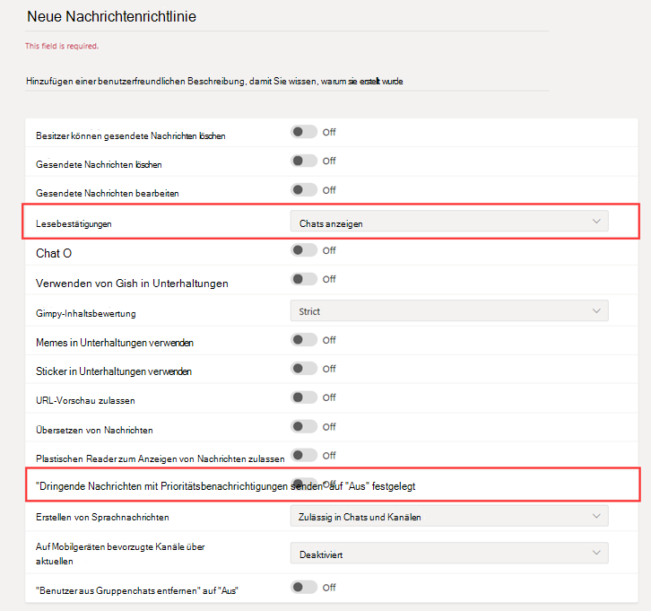

# Sicheres Messaging für Organisationen im GesundheitswesenSecure Messaging for healthcare organizations

Nachrichtenrichtlinien werden verwendet, um zu steuern, welche Chat-und Kanal-Messaging Features für Benutzer in Microsoft Teams zur Verfügung stehen, und sind Teil der allgemeinen Bereitstellung von Secure Messaging für Organisationen im Gesundheitswesen wie Krankenhäuser, Kliniken oder Arztpraxen, in denen es entscheidend ist, wenn eine Nachricht aufgenommen und rechtzeitig bearbeitet wird, da Sie wissen, wann wichtige Nachrichten gelesen werden.Messaging policies are used to control which chat and channel messaging features are available to users in Microsoft Teams, and are part of the overall deployment of Secure Messaging for healthcare organizations like Hospitals, clinics, or doctor's offices, where having a message picked up and acted upon in a timely manner is crucial, as is knowing when crucial messages are read.

Sie können die Global (org-Wide Standard)-Richtlinie verwenden oder eine oder mehrere benutzerdefinierte Messagingrichtlinien für Personen in Ihrer Organisation erstellen.You can use the global (Org-wide default) policy or create one or more custom messaging policies for people in your organization. Sofern Sie keine benutzerdefinierte Richtlinie erstellen und zuweisen, wird Benutzern in Ihrer Organisation automatisch die globale Standardrichtlinie zugewiesen.Users in your organization will automatically get the global policy unless you create and assign a custom policy. Nachdem Sie eine benutzerdefinierte Richtlinie erstellt haben, weisen Sie Ihr einen Benutzer oder Gruppen von Benutzern in Ihrer Organisation zu.After you create a custom policy, assign it a user or groups of users in your organization. So können Sie beispielsweise festlegen, dass Sie nur bestimmten Aufgaben Rollen die Verwendung dieser Funktionen (vielleicht nur von Ärzten und Krankenschwestern) und anderen Mitarbeitern (wie dem Hausmeister oder Küchenpersonal) erlauben, um eine begrenzte Anzahl von Funktionen zu erhalten.For example, you may choose to only allow certain job roles to use these features (perhaps doctors and nurses only) and other workers (like the janitorial or kitchen staff) to get a more limited set of features. Entscheiden Sie selbst, was Ihre Organisation braucht, die Anleitung hier ist höchstens ein Vorschlag.Decide for yourself what needs your organization has, the guidance here is at most a suggestion.

Richtlinien können im [Microsoft Teams Admin Center](https://admin.teams.microsoft.com) einfach verwaltet werden, indem Sie sich mit Administratoranmeldeinformationen anmelden und im linken Navigationsbereich **Messaging Richtlinien** auswählen.Policies can be easily managed in the [Microsoft Teams admin center](https://admin.teams.microsoft.com) by logging in with administrator credentials and choosing **Messaging policies** in the left navigation pane.

 

Wenn Sie die vorhandene Standard-Messaging Richtlinie für Ihre Organisation bearbeiten möchten, klicken Sie auf **Global (org-Wide Standard)** , und nehmen Sie dann die gewünschten Änderungen vor.To edit the existing default Messaging policy for your organization, click **Global (Org-wide default)** , and then make your changes. Wenn Sie eine neue benutzerdefinierte Nachrichten Richtlinie erstellen möchten, klicken Sie auf **Hinzufügen** , und wählen Sie dann Ihre Einstellungen aus.To create a new custom messaging policy, click **Add** and then select your settings. Wenn Sie fertig sind, wählen Sie **Speichern** aus.Choose **Save** when you are done.

Die folgenden Einstellungen sind für medizinische Anwendungen von besonderem Interesse und sollten beim Entwerfen einer benutzerdefinierten Richtlinie berücksichtigt werden, die im Feld "Gesundheitswesen" verwendet wird:The following settings are of special interest for Healthcare applications, and should be considered when designing a custom policy used in the Healthcare field:

## LesebestätigungenRead receipts

Lesebestätigungen können dem Absender einer Chatnachricht mitteilen, wann Ihre Nachricht vom Empfänger in 1:1 gelesen wurde, und Gruppen-Chats mit mindestens 20 Personen.Read receipts allows the sender of a chat message to know when their message was read by the recipient in 1:1 and group chats 20 people or less. Verwenden Sie diese Einstellung, um anzugeben, ob Lesebestätigungen vom Benutzer gesteuert werden, für jeden aktiviert oder für jeden deaktiviert sind.Use this setting to specify whether read receipts are user controlled, on for everyone, or off for everyone. Lesebestätigungen für Nachrichten sind in Organisationen des Gesundheitswesens wichtig, da Sie ungewiss darüber entscheiden, ob eine Nachricht gelesen wurde.Message read receipts are important in Healthcare organizations because they remove uncertainly about whether a message was read.

Wählen Sie für Anwendungen im Gesundheitswesen entweder **Benutzer gesteuert** oder **ein für alle** aus.For Healthcare applications, choose either **User controlled** or **On for everyone** . Beachten Sie, dass die einzige Möglichkeit zum Festlegen der Belege für den gesamten Mandanten bei Verwendung der Einstellung **für alle** für den gesamten Mandanten nur eine Messagingrichtlinie (die Standardrichtlinie mit dem Namen "Global (org-Wide Standard)") oder die Verwendung der gleichen Einstellungen für die Empfangsbestätigungen für alle Messagingrichtlinien im Mandanten ist.Be aware that when using the **On for everyone** setting, the only way to set receipts for the whole  tenant is either to have only one messaging policy for the whole tenant (the default policy named "Global (Org-wide Default)") or to have all messaging policies in the tenant use the same settings for receipts. Das Feature „Lesebestätigungen“ ist am effektivsten, wenn das Feature **für alle aktiviert** ist.The read receipts feature is most effective when the feature is enabled to **On for everyone** .

*Verwendungsbeispiel ohne Lesebestätigungen:* Jakob Roth, ein Patient mit einem Höchstrisiko, wird zum Krankenhaus zugelassen.*Usage example without read receipts:* Jakob Roth, a high risk patient, is admitted to the hospital.  Sofia Krause ist eine Krankenschwester, die als Teil des interdisziplinären Teams (IDT) von medizinischen Arbeitern, darunter verschiedene Spezialisten, als primärer Betreuer für diesen Patienten verantwortlich ist.Sofia Krause is a nurse working as part of the inter-disciplinary team (IDT) of medical workers, including different specialists, is assigned as the primary care coordinator in charge of this patient.  Sofia sendet e-Mails und andere Sofortnachrichten an eine Gruppe von Krankenschwestern und Ärzten, die eine Vielzahl von Messaging-Clients und-Apps verwenden, und erhält oft keine Antwort oder gibt an, ob eine Nachricht von Teammitgliedern gelesen wurde.Sofia sends emails and other instant messages to a groups of nurses and doctors who use a variety of messaging clients and apps, and often gets no response or indication whether a message was read by team members. Aufgrund von verworrenen Kommunikationsprozessen wird Jakobs Medikamenten nicht mehr verwendet und sein Krankenhausaufenthalt verlängert.Due to tangled communication processes, Jakob's medication is misapplied and his hospital stay is extended.

*Verwendungsbeispiel mit Lesebestätigungen:* Jakob Roth, ein Patient mit einem Höchstrisiko, wird zum Krankenhaus zugelassen.*Usage example with read receipts:* Jakob Roth, a high risk patient, is admitted to the hospital.  Sofia Krause ist eine Krankenschwester, die als Teil des interdisziplinären Teams (IDT) von medizinischen Arbeitern, darunter verschiedene Spezialisten, als primärer Betreuer für diesen Patienten verantwortlich ist.Sofia Krause is a nurse working as part of the inter-disciplinary team (IDT) of medical workers, including different specialists, is assigned as the primary care coordinator in charge of this patient.  Sofia startet einen Gruppen-Chat mit einer Reihe von Ärzten und anderen Krankenschwestern, die mit dem Patienten zusammenarbeiten werden, um die Behandlung zu koordinieren und eine Notfall-Triage zu starten.Sofia starts a group chat with a set of doctors and other nurses who will be working with the patient to coordinate care and starts an emergency triage.  Die Krankenschwestern und Ärzte kommunizieren und Arbeiten über den Pflegeplan des Patienten während des Pflege Koordinationsprozesses zusammen.The nurses and doctors communicate and collaborate over the patient's care plan throughout the care coordination process.  Wichtige und dringende Nachrichten werden über 1:1 und Gruppen-Chat-Unterhaltungen gesendet.Important and urgent messages are sent through 1:1 and group chat conversations. Sofia verwendet die Lese Bestätigungsfunktion, um festzustellen, ob Nachrichten, die Support anfordern, von den Ziel Ärzten oder Krankenschwestern zugestellt und gelesen werden.Sofia uses the read receipts functionality to determine if messages sent requesting support are delivered and read by the targeted physicians or nurses. Jakobs Patientenergebnisse sind nahezu optimal und er geht früher nach Hause, weil sein Gesundheitsteam reibungslos kommuniziert.Jakob's patient outcomes are near-optimal and he goes home sooner because his health team communicates smoothly.

## Senden dringender Nachrichten mithilfe von Prioritäts BenachrichtigungenSend urgent messages using priority notifications

Ein Benutzer kann eine Nachricht beim Senden von Chatnachrichten an andere Benutzer als *dringend* kennzeichnen.A user can mark a message as *urgent* when sending chat messages to other users. Dieses Feature hilft Krankenhausmitarbeitern, sich gegenseitig zu benachrichtigen, wenn ein kritischer Vorfall Ihre Aufmerksamkeit erfordert.This feature helps hospital staff alert one another when a critical incident requires their attention. Im Gegensatz zu normalen *wichtigen* Nachrichten werden Benutzer mit [Prioritäts Benachrichtigungen](https://support.microsoft.com/article/mark-a-message-as-important-or-urgent-in-teams-ea99d5b6-1317-4550-8d75-86ff14cd4462) alle zwei Minuten für bis zu 20 Minuten benachrichtigt, oder bis die Nachricht vom Empfänger abgeholt und gelesen wird, wobei die Wahrscheinlichkeit maximiert wird, dass die Nachricht rechtzeitig verarbeitet wird.Unlike regular *important* messages, [priority notifications](https://support.microsoft.com/article/mark-a-message-as-important-or-urgent-in-teams-ea99d5b6-1317-4550-8d75-86ff14cd4462) notify users every two minutes for up to 20 minutes or until the message is picked up and read by the recipient, maximizing the likelihood that the message is acted upon in a timely manner.

Ein Administrator kann die Möglichkeit für Benutzer, denen diese Richtlinie zugewiesen ist, zum Senden von Prioritäts Benachrichtigungen aktivieren oder deaktivieren.An admin can enable or disable the ability for users assigned this policy to send priority notifications. Dieses Feature ist standardmäßig aktiviert.This feature is on by default. Der Empfänger der Prioritäts Nachricht hat möglicherweise nicht die gleiche Messagingrichtlinie und hat keine Option zum Deaktivieren des Empfangens von Prioritäts Nachrichten.The recipient of the priority message might not have the same messaging policy, and will not have an option to disable receiving priority messages. Für Anwendungen im Gesundheitswesen empfehlen wir, das Feature für mindestens einige Benutzer zu aktivieren, doch müssen Sie ermitteln, welche.For Healthcare applications, we recommend enabling the feature for at least some users, but you'll need to determine which ones.

*Verwendungsbeispiel:* Sofia Krause gibt einen Patienten mit hoher Risikowahrscheinlichkeit, Jakob Roth, erneut ein.*Usage example:* Sofia Krause is readmitting a high-risk patient, Jakob Roth. Manuela Carstens, Ärztin, ist die Ärztin für diesen Patienten.Manuela Carstens, a physician, is the primary care doctor for this patient.  Sofia sendet eine Nachricht an Manuela mithilfe einer Prioritäts Benachrichtigung, in der Sie um sofortige Hilfe bei der Selektierung von Jakob gebeten werden.Sofia sends a message to Manuela using a priority notification asking for immediate help with triage of Jakob.  Manuelas Telefon erhält die Nachricht, aber Manuela spürte keine Vibrationen des Telefons und antwortet nicht.Manuela's phone receives the message but Manuela didn't feel the phone vibration and does not reply. Teams benachrichtigt Manuela erneut und wird weiterhin ständig erneut benachrichtigt, bis Sie die Nachricht liest.Teams re-notifies Manuela and will continue to persistently re-notify until she reads the message. Wenn Lesebestätigungen ebenfalls aktiviert sind, kann sich Sofia bewusst sein, dass die Nachricht von Manuela gelesen wurde, noch bevor Manuela sich entscheidet, wie Sie antworten möchten.If read receipts are also enabled, Sofia can be aware that the message was read by Manuela, even before Manuela decides how to respond.

## Verwandte ThemenRelated topics

- [Verwalten von Messaging-Richtlinien in TeamsManage messaging policies in Teams](../../messaging-policies-in-teams.md)
- [Erste Schritte mit Teams für Organisationen im GesundheitswesenGet started with Teams for Healthcare organizations](teams-in-hc.md)
