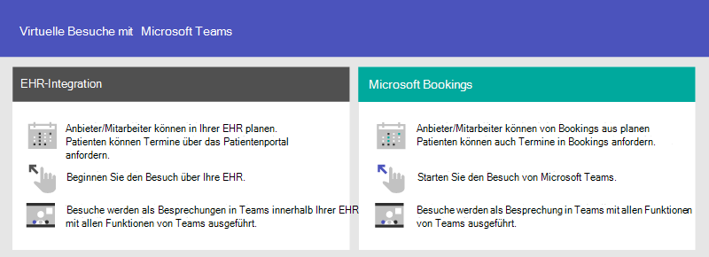
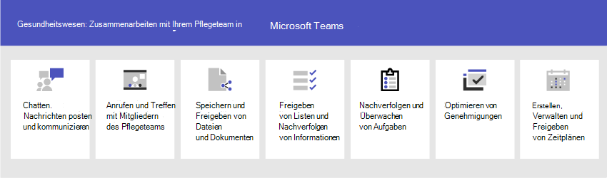

# Erste Schritte mit Teams für Organisationen im Gesundheitswesen

Microsoft Teams bietet eine Reihe von telemedizinischen Funktionen, die für Krankenhäuser und andere Gesundheitsorganisationen nützlich sind. Die Features von Teams sind derzeit in der Entwicklung, um Krankenhäusern zu helfen:

- Integration virtueller Besuche und elektronischer Gesundheitsakte (EPA)
- Teams-Richtlinien Pakete
- Sicheres Messaging
- Teams-Vorlagen
- Pflege Koordination und Zusammenarbeit

Diese Funktionalität ist Teil der Microsoft Cloud für Healthcare. Erfahren Sie mehr über die Verwendung dieser Lösung, die Funktionen aus Azure, Dynamics 365 und Microsoft 365 bei [Microsoft Cloud für Healthcare](https://docs.microsoft.com/industry/healthcare)zusammenführt.

Schauen Sie sich das folgende Video an, um mehr über die Verwendung der Healthcare-Sammlung zu erfahren, um die Zusammenarbeit im Gesundheitsteam in Microsoft Teams zu erhöhen.

> [!VIDEO https://www.microsoft.com/videoplayer/embed/RE4Hqan]

> [!NOTE]
> Bei dem Inhalt in diesem Abschnitt wird davon ausgegangen, dass Sie bereits Teams in Ihrer Organisation bereitgestellt haben. Wenn Sie noch keine Teams ausgearbeitet haben, lesen Sie zunächst, [wie Sie Microsoft Teams Ausrollen](../../How-to-roll-out-teams.md).

## Integration virtueller Besuche und elektronischer Gesundheitsakte (EPA)

Verwenden Sie die vollständige Besprechungs Plattform in Microsoft Teams, um virtuelle Besuche mit Patienten zu planen, zu verwalten und durchzuführen.

- Wenn Ihre Organisation bereits elektronische Gesundheitsdatensätze oder EHR verwendet, können Sie Microsoft Teams für eine nahtlosere Benutzeroberfläche integrieren. Der Microsoft Teams Electronic Health Record (EHR) Connector macht es Klinikern einfach, einen virtuellen Patienten Besuch oder eine Konsultation mit einem anderen Anbieter in Teams direkt aus dem EPA-System zu starten. Weitere Informationen finden Sie unter [Virtuelle Besuche mit Teams – Integration in EPA](ehr-admin.md).
- Wenn Sie keine unterstützte EHR verwenden, können Sie Microsoft-Buchungen und die APP für Buchungen in Teams verwenden. Weitere Informationen finden Sie unter [Reservierungen-APP und virtuelle Besuche in Microsoft Teams](../../bookings-app-admin.md).

## Teams-Richtlinien Pakete

Wenden Sie Teams-Richtlinien Pakete an, um zu definieren, welche Aufgaben in Teams unterschiedlich sein können. Geben Sie beispielsweise Richtlinien für Folgendes an:

- Klinische Arbeitskräfte wie registrierte Krankenschwestern, Krankenschwestern, Ärzte und Sozialarbeiter, damit Sie uneingeschränkten Zugriff auf Chats, Anrufe, Schicht Management und Besprechungen haben können.
- Information Worker in Ihrer Gesundheitsorganisation, wie IT-Personal, Informatik Personal, Finanz Personal und Compliance Officer, können vollständigen Zugriff auf Chats, Anrufe und Besprechungen haben.
- Patientenzimmer, um die Einstellungen für patientenraum Geräte zu kontrollieren.

Weitere Informationen finden Sie unter [Teams-Richtlinien Pakete für die Gesundheitsversorgung](../../policy-packages-healthcare.md).

## Sicheres Messaging

Secure Messaging unterstützt die Zusammenarbeit innerhalb von Health Teams, einschließlich mehrerer neuer Funktionen:

- Ein Nachrichtenabsender kann eine besondere Priorität für seine Nachricht festzulegen, sodass der Empfänger wiederholt benachrichtigt wird, bis er die Nachricht gelesen hat.
- Ein Nachrichtenabsender kann eine Lesebestätigung anfordern, damit er benachrichtigt wird, wenn eine von Ihnen gesendete Nachricht vom Empfänger der Nachricht gelesen wurde.

Zusammen ermöglichen diese Features eine schnellere Berücksichtung dringender Nachrichten und die Gewissheit, dass die Nachricht empfangen und gelesen wurde. Neue Gesundheitsteams, die diese Features verwenden, können für jeden Patienten erstellt werden. Diese Features sind Richtlinien basiert und können Einzelpersonen oder gesamten Teams zugewiesen werden.

Weitere Informationen finden Sie unter [Erste Schritte mit sicheren Messaging Richtlinien für Organisationen im Gesundheitswesen](messaging-policies-hc.md).

Im Zusammenhang mit Secure Messaging können auch andere Mandanten von Organisationen des Gesundheitswesens verbunden werden, was eine umfassendere Kommunikation zwischen Mandanten ermöglicht. (Siehe [Verwalten des externen Zugriffs (Föderation) in Microsoft Teams](../../manage-external-access.md)).

## Teams-Vorlagen für Organisationen im Gesundheitswesen

Neue Vorlagen für die Erstellung von Teams wurden entwickelt, um auf eine Krankenhauseinstellung anzuwenden, und weitere werden in Kürze erwartet. Auf diese Weise ist es einfacher, Teams zu erstellen, die von Mitarbeitern des Gesundheitswesens zur Koordinierung der Versorgung von Patienten in verschiedenen Abteilungen oder Stationen eingesetzt werden. Weitere Informationen finden Sie unter [Erste Schritte mit Microsoft Teams-Vorlagen für Organisationen im Gesundheitswesen](healthcare-templates.md). Teams können für interne Abteilungen wie Kardiologie oder für Pflegestationen gestartet werden, und weitere Vorlagen befinden sich in der Entwicklung.

## Pflege Koordination und Zusammenarbeit

Bringen Sie Ihr Gesundheitsteam zusammen, um die Betreuung zu koordinieren und mit Microsoft Teams zusammenzuarbeiten.

Microsoft Teams ermöglicht es Ärzten, Klinikern, Krankenschwestern und anderen Mitarbeitern, effizient mit den mitgelieferten Zusammenarbeitsfeatures in Microsoft Teams zusammenzuarbeiten, wie beispielsweise:

- Richten Sie Teams und Kanäle für Ihre Gesundheitsteams und Informationsmitarbeiter ein. Verwenden Sie Kanäle mit Registerkarten als Möglichkeit, um Ihre Arbeit zu strukturieren, mit zusätzlicher Hilfe von Registerkarten, an die Sie Informationsquellen anheften können.
- Chatten, Nachrichten Posten und kommunizieren. Ihr Team kann permanente Unterhaltungen zu unterschiedlichen Patienten haben, auf die Sie achten müssen.
- Rufen Sie an und treffen Sie sich mit Mitgliedern des Gesundheitsteams. Richten Sie einzelne Besprechungen ein, oder verwenden Sie Kanal Besprechungen, um tägliche Besprechungen zu verwalten, und zwar mit der Leistung von Teams, Audio-, Video-, Bildschirmfreigabe-, Aufzeichnung-und Transkriptions Funktionen.
- Speichern und Freigeben von Dateien und Dokumenten Ihr Gesundheitsteam ist Teil eines einzelnen virtualisierten Teams, das an Office-Dokumenten arbeitet und zusammenarbeitet.

Darüber hinaus kann Ihr Team apps in Teams für folgende Zwecke verwenden:

- Freigeben von Listen und nachvollziehen von Informationen mit der App "Listen"
- Nachverfolgen und Überwachen von Aufgaben mit der Aufgaben-app
- Optimieren von Genehmigungen mit der Genehmigungs-App
- Erstellen, verwalten und Freigeben von Terminplänen mit der App "Schichten"

### Freigeben von Listen und nachvollziehen von Informationen mit der App "Listen"

> [!NOTE]
> Die Patienten-App wurde im 30. Oktober, 2020, eingestellt und durch die [Listen-App](https://support.microsoft.com/office/get-started-with-lists-in-teams-c971e46b-b36c-491b-9c35-efeddd0297db) in Teams ersetzt. Mit Listen können Betreuerteams in Ihrer Gesundheitsorganisation patientenlisten für Szenarien erstellen, die von runden und interdisziplinären Teambesprechungen bis hin zur allgemeinen Patientenüberwachung reichen.

Mithilfe der Listen-app in Teams können Teams Informationen nachvollziehen und die Arbeit organisieren. Die APP ist für alle Teams-Benutzer vorinstalliert und steht in allen Teams und Kanälen als Registerkarte zur Verfügung. Listen können von Grund auf neu erstellt werden, aus vordefinierten Vorlagen oder durch Importieren von Daten nach Excel.

Health Teams können die Vorlage Patienten verwenden, um loszulegen. Sie können Listen erstellen, um die Bedürfnisse und den Status von Patienten nachvollziehen zu können. Vorhandene Patientendaten in Excel-Tabellen können zum Erstellen einer Liste in Teams herangezogen werden. Diese Listen können für Szenarien wie Runden und Patientenüberwachung verwendet werden, um die Behandlung zu koordinieren.

Beispielsweise erstellt eine Kosten Krankenschwester eine Patientenliste in einem Team, in der alle Mitglieder des Gesundheitsteams enthalten sind. Während der Runden wird das Team des Gesundheitsteams auf seinen mobilen Geräten zugreifen und die Patienteninformationen in der Liste aktualisieren, die jeder im Team sehen kann, um synchron zu bleiben. Bei runden Sitzungen, bei denen das Gesundheitsteam zusammen kommt, um wichtige Integritäts Leistungsmetriken zu besprechen und zu bewerten, um sicherzustellen, dass ein Patient auf dem richtigen Gleitweg zur Entladung ist, können Sie diese Informationen über Teams auf einem größeren Bildschirm freigeben. Mitglieder des Gesundheitsteams, die nicht auf der Website sind, können Remoteteil nehmen.

Nachfolgend finden Sie eine Beispielliste, die für die Patienten Rundung eingerichtet wurde.

:::image type="content" source="../../media/lists-patients-example.png" alt-text="Screenshot einer Beispielliste für die Patienten Rundung":::

Weitere Informationen finden Sie unter [Verwalten der Listen-App für Ihre Organisation in Teams](../../manage-lists-app.md).

### Nachverfolgen und Überwachen von Aufgaben mit der Aufgaben-app

Verwenden Sie Aufgaben in Teams, um [Aufgaben](https://support.microsoft.com/office/use-the-tasks-app-in-teams-e32639f3-2e07-4b62-9a8c-fd706c12c070) für Ihr gesamtes Gesundheitsteam zu überwachen. Ihr Gesundheitsteam kann von jedem Gerät, das Teams ausführt, Aufgaben erstellen, zuweisen und planen, Aufgaben kategorisieren und den Status aktualisieren.

Weitere Informationen finden Sie unter [Verwalten der Aufgaben-app für Ihre Organisation in Microsoft Teams](../../manage-tasks-app.md) .

### Optimieren von Genehmigungen mit der Genehmigungs-App

Verwenden Sie [Genehmigungen](https://support.microsoft.com/office/what-is-approvals-a9a01c95-e0bf-4d20-9ada-f7be3fc283d3) , um alle Ihre Anforderungen und Prozesse mit Ihrem Team zu rationalisieren. Erstellen, verwalten und Freigeben von Genehmigungen direkt von ihrem Hub für Teamwork. Starten Sie einen Genehmigungs Fluss an derselben Stelle, an der Sie einen Chat, in einer Kanal Unterhaltung oder in der Genehmigungs-APP selbst senden. Wählen Sie einfach einen Genehmigungs aus, fügen Sie Details hinzu, fügen Sie Dateien hinzu, und wählen Sie Genehmiger aus. Nach der Übermittlung werden die Genehmiger benachrichtigt und können die Anfrage überprüfen und bearbeiten.

Sie können die Genehmigungs-App für Ihre Organisation zulassen und Sie Ihren Teams hinzufügen. Weitere Informationen zum Verwalten von apps finden Sie unter [Verwalten von apps im Microsoft Teams Admin Center](../../manage-apps.md).

### Erstellen, verwalten und Freigeben von Terminplänen mit der Schicht-APP und der Integration von First-Worker

Microsoft Teams ist in die Schichten-APP und die First-Worker-Anwendung integriert, die zum Koordinieren von Funktionen für die Schicht Besetzung und mehr verwendet werden kann. In Schichten können Krankenschwestern-Manager beispielsweise Zeitpläne für Ihre Mitarbeiter einrichten und koordinieren, und Krankenschwestern können Zeitpläne überprüfen und Schichten austauschen. Teams umfasst eine integrierte Richtlinie für die Einrichtung einer ersten Arbeitsumgebung, die Sie den Mitarbeitern in Ihrer Organisation in erster Linie zuweisen können. Standardmäßig beinhaltet diese Richtlinie die Apps für Aktivität, Schichten, Chat und Anrufe. Diese Richtlinie steuert das Verhalten für diese apps, beispielsweise das Anheften der App "Schichten" an die APP-Leiste, damit das Team schnell darauf zugreifen kann.

Weitere Informationen finden Sie unter [Verwalten der Schicht-App für Ihre Organisation in Microsoft Teams](../shifts/manage-the-shifts-app-for-your-organization-in-teams.md).
