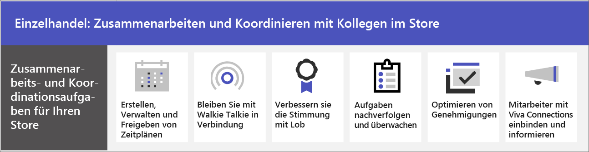

# Zusammenarbeit im Einzelhandel

Bringen Sie Filialmitarbeiter und Management zusammen, um mit Microsoft Teams zu kommunizieren, zusammenzuarbeiten und Abläufe zu optimieren. Unterstützen Sie Ihre Mitarbeiter dabei,[ sich über Viva Connections mit Ihrer Organisation zu verbinden](#connect-information-from-across-the-organization-with-viva-connections), und ermöglichen Sie die Kommunikation zwischen Filialen und der Zentrale mit [Yammer Communitys](#connect-across-your-organization-with-yammer-and-teams).

> [!VIDEO https://www.microsoft.com/videoplayer/embed/RWRJVw]

> [!NOTE]
> Diese Szenarien sind auch Bestandteil der Microsoft Cloud für den Einzelhandel. Bei diesen Szenarien haben Sie mehr Möglichkeiten, wenn Sie auch andere Funktionen aus der Microsoft Cloud für den Einzelhandel verwenden, z. B. Microsoft Dynamics 365. Erfahren Sie mehr über die Verwendung dieser Lösung, die die Funktionen von Azure, Dynamics 365 und Microsoft 365 in [Microsoft Cloud für Einzelhandel](/industry/retail) bündelt.

## Tägliche Kommunikation und Zusammenarbeit in Teams

Microsoft Teams ermöglicht es Verkaufsmitarbeitern in der Filiale, Managern und anderen Mitarbeitern durch die enthaltenen Funktionen und Apps für die Zusammenarbeit effizient zusammenzuarbeiten. Ihre Mitarbeiter an vorderster Front können Teams nach den Anforderungen Ihrer Organisation entweder auf persönlichen oder gemeinsam genutzten Geräten verwenden.

Teams beinhaltet die folgenden Methoden zum Kommunizieren und Freigeben von Informationen:

| Vorgang | Beschreibung | Verwalten dieser Funktion | Schulungen für Endbenutzer |
| ---- | ---- | ---- | ---- |
| Chatten, Posten von Nachrichten und Kommunizieren | Ihre Mitarbeiter in den Filialen können abteilungsübergreifend kommunizieren, um Aufträge zu erfüllen, Hilfe für Kunden zu erhalten und den Lagerbestand zu verwalten.   Teams bietet ohne weitere Konfiguration eine hervorragende Zusammenarbeitserfahrung, und die meisten Organisationen stellen fest, dass die Standardeinstellungen für sie sinnvoll sind. | [Chat, Teams, Kanäle und Apps in Microsoft Teams](../deploy-chat-teams-channels-microsoft-teams-landing-page.md) | [Starten von Chats](https://support.microsoft.com/office/start-and-pin-chats-a864b052-5e4b-4ccf-b046-2e26f40e21b5) und [Arbeiten mit Beiträgen und Nachrichten](https://support.microsoft.com/office/create-and-format-a-post-e66777da-636b-49eb-9408-b0d88b212885) |
|Anrufen und Treffen mit Teammitgliedern | Manager können einzelne Besprechungen einrichten oder Kanalbesprechungen verwenden, um tägliche Besprechungen zu verwalten, und beides mithilfe der leistungsstarken Audio-, Video-, Bildschirmfreigabe-, Aufzeichnungs- und Transkriptionsfeatures von Teams. Beispielsweise könnte ein Vorgesetzter eine Videokonferenz mit Mitarbeitern verschiedener Abteilungen einrichten, um deren Status vor dem Öffnen der Filiale zu überprüfen.   Sie müssen Einstellungen für Besprechungen und Konferenzen konfigurieren und eine Voice-Lösung für die Verwendung von Anrufen aktivieren. | [Besprechungen und Konferenzen in Microsoft Teams](../deploy-meetings-microsoft-teams-landing-page.md) und [ Planen der Teams Voice-Lösung](../cloud-voice-landing-page.md) | [Anrufe tätigen](https://support.microsoft.com/office/overview-of-teams-calls-425d6970-6e27-47b6-bc61-4c38fff51c4f) und [Teilnehmen an einer Besprechung](https://support.microsoft.com/office/join-a-teams-meeting-078e9868-f1aa-4414-8bb9-ee88e9236ee4) |
|Speichern und Freigeben von Dateien und Dokumenten | Durch das Freigeben von Dateien können die Mitarbeiter in der Filiale problemlos auf Informationen wie Verkaufsförderungsdiagramme zugreifen, ohne die Verkaufsfläche verlassen oder Hilfe von einem Vorgesetzten anfordern zu müssen. Jedes Team verfügt automatisch über die Registerkarte „Dateien“, mit der Sie Dokumente speichern und freigeben können. Diese Registerkarte stellt tatsächlich einen Ordner innerhalb der standardmäßigen Teamwebsite-Dokumentbibliothek in SharePoint dar, der automatisch erstellt wird, wenn das Team erstellt wird. | [Interaktion von SharePoint und OneDrive mit Microsoft Teams](../sharepoint-onedrive-interact.md) | [Hochladen und Freigeben von Dateien](https://support.microsoft.com/office/upload-and-share-files-57b669db-678e-424e-b0a0-15d19215cb12) |

Ihr Team kann mithilfe von Apps in Teams tägliche Aufgaben koordinieren und an ihnen zusammenarbeiten, z. B.:

| Vorgang | App | Beschreibung | Diese App verwalten | Schulungen für Endbenutzer |
| ---- | ---- | ---- | ---- | ---- |
| Erstellen, Verwalten und Freigeben von Zeitplänen| Schichten | Verwenden Sie Schichten, um Zeitpläne nahtlos zu verwalten und gemeinsam zu nutzen. Manager können benutzerdefinierte Gruppen erstellen, z. B. Kassierer oder Empfangspersonal, Schichten Mitarbeitern zuweisen, benutzerdefinierte Beschriftungen und Pausen hinzufügen sowie freie Schichten hinzufügen, die Mitarbeiter übernehmen können. Mitarbeiter können Schichten verwenden, um ihre Verfügbarkeit festzulegen, ihre Zeitpläne anzuzeigen, Schichten mit Kollegen zu tauschen sowie ein- und auszustempeln. | [Verwalten von Schichten](/microsoftteams/expand-teams-across-your-org/shifts/manage-the-shifts-app-for-your-organization-in-teams)|[Videoschulung für Schichten](https://support.microsoft.com/office/what-is-shifts-f8efe6e4-ddb3-4d23-b81b-bb812296b821)|
| In Verbindung bleiben | Walkie-Talkie | Die Walkie-Talkie-App bietet sofortige Push-to-Talk-Kommunikation. Mithilfe von Walkie-Talkie können Mitarbeiter und Manager überall in der Filiale kommunizieren. Wenn z. B. ein Kunde auf der einen Seite der Filiale einen Mitarbeiter fragt, ob ein Artikel auf der anderen Seite des Geschäfts vorrätig ist, kann der Mitarbeiter mit dem Walkie-Talkie jemanden kontaktieren, der in der Nähe des Artikels arbeitet. Da Walkie-Talkie über eine unbegrenzte Reichweite verfügt, können sich die Mitarbeiter auch problemlos mit Experten in anderen Filialen oder Unternehmensniederlassungen beraten. | [Verwalten von Walkie-Talkie](../walkie-talkie.md)  | [Videoschulung zu Walkie-Talkie](https://support.microsoft.com/office/use-walkie-talkie-in-teams-884a008a-761e-4b62-99f8-15671d9a2f69) |
| Motivationsförderung | Lob | Die Lob-App ermöglicht es dem Management und Filialmitarbeitern, sich gegenseitig zu beglückwünschen und Anerkennung zu teilen, indem sie vorgefertigte oder benutzerdefinierte Badges sendet. Lob hilft den Mitarbeiter*innen, sich für ihre Leistungen anerkannt zu fühlen, z. B. für das Erreichen von Verkaufszielen oder den Einsatz für Kunden, der über das normale Maß hinausgeht. | [Verwalten der Lob-App](../manage-praise-app.md) |[Videoschulung zur Lob-App](https://support.microsoft.com/office/communication-and-praise-7d37ef80-542b-42e5-aa01-0fabbaa634b6) |
| Nachverfolgen und Überwachen von Aufgaben | Aufgaben | Verwenden Sie Aufgaben in Teams, um Aufgabenelemente für das gesamte Einzelhandelsteam nachzuverfolgen. Filialmanager und -mitarbeiter können Aufgaben auf jedem Gerät, auf dem Teams ausgeführt wird, jederzeit erstellen, zuweisen und planen, Aufgaben kategorisieren und den Status aktualisieren. IT-Profis und Administratoren können auch Aufgaben für bestimmte Teams in Ihrer Organisation veröffentlichen. Sie können z. B. eine Reihe von Aufgaben für die tägliche Reinigung oder Schritte zum Einrichten einer neuen Vitrine veröffentlichen.| [Verwalten der Aufgaben-App](/microsoftteams/manage-tasks-app) |[Videoschulung zu Aufgaben](https://support.microsoft.com/office/use-the-tasks-app-in-teams-e32639f3-2e07-4b62-9a8c-fd706c12c070) |
| Optimieren von Genehmigungen | Genehmigungen | Verwenden Sie Genehmigungen, um Anforderungen und Prozesse mit Ihrem Team zu optimieren. Erstellen, verwalten und teilen Sie Genehmigungen direkt von Ihrem Teamarbeitshub aus. Starten Sie einen Genehmigungsablauf von demselben Ort aus, an dem Sie einen Chat senden, in einer Kanalunterhaltung oder über die Genehmigungsapp selbst. Wählen Sie einfach einen Genehmigungstyp aus, fügen Sie Details hinzu, fügen Sie Dateien an, und wählen Sie genehmigende Benutzer aus. Sobald dies übermittelt wurde, werden die genehmigenden Benutzer benachrichtigt und sie können die Anforderung überprüfen und entsprechend agieren. Sie können die Genehmigungs-App für Ihre Organisation zulassen und zu Teams hinzufügen. | [Verfügbarkeit der Microsoft Teams-App "Genehmigungen"](/microsoftteams/approval-admin) | [Videoschulung zu Genehmigungen](https://support.microsoft.com/office/what-is-approvals-a9a01c95-e0bf-4d20-9ada-f7be3fc283d3?wt.mc_id=otc_microsoft_teams)|

### Einrichten Ihrer Teams, Kanäle und Apps

Wenn Sie bereit sind, Ihre Einzelhandelsmitarbeiter in Teams zu verbinden, können Sie Teams und Kanäle mit vordefinierten oder benutzerdefinierten Vorlagen für Ihre Filialteams und -manager einrichten. Am einfachsten beginnen Sie mit einer Vorlage. Die [Vorlagen](/microsoftteams/get-started-with-retail-teams-templates) **Einen Store organisieren** und **Einzelhandel für leitende Angestellte** sind vorgefertigte Vorlagen, die Kanäle und Apps enthalten, die für den Einzelhandel entwickelt wurden. Sie können auch eine Vorlage erstellen, die auf einem vorhandenen Team basiert. Auch wenn Sie mit einer Vorlage beginnen, können Sie das Team und die Kanäle anpassen und weitere Apps für die Anforderungen Ihres Teams hinzufügen.

- Nutzen Sie Kanäle mit Registerkarten, um Neuigkeiten mitzuteilen, Mitarbeiter schichtübergreifend in Kontakt zu halten und eine Gemeinschaft aufzubauen.
- Verwenden Sie Teamvorlagen zum Einrichten von Teams mit ähnlichen Strukturen (z. B. Kanäle und Registerkarten) über Filialen oder Regionen hinweg.

#### Erstellen eines Teams basierend auf einer Vorlage

1. Wählen Sie in Microsoft Teams die Option **Team beitreten oder erstellen** aus.

2. Wählen Sie **Team erstellen** aus, und scrollen Sie dann nach unten, um die verfügbaren Vorlagen anzuzeigen.

Weitere Informationen: [Erstellen eines Teams mit Vorlagen](https://support.microsoft.com/office/create-a-team-with-team-templates-702a2977-e662-4038-bef5-bdf8ee47b17b)

### Verwalten von Apps

Verfeinern Sie die Arbeit Ihres Teams mit Apps. Sie können Apps für Ihre Organisation zulassen oder blockieren oder Einstellungen für Apps im Microsoft Teams Admin Center konfigurieren. Weitere Informationen zum Verwalten von Apps finden Sie unter [Verwalten von Apps im Microsoft Teams Admin Center](../manage-apps.md).

Ihre Benutzer können beliebige Apps hinzufügen, die Sie ihren Teams erlaubt haben. Teilen Sie diese Schulung mit Ihren Benutzern, um ihnen zu zeigen, wie das geht: [Suchen und Verwenden von Apps](https://support.microsoft.com/office/find-and-use-apps-6e22a734-c002-4da0-ba63-681f155b142d).

## Verbinden Sie mit Viva Connections Informationen aus der gesamten Organisation

Informieren und beziehen Sie mit Viva Connections Ihre Arbeitnehmer mit ein. Viva Connections erstellt einen Hub in Teams, in dem Ihre Einzelhandelsmitarbeiter einen maßgeschneiderten Newsfeed von Ihrer Organisation und ein personalisiertes Dashboard mit benötigten Ressourcen anzeigen können. Wenn Mitarbeiter Viva Connections verwenden, erhalten sie wichtige Informationen schneller, was bedeutet, dass Manager keine wertvolle Zeit mit der Weitergabe von Updates verbringen müssen. Oberfläche mit wichtigen Informationen, personalisierte Nachrichten, Aufgaben, Ankündigungen und andere Ressourcen auf dem Viva Connections-Dashboard.

Erfahren Sie mehr über [Viva Connections](/sharepoint/viva-connections-overview) und helfen Sie Ihren Mitarbeitern und Kollegen bei den ersten Schritte mit [Viva Connections in Microsoft Teams](https://support.microsoft.com/office/your-intranet-is-now-in-microsoft-teams-8b4e7f76-f305-49a9-b6d2-09378476f95b).

Mit Microsoft Teams, Viva Connections und SharePoint ermöglichen Sie die folgenden Szenarien:

- Onboarding neuer Mitarbeiter in Ihre Organisation [Erfahren Sie, wie das geht](/sharepoint/onboard-employees)
- Verbinden Sie Führungsteams mit Mitarbeitern mit Kundenkontakt [Erfahren Sie, wie das geht](/sharepoint/leadership-connection)
- Verteilen Sie Neuigkeiten in Ihrer Organisation [Erfahren Sie, wie das geht](/sharepoint/distribute-corporate-news-to-your-organization)

[Erfahren Sie mehr darüber, wie Sie die Kommunikation in Ihrer Organisation vorantreiben können.](/sharepoint/corporate-communications-overview)

## Verbinden Sie sich organisationsweit mit Yammer und Teams 

Arbeiten Sie mit Communitys in Yammer zusammen. Communities in Yammer erfüllen die Anforderungen an Wissensaustausch, Mitarbeitererfahrung, unternehmensweite Kommunikation und Führungsbindung, indem sie einen zentralen Ort für Ihre Unterhaltungen, Dateien, Ereignisse und Updates bereitstellen. Mitarbeiter können in Yammer Communitys Probleme ansprechen, Feedback geben sowie Fragen stellen und beantworten. Veranstalten Sie Liveereignisse und Versammlungen, damit alle in Ihrer Organisation auf dem Laufenden bleiben.

Erfahren Sie, wie Sie [eine Yammer-Seite zu einem Teams-Kanal hinzufügen](https://support.microsoft.com/office/add-a-yammer-page-to-a-teams-channel-ca06ec83-f22d-4b76-83a5-c83aa2a33528) und wie Sie [eine Community in Yammer erstellen und beitreten](https://support.microsoft.com/office/join-and-create-a-community-in-yammer-56aaf591-1fbc-4160-ba26-0c4723c23fd6).

Weitere Informationen zu Yammer:

- Für Administratoren: [Verwalten von Yammer](/yammer)
- Für Benutzer: [Verwenden von Yammer](https://support.microsoft.com/office/what-is-yammer-1b0f3b3e-89ee-4b66-aac5-30def12f287c)