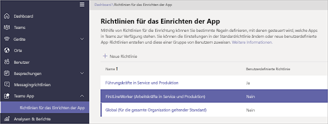

# <a name="manage-the-shifts-app-for-your-organization-in-microsoft-teams"></a>Verwalten der Schichten-App für Ihre Organisation in Microsoft Teams

> [!IMPORTANT]
> 2019, 31. Dezember, wird Microsoft StaffHub eingestellt. Wir erstellen StaffHub-Funktionen in Microsoft Teams. Heute umfasst Teams die Schicht-App für die Terminplanung, und zusätzliche Funktionen werden im Laufe der Zeit bereitgestellt. StaffHub wird am 31. Dezember 2019 nicht mehr für alle Benutzer funktionieren. Jede Person, die versucht, StaffHub zu öffnen, wird eine Meldung angezeigt, die Sie zum Herunterladen von Teams anweist. Weitere Informationen finden Sie unter [Microsoft StaffHub](microsoft-staffhub-to-be-retired.md).  

## <a name="overview-of-shifts"></a>Übersicht über Schichten
Mit der App "Schichten" in Microsoft Teams sind die Mitarbeiter von firstal verbunden und synchron. Es ist ein mobiles Gerät, das für schnelle und effektive Zeitmanagement und Kommunikation für Teams entwickelt wurde. Mithilfe von Schichten können First-Worker und Ihre Manager Ihre mobilen Geräte verwenden, um Zeitpläne zu verwalten und in Kontakt zu bleiben. 

- Manager erstellen, aktualisieren und verwalten Schichtpläne für Teams. Sie können Nachrichten an eine Person senden ("Es gibt einen Überlauf auf dem Boden") oder das gesamte Team ("der regionale GM wird in 20 Minuten ankommen"). Sie können auch Richtliniendokumente, Nachrichtenbulletins und Videos senden. 
- Die Mitarbeiter sehen Ihre bevorstehenden Schichten an, können sehen, wer sonst für den Tag geplant ist, die Anforderung zum tauschen oder zur Verfügung stellen und eine freie Zeit anfordern. 

Es ist wichtig zu wissen, dass Schichten die Gastbenutzer derzeit nicht unterstützen. Das bedeutet, dass Gäste in einem Team nicht hinzugefügt oder Schichtpläne verwenden können, wenn der Gastzugriff in Teams aktiviert ist. 

## <a name="availability-of-shifts"></a>Verfügbarkeit von Schichten

Schichten sind in allen Enterprise-SKUs verfügbar, in denen Teams verfügbar sind.

## <a name="location-of-shifts-data"></a>Speicherort von schichtdaten

Schichten Daten werden derzeit in Azure in Rechenzentren in Nordamerika, Westeuropa und Asien-Pazifik gespeichert. Weitere Informationen dazu, wo Daten gespeichert werden, finden Sie unter [wo befinden sich meine Daten](http://o365datacentermap.azurewebsites.net/)?

## <a name="set-up-shifts"></a>Einrichten von Schichten

### <a name="enable-or-disable-shifts-in-your-organization"></a>Aktivieren oder Deaktivieren von Schichten in Ihrer Organisation

Schichten sind standardmäßig für alle Teams-Benutzer in Ihrer Organisation aktiviert. Sie können die APP organisationsweit deaktivieren oder aktivieren, indem Sie in der APP-Berechtigungsrichtlinie im Microsoft Teams Admin Center organisationsweite Einstellungen verwenden.

1. Wechseln Sie in der linken Navigationsleiste des Microsoft Teams Admin Center zu **Teams-apps** > -**Berechtigungsrichtlinien** .
2. Klicken Sie auf **organisationsweite Einstellungen**.
3. Führen Sie im Panel **organisationsweite Einstellungen** unter **Blockierte apps**eine der folgenden Aktionen aus:

    - Wenn Sie die Schichten für Ihre Organisation deaktivieren möchten, suchen Sie nach der App "Schichten", und klicken Sie auf **Hinzufügen** , um Sie der Liste der blockierten apps hinzuzufügen.
    - Wenn Sie die Schichten für Ihre Organisation aktivieren möchten, entfernen Sie die app "Schichten" aus der Liste der blockierten apps.
4. Klicken Sie auf **Speichern**. 

### <a name="enable-or-disable-shifts-for-specific-users-in-your-organization"></a>Aktivieren oder Deaktivieren von Schichten für bestimmte Benutzer in Ihrer Organisation

Wenn Sie bestimmten Benutzern in Ihrer Organisation das Verwenden von Schichten erlauben oder blockieren möchten, stellen Sie sicher, dass für Ihre Organisation in organisationsweiten Einstellungen aktiviert ist, und erstellen Sie dann eine benutzerdefinierte App-Berechtigungsrichtlinie, und weisen Sie diese Benutzern zu. Weitere Informationen finden Sie unter [Verwalten von App-Berechtigungsrichtlinien in Teams](../../teams-app-permission-policies.md).

### <a name="use-the-firstlineworker-app-setup-policy-to-pin-shifts-to-teams"></a>Verwenden der FirstlineWorker-App-Setup Richtlinie zum Anheften von Schichten an Teams

Mit den Richtlinien für die APP-Einrichtung können Sie Teams anpassen, um die apps hervorzuheben, die für Benutzer in Ihrer Organisation am wichtigsten sind. Die in einer Richtlinie festgelegten apps werden an&mdash;die APP-Leiste angeheftet, die sich auf der Seite des Teams-Desktop Clients und am unteren&mdash;Rand der mobilen Teams-Clients befindet, auf denen Benutzer schnell und einfach darauf zugreifen können. 
 
Teams umfasst eine integrierte Richtlinie für die FirstlineWorker-APP, die Sie den Mitarbeitern in Ihrer Organisation in erster Linie zuweisen können. Standardmäßig umfasst die Richtlinie die Aktivitäten, Schichten, Chats und Anruf-apps. 

Wenn Sie die FirstlineWorker-Richtlinie anzeigen möchten, wechseln Sie in der linken Navigationsleiste des Microsoft Teams admin Centers zu den**Setup Richtlinien**für **Teams-App** > -app.



#### <a name="assign-the-firstlineworker-policy-to-individual-users"></a>Zuweisen der FirstlineWorker-Richtlinie zu einzelnen Benutzern

1. Navigieren Sie in der linken Navigationsleiste des Microsoft Teams Admin Center zu **Benutzer**, und klicken Sie dann auf den Benutzer.
2. Wählen Sie neben **zugewiesene Richtlinien**die Option **Bearbeiten**aus.
3. Wählen Sie unter **Teams-App-Setup Richtlinie**die Option **FirstlineWorker**aus, und wählen Sie dann **Speichern**aus.

#### <a name="assign-the-firstlineworker-app-setup-policy-to-users-in-a-group"></a>Zuweisen der FirstlineWorker-App-Setup Richtlinie zu Benutzern in einer Gruppe

Sie können die FirstlineWorker-App-Setup Richtlinie Benutzern in einer Gruppe wie einer Sicherheitsgruppe zuweisen, indem Sie eine Verbindung mit dem Azure Active Directory PowerShell für Graph-Modul und dem Skype for Business PowerShell-Modul herstellen. Weitere Informationen zur Verwendung von PowerShell zum Verwalten von Teams finden Sie unter [Überblick über PowerShell für Microsoft Teams](../../teams-powershell-overview.md).

In diesem Beispiel weisen wir die FirstlineWorker-App-Setup Richtlinie allen Benutzern in der Contoso-Team Gruppe zu.

> [!NOTE]
> Stellen Sie sicher, dass Sie zuerst eine Verbindung mit dem Azure Active Directory PowerShell for Graph-Modul und dem Skype for Business PowerShell-Modul herstellen, indem Sie die Schritte unter [Verbinden mit allen Office 365-Diensten in einem einzigen Windows PowerShell-Fenster](https://docs.microsoft.com/office365/enterprise/powershell/connect-to-all-office-365-services-in-a-single-windows-powershell-window)ausführen.

Abrufen der GroupObject-ID der jeweiligen Gruppe.
```PowerShell
$group = Get-AzureADGroup -SearchString "Contoso Firstline Team"
```
Abrufen der Mitglieder der gewählten Gruppe.
```PowerShell
$members = Get-AzureADGroupMember -ObjectId $group.ObjectId -All $true | Where-Object {$_.ObjectType -eq "User"}
```
Weisen Sie alle Benutzer in der Gruppe der FirstlineWorker-App-Setup Richtlinie zu.
```PowerShell
$members | ForEach-Object { Grant-CsTeamsAppSetupPolicy -PolicyName "FirstlineWorker" -Identity $_.EmailAddress}
``` 
Je nach Anzahl der Mitglieder einer Gruppe kann das Ausführen dieses Befehls mehrere Minuten dauern.

## <a name="related-topics"></a>Verwandte Themen
- [Schicht Hilfe für Mitarbeiter von First-work](https://support.office.com/article/apps-and-services-cc1fba57-9900-4634-8306-2360a40c665b)
