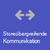
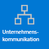
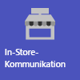
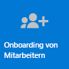

# Erste Schritte mit Teams für den Einzelhandel

Einzelhandelsumgebungen mit rotierenden Zeitplänen und Mitarbeitern, die ständig unterwegs sind, haben ganz andere Anforderungen als andere Unternehmen. Um den größtmöglichen Nutzen für Ihre Einzelhandelsorganisation zu erzielen, wählen Sie zunächst aus, mit welchen Szenarien Teams Sie bei Ihrem Tagesgeschäft unterstützen kann. Stellen Sie dann sicher, dass Sie Ihre Teams-Umgebung mit den richtigen Grundlagen, Teams und Apps vorbereiten, um diese Szenarien zu unterstützen.

1. [Wählen Sie die Szenarien aus](#choose-your-scenarios), die Sie für Ihr Unternehmen implementieren möchten.
:::image type="content" source="../media/retail-teams-scenarios.png" alt-text="Das Diagramm zeigt Teams-Szenarien für den Einzelhandel." lightbox="../media/retail-teams-scenarios.png":::
1. [Einrichten der Grundlagen](#set-up-the-fundamentals) – Unterstützen Sie Ihre Mitarbeiter bei den grundlegenden Aufgaben: Verwalten von Konten und Geräten und stellen Sie sicher, dass die entsprechenden Teams-Richtlinien verwendet werden.
:::image type="content" source="../media/retail-teams-fundamentals.png" alt-text="Das Diagramm zeigt grundlegende Informationen, einschließlich Teams-Richtlinien, Konten und Geräte." lightbox="../media/retail-teams-fundamentals.png":::
1. [Einrichten von Teams und Apps](#set-up-teams-and-apps) – Verwenden Sie Teamvorlagen zum schnellen Einrichten der benötigten Teams, einschließlich der Kanäle und Apps, die Sie für Ihr Unternehmen benötigen. Fügen Sie nach Bedarf andere Apps von Microsoft hinzu, um Ihre Szenarien zu unterstützen.
:::image type="content" source="../media/retail-teams-apps.png" alt-text="Das Diagramm zeigt Teams, Teamvorlagen und Apps, die einbezogen werden können." lightbox="../media/retail-teams-apps.png":::

<!-- Additional capabilities for retail environments are available with the Microsoft Cloud for Retail, which includes capabilities from Dynamics 365 and Microsoft Azure as well as the Microsoft 365 features. For more information, see [Microsoft Cloud for Retail](/industry/retail/). -->

## Auswählen der Szenarien

Microsoft 365 und Microsoft Teams bieten mehrere Funktionen, die Einzelhandelsorganisationen bei ihrem Tagesgeschäft und bei der digitalen Transformation helfen können. Für Einzelhandelsorganisationen empfehlen wir die folgenden Szenarien:

     

> [!NOTE]
> Diese Szenarien sind auch Bestandteil der Microsoft Cloud für den Einzelhandel. Bei diesen Szenarien haben Sie mehr Möglichkeiten, wenn Sie auch andere Funktionen aus der Microsoft Cloud für den Einzelhandel verwenden, z. B. Microsoft Dynamics 365. Erfahren Sie mehr über die Verwendung dieser Lösung, die Funktionen von Azure, Dynamics 365 und Microsoft 365 in [Microsoft Cloud für Einzelhandel](/industry/retail) bündelt.

### Filialkommunikation und -zusammenarbeit

Bringen Sie Filialmitarbeiter und Management zusammen, um mit Teams und Teams Apps zusammenzuarbeiten und Abläufe zu optimieren.

**Wichtige Apps:** Schichten, Walkie-Talkie, Aufgaben, Genehmigungen, Chat, Lob, Listen, Dateien

**Weitere Dienste:** Viva Connections, SharePoint, Power Platform und Power Apps

Weitere Informationen: [Zusammenarbeit im Einzelhandel](retail-team-collaboration.md)

### Filialübergreifende Kommunikation und Zusammenarbeit

Mitarbeiter können mit den gleichen Tools und Apps, die Sie in Ihrer Filiale verwenden, mit anderen Filialen in der Region oder der Zentrale kommunizieren und zusammenarbeiten.

**Wichtige Apps:** Schichten, Walkie-Talkie, Aufgaben, Genehmigungen, Chat, Lob, Listen, Dateien

**Weitere Dienste:** Viva Connections, Yammer, SharePoint, Power Platform und Power Apps

Weitere Informationen: [Zusammenarbeit im Einzelhandel](retail-team-collaboration.md)

### Virtuelle Anproben und Beratungsgespräche

Die Bookings-App in Microsoft Teams bietet Organisationen eine einfache Möglichkeit zum Planen und Verwalten virtueller Termine für Mitarbeiter und Kunden. Verwenden Sie sie zum Planen virtueller Termine, z. B. virtueller Einkaufserlebnisse.

**Wichtige Features und Apps:** Besprechungen, Bookings

Weitere Informationen: [Virtuelle Besuche mit Microsoft Teams und der Bookings-App](bookings-virtual-visits.md)

### Vereinfachen von Geschäftsprozessen

Sie können Teams-Apps, Power Apps und Power BI zur Vereinfachung von Geschäftsprozessen verwenden. Sie verfügen über folgende Möglichkeiten:

- Mit Schichten können Sie Zeitpläne für Ihre Mitarbeiter festlegen und verwalten.
- Führen Sie Filialrundgänge und Inventuren mit Power Apps durch.
- Verfolgen Sie Leistungsindikatoren (Key Performance Indicators, KPIs) mit Power BI Bericht.

**Wichtige Apps:** Schichten, Aufgaben, Listen, Genehmigungen

**Weitere Dienste:** Power Platform mit Power Apps und Power BI

Weitere Informationen: [Vereinfachen von Geschäftsprozessen](retail-business-processes.md)

### Unternehmenskommunikation

Die Mitarbeiterbindung trägt in jeder Organisation wesentlich zur Zufriedenheit am Arbeitsplatz, Loyalität und Produktivität bei. Erfahren Sie, wie mithilfe von SharePoint, Teams, Yammer, Stream und Viva Connections jeder informiert und eingebunden bleibt.

**Weitere Dienste:** Viva Connections, SharePoint, Stream, Yammer

Weitere Informationen: [Organisationskommunikation: Anleitungen, Methoden und Produkte](/sharepoint/corporate-communications-overview)

### Einarbeiten neuer Mitarbeiter

Machen Sie das Einarbeiten neuer Mitarbeiter zu einer großartigen Erfahrung, indem Sie eine hybride Gesamtumgebung schaffen, in der neue Mitarbeiter wichtige Ressourcen finden, Personen in ihrer Organisation kennenlernen und sich darauf vorbereiten können, in ihrer neuen Rolle erfolgreich zu sein.

**Wichtige Apps:** Listen, Live-Besprechungen

**Weitere Dienste:** Viva Learning, SharePoint, Yammer

Weitere Informationen: [Einarbeiten neuer Mitarbeiter](/sharepoint/onboard-employees)

> [!NOTE]
> Für alle diese Funktionen müssen Benutzer über eine entsprechende Lizenz verfügen. Microsoft 365 für Mitarbeiter in Service und Produktion F1 und F3 oder Office 365 F3, Office 365 A3, A5, E3 und E5 sowie Microsoft 365 Business Standard, Business Premium, A3, A5, E3 und E5 werden alle unterstützt. Weitere Informationen zur allgemeinen Teams-Lizenzierung finden Sie unter [Verwalten des Benutzerzugriffs auf Teams](../user-access.md). Weitere Informationen zur Verwendung von Microsoft 365 für Mitarbeiter in Service und Produktion in Kombination mit anderen Lizenzen finden Sie unter [Lizenzierungsoptionen für Mitarbeiter in Service und Produktion](../flw-licensing-options.md).

## Einrichten der Grundlagen

Schaffen Sie die richtige Grundlage für Ihre Mitarbeiter, damit sie ihre Arbeit sicher und vorschriftsmäßig erledigen können, indem Sie geeignete Lizenzen für sie auswählen und ihre Konten sowie ihre Geräte verwalten.

:::image type="content" source="../media/retail-teams-fundamentals.png" alt-text="Diagramm der Grundlagen zur Unterstützung von Szenarien in Teams, z. B. Teams-Richtlinien und Konten und Geräte.":::

### Lizenzierung

Einzelhandelsmitarbeiter sind in der Regel mobile Mitarbeiter: arbeitsplatzungebundene Mitarbeiter und Manager, die im Gegensatz zu Unternehmensmitarbeitern nicht den ganzen Tag an Computer gebunden sind. Daher unterscheiden sich die benötigten Tools und Apps. Microsoft 365 für Mitarbeiter in Service und Produktion bietet eine Featuresammlung, die auf diese Zielgruppe zugeschnitten ist. Weitere Informationen finden Sie unter [Lizenzierungsoptionen für Mitarbeiter in Service und Produktion](../flw-licensing-options.md).

### Konten

Bei hoher Fluktuation ist es entscheidend, Konten schnell hinzuzufügen, zu entfernen und die richtigen Richtlinien zu erhalten. Erste Schritte mit dem Onboarding-Assistenten für arbeitsplatzungebundene Mitarbeiter in Microsoft 365 Admin Center. Der Assistent richtet ein Team für Ihre arbeitsplatzungebundene Mitarbeiter ein und weist jedem Teammitglied Lizenzen und Richtlinienpakete zu. Weitere Informationen finden Sie unter [Verwenden Sie den Onboarding-Assistenten für arbeitsplatzungebundene Mitarbeiter, um Ihrem arbeitsplatzungebundenen Personal einen schnellen Einstieg zu ermöglichen](../flw-onboarding-wizard.md).

Wenn Sie viele Benutzer hinzufügen müssen (mehr als 100), können Sie mit einer skriptgestützten Bereitstellung für [arbeitsplatzungebundene Mitarbeiter](../flw-scripted-deployment.md) schnell Benutzer und Teams bereitstellen und alle relevanten Richtlinien zuweisen.

Die Anwesenheit von arbeitsplatzungebundener Mitarbeitern ist häufig weniger vorhersagbar als bei anderen Mitarbeitern, da ihre Arbeitszeiten in der Regel nicht jeden Tag gleich sind. Ein Administrator kann Teams auf schichtbasierten Zugriff (Vorschau) konfigurieren, sodass eine Zusammenstellung der Anwesenheitsstatus der arbeitsplatzungebundenen Mitarbeiter schichtbasiert angezeigt wird, um anzugeben, wann sie an- oder abwesend sind. Sie können auch den Zugriff auf Teams verwalten, wenn arbeitsplatzungebundene Mitarbeiter abwesend sind. Weitere Informationen finden Sie unter [Verwalten des schichtbasierten Zugriffs für arbeitsplatzungebundene Mitarbeiter](shifts/manage-shift-based-access-flw.md).

### Geräte

Da die Mitarbeiter größtenteils mobil sind, ist für Einzelhandelsumgebungen das Verwalten von Konten und Geräten eine wichtige Grundlage. Sie müssen eine sichere, konforme Grundlinie zum Umgang mit verwalteten Geräten festlegen, die Ihre Mitarbeiter verwenden können, unabhängig davon, ob es sich um ein gemeinsam genutztes Gerät oder ein eigenes Gerät eines Mitarbeiters handelt. Weitere Informationen finden Sie unter:

- [Bereitstellung eines Azure Active Directory-Geräts planen](/azure/active-directory/devices/plan-device-deployment)
- [Übersicht über Microsoft Intune](/mem/intune/fundamentals/what-is-intune#manage-devices)
- [Microsoft Teams für RealWear](../flw-realwear.md)

### Richtlinien

Stellen Sie sicher, dass Ihre Verkaufsmitarbeiter und andere arbeitsplatzungebundene Mitarbeiter über den entsprechenden Zugriff auf Teams verfügen, indem Sie die entsprechenden Richtlinienpakete konfigurieren. Mithilfe von Teams-Richtlinien können Sie steuern, welche Aktionen Benutzer in bestimmten Rollen ausführen können. Die [Richtlinienpakete für arbeitsplatzungebundene Mitarbeiter und Manager](../manage-policy-packages.md#policy-packages-included-in-teams) sind auf arbeitsplatzungebundene Mitarbeiter zugeschnitten, wie z. B. Mitarbeitern in Einzelhandelsgeschäften.

Teams ist mit der App „Schichten“ in arbeitsplatzungebundene Mitarbeiter integriert, was unter anderem zum Koordinieren von Schichtbesetzungsfeatures verwendet werden kann. So können Filialleiter z. B. in Schichten Zeitpläne für ihre Mitarbeiter einrichten und koordinieren, und Mitarbeiter können Zeitpläne überprüfen und Schichten tauschen.

## Einrichten von Teams und Apps

:::image type="content" source="../media/retail-teams-apps.png" alt-text="Diagramm von Teams, Teamvorlagen und Apps, die enthalten sein können.":::

### Apps und Dienste für den Einzelhandel

Stellen Sie sicher, dass Ihre Beschäftigten über Apps wie Schichten, Walkie-Talkie, Aufgaben, Listen, Lob und andere Apps kommunizieren, zusammenarbeiten und hervorragenden Kundendienst bieten können. Sie bestimmen, welche Apps für Ihre Benutzer verfügbar sind, indem Sie sie im Teams Admin Center aktivieren oder in eine Teamvorlage einfügen. Weitere Informationen zum [Verwalten von Teams-Apps](../manage-apps.md).

Für Einzelhandelsumgebungen können Ihnen die folgenden Apps und Dienste dabei helfen, Ihre Geschäftsprozesse zu transformieren und die Kommunikation zu unterstützen:

| Apps und Dienste in Teams | Beschreibung | Verwalten | Hilfe |
| ----- | ----- | ----- | ----- |
| Genehmigungen | Genehmigungen können zur einfachen Abmeldung in den Chat integriert werden. | [Verwalten von Genehmigungen](../approval-admin.md) | [Verwenden von Genehmigungen](https://support.microsoft.com/office/what-is-approvals-a9a01c95-e0bf-4d20-9ada-f7be3fc283d3) |
| Chat | Ermöglicht schnelle Unterhaltungen und Checkins zwischen Mitarbeitern mit sicheren, auf Unternehmen zugeschnittenen Kommunikationstools anstelle von Apps oder SMS auf Verbraucherqualität. | [Chat, Teams, Kanäle und Apps in Microsoft Teams](../deploy-chat-teams-channels-microsoft-teams-landing-page.md) | [Chat in Teams](https://support.microsoft.com/office/start-and-pin-chats-a864b052-5e4b-4ccf-b046-2e26f40e21b5?wt.mc_id=otc_microsoft_teams) |
| Dokumente | Teilen von Standardbetriebsabläufen, Speicherrichtlinien, Plänen und vielem mehr. | [Interaktion von SharePoint und OneDrive mit Microsoft Teams](../sharepoint-onedrive-interact.md) | [Freigeben von Dateien](https://support.microsoft.com/office/upload-and-share-files-57b669db-678e-424e-b0a0-15d19215cb12) |
| Lob | Hervorragende Teamarbeit der Kollegen mit der Lob-App anerkennen. | [Verwalten der Praise-App](../manage-praise-app.md) | [Senden von Lob an Personen](https://support.microsoft.com/office/send-praise-to-people-50f26b47-565f-40fe-8642-5ca2a5ed261e) |
| RealWear-Geräte | Freisprechkommunikation mit Geräten. | [Microsoft Teams für RealWear](../flw-realwear.md) | [Verwenden von Microsoft Teams für RealWear](https://support.microsoft.com/office/using-microsoft-teams-for-realwear-af20d232-d18c-476f-8031-843a4edccd5f) |
| Schichten | Verwalten Sie mit Schichten Zeitpläne und die Arbeitszeiterfassung. | [Verwalten von Schichten](shifts-for-teams-landing-page.md) | [Verwenden von Schichten](https://support.microsoft.com/office/what-is-shifts-f8efe6e4-ddb3-4d23-b81b-bb812296b821) |
| Aufgaben | Durch das Zuweisen von Aufgaben wissen Mitarbeiter, worauf sie sich konzentrieren sollen, wenn sie keinen Kundenkontakt haben. Vorgänge können die [Aufgabenveröffentlichung](../manage-tasks-app.md#task-publishing) verwenden, um Aufgaben an Standorte zu senden und den Fortschritt über diese Standorte hinweg nachverfolgen zu können. | [Verwalten der Aufgaben-App](../manage-tasks-app.md) | [Verwenden von Aufgaben](https://support.microsoft.com/office/use-the-tasks-app-in-teams-e32639f3-2e07-4b62-9a8c-fd706c12c070) |
| Walkie-Talkie | Push-to-Talk-Kommunikation, die nicht wie bei herkömmlichen 2-Wege-Funkgeräten durch geografische Gegebenheiten eingeschränkt ist.| [Verwalten der Walkie-Talkie-App](../walkie-talkie.md) | [Verwenden von Walkie-Talkie](https://support.microsoft.com/office/get-started-with-teams-walkie-talkie-25bdc3d5-bbb2-41b7-89bf-650fae0c8e0c) |

| Weitere Apps und Dienste von Microsoft | Beschreibung | Verwalten | Hilfe |
| ----- | ----- | ----- | ----- |
| Bookings | Aktivieren von virtuellen Anproben und Beratungsgesprächen. | [Virtuelle Visiten und Termine mit Microsoft Teams und der Bookings-App](bookings-virtual-visits.md) | [Verwenden von Bookings](https://support.microsoft.com/en-us/office/what-is-bookings-42d4e852-8e99-4d8f-9b70-d7fc93973cb5) |
| Power Apps und die Power Platform | Ermöglichen die Integration von Geschäftsprozessen, und die schnelle Aktualisierungen von Daten, z. B. Lagerbestand, Verkaufszahlen, Schadensberichte und mehr. | [Integration von Teams in die Microsoft Power Platform](../teams-power-platfom-integration.md) und [Verwalten von Microsoft Power Platform-Apps im Microsoft Teams Admin Center](../manage-power-platform-apps.md) | -  |
| SharePoint | Wenn Sie ein neues Team erstellen, wird eine neue SharePoint-Site erstellt und mit dem Team verbunden. Viele der oben genannten Szenarien basieren auf bereits in Teams integrierten SharePoint-Features, z. B. das Freigeben von Dokumenten für die Zusammenarbeit im Team. | [Integration von Teams und SharePoint](/sharepoint/teams-connected-sites) | [Einfügen einer SharePoint-Seite, -Liste oder -Dokumentbibliothek als Registerkarte in Teams](https://support.microsoft.com/office/add-a-sharepoint-page-list-or-document-library-as-a-tab-in-teams-131edef1-455f-4c67-a8ce-efa2ebf25f0b)|
| Viva Connections | Viva Connections erstellt einen Hub in Teams, in dem Ihre Einzelhandelsmitarbeiter einen maßgeschneiderten Newsfeed von Ihrer Organisation und ein personalisiertes Dashboard mit benötigten Ressourcen anzeigen können. | [Übersicht über Viva Connections](/sharepoint/viva-connections-overview) | [Viva Connections in Microsoft Teams](https://support.microsoft.com/office/your-intranet-is-now-in-microsoft-teams-8b4e7f76-f305-49a9-b6d2-09378476f95b) |
| Viva Learning | Stellen Sie bei Bedarf Schulungen direkt im Arbeitsablauf zur Verfügung. | [Verwalten von Viva Learning](/microsoft-365/learning/) | [Verwenden von Viva Learning (Vorschau)](https://support.microsoft.com/office/viva-learning-preview-01bfed12-c327-41e0-a68f-7fa527dcc98a) |
| Yammer | Verbinden Sie Ihre Organisation, und ermöglichen Sie mit Yammer abteilungs- und regionsübergreifende Kommunikation. | [Verwalten von Yammer](/yammer) | [Verwenden von Yammer](https://support.microsoft.com/office/what-is-yammer-1b0f3b3e-89ee-4b66-aac5-30def12f287c) |

### Verwenden von Vorlagen zum Einrichten von Teams

Erstellen Sie Teams, die eine vordefinierte Gruppe von Einstellungen, Kanälen, Registerkarten und vorinstallierten Apps für die Kommunikation und Zusammenarbeit in einer einzelnen Filiale, in einer Region oder zwischen der Zentrale und Ihren Mitarbeitern enthalten, wo immer sie sich befinden.

- Die Einzelhandelsvorlage **Einen Store organisieren** enthält Kanäle für „Allgemein“, „Schichtübergabe“, „Bereitschaft der Filiale“ und „Learning“ sowie die Apps „Genehmigungen“, „Aufgaben“ und „Wiki“.
- Die Vorlage **Einzelhandel für leitende Angestellte** enthält Kanäle für „Allgemein“, „Vorgänge“ und „Lernen“ sowie die Registerkarte „Wiki“.

Sie können auch [eine benutzerdefinierte Vorlage erstellen](../create-a-team-template.md) mit den Apps, die Ihr Store benötigt. Weitere Informationen: [Erste Schritte mit Teamvorlagen für den Einzelhandel](../get-started-with-retail-teams-templates.md)

Neben Teamvorlagen können Sie auch andere Websites und Dienste einrichten, die Ihnen bei der Kommunikation helfen: SharePoint-Websites und Viva Connections.

- Richten Sie SharePoint-Websites ein, um eine Startseite für Ihre Organisation zu erstellen, Neuigkeiten unternehmensweit zu verteilen und einen Ort mit Ressourcen für das Onboarding von Benutzern zur Verfügung zu stellen. Weitere Informationen zur Verwendung von SharePoint-Websites für Szenarien für die Unternehmenskommunikation finden Sie unter [Organisationskommunikation: Anleitungen, Methoden und Produkte](/sharepoint/corporate-communications-overview).
- Verwenden Sie Viva Connections, um alles zusammenzuführen. Mit Viva Connections als Startpunkt Ihrer Mitarbeiter in Teams können Ihre Mitarbeiter Aktualisierungen zu ihren Aufgaben, Neuigkeiten aus der Organisation und vielem mehr erhalten. Weitere Informationen finden Sie unter [Übersicht: Viva Connections (Vorschau)](/viva/connections/viva-connections-overview) und [Hinzufügen der Viva Connections-App im Teams Admin Center (Vorschau)](/viva/connections/add-viva-connections-app).

## Bereiten Sie sich auf die Einführung Ihrer Szenarien vor– identifizieren Sie Rollen und Zuständigkeiten für Szenarien.

Da Sie nun wissen, welche Szenarien Sie implementieren möchten und was Sie benötigen, um sie zu unterstützen, können Sie Ihr Team versammeln, um sie zu planen, einzuführen und zu überwachen, wie sie in Ihrer Organisation funktionieren. Beispielsweise können die folgenden Rollen erforderlich sein, um diese Szenarien in Ihrer Organisation einführen zu können:

| Bild | Rolle | Responsibilities | Abteilung |
| ---- | ---- | ----- | ----- |
|  | IT-Administrator | Arbeiten mit dem Personal von Operations und der Einzelhandelsverwaltung zusammen, um Szenarien und deren Funktionsweise für die Organisation zu definieren.   Konfigurieren Einstellungen im Teams Admin Center, z. B. Richtlinien und Vorlagen, und aktivieren Apps.   Richten App-Einstellungen (z. B. globale Schichteneinstellungen) für die Organisation ein.   Hinzufügen und Lizenzieren von Benutzern.  | IT-Abteilung |
|  | Operations-Personal | Arbeiten mit den Administratoren zusammen, um Szenarien zu definieren und zu bestimmen, welche Einstellungen, Richtlinien, Vorlagen und Apps für Teams benötigt werden.   Erstellen regionale oder Abteilungsteams aus Vorlagen.   Richten Aufgaben, Listen und Genehmigungsflüsse für die Abstimmung zwischen Filialen innerhalb einer Region oder zwischen Filialen und Zentrale ein.   Richten ein Learning-Framework für Mitarbeiter ein. | Central Operations |
|  | Filialleiter | Arbeiten mit Administratoren und Operations-Personal zusammen, um Szenarien zu definieren.   Erstellen Teams aus Vorlagen für die Filiale.   Richten nach Bedarf Kanäle und Apps für die Teams ein. Beispiel: ein Kanal für Schichtübergaben.   Richten in Schichten Filialzeitpläne ein.   Richten für die Filiale spezifische Aufgaben-, Listen- und Genehmigungsflüsse ein.   Richten Learning-Aufgaben für Mitarbeiter ein. | Filialsteuerung |

Weitere Informationen zur erfolgreichen Implementierung und Einführung von Teams finden Sie unter [Einführen von Microsoft Teams](../adopt-microsoft-teams-landing-page.md).