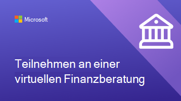
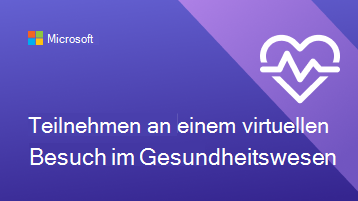
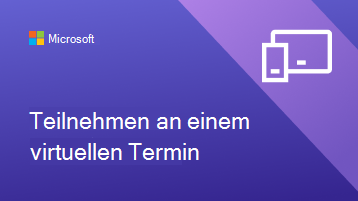

# Helfen Sie Ihren Kunden und Kunden bei der Verwendung virtueller Termine

Nachdem Ihre Organisation mit der Verwendung von Microsoft Teams und der Bookings-App für virtuelle Termine begonnen hat, müssen Sie sicherstellen, dass Ihre Kunden und Kunden verstehen, wie sie diese Termine buchen und daran teilnehmen können.

Schauen Sie sich dieses Video an, um einen schnellen Überblick darüber zu erhalten, was virtuelle Termine für Ihre Organisation tun können.

> [!VIDEO https://www.microsoft.com/videoplayer/embed/RE4TQop]

## Inhalt dieses Toolkits

Dieses Toolkit soll Ihnen helfen, Ihren Kunden und Kunden bei der erfolgreichen Teilnahme an einem virtuellen Termin zu helfen. Sie können die von uns bereitgestellten Ressourcen anpassen und Links zu ihnen in Ihre Kommunikation zu virtuellen Terminen aufnehmen. Dieses Toolkit umfasst:

[Anleitungen für Ihre Website](#guidance-for-your-website):   Häufig gestellte Fragen zu virtuellen Terminen, die Sie anpassen und dann auf Ihrer Website hosten können. Stellen Sie sicher, dass Sie Ihre eigenen Links und alle zusätzlichen Informationen hinzufügen, die Ihre Kunden über Ihre Richtlinien wissen müssen.

[Ressourcen für Ihr Team](#resources-for-your-team):   Artikel und Videos helfen Ihrem Team, virtuelle Termine komfortabler zu gestalten.

[Ressourcen für Ihre Clients](#resources-for-your-clients):  
Ein Link zu den Supportinhalten von Microsoft, der ein Video über die Teilnahme an einem virtuellen Termin enthält. 
Infografiken, die Sie für Ihre Organisation anpassen können.

## Anleitungen für Ihre Website

Lassen Sie Ihre Kunden wissen, was Sie mit virtuellen Terminen erwarten können, indem Sie häufig gestellte Fragen beantworten. Sie müssen nur diese F-&A bearbeiten, um sie an Ihre virtuellen Terminrichtlinien auszurichten, und sie auf Ihrer Website einfügen.

### Grundlagen zu virtuellen Terminen

**Was ist ein virtueller Termin?**

Ein virtueller Termin ist ein Onlinetermin, der über Microsoft Teams durchgeführt wird. Sie sprechen 1:1 mit einem unserer Mitarbeiter, genau wie bei einem Persönlichbesuch.

**Wie unterscheiden sich virtuelle Termine von persönlich besuchten Terminen?**

Lassen Sie Ihre Kunden wissen, ob es Unterschiede bei den Dienstleistungen gibt, die Sie virtuell und persönlich bereitstellen. Sie können auch alle Gebührenunterschiede zwischen virtuellen und privaten Terminen beschreiben.

**Wie läuft ein virtueller Termin ab?**

Wenn Sie über den Link in der E-Mail-Bestätigung teilnehmen, geben Sie einen virtuellen Warteraum ein. Sobald ein Mitarbeiter dem Anruf beigetreten ist, betreten Sie einen virtuellen Raum mit ihnen, in dem Ihr Einzelbesuch stattfindet.

**Wie funktioniert die Zahlung bei virtuellen Terminen?**

Informieren Sie Ihre Kunden darüber, ob Sie unterschiedliche Zahlungsarten für virtuelle Termine akzeptieren.

### Buchen eines Termins

**Gewusst wie einen Termin vereinbaren?**

Link zur Buchungsseite Ihrer Organisation. Informieren Sie Ihre Kunden darüber, ob es alternative Möglichkeiten gibt, virtuelle Termine zu tätigen, z. B. per Telefon, per E-Mail oder über soziale Medien.

**Wer kann ich einen Termin vereinbaren?**

Stellen Sie sicher, dass Ihre Kunden Beziehungen zu ihren bevorzugten Anbietern pflegen können, indem Sie teilen, welche Mitarbeiter, falls vorhanden, ausschließlich virtuell oder persönlich arbeiten.

**Gewusst wie einen virtuellen Termin absagen oder neu planen?**

Sie können hier eine Verknüpfung mit der Stornierungs- und Neuplanungsrichtlinie Ihrer Organisation herstellen oder unterschiede in der Richtlinie zwischen virtuellen und persönlich terminbezogenen Terminen beschreiben.

### Technologie

**Welche Ausrüstung benötige ich für einen virtuellen Termin?**

Kunden können über einen beliebigen Webbrowser oder über die Microsoft Teams-App an einem virtuellen Termin teilnehmen. Listen Sie hier auf, ob Ihre Organisation über zusätzliche Spezifikationen verfügt, z. B. eine hochwertige Webcam oder ein Mikrofon. Wenn Ihre Gesundheitsorganisation die AA in Teams integriert hat, können Patienten über Ihr Gesundheitsportal an Besuchen teilnehmen.

**Gewusst wie einem virtuellen Termin beitreten?**

Sie können Ihre Kunden hier verknüpfen, um einem Bookings Termin als Teilnehmer (microsoft.com) beizutreten, um ihnen ein detailliertes Video und einen schrittweisen Prozess zur Teilnahme an einem Termin zu zeigen.

## Ressourcen für Ihr Team

Nutzen Sie virtuelle Termine optimal, indem Sie sicherstellen, dass Ihre Mitarbeiter wissen, wie sie diese durchführen können. Sie können diese Artikel und Videos mit Ihren Teammitgliedern teilen, um ihnen zu helfen, virtuelle Termine besser zu verstehen.

- [Informationen zum Verwenden der Bookings-App in Teams](https://support.microsoft.com/office/what-is-bookings-42d4e852-8e99-4d8f-9b70-d7fc93973cb5)
- [Erfahren Sie, wie Sie an einem Bookings Termin teilnehmen](https://support.microsoft.com/office/join-a-bookings-appointment-attendees-3deb7bde-3ea3-4b41-8a06-741ad0db9fc0)
- [Durchführen eines virtuellen Besuchs](/microsoftteams/expand-teams-across-your-org/bookings-virtual-visits#conduct-a-visit)
- [Sehen Sie sich ein Video zu virtuellen Terminen an](#help-your-clients-and-customers-use-virtual-appointments)

## Ressourcen für Ihre Clients

Sie können einen Link zu diesem Artikel erstellen, um Ihren Kunden zu zeigen, wie Sie an virtuellen Terminen teilnehmen:  
[Erfahren Sie, wie Sie an einem virtuellen Termin teilnehmen](https://support.microsoft.com/office/join-a-bookings-appointment-as-an-attendee-95cea12d-2220-421f-a663-6efb20913c7f)

Laden Sie eine dieser Infografiken herunter, und [passen Sie](#customize-your-infographic) sie so an, dass sie auf Ihrer Website angezeigt werden. Diese bieten Ihren Kunden eine schnelle und visuell ansprechende Möglichkeit zu verstehen, wie virtuelle Termine mit Ihrer Organisation funktionieren.

| Grafik                | Beschreibung und Links              |
| :------------------- | -------------------: |
|  | Anpassbare Infografik für Ihre Finanzdienstleistungsorganisation   [Als PDF herunterladen](https://go.microsoft.com/fwlink/?linkid=2196520&clcid=0x409)   [Als PowerPoint herunterladen](https://go.microsoft.com/fwlink/?linkid=2196449&clcid=0x409)
|  | Anpassbare Infografik für Ihre Einzelhandelsorganisation   [Als PDF herunterladen](https://go.microsoft.com/fwlink/?linkid=2196452&clcid=0x409)   [Als PowerPoint herunterladen](https://go.microsoft.com/fwlink/?linkid=2196451&clcid=0x409) |
|  | Anpassbare Infografik für Ihre Organisation im Gesundheitswesen   [Als PDF herunterladen](https://go.microsoft.com/fwlink/?linkid=2196357&clcid=0x409)   [Als PowerPoint herunterladen](https://go.microsoft.com/fwlink/?linkid=2196450&clcid=0x409) |
|  | Anpassbare Infografik, die nicht für eine bestimmte Branche spezifisch ist   [Als PDF herunterladen](https://go.microsoft.com/fwlink/?linkid=2196355&clcid=0x409)   [Als PowerPoint herunterladen](https://go.microsoft.com/fwlink/?linkid=2196356&clcid=0x409) |

### Anpassen ihrer Infografik

1. Wählen Sie je nach Den Anforderungen Ihrer Organisation eine von drei vorgefertigten Infografiken aus:
    1. Gesundheitswesen
    2. Finanzdienstleistungen
    3. Einzelhandel

2. Passen Sie die Infografik in PowerPoint an.
    1. Verwenden Sie die Farben und bevorzugten Schriftarten Ihrer Organisation.
    2. Fügen Sie das Logo oder Markenbilder Ihrer Organisation hinzu.
    3. Link zu Seiten auf Ihrer Website, z. B. Ihrer Buchungsseite, Abrechnungsinformationen oder Homepage.
    4. Fügen Sie alle zusätzlichen Informationen hinzu, die Ihre Kunden kennen müssen, bevor Sie einem virtuellen Termin beitreten.

3. Exportieren Sie Ihre angepasste Infografik als PDF.
