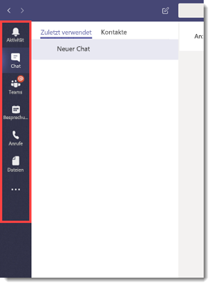
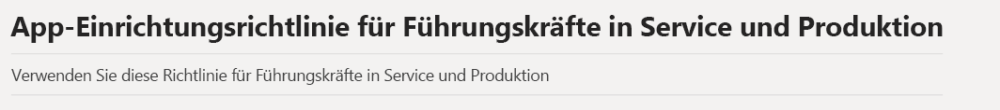
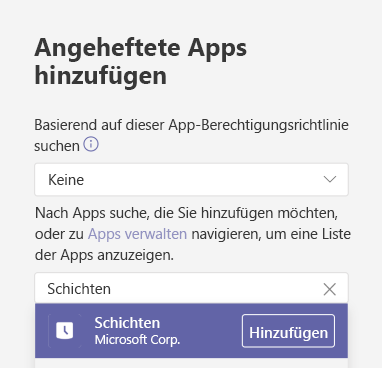
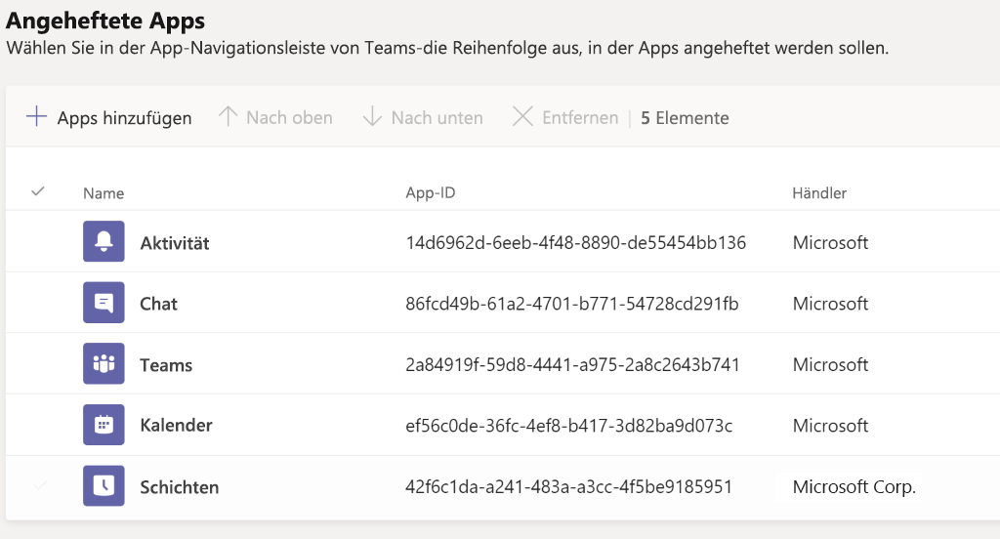
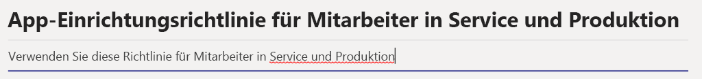
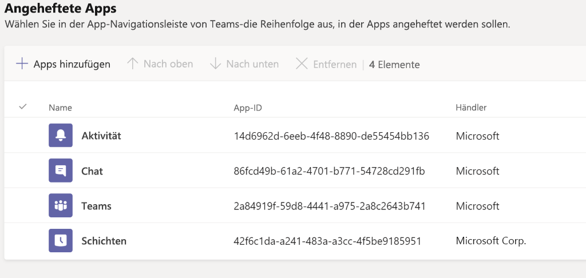

# <a name="how-to-provision-teams-at-scale-for-frontline-workers"></a>Bereitstellen von Teams im großen Maßstab für Mitarbeiter in Service und Produktion

Müssen Sie eine große Anzahl von Benutzern schnell in Microsoft Teams einrichten und eine optimierte Umgebung für die Benutzer konfigurieren? Sie können im Handumdrehen die nachstehenden Anweisungen ausführen, um Identitäten und Teams schnell bereitzustellen sowie alle relevanten Richtlinien zuzuweisen, um die Endbenutzerumgebung zu definieren.

Dabei lernen Sie Folgendes:

- Erstellen einer großen Anzahl von Benutzern
- Erstellen einer großen Anzahl von Teams und Einrichten der entsprechenden Kanäle
- Zuweisen von Lizenzen in großem Maßstab
- Erstellen geeigneter Gruppen-Messagingrichtlinien sowie von App-Einrichtungs- und -Berechtigungsrichtlinien.
- Anwenden dieser Richtlinien auf Benutzer im großen Maßstab.
- Eine große Anzahl von Benutzern einem bestimmten Team zuweisen

> [!NOTE]
> Wenn Sie diese Informationen gelesen haben und das Gefühl haben, dass Sie Hilfe benötigen oder Fragen haben, [**klicken Sie hier**](https://forms.office.com/Pages/ResponsePage.aspx?id=v4j5cvGGr0GRqy180BHbRyMDv-1voW9MqL7zkQ11DzBUREZaU1E0WEk5T0NYS0NDSkFMSDROUUdYMC4u), um zum White Glove-Support zu gelangen.

## <a name="prerequisites"></a>Voraussetzungen

Laden Sie die Objekte von [hier](https://aka.ms/flwteamsscale) herunter.

> [!IMPORTANT]
> Die Skripts unter obigem Link werden von Microsoft im Istzustand bereitgestellt und müssen an Ihre individuellen Anforderungen angepasst werden.

## <a name="technical-requirements"></a>Technische Anforderungen

- Ihr Mandant muss über die entsprechende Anzahl von Lizenzen verfügen, die Microsoft Teams umfassen. Falls Sie diese Lizenzen noch nicht besitzen, können Sie unter [Teams Exploratory](teams-exploratory.md) ein kostenloses Probeabonnement erwerben.
- Benutzern, die diese Schritte durchführen, müssen in Azure AD die folgenden Rollen zugewiesen sein: Globaler Administrator, Benutzer-Administrator und Teams-Dienst-Administrator.
- Der Benutzer muss über die Berechtigung zum Installieren und Konfigurieren von Software auf dem lokalen Computer verfügen.

## <a name="step-by-step-process-overview"></a>Übersicht über die einzelnen Prozessschritte

1. **Ihre Umgebung einrichten**
    1. Herunterladen aus dem GitHub-Repository mit den Beispiel-PowerShell-Skripts und der Dokumentation
    1. Konfigurieren der lokalen Umgebung
    1. Anmeldeinformationen einrichten
    1. PowerShell-Module und Umgebungsvariablen einrichten
1. **Erstellen und Einrichten von Teams**
    1. Teams erstellen
    1. Schritte zum Erstellen eines Teams
    1. Erstellen von Kanälen für Teams
1. **Erstellen von Teamrichtlinien**
    1. Erstellen von Nachrichtenrichtlinien für Teams
    1. Erstellen von App-Einrichtungsrichtlinien für Teams
    1. Erstellen von App-Berechtigungsrichtlinien für Teams
1. **Benutzer und Sicherheitsgruppen**
    1. Erstellen von Benutzern und Sicherheitsgruppen
    1. Benutzern Lizenzen über eine gruppenbasierte Lizenzierung zuweisen
1. **Zuweisen von Benutzern und Richtlinien**
    1. Benutzer Teams zuweisen
    1. Benutzern Teams-Richtlinien zuweisen
    1. OPTIONAL: Konvertieren des Typs einer Gruppenmitgliedschaft
1. **Testen und überprüfen**
    1. Anmelden bei Microsoft Teams mit einem Testbenutzer
    1. Auf Fehler überprüfen
    1. Fehlerbehandlung
1. **Weitere Lektüre**

## <a name="set-up-your-environment"></a>Einrichten der Umgebung

Mithilfe der folgenden Schritte können Sie Ihre Umgebung einrichten:

### <a name="download-from-the-github-repository-containing-sample-powershell-scripts-and-documentation"></a>Herunterladen aus dem GitHub-Repository, das Beispiel-PowerShell-Skripts und Dokumentationsunterlagen beinhaltet

Bevor Sie fortfahren können, müssen Sie die Skripts von [diesem Speicherort](https://aka.ms/flwteamsscale) herunterladen.

### <a name="configure-the-local-environment"></a>Konfigurieren der lokalen Umgebung

Das Festlegen der lokalen Umgebungsvariablen ermöglicht das Ausführen der hier referenzierten Skripts mithilfe von relativen Pfaden. Der rootPath ist der Stamm, von dem Sie dieses Repository geklont haben, und der Mandantenname hat das Format **yourTenant.onmicrosoft.com** (HTTPS sollte nicht einbezogen werden).

1. Öffnen Sie eine PowerShell-Sitzung und navigieren Sie innerhalb des geklonten „Git-Repositorys“ zum Ordner „Skripts“.
1. Führen Sie das Skript .\SetConfig.ps1 -tenantname [Name Ihres Mandanten] -rootPath „vollständiger Pfad zum Stamm des Git-Repositorys“ aus.

Beispiel: .\SetConfig.ps1 -tenantName contoso.onmicrosoft.com -rootPath "C:\data\source\FLWTeamsScale"

### <a name="setup-credentials"></a>Anmeldeinformationen einrichten

> [!IMPORTANT]
> Die Verwaltung der Anmeldeinformationen in diesen Skripts ist möglicherweise nicht für ihre Verwendung geeignet. Sie können allerdings ganz einfach geändert werden, um Ihren Anforderungen zu entsprechen. Folgen Sie immer den Standards und Praktiken Ihres Unternehmens zur Sicherung von Dienstkonten und verwaltete Identitäten.

Die Skripts verwenden Anmeldeinformationen, die als XML-Dateien gespeichert sind unter $ENV:LOCALAPPDATA\keys, d. h. im Ordner AppData\Local. Die Hilfsfunktion **Set-Creds** im Modul **BulkAddFunctions.psm1** muss aufgerufen werden, um die zum Ausführen dieser Skripts verwendeten Anmeldeinformationen festzulegen. Durch diese Vorgehensweise ist es nicht mehr erforderlich, dass Sie sich bei allen unterschiedlichen Dienstendpunkten authentifizieren, wobei sich die Anmeldeinformationen an einem lokalen Speicherort befinden. Von jedem nachfolgenden Skript aus werden die entsprechenden Anmeldeinformationen mithilfe der von uns als **Get-Creds** bezeichneten Hilfsfunktion ausgelesen, und diese Anmeldeinformationen werden verwendet, um eine Verbindung mit den verschiedenen Diensten herzustellen.

Wenn Sie **Set-Creds** aufrufen, werden Sie aufgefordert, einen XML-Dateinamen anzugeben, der lautet: $ENV:LOCALAPPDATA\keys.   Möglicherweise haben Sie für verschiedene Dienste unterschiedliche Anmeldeinformationen. Sie könnten beispielsweise über unterschiedliche Anmeldeinformationen für Microsoft Teams, Azure AD und MS Online verfügen; in diesem Fall können Sie **Set-Creds** öfter ausführen, um die jeweilige Anmeldeinformationsdatei unter einem eigenen aussagekräftigen Namen zu speichern.

Beispiele: Set-Creds msol-cred.xml, Set-Creds azuread-cred.xml, Set-Creds teams-cred.xml

Führen Sie das Skript **SetCreds.ps1** aus, um Ihre Anmeldeinformationen zu speichern. Die Aufforderung „Vorgang ‚Export-Clixml‘ ausführen...“ wird angezeigt, und Sie müssen „J“ (oder "Y") eingeben, um dies zu genehmigen.

> [!NOTE]
> Für das für die Anmeldeinformationen verwendete Konto darf keine mehrstufige Authentifizierung (Multi-Factor Auth, MFA) erforderlich sein.

Nachstehend finden Sie ein Beispiel dafür, wie die verschiedenen Skripts die gespeicherten Anmeldeinformationen verwenden:

```azurepowershell
# Connect to MicrosoftTeams
$teams_cred = Get-Creds teams-cred.xml
Connect-MicrosoftTeams -Credential $teams_cred
```

### <a name="configure-powershell-modules-and-environmental-variables"></a>Konfigurieren von PowerShell-Modulen und Umgebungsvariablen

Sie müssen mehrere PowerShell-Module installieren und eine Verbindung mit diesen herstellen, einschließlich Azure AD, MSAL, MSCloudUtils und MicrosoftTeams.

1. Suchen Sie das Skript **ConfigurePowerShellModules.ps1** im Ordner „Skripts“ im Repository.
1. Führen Sie in PowerShell das **ConfigurePowerShellModules.ps1**-Skript aus.

## <a name="create-and-set-up-teams"></a>Erstellen und Einrichten von Teams

Um mit den Mitarbeitern in Service und Produktion kommunizieren und zusammenarbeiten zu können, müssen Sie zuerst eine Reihe von Teams einrichten und diesen Standardkanäle hinzufügen. Darin besteht der nächste Schritt.

### <a name="create-teams"></a>Teams erstellen

Teams bestehen aus Personen, Inhalten und Tools innerhalb Ihrer Organisation. Für die meisten Organisationen, deren Mitarbeiter vorwiegend in Service und Produktion tätig sind, empfiehlt es sich in der Praxis, ein Team basierend auf einem physischen Standort einzurichten. Beispielsweise ein Team für jeden der folgenden Orte:

- Store
- Verteilungscenter
- Produktionswerk
- Krankenhaus
- Lebensmittelgeschäft

*Bewährte Methoden*: Bei der Planung Ihrer Teams müssen die [Limits und Spezifikationen für Teams](limits-specifications-teams.md) beachtet werden. Für kleinere Organisationen kann ein organisationsweites Team zur Optimierung der Kommunikation und zur Ergänzung einer physikalischen Standortstruktur verwendet werden. In anderen Organisationen erleichtert eine strukturierte Teams-Benennungskonvention nach physischem Standort die Unternehmenskommunikation mittels gleichzeitigem Crossposting an mehrere Teams. So können Sie z. B. nach allen Teams mit "DE" im Namen suchen und mittels Crossposting eine Nachricht an alle deutschen Standorte senden. Weitere Informationen zum Thema Crossposting finden Sie [hier](https://support.office.com/article/cross-post-a-channel-conversation-in-teams-9c1252a3-67ef-498e-a7c1-dd7147b3d295).

#### <a name="steps-to-create-teams"></a>Schritte zum Erstellen eines Teams

1. Suchen Sie die Datei **TeamsInformation.csv** im Ordner „Daten“ im Repository.
1. Aktualisieren Sie die Informationen in der Datei **TeamsInformation.csv** mit den spezifischen Informationen Ihrer Organisation. Bedenken Sie die zuvor erwähnten bewährten Methoden.
1. Suchen Sie das **CreateTeams.ps1**-Skript.
1. Führen Sie in PowerShell das **CreateTeams.ps1**-Skript aus.

### <a name="create-channels-for-teams"></a>Erstellen von Kanälen für Teams

Kanäle sind spezielle Bereiche innerhalb eines Teams, mit denen Unterhaltungen nach bestimmten Themen, Projekten, Fachrichtungen und mehr organisiert werden können. Jedes Team erhält automatisch einen Kanal "Allgemein". Von dort aus können Sie jedoch die Struktur entsprechend den Anforderungen Ihres Unternehmens anpassen. Eine zusätzliche Kanalstruktur kann beispielsweise Folgendes umfassen:

- **Produktion**: Sicherheit, Fertigungslinie 1, Fertigungslinie 2, Unternehmenskommunikation, Schulungen
- **Lebensmittelgeschäft**: Backwaren, Obst und Gemüse, Fleischwaren, Unternehmenskommunikation, Schulungen
- **Gesundheitsversorgung**: KrankenpflegerInnen, ÄrztInnen, Intensivstation 1, Intensivstation 2
- **Gastgewerbe**: Rezeption, Wartung, Organisation, Hoteldiener und Gepäck, Unternehmenskommunikation, Schulungen
- **Detailhandel**: Verkaufsraum, Backstore, Unternehmenskommunikation, Schulungen

> [!NOTE]
> Kanäle sollten nicht als Sicherheitsbegrenzungen betrachtet werden. Sie sind ein Mittel zum Organisieren Ihrer Mitarbeiter zum Zweck der Zusammenarbeit.

*Bewährte Methoden*: Beim Planen Ihrer Kanalstruktur ist es wichtig, dass die Dinge einfach bleiben, insbesondere, wenn Sie eine große Anzahl von Benutzern einrichten möchten. Widerstehen Sie der Versuchung, Kanäle für jede Situation, Rolle oder jedes Thema zu erstellen, um den Schulungsbedarf zu minimieren. Wählen Sie für den Anfang höchstens 3-5 Kanäle aus. Bei Bedarf können Sie später auf einfache Weise weitere Kanäle erstellen. Es ist auch durchaus in Ordnung, zunächst nur den Kanal "Allgemein" zu verwenden!

#### <a name="steps-to-create-channels-for-teams"></a>Schritte zum Erstellen von Kanälen für Teams

1. Suchen Sie die Datei **TeamsChannels.csv** im Ordner „Skripts“ im Repository.
1. Aktualisieren Sie die **TeamsChannels.csv**-Datei mit den spezifischen Informationen Ihrer Organisation. Bedenken Sie die zuvor erwähnten bewährten Methoden.
1. Suchen Sie das Skript **CreateTeamsChannels.ps1** im Ordner „Skripts“ im Repository.
1. Führen Sie in PowerShell das Skript **CreateTeamsChannels.ps1** aus.

## <a name="create-teams-policies"></a>Erstellen von Teamrichtlinien

Als Administrator können Sie mithilfe von Teamrichtlinien in Microsoft Teams steuern, was Benutzer in Ihrer Organisation sehen können und wozu sie berechtigt sind. Sie können z. B. steuern, welche Anwendungen auf der linken Seite des Desktops bzw. des Webbrowsers oder auf der unteren Leiste auf mobilen Geräten angeheftet sind, um die Endbenutzererfahrung im Falle des Onboardings einer großen Anzahl von Benutzern zu vereinfachen. Einige dieser Richtlinien können mit PowerShell erstellt werden, andere hingegen müssen manuell in der Admin-Konsole von Microsoft Teams erstellt werden.

*Bewährte Methoden*: Bei jeder der folgenden Richtlinien werden in Wirklichkeit zwei Richtlinien erstellt: eine für Mitarbeiter in Service und Produktion, und eine für deren Vorgesetzte. Sie können so viele oder so wenige Richtlinien erstellen, wie Sie möchten. Bei den meisten Kunden eignen sich zwei gut zum Starten, selbst wenn anfangs für alle Gruppen die gleichen Einstellungen festgelegt werden. Wenn einige Erfahrung mit Microsoft Teams gesammelt wurde, können Sie sich entscheiden, die Benutzererfahrung weiter zu differenzieren, und die beiden bereits erstellen getrennten Richtlinien können dies vereinfachen.

### <a name="create-teams-message-policies"></a>Erstellen von Nachrichtenrichtlinien für Teams

Nachrichtenrichtlinien werden verwendet, um zu steuern, welche Chat- und Messagingfunktionen den Benutzern in Microsoft Teams zur Verfügung stehen.

*Bewährte Methoden*: Sie können zwar die automatisch erstellte globale Standardrichtlinie verwenden, wir haben uns jedoch für eine benutzerdefinierte Richtlinie entschieden, die Sie über die nachstehenden Schritte erstellen können. Dadurch wird eine noch spezifischere, einfachere und differenziertere Benutzererfahrung für Mitarbeiter in Service und Produktion sowie deren Vorgesetzte bereitgestellt.

#### <a name="steps-to-create-teams-message-policies"></a>Schritte zum Erstellen von Nachrichtenrichtlinien für Teams

1. Suchen Sie die Datei **TeamsMessagingPolicies.csv** im Ordner „Skripts“ im Repository.
1. Aktualisieren Sie die **TeamsMessagingPolicies.csv**-Datei mit den spezifischen Informationen Ihrer Organisation. Weitere Informationen zu einigen der möglichen Optionen finden Sie [hier](https://docs.microsoft.com/microsoftteams/messaging-policies-in-teams#messaging-policy-settings).
1. Suchen Sie das Skript **CreateTeamsMessagePolicies.ps1** im Ordner „Skripts“ im Repository.
1. Führen Sie in PowerShell das Skript **CreateTeamsMessagePolicies.ps1** aus.

### <a name="create-teams-app-setup-policies"></a>Erstellen von App-Einrichtungsrichtlinien für Microsoft Teams

Als Administrator können App-Einrichtungsrichtlinien für Folgendes einrichten:

- Passen Sie Teams so an, dass jene Apps hervorgehoben werden, die für Ihre Benutzer am wichtigsten sind. Wählen Sie die Apps aus, die Sie anheften möchten, und legen Sie die Reihenfolge fest, in der sie angezeigt werden sollen. Durch das Anpinnen können Sie Apps vorstellen, die von Benutzern in Ihrer Organisation benötigt werden, beispielsweise Apps von Drittanbietern oder von Entwicklern in Ihrer Organisation.
- Legen Sie fest, ob Benutzer Apps in Microsoft Teams anheften können.

Apps werden an die App-Leiste angeheftet. Hierbei handelt es sich um die Leiste am seitlichen Rand im Microsoft Teams-Desktopclient bzw. am unteren Rand in mobilen Teams-Clients (iOS und Android).

|Microsoft Teams-Desktopclient  |         |Mobiler Microsoft Teams-Client  |
|---------|---------|---------|
|         |         | |

*Bewährte Methoden*: Richtlinien für das App-Setup werden im Microsoft Teams Admin Center verwaltet. Sie können nicht mit PowerShell erstellt werden. Sie können die globale organisationsweite Standardrichtlinie verwenden, oder benutzerdefinierte Richtlinien erstellen und diese Benutzern zuweisen. Sofern Sie keine benutzerdefinierte Richtlinie erstellen und zuweisen, wird Benutzern in Ihrer Organisation automatisch die globale Standardrichtlinie zugewiesen. Für unsere Zwecke erstellen wir zwei neue Richtlinien für jeweils Mitarbeiter und Vorgesetzte in Service und Produktion, um ihnen eine einfachere und effizientere Benutzeroberfläche zur Verfügung zu stellen. Dies erleichtert das gleichzeitige Onboarding einer großen Anzahl von Benutzern. Sie können die Benutzeroberfläche eventuell den Anforderungen Ihres Unternehmens entsprechend anpassen.

#### <a name="create-the-frontline-manager-app-setup-policy"></a>Erstellen der App-Einrichtungsrichtlinie für Vorgesetzte in Service und Produktion

Die folgenden Einstellungen können so angepasst werden, dass sie den Anforderungen Ihres Unternehmens entsprechen. Wir haben einige empfohlene Optionen auf der Grundlage bewährter Methoden ausgewählt sowie zur Erleichterung des Onboardings einer großen Anzahl neuer Benutzer. Klicken Sie [hier](https://docs.microsoft.com/MicrosoftTeams/teams-app-setup-policies#create-a-custom-app-setup-policy), um weitere Informationen zu erhalten.

1. Wechseln Sie in der linken Navigationsleiste des Microsoft Teams Admin Centers zu  **Teams-Apps** > **Einrichtungsrichtlinien**.
2. Klicken Sie auf  **Hinzufügen**.  
3. Geben Sie eine Bezeichnung und eine Beschreibung für die Richtlinie ein. Beispiel: **App-Einrichtungsrichtlinie für Vorgesetzte in Service und Produktion**.


4. Deaktivieren Sie **Benutzerdefinierte Apps hochladen**.
5. Deaktivieren Sie **Benutzern das Anheften erlauben**.


6. Wenn sie noch nicht aufgeführt ist, fügen Sie die **Schichten**-App hinzu. Klicken Sie [hier](expand-teams-across-your-org/shifts/manage-the-shifts-app-for-your-organization-in-teams.md), um weitere Informationen zu **Schichten** zu erhalten.


7. Entfernen Sie "Anrufe", falls dies angezeigt wird. Hinweis: Wenn Sie dieses Feature entfernen, wird es nicht für den Benutzer deaktiviert, sondern es wird verhindert, dass es auf der App-Leiste angezeigt wird, um die Benutzeroberfläche zu vereinfachen.
8. Ordnen Sie die Apps in der nachfolgend angegebenen Reihenfolge an, um vorzugeben, wie sie in der Microsoft Teams-App-Leiste angezeigt werden sollen, und klicken Sie dann auf  **Speichern**.
    1. Aktivität
    1. Chat
    1. Teams
    1. Kalender
    1. Schichten 

#### <a name="create-the-frontline-worker-app-setup-policy"></a>Erstellen der App-Einrichtungsrichtlinie für Mitarbeiter in Service und Produktion

Die folgenden Einstellungen können so angepasst werden, dass sie den Anforderungen Ihres Unternehmens entsprechen. Wir haben einige empfohlene Optionen auf der Grundlage bewährter Methoden ausgewählt sowie zur Erleichterung des Onboardings einer großen Anzahl neuer Benutzer. Klicken Sie [hier](https://docs.microsoft.com/MicrosoftTeams/teams-app-setup-policies#create-a-custom-app-setup-policy), um weitere Informationen zu erhalten.

1. Wechseln Sie in der linken Navigationsleiste des Microsoft Teams Admin Centers zu  **Teams-Apps** > **Einrichtungsrichtlinien**.
2. Klicken Sie auf  **Hinzufügen**.
3. Geben Sie eine Bezeichnung und eine Beschreibung für die Richtlinie ein. Beispiel: **App-Einrichtungsrichtlinie für Mitarbeiter in Service und Produktion**.


4. Deaktivieren Sie **Benutzerdefinierte Apps hochladen**.
5. Deaktivieren Sie **Benutzern das Anheften erlauben**.


6. Wenn sie noch nicht aufgeführt ist, fügen Sie die **Schichten**-App hinzu. Klicken Sie hier, um weitere Informationen zur **Schichten**-App zu erhalten.


7. Entfernen Sie ggf. "Besprechungen und Anrufe", falls dies angezeigt wird. Hinweis: Wenn Sie diese Features entfernen, werden sie nicht für den Benutzer deaktiviert, sondern es wird verhindert, dass sie auf der App-Leiste angezeigt werden, um die Benutzeroberfläche zu vereinfachen.
8. Ordnen Sie die Apps in der nachfolgend angegebenen Reihenfolge an, um vorzugeben, wie sie in der Microsoft Teams-App-Leiste angezeigt werden sollen, und klicken Sie dann auf  **Speichern**.
    1. Aktivität
    1. Chat
    1. Teams
    1. Schichten 

### <a name="create-teams-app-permission-policies"></a>Erstellen von App-Berechtigungsrichtlinien für Teams

Als Administrator können Sie App-Berechtigungsrichtlinien verwenden, um zu steuern, welche Apps Microsoft Teams-Benutzern in Ihrer Organisation zur Verfügung stehen. Sie können alle oder nur bestimmte Apps, die von Microsoft, Drittanbietern und Ihrer Organisation veröffentlicht wurden, zulassen oder blockieren. Wenn Sie eine App blockieren, kann sie von Benutzern, die unter die Richtlinie fallen, nicht aus dem App-Shop für Microsoft Teams installiert werden. Sie müssen ein globaler Administrator oder Teams-Dienstadministrator sein, um diese Richtlinien verwalten zu können.

*Bewährte Methoden*: Richtlinien für das App-Setup werden im Microsoft Teams Admin Center verwaltet. Sie können nicht mit PowerShell erstellt werden. Sie können die globale Standardrichtlinie (Org-wide default) verwenden oder benutzerdefinierte Richtlinien erstellen und diese Benutzern zuweisen. Sofern Sie keine benutzerdefinierte Richtlinie erstellen und zuweisen, wird Benutzern in Ihrer Organisation automatisch die globale Standardrichtlinie zugewiesen. Für unsere Zwecke erstellen wir zwei neue Richtlinien für jeweils Mitarbeiter und Vorgesetzte in Service und Produktion, um eine sichere und effizientere Benutzeroberfläche bereitzustellen. Dies erleichtert das gleichzeitige Onboarding einer großen Anzahl von Benutzern. Sie können die Benutzeroberfläche natürlich den Anforderungen Ihres Unternehmens entsprechend anpassen.

#### <a name="create-the-frontline-manager-app-permission-policy"></a>Erstellen der App-Berechtigungsrichtlinie für Vorgesetzte in Service und Produktion

Die folgenden Einstellungen können so angepasst werden, dass sie den Anforderungen Ihres Unternehmens entsprechen. Hierbei handelt es sich um einige empfohlene Optionen auf der Grundlage bewährter Methoden, die zur Erleichterung des Onboardings einer großen Anzahl neuer Benutzer beitragen können. Klicken Sie [hier](teams-app-permission-policies.md), um weitere Informationen zu erhalten.

1. Wechseln Sie in der linken Navigationsleiste des Microsoft Teams Admin Centers zu  **Teams-Apps** > **Berechtigungsrichtlinien**.
2. Klicken Sie auf  **Hinzufügen**.


3. Geben Sie eine Bezeichnung und eine Beschreibung für die Richtlinie ein. Beispiel: App-Berechtigungsrichtlinie für Vorgesetzte in Service und Produktion.
4. Wählen Sie unter Microsoft-Apps **Alle Apps zulassen** aus.
5. Wählen Sie unter Drittanbieter-Apps **Alle Apps zulassen** aus.
6. Wählen Sie unter Mandanten-Apps **Alle Apps zulassen** aus.
7. Klicken Sie auf  **Speichern**.

#### <a name="create-the-frontline-worker-app-permission-policy"></a>Erstellen der App-Berechtigungsrichtlinie für Mitarbeiter in Service und Produktion

Die folgenden Einstellungen können so angepasst werden, dass sie den Anforderungen Ihres Unternehmens entsprechen. Hierbei handelt es sich um einige empfohlene Optionen auf der Grundlage bewährter Methoden, die zur Erleichterung des Onboardings einer großen Anzahl neuer Benutzer beitragen können. Klicken Sie [hier](teams-app-permission-policies.md), um weitere Informationen zu erhalten.

1. Wechseln Sie in der linken Navigationsleiste des Microsoft Teams Admin Centers zu  **Teams-Apps** > **Berechtigungsrichtlinien**.
2. Klicken Sie auf  **Hinzufügen**.


3. Geben Sie eine Bezeichnung und eine Beschreibung für die Richtlinie ein. Beispiel: App-Berechtigungsrichtlinie für Mitarbeiter in Service und Produktion.
4. Wählen Sie unter Microsoft-Apps **Alle Apps zulassen** aus.
5. Wählen Sie unter Drittanbieter-Apps **Alle Apps blockieren** aus.
6. Wählen Sie unter Mandanten-Apps **Alle Apps zulassen** aus.
7. Klicken Sie auf  **Speichern**.

## <a name="users-and-security-groups"></a>Benutzer und Sicherheitsgruppen

### <a name="create-users-and-security-groups"></a>Erstellen von Benutzern und Sicherheitsgruppen

Damit die Arbeit mit einer großen Anzahl von Benutzern in Microsoft Teams möglich ist, müssen Sie die Benutzer zuerst in Azure AD erstellt haben. Es gibt viele Möglichkeiten, um eine große Anzahl von Benutzern bereitzustellen, aber wir möchten Folgendes hervorheben:

- Wenn diese Benutzer bereits in einem der folgenden HR-Systeme vorhanden sind, verwenden Sie die folgenden Links, um die Bereitstellung von Benutzern einzurichten:
  - SAP-Erfolgsfaktoren – [Lernprogramm: Konfigurieren der SAP-SuccessFactors für die Bereitstellung von Active Directory-Benutzern](https://docs.microsoft.com/azure/active-directory/saas-apps/sap-successfactors-inbound-provisioning-tutorial).
  - Arbeitstag – [Lernprogramm: Konfigurieren des Arbeitstags für die automatische Bereitstellung](https://docs.microsoft.com/azure/active-directory/saas-apps/workday-inbound-tutorial).
- Wenn sich die Benutzerinformationen in anderen Systemen befinden, fahren Sie mit den nachstehenden Schritte fort.

Um diese Benutzer effektiver verwalten zu können, müssen Sie je eine Sicherheitsgruppen für Mitarbeiter und Vorgesetzte in Service und Produktion erstellen, und diese Benutzer direkt den Sicherheitsgruppen zuordnen, indem Sie die folgenden Schritte ausführen:

1. Suchen Sie die Datei **Users.csv** im Ordner „Skripts“ im Repository.
1. Aktualisieren Sie die **Users.csv**-Datei mit den spezifischen Informationen Ihrer Organisation.
    1. Standardmäßig erstellt das von uns bereitgestellte Skript einen Benutzer mit einem temporären Kennwort, das bei der ersten Anmeldung geändert werden muss. Wenn Sie das Standardkennwort nicht verwenden möchten, bearbeiten Sie das **CreateUsers.ps1**-Skript entsprechend Ihren Anforderungen.
    1. Stellen Sie sicher, dass Sie das Feld "SecurityGroup" so aktualisieren, dass es dem zuvor erstellten Namen entspricht.
1. Suchen Sie die Datei **SecurityGroups.csv** im Ordner „Skripts“ im Repository.
1. Aktualisieren Sie die Datei **SecurityGroups.csv** mit den spezifischen Informationen für Sicherheitsgruppen Ihrer Organisation.
    1. Aktualisieren Sie die Felder **MessagePolicy**, **AppPermissionPolicy** und **AppSetupPolicy** so, dass sie den zuvor erstellten Richtlinien zugeordnet sind.
    1. Aktualisieren Sie das Feld **LicensePlan**, um die Lizenzierung anzugeben, die jedem dieser Benutzer bereitgestellt werden soll. Weitere Informationen zu Produktnamen und Serviceplanbezeichnern finden Sie in der Dokumentation [hier](https://docs.microsoft.com/azure/active-directory/users-groups-roles/licensing-service-plan-reference).
1. Führen Sie in PowerShell das Skript **CreateUsers.ps1** aus Objekten aus.

### <a name="assign-licensing-to-users-via-group-based-licensing"></a>Benutzern Lizenzen über eine gruppenbasierte Lizenzierung zuweisen

Kostenpflichtige Microsoft Cloud-Dienste wie Microsoft 365, Office 365, Enterprise Mobility + Security, Dynamics 365 und andere ähnliche Produkte benötigen Lizenzen. Diese Lizenzen werden jedem Benutzer zugewiesen, der Zugriff auf diese Dienste benötigt. Zum Verwalten von Lizenzen verwenden Administratoren eines der Verwaltungsportale (Office oder Azure) sowie PowerShell-Cmdlets. Azure Active Directory (Azure AD) ist die zugrunde liegende Infrastruktur, die die Identitätsverwaltung für alle Microsoft Cloud-Dienste unterstützt. Azure AD speichert Informationen zum Lizenzzuordnungsstatus für Benutzer.

Um die Lizenzierung in großem Maßstab zu ermöglichen, umfasst Azure AD jetzt die Option der gruppenbasierten Lizenzierung, und aus diesem Grund haben wir die Sicherheitsgruppen weiter oben in diesem Artikel erstellt. Sie können einer Gruppe eine oder mehrere Produktlizenzen zuweisen. Azure AD stellt sicher, dass die Lizenzen allen Mitgliedern der Gruppe zugewiesen werden. Allen neuen Mitgliedern, die der Gruppe beitreten, werden die entsprechenden Lizenzen zugewiesen. Die Lizenzen für Mitgliedern, die die Gruppe verlassen, werden wieder entfernt. Dank dieser Lizenzierungsverwaltung ist es nicht mehr erforderlich, die Lizenzverwaltung über PowerShell so zu automatisieren, dass Änderungen in der Organisations-und Abteilungsstruktur auf Benutzerbasis berücksichtigt werden.

## <a name="assign-users-and-policies"></a>Zuweisen von Benutzern und Richtlinien

### <a name="assign-users-to-teams"></a>Zuweisen von Benutzern zu Teams

Nachdem Sie die Benutzer und die Teams erstellt haben, ist es an der Zeit, alle Benutzer den entsprechenden Teams zuzuordnen.

1. Suchen Sie die Datei **Users.csv** im Ordner „Daten“ im Repository und stellen Sie sicher, dass in dieser Datei eine genaue Zuordnung zu Teams vorhanden ist.
1. Führen Sie in PowerShell das Skript **AssignUserstoTeams.ps1** aus dem Skript-Ordner im Repository aus.

### <a name="assign-teams-policies-to-users"></a>Benutzern Teamrichtlinien zuweisen

Jetzt, da Sie die Benutzer und die Richtlinien zum Ändern der Benutzererfahrung in Microsoft Teams erstellt haben, ist es an der Zeit, diese Richtlinien den richtigen Benutzern zuzuweisen.

1. Suchen Sie die Datei **SecurityGroups.csv** im Ordner „Daten“ im Repository und stellen Sie sicher, dass eine genaue Zuordnung von Richtlinien zu Gruppen vorhanden ist.
1. Führen Sie in PowerShell das Skript **AssignPoliciestoUsers.ps1** aus dem Skript-Ordner im Repository aus.

### <a name="optional-convert-group-membership-type"></a>OPTIONAL: Konvertieren des Typs einer Gruppenmitgliedschaft

> [!NOTE]
> Dieser Schritt ist für Personen vorgesehen, die über Azure AD P1 oder höher verfügen.

Wenn Sie für Azure AD P1 oder höher lizenziert sind, haben Sie die Möglichkeit, die dynamische Gruppenmitgliedschaft anstelle der zugewiesenen Mitgliedschaft zu nutzen. Die Skripts, mit denen die Teams erstellt wurden, haben auch Office-Gruppen des zugewiesenen Mitgliedschaftstyps erstellt, was bedeutet, dass deren Mitglieder explizit hinzugefügt werden müssen.

Mithilfe der dynamischen Mitgliedschaft werden Regeln festgelegt, anhand derer festgestellt wird, ob jemand Mitglied des Teams ist oder nicht.

> [!NOTE]
> Wenn Sie dieses Skript ausführen, werden aktuelle Mitgliedschaften der Gruppe entfernt (mit Ausnahme der Besitzer), und neue Mitglieder werden hinzugefügt, wenn der Synchronisierungsvorgang für die Mitgliedschaften ausgeführt wird.

1. Suchen Sie die Datei **migrateGroups.csv** im Ordner „Daten“ im Repository.
1. Aktualisieren Sie die CSV-Datei **migrateGroups.csv** mit den zu migrierenden Gruppen zusammen mit der Regel für die dynamische Mitgliedschaft.
1. Suchen Sie die Datei **ConvertGroupMembershipType.ps1** im Ordner „Skripts“ im Repository.
1. Führen Sie in PowerShell das Skript **ConvertGroupMembershipType.ps1** aus

## <a name="test-and-validate"></a>Testen und überprüfen

### <a name="login-to-teams-with-a-test-user"></a>Anmelden bei Microsoft Teams mit einem Testbenutzer

Nachdem Sie alle Schritte ausgeführt haben, ist es an der Zeit, Ihre Arbeit zu überprüfen.

1. Der erstellte Benutzer verfügt über ein anfängliches Kennwort, das sich in „CreateUsers.ps1“ befindet. Dieses muss bei der ersten Anmeldung geändert werden.
1. Überprüfen Sie, ob das Aussehen und Verhalten von Microsoft Teams Ihren Erwartungen entspricht. Wenn dies nicht der Fall ist, überprüfen Sie die Abschnitte **Erstellen von Microsoft Teams-Richtlinien** und **Benutzern Teamrichtlinien zuweisen**.
1. Vergewissern Sie sich, dass sich der Benutzer im richtigen Team befindet. Wenn dies nicht der Fall ist, überprüfen Sie die Abschnitte **Erstellen und Einrichten von Benutzern** und **Benutzer Teams zuweisen**.

> [!NOTE]
> Wenn die Bereitstellung von Mitarbeitern in Service und Produktion durch Ihr Identitäts- und Zugriffsverwaltungsteam verwaltet wird, müssen Sie deren Verfahren zur Bereitstellung der Anmeldeinformationen für den jeweiligen Mitarbeiter befolgen.

### <a name="check-for-errors"></a>Auf Fehler überprüfen

Während Sie die vorangehenden Skripts ausgeführt haben, wurden etwaige Fehler oder Ausnahmen in eine CSV-Datei geschrieben, die sich im Protokollordner in Ihrer Repository-Kopie befindet. Diese Datei kann verwendet werden, um mögliche Probleme zu untersuchen.

Eine Ausnahme könnte beispielsweise bestehen, wenn Sie versucht haben, eine Gruppe zu erstellen, die bereits in Ihrem Mandanten vorhanden war.

1. Suchen Sie den **Protokoll**-Ordner, und überprüfen Sie die eventuell enthaltenen CSV-Dateien. Wenn keine Ausnahmen aufgetreten sind, finden Sie hier auch keine Ausnahmedatei.

### <a name="error-handling"></a>Fehlerbehandlung

In diesen Beispielskripts wurde die minimale Fehlerbehandlung implementiert. Es gibt TRY/CATCH-Blöcke, und wenn diese ausgelöst werden, wird der Fehler in einer Variablen im CATCH-Block gespeichert. Eine zusätzliche Fehlerbehandlung muss entsprechend Ihren Einstellungen implementiert werden.

## <a name="further-reading"></a>Weitere Lektüre

- [Neuer Team-anal (PowerShell)](https://docs.microsoft.com/powershell/module/teams/new-teamchannel?view=teams-ps)
- [Neue Teams-Messaging-Richtlinie (PowerShell)](https://docs.microsoft.com/powershell/module/skype/new-csteamsmessagingpolicy?view=skype-ps)
- [Zuweisen von Richtlinien zu Ihren Benutzern in Microsoft Teams](assign-policies.md#install-and-connect-to-the-microsoft-teams-powershell-module)
- [Zuweisen von Lizenzen und Benutzerkonten mit Office 365 PowerShell](https://docs.microsoft.com/office365/enterprise/powershell/assign-licenses-to-user-accounts-with-office-365-powershell)
