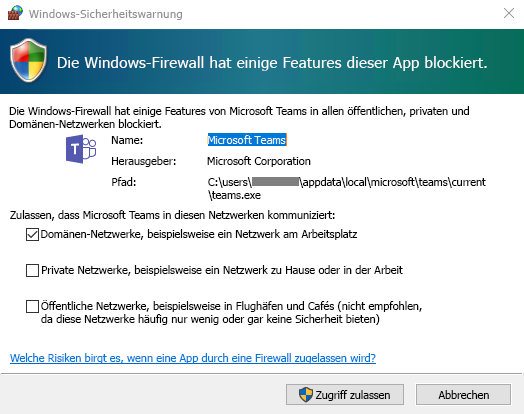
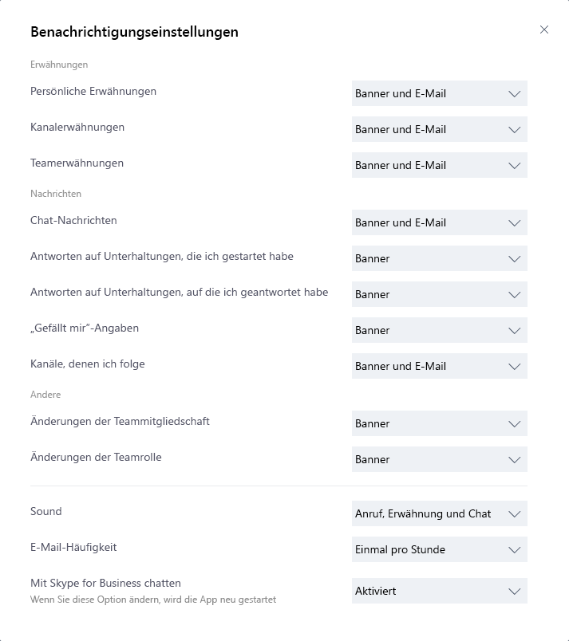

# <a name="get-clients-for-microsoft-teams"></a>Beziehen von Clients für Microsoft Teams 


Microsoft Teams verfügt über Clients für Desktop (Windows, Mac und Linux), Web und Mobile (Android und IOS). Diese Clients benötigen alle eine aktive Internetverbindung und unterstützen keinen Offlinemodus.

> [!NOTE]
> Ab dem 29. November 2018 können Sie die Microsoft Teams for Windows 10 S-App (Vorschau), die im Microsoft Store verfügbar ist, nicht mehr verwenden. Stattdessen können Sie jetzt den Desktop-Client für Teams auf Geräten mit Windows 10 S-Modus herunterladen und installieren. Wechseln Sie zum Herunterladen des Desktop- [https://teams.microsoft.com/downloads](https://go.microsoft.com/fwlink/?linkid=855754)Clients zu. MSI-Builds des Teams-Desktop Clients sind noch nicht für Geräte verfügbar, auf denen Windows 10 S-Modus ausgeführt wird.
>
> Weitere Informationen zum Windows 10 s-Modus finden Sie unter [Einführung in Windows 10 im s-Modus](https://www.microsoft.com/windows/s-mode). 

## <a name="desktop-client"></a>Desktopclient

> [!Tip]
> Schauen Sie sich die folgende Sitzung mit Informationen zu den Vorteilen des Windows-Desktopclient sowie zum Planen und Bereitstellen der Lösung an: [Windows-Desktopclient für Teams](https://aka.ms/teams-clients)

Der Microsoft Teams-Desktop Client ist eine eigenständige Anwendung und steht auch [in Office 365 ProPlus zur Verfügung](https://docs.microsoft.com/deployoffice/teams-install). Teams steht für Windows (7 +), sowohl 32-Bit-als auch 64-Bit-Versionen, macOS (10.10 +) und Linux ( `.deb` in `.rpm` und Formate.) zur Verfügung. Unter Windows erfordert Teams .NET Framework 4.5 oder höher. Das Installationsprogramm für Teams bietet die Installation an, wenn Sie nicht darüber verfügen. Unter Linux versuchen Paketmanager wie apt und yum, alle Anforderungen für Sie zu installieren. Wenn dies jedoch nicht der Fall ist, müssen Sie alle gemeldeten Anforderungen installieren, bevor Sie Teams unter Linux installieren können.

Die Desktopclients bieten Unterstützung für Echtzeitkommunikation (Audio, Video und Inhaltsfreigabe) für Teambesprechungen, Gruppenanrufe und private Einzelanrufe.

Desktopclients können unter [https://teams.microsoft.com/downloads](https://go.microsoft.com/fwlink/?linkid=855754) von Endbenutzern direkt heruntergeladen und installiert werden, sofern sie über die entsprechenden lokalen Berechtigungen verfügen (Administratorrechte sind zum Installieren des Teams-Clients auf einem PC nicht erforderlich, auf einem Mac jedoch sind sie erforderlich).

IT-Administratoren können Ihre bevorzugte Methode zum Verteilen der Installationsdateien an Computer in Ihrer Organisation auswählen. Einige Beispiele sind System Center Configuration Manager (Windows) oder JAMF pro (macOS). Informationen dazu, wie Sie das MSI-Paket für die Verteilung von Windows erhalten, finden Sie unter [Installieren von Microsoft Teams mithilfe eines MSI-Pakets](msi-deployment.md).  

> [!NOTE]
> Die Verteilung des Clients über diese Mechanismen ist nur für die anfängliche Installation von Microsoft Team-Clients gedacht, nicht für zukünftige Updates.

### <a name="windows"></a>Windows

Die Installation von Microsoft Teams für Windows bietet herunterladbare Installationsprogramme in der 32-Bit- und 64-Bit-Architektur.

> [!NOTE]
> Die Architektur (32 Bit oder 64 Bit) von Microsoft Teams ist unabhängig von der Architektur der installierten Windows- und Office-Version.

Der Windows-Client wird im Ordner „AppData“ im Profil des Benutzers bereitgestellt. Durch das Bereitstellen im lokalen Profil des Benutzers kann der Client ohne erweiterte Berechtigungen installiert werden. Der Windows-Client nutzt die folgenden Speicherorte:

- %LocalAppData%\\Microsoft\\Teams

- % LocalAppData%\\Microsoft\\TeamsMeetingAddin

- %AppData%\\Microsoft\\Teams

- %LocalAppData%\\SquirrelTemp

Wenn Benutzer erstmals mit dem Microsoft Teams-Client einen Anruf einleiten, sehen sie möglicherweise eine Warnung mit den Einstellungen der Windows-Firewall, in der sie aufgefordert werden, die Kommunikation zuzulassen. Die Benutzer können angewiesen werden, diese Meldung zu ignorieren, da der Anruf auch dann funktioniert, wenn die Warnung geschlossen wird.



> [!NOTE]
> Die Konfiguration der Windows-Firewall wird auch dann geändert, wenn die Eingabeaufforderung durch Auswählen von „Abbrechen“ geschlossen wird. Zwei eingehende Regeln für „teams.exe“ werden mit der Aktion „Blockieren“ für die Protokolle TCP und UDP erstellt.

### <a name="mac"></a>Mac

Mac-Benutzer können Teams mit einer PKG-Installationsdatei für macOS-Computer installieren. Administratorzugriff ist erforderlich, um den Mac-Client zu installieren. Der macOS-Client wird im Ordner „/Programme“ installiert.

#### <a name="install-teams-by-using-the-pkg-file"></a>Installieren von Teams mithilfe der PKG-Datei

1. Klicken Sie auf der [Teams-Downloadseite](https://teams.microsoft.com/downloads) unter **Mac** auf **Herunterladen**.
2. Doppelklicken Sie auf die PKG-Datei.
3. Folgen Sie zum Durchführen der Installation den Anweisungen im Installations-Assistenten.
4. Teams werden im Ordner „/Programme“ installiert. Es handelt sich um eine computerweite Installation.

> [!NOTE]
> Während der Installation fordert die PKG-Datei den Benutzer zur Eingabe von Administratoranmeldeinformationen auf. Der Benutzer muss die Administratoranmeldeinformationen eingeben, unabhängig davon, ob er ein Administrator ist oder nicht.

Wenn ein Benutzer aktuell über eine DMG-Installation von Teams verfügt und sie durch die PKG-Installation ersetzen möchte, sollte der Benutzer:

1. Die Teams-App beenden.
2. Die Teams-App deinstallieren.
3. Die PKG-Datei installieren.

IT-Administratoren können die verwaltete Bereitstellung von Teams für die Verteilung der Installationsdateien auf allen Macs in ihrer Organisation verwenden, z. B. Jamf Pro.

> [!NOTE]
> Wenn Probleme beim Installieren der PKG-Datei auftreten, lassen Sie es uns wissen. Klicken Sie im Abschnitt **Feedback** am Ende dieses Artikels auf **Produktfeedback**.

### <a name="linux"></a>Linux

Die Benutzer können systemeigene Linux-Pakete in `.deb` und `.rpm` Formate installieren.

> [!NOTE] 
> Der Client für Linux-Teams steht in der limitierten Vorschau zur Verfügung. Übermitteln `Report a Problem` von Fehlern innerhalb des Clients Bekannte Probleme finden Sie unter [bekannte Probleme](Known-issues.md).

#### <a name="install-teams-using-deb-package"></a>Installieren von Teams mithilfe des deb-Pakets

1. Laden Sie das Paket https://aka.ms/getteamsvon herunter. (Der Linux-Client befindet sich in einer limitierten Vorschau und wird in Kürze gestartet. Wenn der Linux-Client auf der Seite Downloads nicht angezeigt wird, wurde er noch nicht gestartet.)
2. Installieren Sie mit einer der folgenden Optionen:  
    - Öffnen Sie das entsprechende Paket Verwaltungstool, und durchlaufen Sie den Installationsvorgang für die selbstgesteuerte Linux-app.
    - Oder wenn Sie Terminal lieben, geben Sie Folgendes ein:`sudo apt install **teams download file**`

Sie können Teams über Aktivitäten oder per Terminal starten, indem `Teams`Sie eine Eingabe durchführen. 

#### <a name="install-teams-using-rpm-package"></a>Installieren von Teams mithilfe des RPM-Pakets

1. Laden Sie das Paket https://aka.ms/getteamsvon herunter. (Der Linux-Client befindet sich in einer limitierten Vorschau und wird in Kürze gestartet. Wenn der Linux-Client auf der Seite Downloads nicht angezeigt wird, wurde er noch nicht gestartet.)
2. Installieren Sie mit einer der folgenden Optionen:
    - Öffnen Sie das entsprechende Paket Verwaltungstool, und durchlaufen Sie den Installationsvorgang für die selbstgesteuerte Linux-app.
    - Oder wenn Sie Terminal lieben, geben Sie Folgendes ein:`sudo yum install **teams download file**`

Sie können Teams über Aktivitäten oder per Terminal starten, indem `Teams`Sie eine Eingabe durchführen.

## <a name="web-client"></a>Webclient 

Beim Webclient ([https://teams.microsoft.com](https://go.microsoft.com/fwlink/?linkid=855753)) handelt es sich um einen vollständig funktionsfähigen Client, der in einer Vielzahl von Browsern verwendet werden kann. Der Webclient unterstützt Anrufe und Besprechungen mit WebRTC, es ist also kein Plug-In oder Download erforderlich, um Teams in einem Webbrowser ausführen. Der Browser muss so konfiguriert sein, dass Drittanbietercookies zulässig sind. 

[!INCLUDE [browser-support](includes/browser-support.md)]

Der Webclient führt beim Herstellen einer Verbindung mit [https://teams.microsoft.com](https://go.microsoft.com/fwlink/?linkid=855753) eine Ermittlung der Browserversion durch. Wenn eine nicht unterstützte Browserversion erkannt wird, wird der Zugriff auf die Webschnittstelle blockiert, und dem Benutzer wird empfohlen, den Desktopclient oder die mobile App herunterzuladen.

## <a name="mobile-clients"></a>Mobile Clients

Die Microsoft Teams-Apps für Mobilgeräte stehen für Android und iOS zur Verfügung und sind auf mobile Benutzer ausgelegt, die an Chat-basierten Unterhaltungen teilnehmen. Außerdem ermöglichen sie Peer-to-Peer-Audioanrufe. Rufen Sie den entsprechenden Store für mobile Apps – Google Play oder Apple App Store – auf, um die Apps herunterzuladen. Die Windows Phone-App wurde am 20. Juli 2018 eingestellt und funktioniert möglicherweise nicht mehr. 

Unterstützte mobile Plattformen für mobile Microsoft Teams-Apps:

-   **Android**: 4.4 oder höher

-   **iOS**: 10.0 oder höher

> [!NOTE]
> Die mobile Version muss der Öffentlichkeit zur Verfügung stehen, damit Teams wie erwartet funktioniert.

Mobile Apps werden nur über den App Store der jeweiligen mobilen Plattform vertrieben und aktualisiert. Die Verteilung der mobilen Apps über MDM oder das Laden von Seiten wird von Microsoft nicht unterstützt. Nachdem die Mobile App auf einer unterstützten mobilen Plattform installiert wurde, wird die Mobile Teams-APP selbst unterstützt, vorausgesetzt, die Version befindet sich innerhalb von drei Monaten nach der aktuellen Version.


| | | |
|---------|---------|---------|
|      |Entscheidungspunkt         |Gelten Einschränkungen, die Benutzer daran hindern, den entsprechenden Microsoft Teams-Client auf ihren Geräten zu installieren?         |
|     |Nächste Schritte         |Wenn Ihre Organisation Softwareinstallationen einschränkt, stellen Sie sicher, dass dieser Prozess mit Microsoft Teams kompatibel ist. Hinweis: Administratorrechte sind zum Installieren von Clients auf einem PC nicht erforderlich, auf einem Mac jedoch sind sie erforderlich.         |

## <a name="client-update-management"></a>Verwaltung von Clientupdates

Clients werden derzeit vom Microsoft Teams-Dienst automatisch aktualisiert, ohne dass ein IT-Administratoreingriff erforderlich ist. Wenn ein Update verfügbar ist, wird der Client das Update automatisch herunterladen, und wenn die APP für einen bestimmten Zeitraum inaktiv ist, wird der Updatevorgang gestartet.

## <a name="client-side-configurations"></a>Clientseitige Konfigurationen

Zurzeit sind keine unterstützten Optionen zum Konfigurieren des Clients durch den Mandantenadministrator, PowerShell, Gruppenrichtlinienobjekte oder die Registrierung verfügbar.

## <a name="notification-settings"></a>Benachrichtigungseinstellungen

Zurzeit sind keine Optionen verfügbar, mit denen IT-Administratoren clientseitige Benachrichtigungseinstellungen konfigurieren können. Alle Benachrichtigungsoptionen werden von den Benutzern festgelegt. Die folgende Abbildung zeigt die Standardclienteinstellungen.



## <a name="sample-powershell-script"></a>PowerShell-Beispielskript

Dieses Beispielskript, das auf Clientcomputern im Kontext eines Administratorkontos mit erweiterten Berechtigungen ausgeführt werden muss, erstellt eine neue eingehende Firewallregel für jeden Benutzerordner unter C:\Users. Wenn Teams diese Regel findet, kann sie verhindern, dass die Teams-Anwendung Benutzer zum Erstellen von Firewallregeln auffordert, wenn der Benutzer seinen ersten Aufruf über Teams tätigt. 

```

<#
.Synopsis
   Creates firewall rules for Teams.
.DESCRIPTION
   (c) Microsoft Corporation 2018. All rights reserved. Script provided as-is without any warranty of any kind. Use it freely at your own risks.
   Must be run with elevated permissions. Can be run as a GPO Computer Startup script, or as a Scheduled Task with elevated permissions. 
   The script will create a new inbound firewall rule for each user folder found in c:\users. 
   Requires PowerShell 3.0.
#>

#Requires -Version 3

$users = Get-ChildItem (Join-Path -Path $env:SystemDrive -ChildPath 'Users') -Exclude 'Public', 'ADMINI~*'
if ($users.Length -gt 0)
{
    foreach ($user in $users)
    {
        $progPath = Join-Path -Path $user.FullName -ChildPath "AppData\Local\Microsoft\Teams\Current\Teams.exe"
        if (Test-Path $progPath)
        {
            if (-not (Get-NetFirewallApplicationFilter -Program $progPath -ErrorAction SilentlyContinue))
            {
                $ruleName = "Teams.exe for user $($user.Name)"
                "UDP", "TCP" | ForEach-Object { New-NetFirewallRule -DisplayName $ruleName -Direction Inbound -Profile Domain -Program $progPath -Action Allow -Protocol $_ }
                Clear-Variable ruleName
            }
        }
        Clear-Variable progPath
    }
}

```
