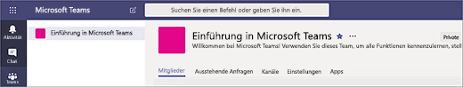
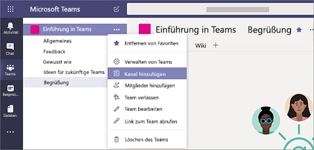
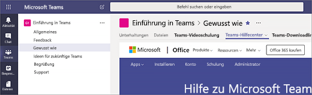

# Erstellen Ihrer ersten Teams und Kanäle in Microsoft TeamsCreate your first teams and channels in Microsoft Teams

Durch das Einrichten und Verwenden Ihrer ersten Reihe von Teams und Kanälen bauen Sie Ihre Erfahrung mit Teams aus und erkennen die Talente, die bei der Einführung von Teams in Ihrem gesamten Unternehmen helfen können.Setting up and using your first set of teams and channels builds your experience with Teams and identifies champions who can help drive Teams adoption across your organization. Wenn Sie Teams noch nicht installiert haben, lesen Sie [Beziehen von Clients für Microsoft Teams](get-clients.md) und [Anmelden bei Teams mit moderner Authentifizierung](sign-in-teams.md).If you haven't installed Teams yet, check out [Get Teams clients](get-clients.md) and [Sign in to Teams using modern authentication](sign-in-teams.md).

## Vorschläge für Ihre ersten Teams und KanäleSuggestions for your first teams and channels

 Ein Team ist eine Gruppe von Personen, die sich um ein gemeinsames Ziel scharen.A team is a collection of people who gather together around a common goal. Kanäle stellen die Plätze zur Zusammenarbeit innerhalb eines Teams dar, in denen die eigentliche Arbeit erfolgt.Channels are the collaboration spaces within a team where the actual work gets done. 

Weitere Informationen finden Sie unter [Teams und Kanäle in Microsoft Teams – Übersicht](teams-channels-overview.md) und [Bewährte Methoden für die Organisation von Teams in Microsoft Teams](best-practices-organizing.md).To learn more, see [Overview of teams and channels in Teams](teams-channels-overview.md) and [Best practices for organizing teams in Teams](best-practices-organizing.md).

 Wir schlagen vor, Sie beginnen mit einem Team “Teams kennenlernen”, in dem Ihre aufgeschlossenen Benutzer herumspielen, Fragen stellen und die Funktionen von Teams entdecken können.We suggest you start with a “Get to know Teams” team where your early adopters can play around, ask questions, and discover the capabilities of Teams. Dieses Team kann für Ihren Erfolg entscheidend sein, während Sie beginnen, mit Teams zu experimentieren.This team can be essential to your success as you begin to experiment with Teams. 

### "Teams kennenlernen"-Team"Get to know Teams" team
Ihr Projektteam kann das Team “Teams kennenlernen” verwenden, um sicherzustellen, dass sie Teams-Clients eingerichtet haben, dann ein paar anfängliche Unterhaltungen führen und herausfinden, was sich in Teams erledigen lässt.Your project team can use the “Getting to know Teams” team to ensure they're set up with Teams clients, have some initial conversations, and explore what Teams can do. Vielleicht haben Sie schon eine Gruppe von Benutzern in Ihrer Organisation, denen es Spaß macht, früh Zugriff auf neue Funktionen zu erhalten.You may already have a group of people in your organization who enjoy getting early access to new capabilities. Diese können eins der ersten Teams sein, die Sie an Bord holen, und es wird Ihnen mit frühzeitigem Feedback helfen.This can be one of their initial teams when you bring them on board and will help you get early feedback.

Hier sehen Sie einen Vorschlag für die Struktur des Teams.Here's a suggested structure for the team.

| KanalChannel | Beschreibung und VerwendungDescription and usage | Angeheftete Registerkarten, Bots und AppsPinned tabs, bots, and apps |
| ------------ | -------------------- | -------------------- |
| AllgemeinGeneral | Alle Teams beginnen mit einem Kanal "Allgemein".All teams start with a General channel. Verwenden Sie diesen Kanal für Ankündigungen, während Sie anfangen, sich mit Teams vertraut zu machen.Use this channel to make announcements as you start getting to know Teams. |  |
| BegrüßungSay hi | Stellen Sie sich beim Team vor, und drücken Sie aus, was Sie sich von Teams versprechen.Introduce yourself to the team and share what you want to get from Teams. |  |
| Gewusst wieHow do I | Ein Kanal für Fragen zur Vorgehensweise.A channel to ask how-to questions. Schritt 1: Installieren der Desktop- und mobilen Clients.Step 1 – install the desktop and mobile clients. Schritt 2: Kopfüber in Teams.Step 2 – jump into Teams.| Angeheftete Registerkarte mit Links zum [Teams-Hilfecenter](https://support.office.com/teams)Pinned tab that links to the [Teams help center](https://support.office.com/teams) Angeheftete Registerkarte mit Links zu [Teams-Schulungsvideos](https://support.office.com/article/microsoft-teams-video-training-4f108e54-240b-4351-8084-b1089f0d21d7)Pinned tab that links to [Teams training videos](https://support.office.com/article/microsoft-teams-video-training-4f108e54-240b-4351-8084-b1089f0d21d7) Angeheftete Registerkarte mit [Downloadlinks für Teams-Desktop- und mobile Clients](https://teams.microsoft.com/downloads)Pinned tab that links to [Teams desktop and mobile client download links](https://teams.microsoft.com/downloads) |
| FeedbackFeedback | Teilen Sie Ihre Gedanken zu Ihren Teams-Erfahrungen.Share your thoughts on your Teams experiences. | Angeheftete Registerkarte mit Polly PollPinned tab with Polly Poll|
| Ideen für zukünftige TeamsIdeas for future teams | Teilen Sie Ihre Ideen für Möglichkeiten, mit Teams Mehrwert für Ihre Organisation zu generieren.Share your thoughts on where Teams can drive additional value in your organization. Wie könnten diese Teams heißen?What could these teams be called? Wer käme als Mitglied in Frage?Who would be members? ||
| SupportSupport | Wenn etwas nicht wie erwartet funktioniert, verwenden Sie diesen Kanal, um Hilfe anzufordern.If something isn't working as expected, use this channel to get help. ||

## Vorbereiten und Starten Ihrer ersten TeamsGet your first teams up and running
Als Administrator können Sie Teams und Kanäle im Teams-Client oder dem Microsoft Teams Admin Center erstellen und verwalten.As an admin, you can create and manage teams and channels in the Teams client or the Microsoft Teams admin center. Sie können Teams als öffentlich oder privat erstellen.You can create teams as public or private. Sie können darüber hinaus ein [organisationsweites](create-an-org-wide-team.md) Team erstellen.You can also create an [org-wide team](create-an-org-wide-team.md). Jede Person in Ihrer Organisation, die Teams verwendet, kann einem öffentlichen Team beitreten.Anyone using Teams in your organization can join a public team. In privaten Teams verwalten Teambesitzer die Teammitgliedschaft.For private teams, team owners manage team membership. Bei einem organisationsweiten Team wird jeder Benutzer in Ihrer Organisation automatisch hinzugefügt.And for an org-wide team, everyone in your organization is automatically added. 

Für den Einstieg empfehlen wir Ihnen, private Teams zu erstellen und einen weiteren Besitzer hinzuzufügen, um die Teameinstellungen und die Mitgliedschaft zu verwalten.To get started, we recommend you create private teams and add another owner to manage team settings and membership. 

> [!NOTE]
> In den folgenden Schritten verwenden wir den Teams-Desktopclient, um Teams und Kanäle zu erstellen.In the steps that follow, we use the Teams desktop client to create teams and channels. Bedenken Sie, dass Sie diese Aufgaben als Administrator auch im Microsoft Teams Admin Center ausführen können.Keep in mind that as an admin, you can also do these tasks in the Microsoft Teams admin center.

### Team erstellenCreate a team

Klicken Sie auf der linken Seite von Teams auf **Teams**, und klicken Sie dann unten in der Teamliste auf **Einem Team beitreten oder ein Team erstellen**. Klicken Sie anschließend auf **Neues Team erstellen**.On the left side of Teams, click **Teams**, at the bottom of the teams list, click **Join or create a team**, and then click **Create a new team**.

Laden Sie nach dem Erstellen des Teams Personen zum Beitritt ein.Once you've created the team, invite people to join it. Sie können einzelne Benutzer, Gruppen und sogar gesamte Kontaktgruppen (vormals als “Verteilerlisten” bezeichnet) hinzufügen.You can add individual users, groups, and even entire contact groups (formerly known as "distribution lists"). 

 

### Hinzufügen eines TeambesitzersAdd a team owner
Suchen Sie das von Ihnen erstellte Team, und klicken Sie auf **Weitere Optionen ˙˙˙** > **Team verwalten**.Find the team that you created, click **More options ˙˙˙** > **Manage team**. Navigieren Sie anschließend zur Registerkarte **Mitglieder**. Suchen Sie die Personen, die Sie als Teambesitzer einsetzen möchten.Then go to the **Members** tab. Find the people you want to designate as team owners. Klicken Sie unter **Rolle** auf **Besitzer**.Under **Role**, click **Owner**.

### Erstellen eines Kanals in einem TeamCreate a channel in a team
Suchen Sie das von Ihnen erstellte Team, und klicken Sie auf **Weitere Optionen...** > **Kanal hinzufügen**.Find the team that you created, click **More options ...** > **Add channel**. Alternativ können Sie auf **Team verwalten** klicken und auf der Registerkarte **Kanäle** einen Kanal hinzufügen.You can also click **Manage team** and add a channel in the **Channels** tab. 

 

Geben Sie dem Kanal einen anschaulichen Namen, damit die Benutzer den Zweck des Kanals leichter verstehen können.Give the channel a descriptive name to make it easier for users to understand the purpose of the channel. 

Als Teambesitzer können Sie Kanäle dem gesamten Team automatisch vorschlagen, wodurch die Kanäle für jeden im Team besser sichtbar werden.As a team owner, you can automatically favorite channels for the whole team, making the channels more visible for everyone on the team. Darüber hinaus können Sie Registerkarten an den Kanal anheften, um Tools, wie etwa OneNote, Links zu Webseiten und anderen Inhalte hinzuzufügen, damit Benutzer leichter finden, was sie brauchen, und ihre Ideen leichter teilen können.You can also pin tabs to the channel to add tools, such as OneNote, links to webpages, and other content to make it easy for users to find what they need and share their thoughts.  

Dies ist ein Beispiel für den "Gewusst wie"-Kanal im Team "Teams kennenlernen" mit angehefteten Registerkarten, die Links zu Teams-Webseiten, &ndash; Teams-Videoschulung, dem Teams-Hilfecenter und Teams-Downloadlinks enthalten.Here's an example of the "How do I" channel in the "Get to know Teams" team, showing pinned tabs that link to Teams webpages &ndash; Teams video training, Teams help center, and Teams download links. 

 

## Nächste SchritteNext steps
Wechseln Sie zu [Onboarding von Early Adopters](get-started-with-teams-onboard-early-adopters.md).Go to [Onboard your early adopters](get-started-with-teams-onboard-early-adopters.md).
