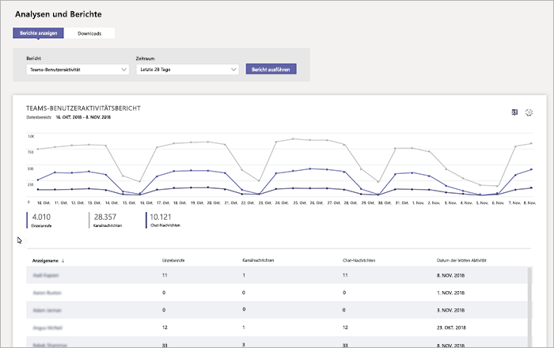

# Überwachen der Verwendung und Feedback in Microsoft TeamsMonitor usage and feedback in Microsoft Teams
Es ist wichtig, zu wissen, wie Teams von Benutzern verwendet wird und was ihre Erfahrung mit Teams ist.It's important to know how users are using Teams and what their experience is with Teams. Verwendungsberichte können Ihnen besser verstehen Verwendungsmuster und zusammen mit Benutzerfeedback, Ihnen Insights nahezubringen breiter und wo Schulung und Kommunikation Maßnahmen priorisieren informiert.Usage reports can help you better understand usage patterns, and along with user feedback, give you insights to inform your wider rollout and where to prioritize training and communication efforts.

## Überwachung der NutzungMonitor usage
Für den ersten Satz von Teams wird empfohlen, dass Sie Berichte zweimal wöchentlich überprüfen, um neue Trends zu verstehen.For your first set of teams, we recommend you review reports twice a week to understand emerging trends. 

Verwendungsberichte anzeigen beispielsweise, dass Benutzer nicht viele Teams mobilen Clients verwenden.For example, usage reports show that not many users are using the Teams mobile clients. Dies kann bedeuten, dass Benutzer nicht sicher wie die Clients installiert sind.This may indicate that users aren't sure how to install the clients. Bereitstellen von installationsanweisungen in einem Kanal erleichtert Laufwerk Verwendung von eine größere Anzahl von Clients.Posting step-by-step installation instructions in a channel may help drive usage of a wider range of clients. Oder Verwendungsberichte zeigt an, dass Benutzer in erster Linie für die private Chats Teams verwenden.Or, usage reports show that users are primarily using Teams for private chats. In diesem Beispiel können Sie Ihr Team Szenarien zu überprüfen, da Benutzer außerhalb der anfänglichen Teams und Kanäle, die eingerichtet wurden und chatten möchten.In this example, you may want to review your team scenarios because users are chatting outside the initial teams and channels that were set up. 

Hier ist wie Berichte zum Anzeigen von Teams Usage abgerufen.Here's how to get reports to view Teams usage. 

### Teams Analytics & Berichte (Microsoft-Teams und Skype für Business Admin Center)Teams analytics & reports (Microsoft Teams & Skype for Business Admin Center)

Teams-Berichten in der Microsoft-Teams & Skype für Business Admin Center können Sie Einblicke in wie Teams in Ihrer Organisation verwendet wird.Teams reports in the Microsoft Teams & Skype for Business Admin Center give you insights into how Teams is used in your organization. Verwenden Sie die Berichte, um eine Ansicht in Teams Nutzung, Benutzeraktivität und Device-Nutzung in Ihrer Organisation zu erhalten.Use the reports to get a view into Teams usage, user activity, and device usage across your organization. 

Um diese Berichte anzeigen möchten, müssen Sie ein globaler Administrator in Office 365, Teams Dienstadministrator oder Skype für Business-Administrator sein. Wechseln Sie zur Microsoft-Teams & Skype für Business-Verwaltungskonsole im linken Navigationsbereich, wählen Sie **Analytics & Berichte**, und wählen Sie dann unter **Bericht**, den Bericht, den Sie ausführen möchten.To view these reports, you must be a global admin in Office 365, Teams service admin, or Skype for Business admin. Go to the Microsoft Teams & Skype for Business Admin Center, in the left navigation, select **Analytics & reports**, and then under **Report**, choose the report you want to run.

- **Bericht zur Verwendung der Teams**: Dieser Bericht bietet eine Übersicht über die Verwendung Aktivität bei Teams, einschließlich der aktiven Benutzer gesamt Kanäle und die Anzahl von aktiven Benutzern und Kanälen, Gäste, und Nachrichten in einzelnen Teams befinden.**Teams usage report**: This report gives you an overview of usage activity in Teams, including the total active users and channels, and the number of active users and channels, guests, and messages in each team. 

    ![Bericht zur Verwendung der Teams] (media/teams-reports-teams-usage.png "Screenshot des Nutzungsberichts Teams im Microsoft-Teams & Skype für Business Admin Center")     
- **Bericht über Benutzeraktivität Teams**: in diesem Bericht können Sie einen Einblick in die Arten von Aktivitäten Benutzer Teilnahme an, wie beispielsweise über 1:1-anrufen, DDE Kanalnachrichten und privaten Chatnachrichten wie viele Personen kommunizieren.**Teams user activity report**: This report gives you insight into the types of activities users engage in, such as how many people communicate through 1:1 calls, channel messages, and private chat messages. 

    ![Bericht über Benutzeraktivität Teams] (media/teams-reports-user-activity.png "Screenshot des Teams User Activity Report im Microsoft-Teams & Skype für Business Admin Center") 
\` 
\`
- **Teams Gerät Verwendungsbericht**: in diesem Bericht werden die Verbindung von Benutzern zum Teams, einschließlich, wie viele Personen auf ihren mobilen Geräten, die beim Klicken auf Go Teams verwenden.**Teams device usage report**: This report shows you how users connect to Teams, including how many people use Teams on their mobile devices when on-the-go. 

    ![Bericht zur Verwendung der Teams Gerät] (media/teams-reports-device-usage.png "Screenshot des Nutzungsberichts Teams Gerät in der Microsoft-Teams & Skype für Business Admin Center")

Weitere Informationen finden checken Sie [Teams Analysen und Berichte aus](teams-analytics-and-reports/teams-reporting-reference.md).To learn more, check out [Teams analytics and reporting](teams-analytics-and-reports/teams-reporting-reference.md). 

### Teams Berichte (Office 365 Administrationscenter)Teams activity reports (Office 365 admin center)
Sie können auch Teams Aktivitäten über Berichte anzeigen, die aus dem Office 365 Administrationscenter verfügbar sind.You can also view Teams activity through reports that are available from the Office 365 admin center. Diese Berichte sind Bestandteil der Office 365-Berichte im Office 365 Administrationscenter und Informationen über Benutzeraktivität und Gerät Nutzung.These reports are part of the Office 365 reports in the Office 365 admin center and provide information about user activity and device usage. 

Zum Anzeigen dieser Berichte und wechseln Sie zu Office 365 Administrationscenter, klicken Sie auf **Berichte** > **Usage**.To view these reports, go to the Office 365 admin center, click **Reports** > **Usage**. Klicken Sie unter **Wählen Sie einen Bericht aus**klicken Sie auf **Microsoft-Teams**.Under **Select a report**, click **Microsoft Teams**. Hier wählen Sie den Bericht, den Sie anzeigen möchten.From here, choose the report you want to view.

Weitere Informationen finden Sie wechseln Sie zum [Verwenden von Berichten für Teams Aktivität](teams-activity-reports.md).To learn more, go to [Use activity reports for Teams](teams-activity-reports.md).

### Verwendungsanalyse für Microsoft 365Microsoft 365 usage analytics

Sie können Microsoft 365 Verwendungsanalyse in Power BI zum Anzeigen und Analysieren von Verwendungsdaten für Teams und andere Office 365-Produkten und Diensten.You can use Microsoft 365 usage analytics in Power BI to view and analyze usage data for Teams and other Office 365 products and services. Verwendungsanalyse für Microsoft 365 ist ein Inhaltspaket, die eine vordefinierte Dashboard und einer Reihe vorgefertigter Berichte enthält.Microsoft 365 usage analytics is a content pack that includes a pre-built dashboard and a number of pre-built reports. Jeder Bericht können Sie bestimmte Nutzungsdaten und Einblicke in die.Each report gives you specific usage data and insights. Zum Verbinden mit dem Content Pack Power BI benötigen und müssen ein globaler Administrator in Office 365 oder Berichte Reader sein.To connect to the content pack, you need Power BI and must be a global admin in Office 365 or reports reader. Wenn Sie nicht bereits Power BI, [Melden Sie sich für den kostenlosen Power BI-Dienst](https://powerbi.microsoft.com)haben.If you don't already have Power BI, [sign up for the free Power BI service](https://powerbi.microsoft.com). 

Finden Sie weitere Informationen finden Sie unter [Microsoft 365 Verwendungsanalyse](https://support.office.com/article/Microsoft-365-usage-analytics-77ff780d-ab19-4553-adea-09cb65ad0f1f).To learn more, see [Microsoft 365 usage analytics](https://support.office.com/article/Microsoft-365-usage-analytics-77ff780d-ab19-4553-adea-09cb65ad0f1f). 

## Erfassung des FeedbacksGather feedback
Die Annahme einer neuen der Zusammenarbeit geht es um Ändern des Verhaltens von Benutzern.The adoption of a new collaboration experience is about changing the behavior of users. Aktivieren der Änderung erfordert Schulung, Unterstützung und positive Beispiele.Enabling change requires training, encouragement, and positive examples. Es ist wichtig, dass Benutzer einen VoIP während des Übergangs Teams haben und ihre Erfahrungen offen freigeben können.It's important for users to have a voice during the transition to Teams and to be able to openly share their experiences. Es wird empfohlen, mit dem Feedback Kanal im Team "Erste Schritte mit Teams wissen" Sie zum Erfassen und Beheben von Feedback von Benutzern auf ihren Erfahrungen mit Teams erstellt haben.We recommend using the Feedback channel in the "Get to know Teams" team you created to collect and address feedback from users on their experiences with Teams. 

## Nächste SchritteNext steps
Wechseln Sie zum [Abrufen von Ressourcen zum Planen Ihrer Organisation geltende Implementierung von Teams](get-started-with-teams-resources-for-org-wide-rollout.md).Go to [Get resources to plan your organization-wide rollout of Teams](get-started-with-teams-resources-for-org-wide-rollout.md).
