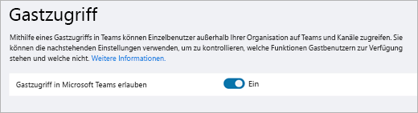
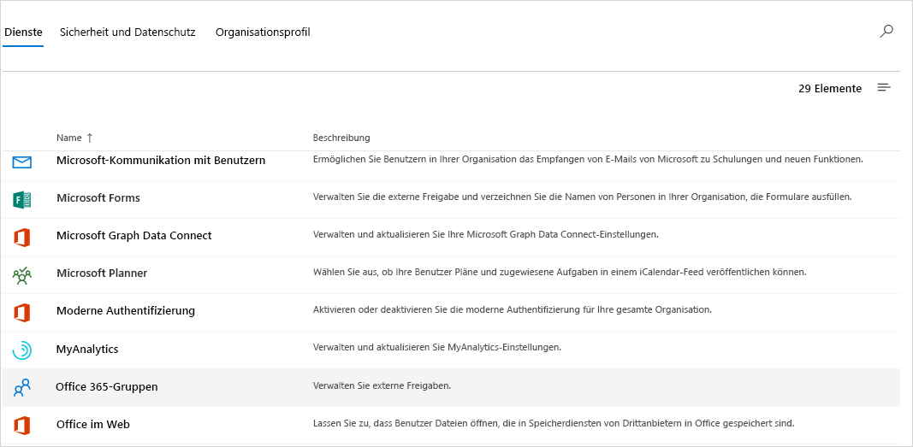
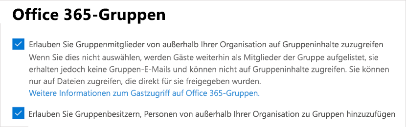
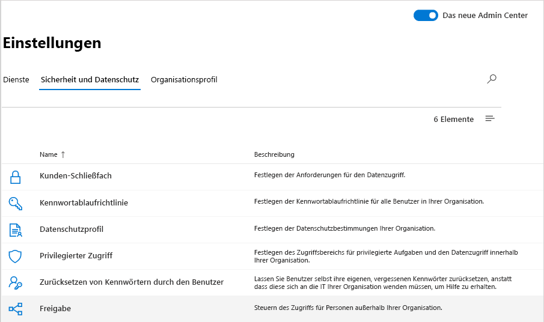
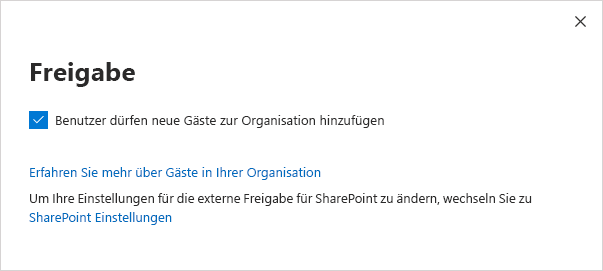
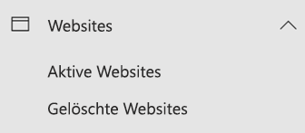
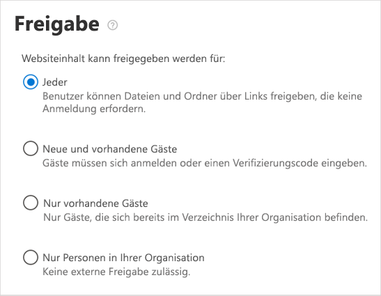
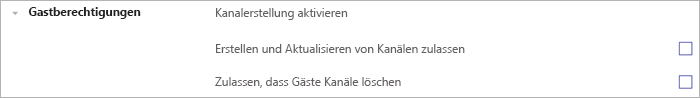

Checkliste für den Microsoft Teams-GastzugriffMicrosoft Teams guest access checklist
=========================================

Verwenden Sie diese Checkliste, um den Gastzugriff in Microsoft Teams einzurichten und zu konfigurieren.Use this checklist to help you turn on and configure guest access in Microsoft Teams. Sie müssen ein globaler Administrator oder ein Teams-Administrator sein, um diese Änderungen vornehmen zu können.You need to be a Global Administrator or a Teams Administrator to make these changes.

> [!IMPORTANT]
> Möglicherweise müssen Sie einige Stunden warten, bis Ihre Änderungen wirksam werden.You may have to wait a few hours for your changes to take effect.

Schauen Sie sich dieses kurze Video an (5:31 Minuten), um zu sehen, wie Sie in Microsoft 365, einschließlich Teams, den Gastzugriff aktivieren.Watch this short video (5:31 minutes) to see how to turn on guest access throughout Microsoft 365, including Teams.

> [!VIDEO https://www.microsoft.com/videoplayer/embed/RE44NTr?autoplay=false]

## Schritt 1: Aktivieren des Gastzugriffs in Teams auf OrganisationsebeneStep 1: Turn on guest access at the Teams org-wide level

Sie müssen ein Team Dienstadministrator sein, um diese Änderungen vornehmen zu können.You must be a Teams service admin to make these changes. Informationen zum Abrufen von Administratorrollen und-Berechtigungen finden Sie unter [Verwenden von Teams-Administratorrollen zum Verwalten von Teams](https://docs.microsoft.com/microsoftteams/using-admin-roles) .See [Use Teams administrator roles to manage Teams](https://docs.microsoft.com/microsoftteams/using-admin-roles) to read about getting admin roles and permissions.

1. Wählen Sie im Teams Admin Center **Organisationsweite Einstellungen** > **Gastzugriff**.In the Teams admin center, select **Org-Wide settings** > **Guest access**.
2. Legen Sie **Gastzugriff in Microsoft Teams ermöglichen** auf **An** fest.Set the **Allow guest access in Microsoft Teams** switch to **On**.

    

3. Auf derselben Seite können Sie die Einstellungen **Anruf**, **Besprechung** und **Messaging** für Gäste ein- oder ausschalten.On this same page, turn on or turn off **Calling**, **Meeting**, and **Messaging** settings for guests.
4. Klicken Sie auf **Speichern**.Click **Save**.

> [!TIP]
> Wenn Sie die Standardeinstellungen in Azure Active Directory, SharePoint Online und Microsoft 365-Gruppen verwenden, ist möglicherweise die Konfiguration des Gastzugriffs abgeschlossen.If you're using default settings in Azure Active Directory, SharePoint Online, and Microsoft 365 Groups, you may be done configuring guest access. In diesem Fall können Sie die restlichen Schritte überspringen.In this case, you can skip the rest of the steps. Wenn Sie sich nicht sicher sind, oder wenn Sie benutzerdefinierte Einstellungen für Aad, SharePoint Online oder Microsoft 365-Gruppen verwenden, fahren Sie mit den restlichen Schritten in dieser Checkliste fort.If you're not sure, or if you're using custom settings for AAD, SharePoint Online, or Microsoft 365 Groups, continue with the rest of the steps in this checklist.

## Schritt 2: Konfigurieren von Einstellungen in Azure AD Business-to-BusinessStep 2: Configure Azure AD business-to-business settings

Hierbei handelt es sich um die Azure AD-Einstellungen, die den Gastzugriff in Teams unterstützen.These are the Azure AD settings that support guest access in Teams. Sobald diese Einstellungen konfiguriert sind, können Sie Gäste in Teams [hinzufügen](add-guests.md) und [verwalten](manage-guests.md).Once these settings are configured, you'll be able to [add](add-guests.md) and [manage guests](manage-guests.md) in Teams.

1. Melden Sie sich als Mandantenadministrator beim [Azure-Portal](https://portal.azure.com) an.Sign in to the [Azure portal](https://portal.azure.com) as a tenant administrator.
2. Wählen Sie **Azure Active Directory** > **Benutzer** > **Benutzereinstellungen** aus.Select **Azure Active Directory** > **Users** > **User settings**.
3. Wählen Sie unter **Externe Benutzer** die Option **Manage external collaboration settings** (Einstellungen für externe Zusammenarbeit verwalten) aus.Under **External users**, select **Manage external collaboration settings**.
   > [!NOTE]
   > Sie können auch über die Seite **Organisationsbeziehungen** auf die **Einstellungen für externe Zusammenarbeit** zugreifen.The **External collaboration settings** are also available from the **Organizational relationships** page. Navigieren Sie in Azure Active Directory unter **Verwalten** zu **Organisationsbeziehungen** > **Einstellungen**.In Azure Active Directory, under **Manage**, go to **Organizational relationships** > **Settings**.
4. Wählen Sie auf der Seite **Einstellungen für externe Zusammenarbeit** die Richtlinien aus, die Sie aktivieren möchten.On the **External collaboration settings** page, choose the policies you want to enable.

    - **Berechtigungen für Gastbenutzer sind eingeschränkt**: Diese Richtlinie bestimmt die Berechtigungen für Gäste in Ihrem Verzeichnis.**Guest users permissions are limited**: This policy determines permissions for guests in your directory. Wählen Sie **Ja**, um Gäste für bestimmte Verzeichnisaufgaben, z. B. dem Auflisten von Benutzern, Gruppen oder anderen Verzeichnisressourcen, zu blockieren.Select **Yes** to block guests from certain directory tasks, like enumerating users, groups, or other directory resources. Wählen Sie **Nein**, um Gästen denselben Zugriff auf Verzeichnisdaten wie normale Benutzer in Ihrem Verzeichnis zu gewähren.Select **No** to give guests the same access to directory data as  regular users in your directory.
     - **Administratoren und Benutzer mit der Rolle „Einladender“ können einladen**: Damit Administratoren und Benutzern mit der Rolle „Einladender“ Gäste einladen können, legen Sie diese Richtlinie auf **Ja** fest.**Admins and users in the guest inviter role can invite**: To allow admins and users in the "Guest Inviter" role to invite guests, set this policy to **Yes**.
     - **Mitglieder können einladen**: Um Mitgliedern Ihres Verzeichnisses, die keine Administratoren SIND; zu erlauben, Gäste einzuladen, legen Sie diese Richtlinie auf **Ja** fest (empfohlen).**Members can invite**: To allow non-admin members of your directory to invite guests, set this policy to **Yes** (recommended). Wenn Sie nur Administratoren erlauben möchten, Gäste hinzuzufügen, können Sie diese Richtlinie auf **Nein** festlegen.If you prefer that only admins be able to add guests, you can set this policy to **No**. Denken Sie daran, dass die Einstellung **Nein** die Gasterfahrung für Besitzer von Teams, die keine Administratoren sind, einschränkt. Sie können nur Gäste zu Teams hinzufügen, die bereits vom Administrator in AAD hinzugefügt wurden.Keep in mind that setting **No** will limit the guest experience for non-admin teams owners; they'll only be able to add guests in Teams that have already been added in AAD by the admin.
     - **Gäste können einladen**: Wenn Sie Gästen ermöglichen wollen, andere Gäste einzuladen, legen Sie diese Richtlinie auf **Ja** fest.**Guests can invite**: To allow guests to invite other guests, set this policy to **Yes**.
         > [!IMPORTANT]
         > Aktuell unterstützt Teams nicht die Rolle „Gasteinladender“. Das heißt, selbst wenn Sie **Gäste können einladen** auf **Ja** festlegen, können Gäste keine anderen Gäste in Teams einladen.Currently, Teams doesn't support the guest inviter role, so even if you set **Guests can invite** to **Yes**, guests can't invite other guests in Teams.
     - **Einmalkennung per E-Mail für Gastbenutzer aktivieren (Vorschauversion)**: Weitere Informationen zum Feature Einmalkennung finden Sie unter [Authentifizierung mit Einmalkennung per E-Mail (Vorschauversion)](https://docs.microsoft.com/azure/active-directory/b2b/one-time-passcode).**Enable email one-time passcode for guests (Preview)**: For more information about the one-time passcode feature, see [Email one-time passcode authentication (preview)](https://docs.microsoft.com/azure/active-directory/b2b/one-time-passcode).
     - **Einschränkungen für die Zusammenarbeit**: Weitere Informationen zum Zulassen oder Blockieren von Einladungen zu bestimmten Domänen finden Sie unter [Zulassen oder Blockieren von Einladungen für B2B-Benutzer von bestimmten Organisationen](https://docs.microsoft.com/azure/active-directory/b2b/allow-deny-list).**Collaboration restrictions**: For more information about allowing or blocking invitations to specific domains, see [Allow or block invitations to B2B users from specific organizations](https://docs.microsoft.com/azure/active-directory/b2b/allow-deny-list).
        > [!NOTE]
        > Informationen zu Einschränkungen für die Zusammenarbeit finden Sie unter [Einrichten der externen B2B-Zusammenarbeit und verwalten, wer Gäste einladen kann](https://docs.microsoft.com/azure/active-directory/b2b/delegate-invitations).For collaboration restrictions, see [Enable B2B external collaboration and manage who can invite guests](https://docs.microsoft.com/azure/active-directory/b2b/delegate-invitations).

    Weitere Informationen zum Steuern der Einladung von Gästen finden Sie unter [Delegieren von Einladungen für Azure Active Directory B2B-Zusammenarbeit](https://docs.microsoft.com/azure/active-directory/b2b/delegate-invitations).For more information about controlling who can invite guests, see [Delegate invitations for Azure Active Directory B2B collaboration](https://docs.microsoft.com/azure/active-directory/b2b/delegate-invitations).

## Schritt 3: Konfigurieren von Microsoft 365-GruppenStep 3: Configure Microsoft 365 Groups

1. Wechseln Sie im Microsoft 365 Admin Center zu **Einstellungen**  >  **org-Einstellungen**, klicken Sie auf **Dienste**, und wählen Sie dann **Microsoft 365-Gruppen**aus.In the Microsoft 365 admin center, go to **Settings** > **Org Settings**, click **Services**, and then select **Microsoft 365 Groups**.

     
2. Stellen Sie sicher, dass das Kontrollkästchen **Gruppenmitglieder von außerhalb Ihrer Organisation dürfen auf Gruppeninhalte zugreifen** aktiviert ist.Make sure that the **Let group members outside the organization access group content** check box is selected. Wenn diese Einstellung nicht aktiviert ist, können Gäste nicht auf Gruppeninhalte zugreifen.If this setting is not selected, guests won't be able to access any group content.

    
3. Stellen Sie sicher, dass das Kontrollkästchen **Gruppenbesitzer dürfen Personen außerhalb der Organisation zu Gruppen hinzufügen** aktiviert ist.Make sure that the **Let group owners add people outside the organization to groups** check box is selected. Wenn diese Einstellung nicht aktiviert ist, können Teambesitzer keine neuen Gäste hinzufügen.If this setting is not selected, team owners won't be able to add new guests. Mindestens diese Einstellung muss aktiviert sein, um den Gastzugriff zu unterstützen.At a minimum, this setting must be on to support guest access.

Ausführliche Anweisungen zum Konfigurieren dieser Einstellungen finden Sie unter [Verwalten des Gastzugriffs in Microsoft 365-Gruppen](https://support.office.com/article/manage-guest-access-in-office-365-groups-9de497a9-2f5c-43d6-ae18-767f2e6fe6e0?appver=MOE150) und [Steuern des Gastzugriffs in Microsoft 365-Gruppen](Teams-dependencies.md#control-guest-access-in-microsoft-365-groups).For detailed instructions about configuring these settings, see [Manage guest access in Microsoft 365 Groups](https://support.office.com/article/manage-guest-access-in-office-365-groups-9de497a9-2f5c-43d6-ae18-767f2e6fe6e0?appver=MOE150) and [Control guest access in Microsoft 365 Groups](Teams-dependencies.md#control-guest-access-in-microsoft-365-groups).

## Schritt 4: Konfigurieren der Freigabe in Microsoft 365Step 4: Configure sharing in Microsoft 365

Stellen Sie sicher, dass Benutzer Gäste hinzufügen können.Make sure that users can add guests. Dazu gehen Sie so vor:Here's how:

1. Wechseln Sie im Microsoft 365 Admin Center zu **Einstellungen**  >  **org-Einstellungen**, klicken Sie auf **Sicherheit & Datenschutz**, und wählen Sie dann **Freigeben**aus.In the Microsoft 365 admin center, go to **Settings** > **Org Settings**, click **Security & privacy**, and then select **Sharing**.

     

2. Aktivieren Sie das Kontrollkästchen **Benutzer dürfen neue Gäste zur Organisation hinzufügen**, und klicken Sie dann auf **Änderungen speichern**.Select the **Let users add new guests to this organization** check box, and then click **Save changes**.

     

    > [!NOTE]
    > Diese Einstellung entspricht der Einstellung **Mitglieder können einladen** in **Benutzereinstellungen** > **Externe Benutzer** in Azure AD.This setting is equivalent to the **Members can invite** setting in **User settings** > **External users** in Azure AD.  

## Schritt 5: Überprüfen der Freigabeeinstellung in SharePointStep 5: Verify sharing setting in SharePoint

1. Melden Sie sich beim Microsoft 365 Admin Center an.Sign in to the Microsoft 365 admin center.
2. Wählen Sie unter **Admin Center** die Option **SharePoint** aus.Under **Admin centers**, select  **SharePoint**.
3. Wählen Sie im neuen SharePoint Admin Center unter **Websites** die Option **Aktive Websites** aus.In the new SharePoint admin center,  under **Sites**, select **Active sites**.

    

3. Wählen Sie die Website aus, und klicken Sie dann auf **Freigabe**.Select the site, and then click **Sharing**.
4. Stellen Sie sicher, dass die Option auf **Jeder** oder **Neue und vorhandene Gäste** festgelegt ist.Make sure that the option is set to **Anyone** or **New and existing guests**.

     

## Schritt 6: Einrichten von GastbenutzerberechtigungenStep 6: Set up guest user permissions

Konfigurieren Sie in der Teams-Anwendung auf Ebene der einzelnen Teams Gastberechtigungen, die steuern, ob Gäste Kanäle erstellen, aktualisieren oder löschen können.In the Teams application, at the individual team level, configure guest permissions that control whether guests can create, update, or delete channels. Sowohl die Teamadministratoren als auch die Teambesitzer können diese Einstellungen konfigurieren.Teams admins as well as team owners can configure these settings.

Weitere Informationen zum Gastzugriff finden Sie unter [Gastzugriff in Teams](guest-access.md) und [Aktivieren oder Deaktivieren des Gastzugriffs auf Microsoft Teams](set-up-guests.md).To learn more about guest access, see [Guest access in Teams](guest-access.md) and [Turn on or turn off guest access to Microsoft Teams](set-up-guests.md).

## ProblembehandlungTroubleshooting

Wenn Probleme beim Einrichten des Gastzugriffs oder beim Hinzufügen von Gästen in Teams auftreten, finden Sie in diesen Ressourcen Hilfe:If you have problems setting up guest access or adding guests in Teams, use these resources to help you:

[Behandeln von Problemen mit Gastzugriff in Microsoft TeamsTroubleshoot problems with guest access in Microsoft Teams](troubleshoot-guest-access.md)

[Teams-ProblembehandlungTeams troubleshooting](https://docs.microsoft.com/MicrosoftTeams/troubleshoot/)
